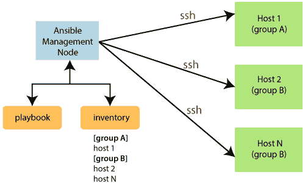

# 可转换的工作流

> 原文：<https://www.javatpoint.com/ansible-workflow>

Ansible 的工作原理是连接到您的节点，并向它们推出一个名为 **Ansible 模块**的小程序。然后 Ansible 执行这些模块，并在完成后删除它们。模块库可以驻留在任何机器上，不需要守护程序、**服务器、**或**数据库**。

在上图中，**管理节点**是控制整个剧本执行的控制节点。**清单**文件提供了需要运行 Ansible 模块的主机列表。**管理节点**进行 **SSH** 连接，在主机上执行小模块并安装软件。

一旦这些模块安装得如此专业，Ansible 就会将其移除。它连接到主机并执行指令，如果安装成功，则删除在主机上复制的代码。

## Ansible 中使用的术语

以下是 Ansible 中使用的一些重要术语，例如:

| 条款 | 说明 |
| 可移植服务器 | 这是一台安装了 Ansible 的机器，所有任务和行动手册都将从这里执行。 |
| 模块 | 该模块是在客户端执行的一个命令或一组类似的命令。 |
| 工作 | 任务是由要完成的单个过程组成的部分。 |
| 作用 | 这是一种组织任务和相关文件的方式，稍后将在行动手册中调用。 |
| 事实 | 使用收集事实操作从客户端系统的全局变量中获取的信息。 |
| 库存 | 包含关于 Ansible 客户端-服务器的数据的文件。 |
| 玩 | 这是剧本的执行。 |
| 处理者 | 仅当通知程序存在时，才会调用该任务。 |
| 通知人 | 归因于一个任务的部分，如果输出改变，该任务调用一个处理程序。 |
| 标签 | 它是一个任务的名称集，以后可以用来发布特定的任务或任务组。 |

* * *