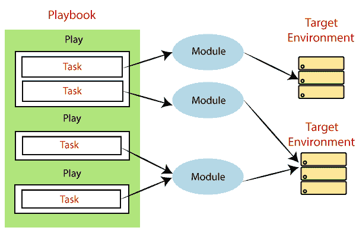

# 可行的行动手册

> 原文：<https://www.javatpoint.com/ansible-playbooks>

行动手册是编写可翻译代码的文件。剧本是用 YAML 格式写的。 **YAML** 的意思是“又一种标记语言”，所以不需要太多的语法。**行动手册**是 Ansible 的核心功能之一，告诉 Ansible 执行什么，用于复杂场景。它们提供了更大的灵活性。

行动手册包含用户希望在特定机器上执行的步骤。剧本是按顺序运行的。行动手册是 Ansible 所有用例的构建模块。

Ansible 行动手册更倾向于配置语言，而不是编程语言。

通过行动手册，您可以为某些主机指定特定角色，为其他主机指定其他角色。通过这样做，您可以在非常不同的场景中编排多个服务器，所有这些都在一个剧本中。

## 剧本结构

每个剧本都是一个或多个剧本的集合。剧本是通过使用剧本来构建的。剧本里可以有多部戏。



该游戏的功能是映射一组针对特定主机定义的指令。

有不同的 YAML 编辑器，但更喜欢使用简单的编辑器，如记事本++。首先，打开记事本++复制粘贴下面的 YAML，并将语言改为 YAML 语(语言→ YAML)。

YAML 总是以- (3 个连字符)开头。

## 创建行动手册

让我们从写一个 YAML 文件的例子开始。首先，我们必须确定一项任务。这些是角色和行动手册的可转换模块的界面。

一个剧本一个剧本，包含多个任务，如下例所示。

```

---
   name: install and configure DB
   hosts: testServer
   become: yes

   vars: 
      oracle_db_port_value : 1521

   tasks:
   -name: Install the Oracle DB
      yum: <code to install the DB>

   -name: Ensure the installed service is enabled and running
   service:
      name: <your service name>

```

以上是剧本的基本语法。保存在文件中作为 **test.yml** 。YAML 语法需要遵循正确的缩进。

## YAML 标记

下面给出了一些 YAML 标签，比如:

| 标签 | 说明 |
| 名字 | 它指定了行动手册的名称。 |
| 主机 | 它指定了要对其运行任务的主机列表。并且主机的标签是强制性的。它告诉 Ansible 在哪些主机上运行列出的任务。这些任务可以在同一台机器或远程机器上运行。可以在多台机器上运行任务，并且主机的标签也可以有一组主机条目。 |
| 变动 | Vars 标签定义了您可以在行动手册中使用的变量。它的用法类似于任何编程语言中的变量。 |
| 任务 | 任务是行动手册中需要执行的操作列表。所有行动手册都应该包含要执行的任务。任务域包括任务的名称。它不是强制性的，但对调试剧本很有用。在内部，每个任务都链接到一段称为模块的代码。应该执行一个模块，以及要运行的模块所需的参数。 |

* * *