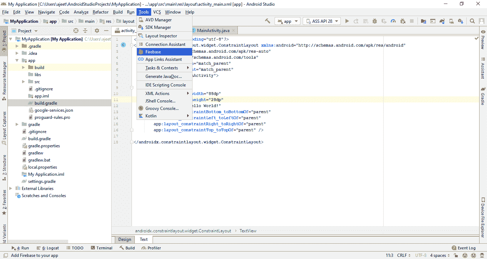
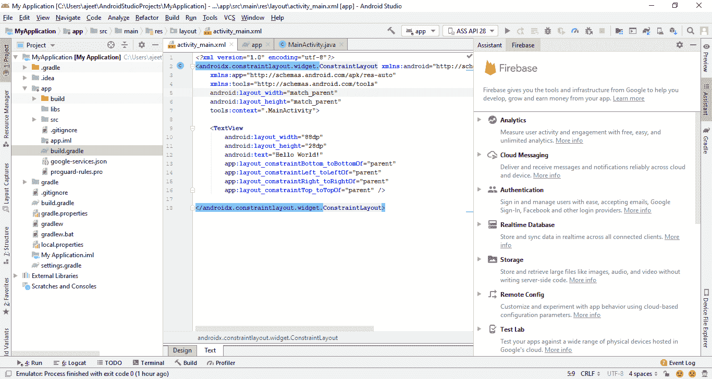
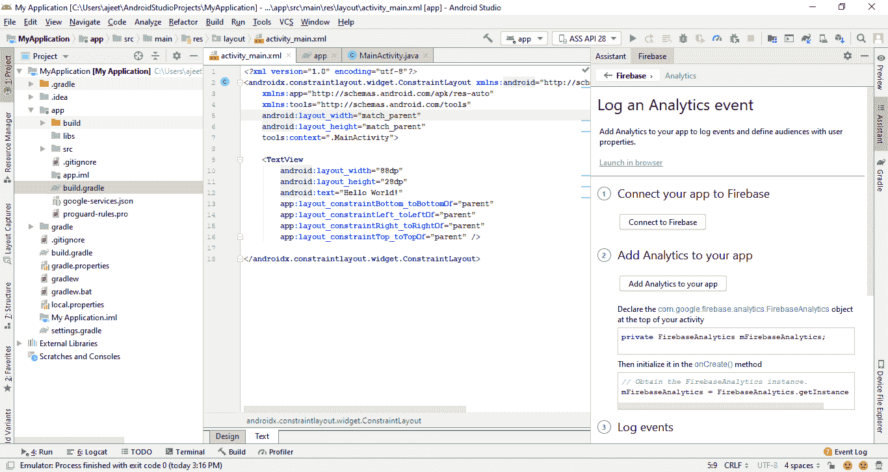
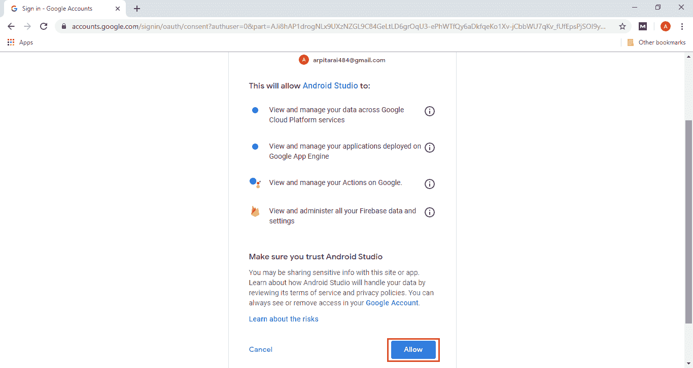
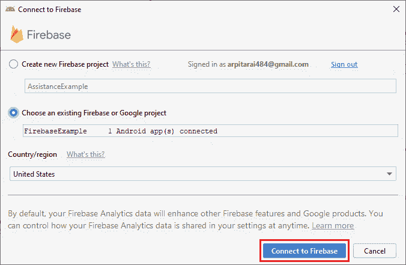
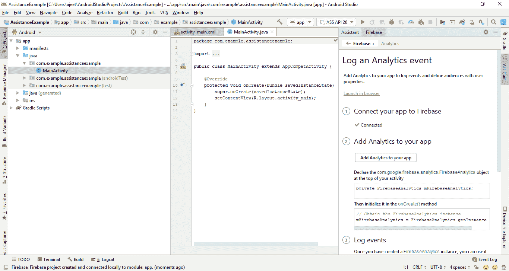
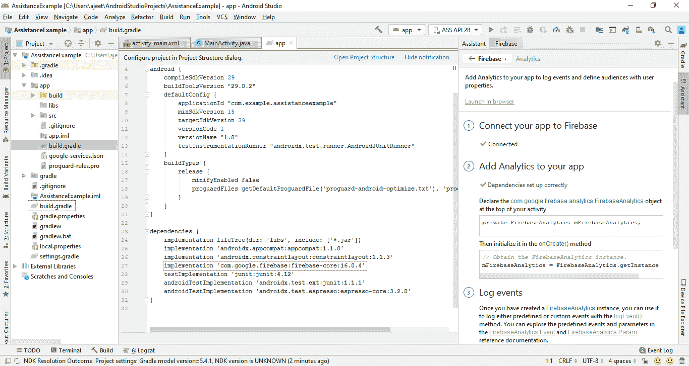
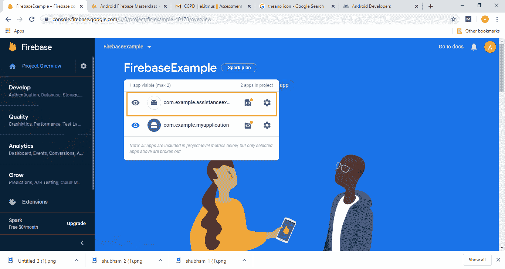

# 消防基地援助

> 原文：<https://www.javatpoint.com/firebase-assistance>

在我们之前的主题中，我们学习了如何在我们的安卓应用程序中手动添加 Firebase。在本节中，我们将学习如何使用 Firebase Assistance 在我们的安卓应用程序中添加 Firebase。

手动方法需要相同的先决条件。Firebase Assistance 会自动将必要的 Firebase 文件和代码添加到我们的安卓项目中。

我们可以简单地使用 Firebase Assistance 添加 Firebase，方法是从 Android Studio 的工具菜单中选择 Firebase。

当我们点击 Firebase 时，会打开一个新窗口，其中包含几个 Firebase 功能，如分析、云消息、身份验证和实时数据库等。

让我们从基础开始，即分析。当我们选择分析时，它为我们提供了我们需要做什么的逐步指南。

**第一步:**

因此，在第一步中，我们将连接到 Firebase。当我们点击连接到 Firebase 时，它可能会调出我们的浏览器，我们可能必须登录我们的谷歌帐户。如果我们登录到我们的谷歌账户，我们可能必须允许访问安卓工作室，这样它才能允许我们添加东西。

当我们点击允许，它会带我们回到安卓工作室。因为我们的项目已经和 Firebase 连接了，所以会弹出一个消息，就是 Firebase 已经连接了。但是如果我们的项目没有与 Firebase 连接，它将显示以下窗口。

在这里，我们必须创建一个新的 Firebase 项目或选择现有的 Firebase 项目。这完全取决于我们。当我们点击**连接到 Firebase** 时，我们的项目将成功连接 Firebase。

**第二步:**

在下一步中，我们将通过点击**将分析添加到您的应用程序**来将分析添加到我们的应用程序中。这实际上会更新我们的 build.gradle 文件，我们在上一节中已经这样做了。

当我们单击接受更改时，它将更新我们的 Gradle 文件，我们可以通过构建来验证。梯度文件。

* * *