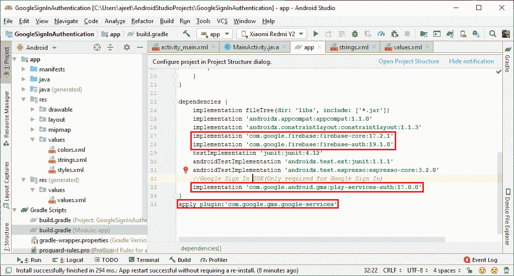
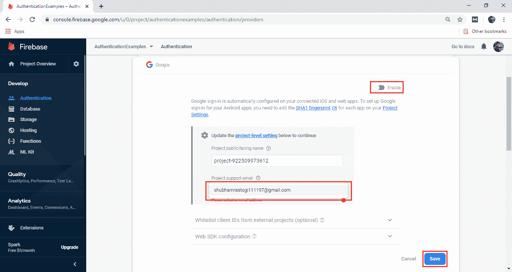
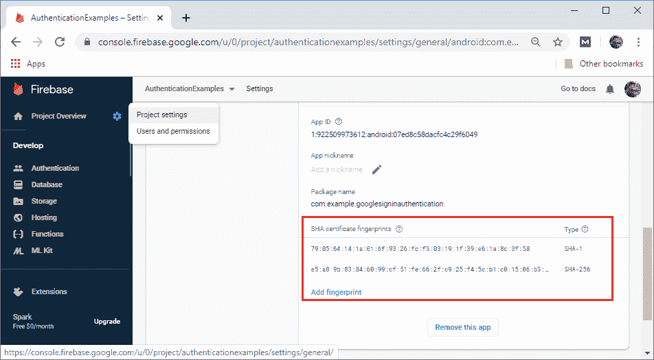
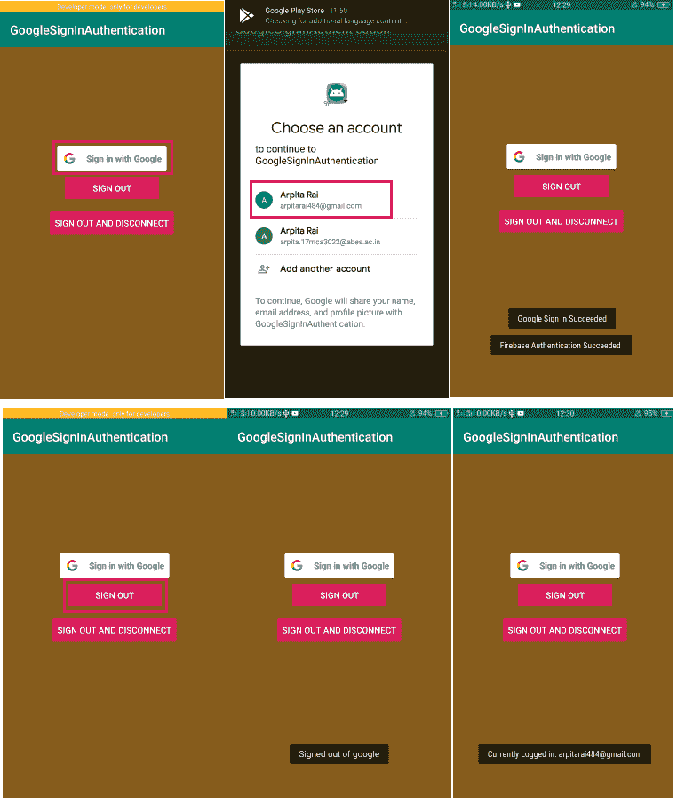
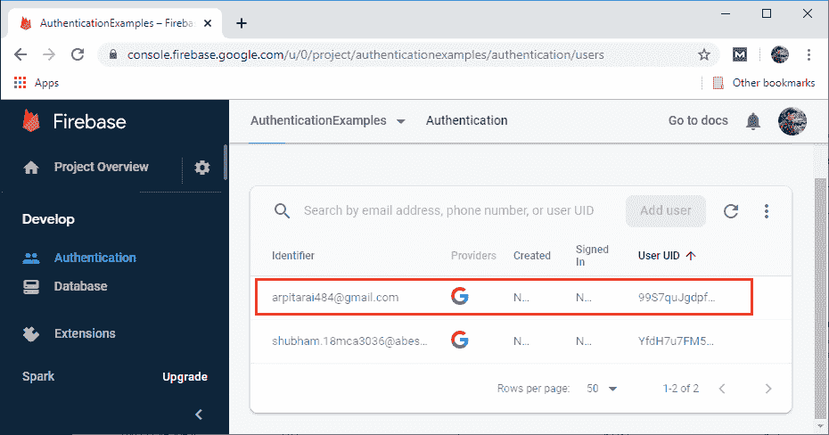

# Firebase:谷歌登录认证

> 原文：<https://www.javatpoint.com/firebase-google-sign-in-authentication>

正如我们前面所讨论的，Firebase 提供了不同类型的身份验证方法。在前一节中，我们学习了如何使用 Firebase UI 和 Firebase SDK 进行身份验证。在本节中，我们将学习另一种方法，即谷歌登录认证。这很容易做到。

开始步骤与我们对其他身份验证方法所做的相同，如下所示:

1.  创建一个安卓项目。
2.  创建一个 Firebase 项目。
3.  将 Firebase 添加到安卓项目或应用中，无论是手动还是 Firebase Assistance。
4.  添加所需的库和 JSON 文件。

**第一步:**

除了 firebase auth 和核心库，我们还必须在 app.gradle 文件中添加 google play services auth



**第二步:**

下一步，我们必须在 Firebase 控制台中启用谷歌登录方法。我们还必须添加一个项目支持电子邮件。



**第三步:**

就像我们以前的方法一样，我们必须设置 SHA-1 和 SHA-256 键。



**第四步:**

在下一步中，我们将创建布局文件，其中包含三个按钮谷歌登录，注销，以及注销和断开连接。活动布局如下所示:


**第五步:**

现在，我们将修改我们的 MainActivity.java 文件，以下列方式执行谷歌登录身份验证:

```

//Implement OnClickListener for sign-in button 
public class MainActivity extends AppCompatActivity implements View.OnClickListener {

    //Adding tag for logging and RC_SIGN_IN for an activity result
private static final String TAG = "GoogleActivity";
private static final int RC_SIGN_IN = 9001;

    // Adding Google sign-in client
    GoogleSignInClient mGoogleSignInClient;

    //Creating member variable for FirebaseAuth
private FirebaseAuth mAuth;

    @Override
protected void onCreate(Bundle savedInstanceState) {
super.onCreate(savedInstanceState);
        setContentView(R.layout.activity_main);

        //Adding buttons to the OnClickListener
        findViewById(R.id.sign_in_button).setOnClickListener(this);
        findViewById(R.id.signOutButton).setOnClickListener(this);
        findViewById(R.id.disconnectButton).setOnClickListener(this);

        //Building Google sign-in and sign-up option.
// Configuring Google Sign In
GoogleSignInOptions gso = new GoogleSignInOptions.Builder(GoogleSignInOptions.DEFAULT_SIGN_IN)
// for the requestIdToken, use getString(R.string.default_web_client_id), this is in the values.xml file that
                // is generated from your google-services.json file (data from your firebase project), uses the google-sign-in method
                // web api key
.requestIdToken(getString(R.string.default_web_client_id))//Default_web_client_id will be matched with the 
                .requestEmail()
                .build();

// Build a GoogleSignInClient with the options specified by gso.
mGoogleSignInClient = GoogleSignIn.getClient(this, gso);

// Set the dimensions of the sign-in button.
SignInButton signInButton = findViewById(R.id.sign_in_button);
        signInButton.setSize(SignInButton.SIZE_WIDE);

// Initialize Firebase Auth
mAuth = FirebaseAuth.getInstance();
    }
     //Creating onStart() method.
    @Override
public void onStart() {
super.onStart();

// Checking if the user is signed in (non-null) and update UI accordingly.
FirebaseUser currentUser = mAuth.getCurrentUser();

if (currentUser != null) {
            Log.d(TAG, "Currently Signed in: " + currentUser.getEmail());
            Toast.makeText(MainActivity.this, "Currently Logged in: " + currentUser.getEmail(), Toast.LENGTH_LONG).show();
        }
    }
     //Calling onActivityResult to use the information about the sign-in user contains in the object.
    @Override
public void onActivityResult(int requestCode, int resultCode, Intent data) {
super.onActivityResult(requestCode, resultCode, data);

// Result returned from launching the Intent from GoogleSignInApi.getSignInIntent(...);
if (requestCode == RC_SIGN_IN) {
            Task<GoogleSignInAccount> task = GoogleSignIn.getSignedInAccountFromIntent(data);
try {
// Google Sign In was successful, authenticate with Firebase
GoogleSignInAccount account = task.getResult(ApiException.class);
                Toast.makeText(this, "Google Sign in Succeeded",  Toast.LENGTH_LONG).show();
                firebaseAuthWithGoogle(account);
            } catch (ApiException e) {
// Google Sign In failed, update UI appropriately
Log.w(TAG, "Google sign in failed", e);
                Toast.makeText(this, "Google Sign in Failed " + e,  Toast.LENGTH_LONG).show();
            }
        }
    }
    //Creating helper method FirebaseAuthWithGoogle().  
private void firebaseAuthWithGoogle(GoogleSignInAccount acct) {
        Log.d(TAG, "firebaseAuthWithGoogle:" + acct.getId());
        //Calling get credential from the oogleAuthProviderG
        AuthCredential credential = GoogleAuthProvider.getCredential(acct.getIdToken(), null);
mAuth.signInWithCredential(credential)
                .addOnCompleteListener(this, new OnCompleteListener<AuthResult>() {
//Override th onComplete() to see we are successful or not. 
 @Override
public void onComplete(@NonNull Task<AuthResult> task) {
if (task.isSuccessful()) {
// Update UI with the sign-in user's information
FirebaseUser user = mAuth.getCurrentUser();
                            Log.d(TAG, "signInWithCredential:success: currentUser: " + user.getEmail());
                            Toast.makeText(MainActivity.this, "Firebase Authentication Succeeded ",  Toast.LENGTH_LONG).show();
                        } else {
// If sign-in fails to display a message to the user.
Log.w(TAG, "signInWithCredential:failure", task.getException());
                            Toast.makeText(MainActivity.this, "Firebase Authentication failed:" + task.getException(),  Toast.LENGTH_LONG).show();
                        }
                    }
                });
    }

public void signInToGoogle(){
        //Calling Intent and call startActivityForResult() method 
        Intent signInIntent = mGoogleSignInClient.getSignInIntent();
        startActivityForResult(signInIntent, RC_SIGN_IN);
    }

private void signOut() {
// Firebase sign out
FirebaseAuth.getInstance().signOut();

// Google sign out
mGoogleSignInClient.signOut().addOnCompleteListener(this,
new OnCompleteListener<Void>() {
                    @Override
public void onComplete(@NonNull Task<Void> task) {
// Google Sign In failed, update UI appropriately
Toast.makeText(getApplicationContext(),"Signed out of google",Toast.LENGTH_SHORT).show();
                    }
                });
    }

private void revokeAccess() {
// Firebase sign out
FirebaseAuth.getInstance().signOut();

// Google revoke access
mGoogleSignInClient.revokeAccess().addOnCompleteListener(this,
new OnCompleteListener<Void>() {
                    @Override
public void onComplete(@NonNull Task<Void> task) {
// Google Sign In failed, update UI appropriately
Log.w(TAG, "Revoked Access");
                    }
                });
    }

    @Override
public void onClick(View v) {
int i = v.getId();
if (i == R.id.sign_in_button) {
Adding signInToGoogle() method
 signInToGoogle();
        }
else if (i == R.id.signOutButton) {
            signOut();
        }
else if (i == R.id.disconnectButton) {
            revokeAccess();
        }
    }

    @Override
public void onPointerCaptureChanged(boolean hasCapture) {

    }
}

```



[Click here to download project](https://static.javatpoint.com/tutorial/firebase/download/GoogleSignInAuthentication.zip)

* * *