# Firebase:脸书登录身份验证

> 原文：<https://www.javatpoint.com/firebase-facebook-sign-in-authentication>

在本节中，我们将讨论 Firebase 最流行的身份验证方法，即脸书。脸书登录身份验证的实现非常典型。通过将脸书登录集成到我们的应用中，用户可以使用他们的脸书帐户向 Firebase 进行身份验证。

让我们一个接一个地看看实现脸书登录身份验证的步骤。

**第一步:**

在第一步中，我们将创建一个安卓和 Firebase 项目，然后我们将在我们的应用中添加 Firebase 项目。另外，在 Firebase 控制台中添加 SHA-1 和 SHA-256 键。然后，在“app.build.gradle”文件中添加所有必需的依赖项，即 firebase-core、firebase-auth 和 plugin，在“build.gradle”文件中添加类路径。

我们还将在“app.build.gradle”文件中添加脸书登录依赖项。

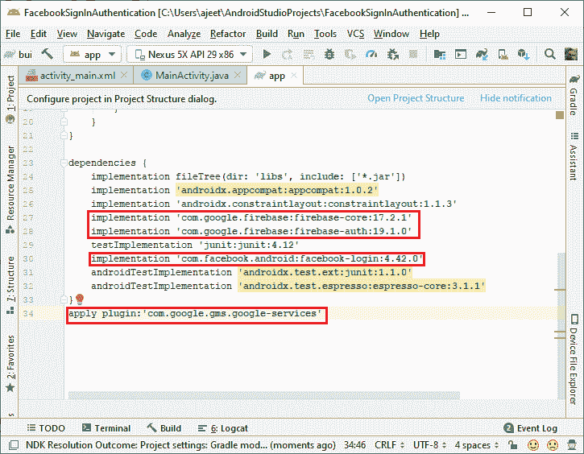

**第二步:**

下一步，我们必须在“开发者脸书”网站上创建一个应用。为了创建请求，我们应该有一个脸书帐户。使用脸书帐户登录。然后，在以下链接的帮助下转到脸书开发人员网站:

[https://developers.facebook.com/](https://developers.facebook.com/)


一旦我们的开发人员帐户登录，我们将点击文档进入文档页面。

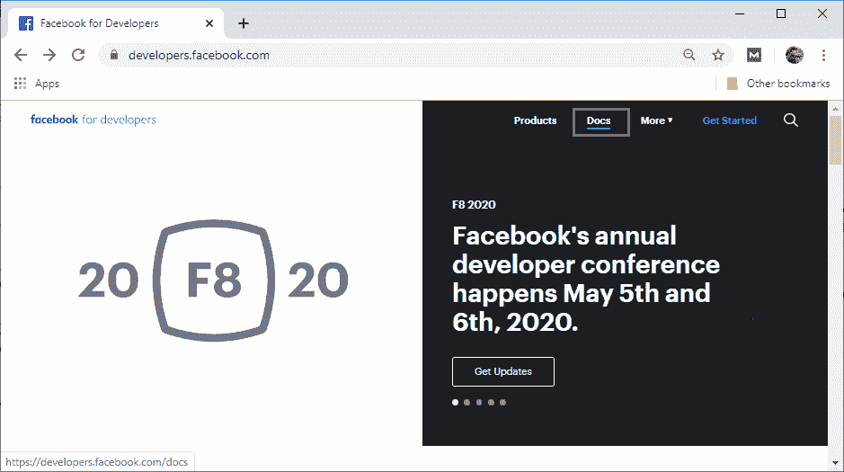

**第三步:**

在文档页面，我们将向下滚动并点击脸书登录。在脸书登录页面，我们将选择安卓来移动安卓页面，我们将选择一个应用或创建一个新的应用。

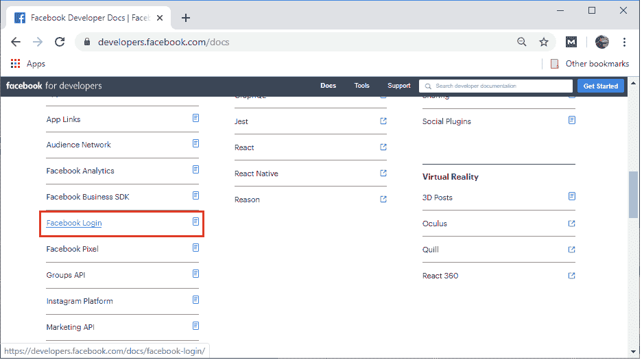
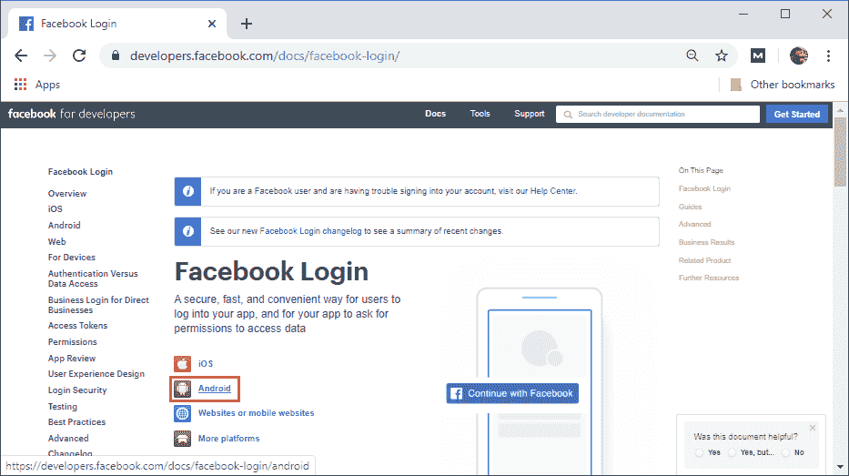

如果我们不是开发者，那么我们必须通过点击注册来注册为开发者。

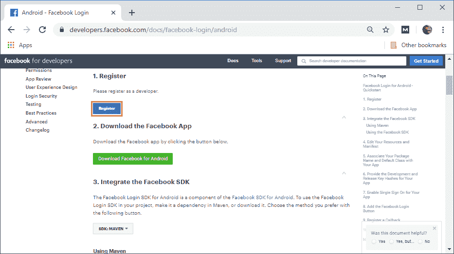

点击下一步注册成为脸书开发商。

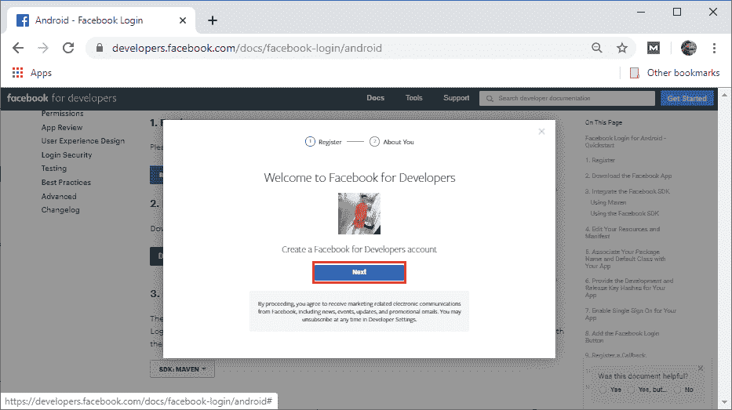

单击下一步后，将会出现一个新的屏幕，从中可以选择开发人员选项。

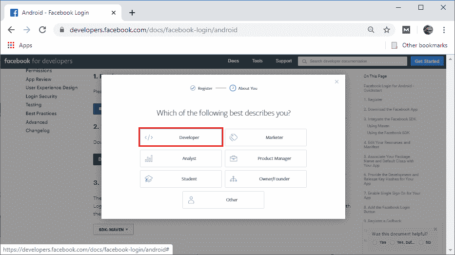

选择开发人员后，将打开欢迎页面。

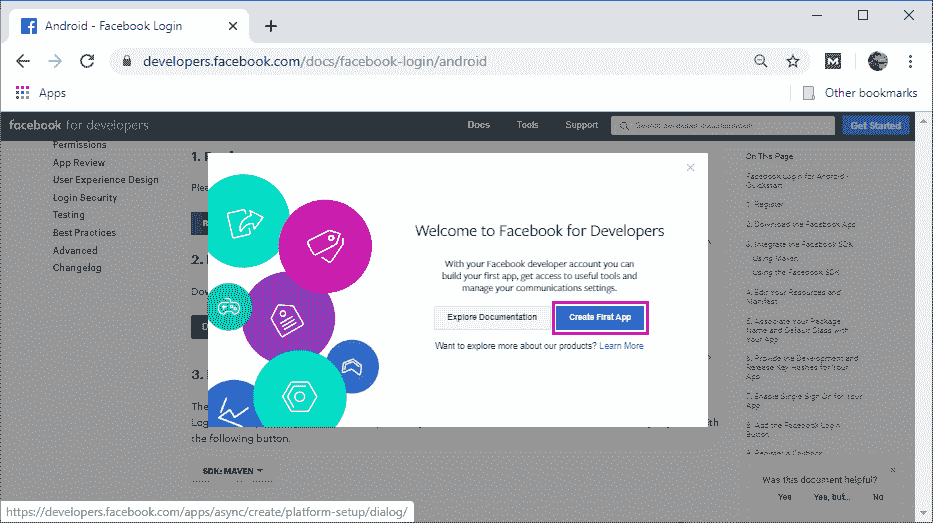

在欢迎页面中，选择**创建第一个应用**并为其命名以供显示和联系电子邮件，然后点击**创建应用标识**。

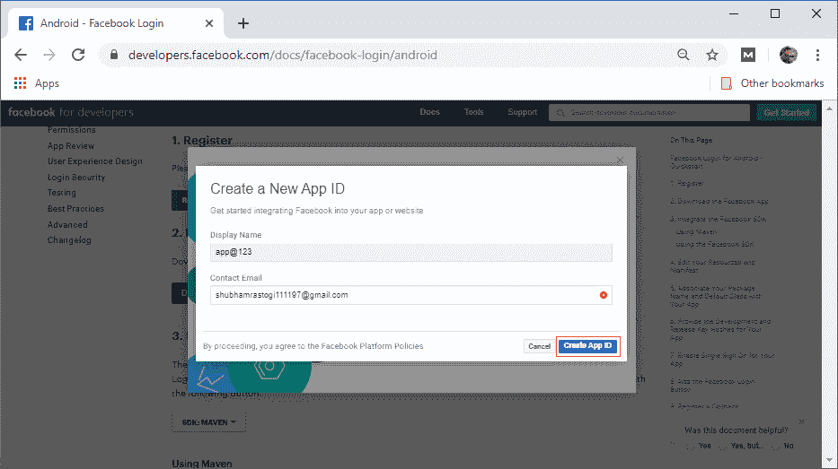

执行安全检查。

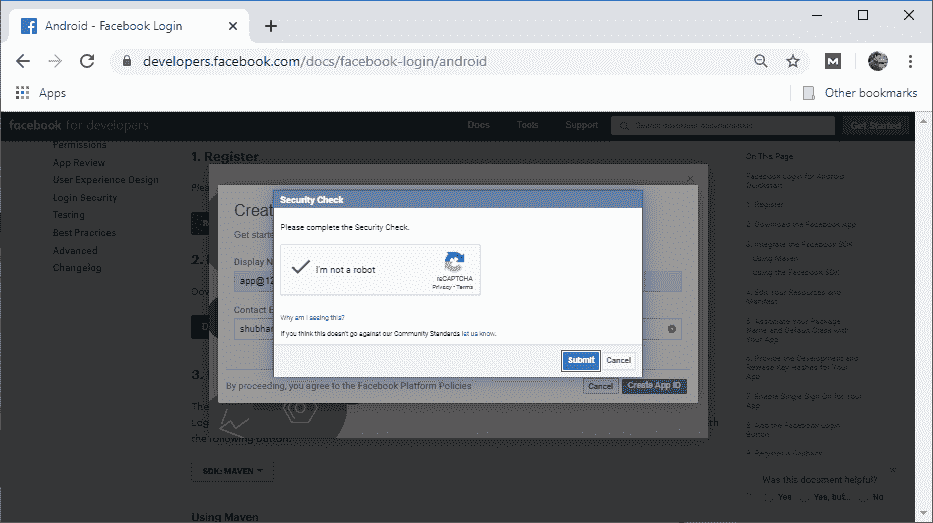
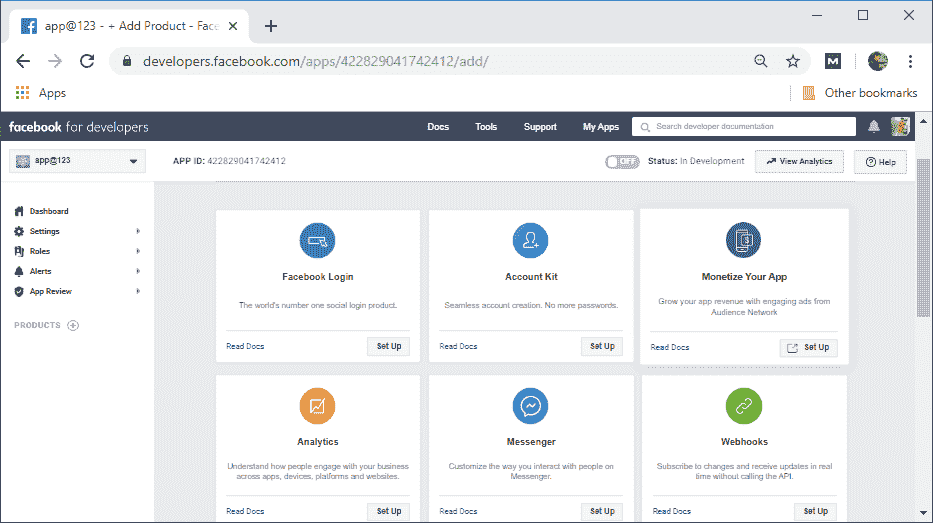

现在，转到主页->文档->facebook 登录->安卓，选择我们之前创建并复制了应用标识的应用。

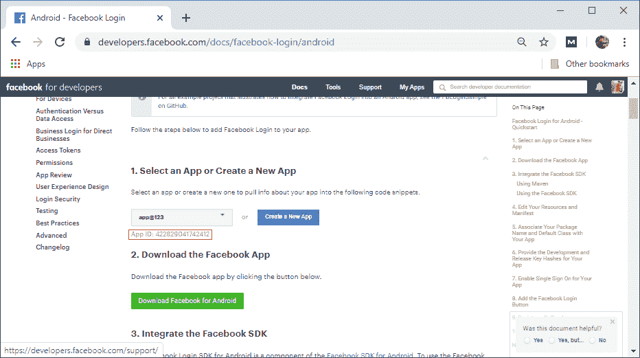

**第四步:**

下一步，我们将移动到 Android Studio 的‘string . XML’文件，创建两个字符串，即 facebook_app_id 和 fb_login_protocol_scheme。对于 facebook_app_id，我们将粘贴之前复制的 app id，对于 fb_login_protocol_scheme，我们将在 app_id 中添加前缀 fb，并将其用作协议字符串。

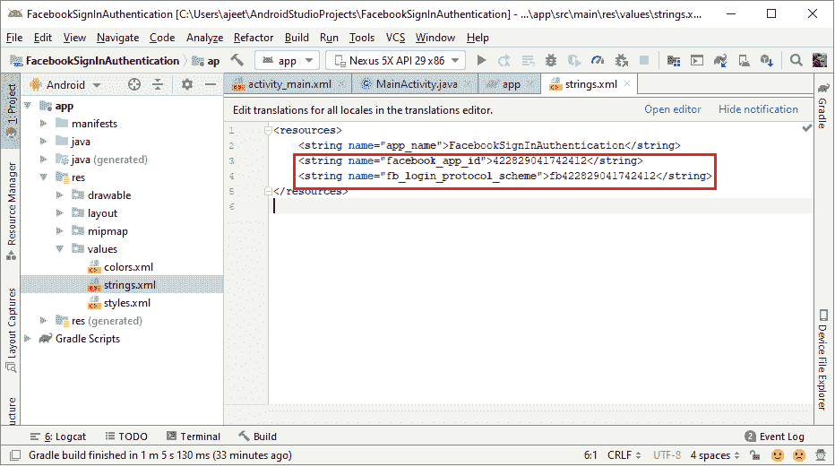

**第五步:**

我们还需要将互联网许可添加到我们的安卓清单文件中。


**第六步:**

在下一步中，我们将添加元数据。为此，我们将前往脸书开发人员网站，复制第 5 步的代码。

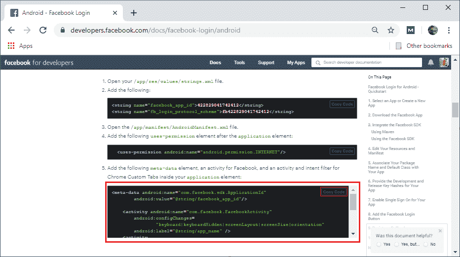

复制代码后，我们将把它粘贴到 MainActivity 代码之后的 Manifest 文件中。

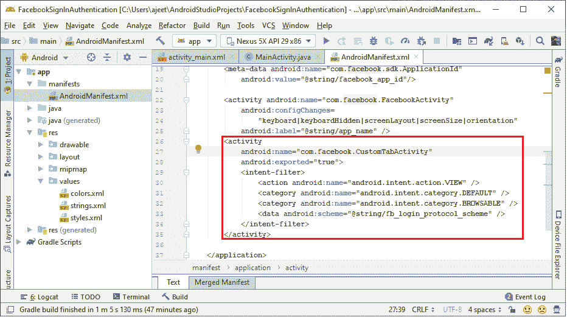

**第七步:**

现在，我们将把我们的包名和默认类与我们的应用相关联。因此，我们将在开发人员站点中添加包名和默认活动类名。


**第八步:**

在下一步中，我们将为我们的应用添加**开发密钥哈希**。为此，我们需要 **openssl** 开放库。如果我们没有这个库，那么我们首先必须下载 openssl 库。之后，我们将在命令提示符下执行以下命令:

```

keytool -export cert -alias androiddebugkey - Keystore "C:\Users\USERNAME\.android\debug.keystore" | "PATH_TO_OPENSSL_LIBRARY\bin\openssl" sha1 -binary | "PATH_TO_OPENSSL_LIBRARY\bin\openssl" base64

```

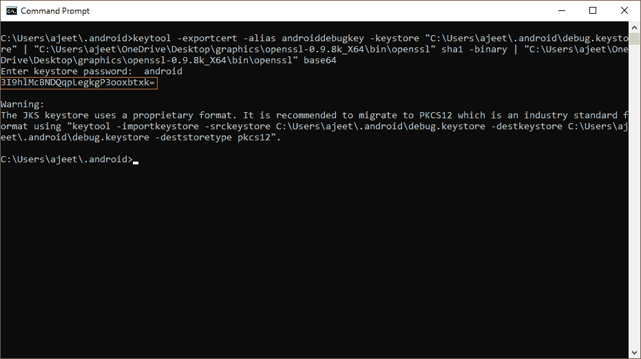

我们将复制这个密钥并将其粘贴到开发人员站点的**密钥散列**中。


**第九步:**

下一步，我们必须在 facebook 开发者网站上为我们的应用启用单点登录。

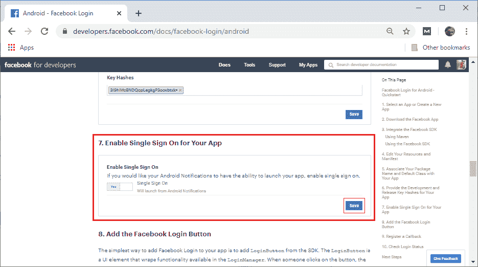

**第十步:**

在下一步中，我们将进入 facebook 开发者网站中我们应用的基本设置。从这里，我们必须复制将在 Firebase 控制台中使用的应用机密。

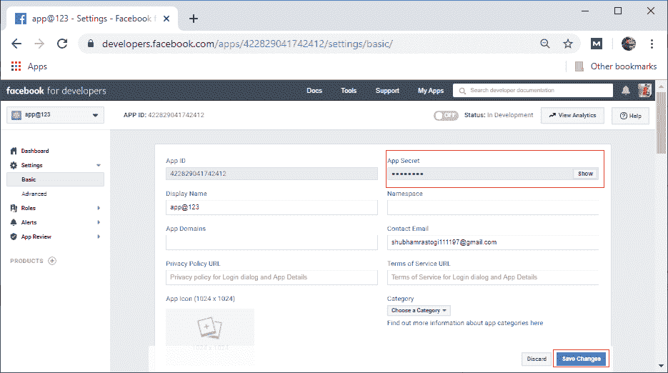

**第 11 步:**

我们从脸书开发者网站复制的应用秘密将被粘贴到 firebase 控制台。当我们启用脸书登录方法时，它会询问应用标识和应用密码，并提供 OAuth 重定向网址，该网址将添加到我们在脸书开发人员网站上的应用中。


现在，我们将进入脸书设置页面。在这里，我们将把 OAuth 重定向 URL 添加到脸书登录设置中。

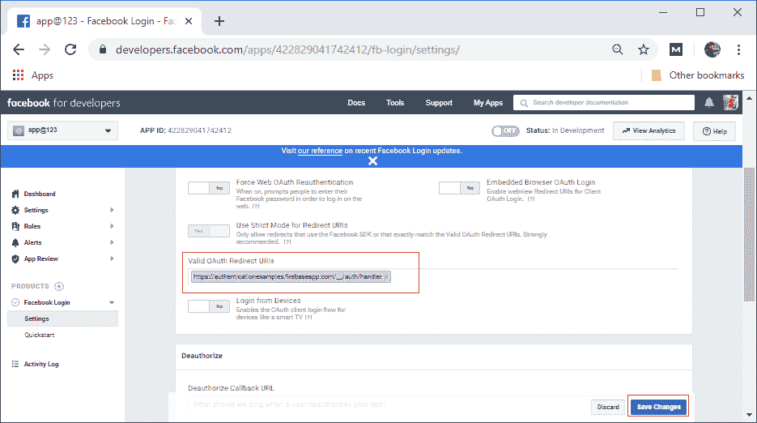

**第 12 步:**

在下一步中，我们将从 SDK 创建一个脸书登录按钮。它是包装登录管理器中可用功能的用户界面元素。


**第 13 步:**

在下一步中，我们将修改我们的 MainActivity.java 文件，以通过以下方式使用脸书执行身份验证:

```

public class MainActivity extends AppCompatActivity {

    private static final String TAG = "FacebookLogin";
    private static final int RC_SIGN_IN = 12345;

    private CallbackManager mCallbackManager;

    private FirebaseAuth mAuth;

    @Override
    protected void onCreate(Bundle savedInstanceState) {
        super.onCreate(savedInstanceState);
        setContentView(R.layout.activity_main);

        // Initialize Firebase Auth
        mAuth = FirebaseAuth.getInstance();

        // Initialize Facebook Login button
        mCallbackManager = CallbackManager.Factory.create();

        LoginButton loginButton = findViewById(R.id.login_button);

        loginButton.setReadPermissions("email", "public_profile");
        loginButton.registerCallback(mCallbackManager, new FacebookCallback<LoginResult>() {
            @Override
            public void onSuccess(LoginResult loginResult) {
                Log.d(TAG, "facebook:onSuccess:" + loginResult);
                handleFacebookAccessToken(loginResult.getAccessToken());
            }

            @Override
            public void onCancel() {
                Log.d(TAG, "facebook:onCancel");
            }

            @Override
            public void onError(FacebookException error) {

            }

        });
    }

    @Override
    public void onStart() {
        super.onStart();

        // Checking if the user is signed in (non-null) and update UI accordingly.
        FirebaseUser currentUser = mAuth.getCurrentUser();

        if (currentUser != null) {
            Log.d(TAG, "Currently Signed in: " + currentUser.getEmail());
            Toast.makeText(MainActivity.this, "Currently Logged in: " + currentUser.getEmail(), Toast.LENGTH_LONG).show();
        }
    }
    @Override
    protected void onActivityResult(int requestCode, int resultCode, Intent data) {
        super.onActivityResult(requestCode, resultCode, data);

        // The activity result pass back to the Facebook SDK
        mCallbackManager.onActivityResult(requestCode, resultCode, data);
    }

    private void handleFacebookAccessToken(AccessToken token) {
        Log.d(TAG, "handleFacebookAccessToken:" + token);

        AuthCredential credential = FacebookAuthProvider.getCredential(token.getToken());

        mAuth.signInWithCredential(credential)
                .addOnCompleteListener(this, new OnCompleteListener<AuthResult>() {
                    @Override
                    public void onComplete(@NonNull Task<AuthResult> task) {
                        if (task.isSuccessful()) {
                            // Sign in success, UI will update with the signed-in user's information
                            Log.d(TAG, "signInWithCredential:success");
                            FirebaseUser user = mAuth.getCurrentUser();
                            Toast.makeText(MainActivity.this, "Authentication Succeeded.", Toast.LENGTH_SHORT).show();
                        } else {
                            // If sign-in fails, a message will display to the user.
                            Log.w(TAG, "signInWithCredential:failure", task.getException());
                            Toast.makeText(MainActivity.this, "Authentication failed.", Toast.LENGTH_SHORT).show();
                        }
                    }
                });
    }
}

```

**输出:**

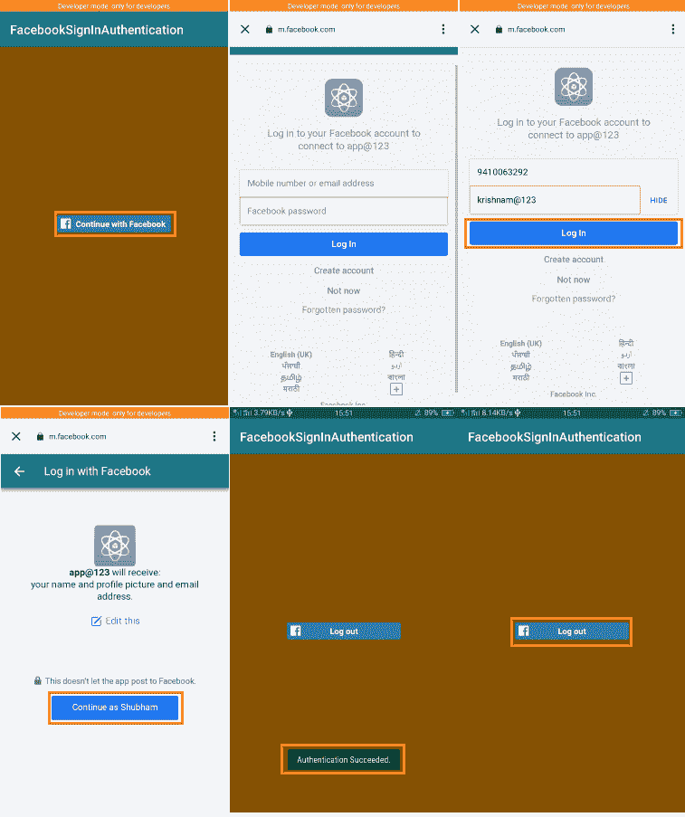

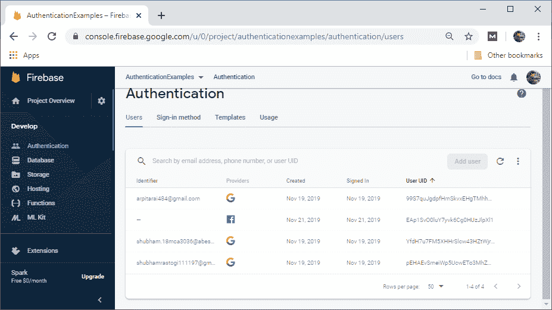[Click here to download project](https://static.javatpoint.com/tutorial/firebase/download/FacebookSignInAuthentication.zip)

* * *