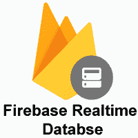
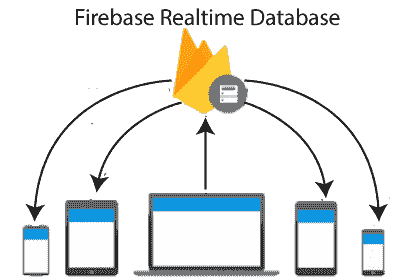

# 实时数据库

> 原文：<https://www.javatpoint.com/firebase-realtime-database>

Firebase 实时数据库是一个云托管的数据库，其中的数据存储为 JSON。数据实时同步到每个连接的客户端。当我们使用 iOS 和 JavaScript SDKs 构建跨平台应用程序时，我们的所有客户端共享一个实时数据库实例，并自动接收最新数据的更新。

Firebase 实时数据库是一个 NoSQL 数据库，我们可以从中实时存储和同步用户之间的数据。这是一个很大的 JSON 对象，开发者可以实时管理。通过使用单个应用编程接口，Firebase 数据库向应用程序提供数据的当前值以及对该数据的更新。实时同步使我们的用户可以轻松地从任何设备访问他们的数据，无论是网络设备还是移动设备。

实时数据库帮助我们的用户相互协作。它附带了移动和网络软件开发工具包，允许我们在不需要服务器的情况下构建应用程序。当我们的用户离线时，实时数据库 SDK 使用设备上的本地缓存来服务和存储更改。当设备联机时，本地数据会自动同步。

## 关键能力

实时数据库能够提供所有离线和在线服务。这些功能包括客户端设备的可访问性、跨多个数据库的扩展等。

### 实时

Firebase 实时数据库使用数据同步，而不是使用 HTTP 请求。任何连接的设备都会在几毫秒内收到更新。它不考虑网络代码，提供协作和沉浸式体验。

### 脱机的

Firebase 数据库软件开发工具包将我们的数据保存在磁盘上，因此，Firebase 应用程序即使在离线时也能保持响应。一旦重新建立连接，客户端设备就会收到丢失的更改。

### 可从客户端设备访问

应用服务器不需要访问 Firebase 实时数据库。我们可以通过移动设备或网络浏览器直接访问它。数据验证和安全性可通过 Firebase 实时数据库安全规则获得，这是在读取或写入数据时执行的基于表达式的规则。

### 跨多个数据库扩展

借助 Firebase 实时数据库的 Blaze 定价计划，我们可以通过在单个 Firebase 项目中跨多个数据库实例分割数据来支持应用程序的数据需求。在我们的项目中使用 Firebase 身份验证简化身份验证，并在我们的数据库实例中验证用户。使用每个数据库实例可用的自定义 Firebase 实时数据库规则控制对每个数据库中数据的访问。

## 其他选择

除了 Firebase 的实时数据库之外，还有几种可供选择的方法。

### 云Storm

Cloud Firestore 是一个可扩展且灵活的数据库，用于 Firebase 和谷歌云平台的服务器开发、移动和网络。

### Firebase 远程配置

它存储开发人员指定的键值对，以改变我们的应用程序的行为和外观，而不需要用户下载更新。

### Firebase 托管

它用于承载我们网站的 HTML、CSS 和 JavaScript，以及其他开发人员提供的资产，如图形、字体和图标。

### 云存储

它用于存储图像、视频和音频以及其他用户生成的内容。

* * *