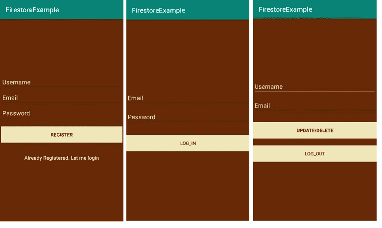
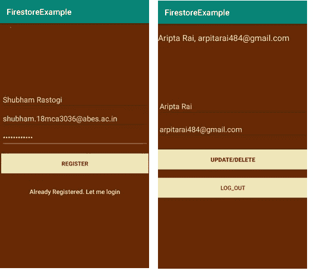
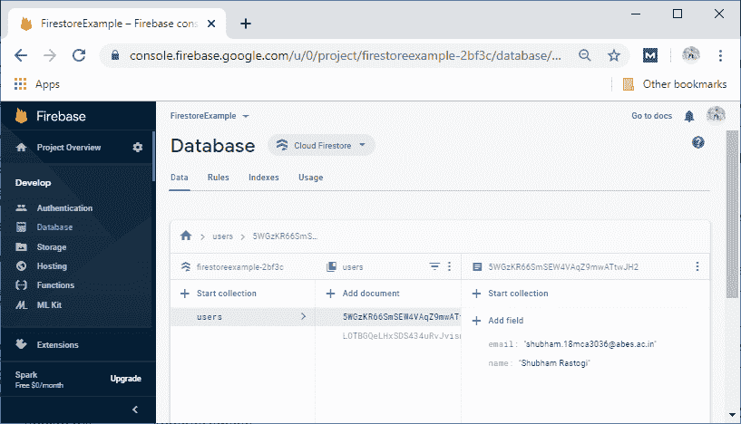

# 在风暴中阅读和写作

> 原文：<https://www.javatpoint.com/firebase-read-and-write-in-firestore>

在这一节中，我们将学习如何在 Firebase Firestore 中读写。之前，我们创建了一个安卓应用程序，并添加了 Firebase。我们已经实现了所有需要的库和插件。我们之前已经创建了一个 Firestore 数据库。

## 将数据写入风暴

为了写入数据，我们必须使用 getInstance()检索数据库的一个实例，并引用我们想要写入的位置。我们将从我们的活动中访问云 Firestore 实例。

```

val db=FirebaseFirestore.getInstance()

```

我们已经知道，数据存储在文档中，这些文档存储在集合中。因此，我们将隐式创建集合和文档。当我们第一次向文档中添加数据时，将自动创建集合。让我们看一个将地图添加到集合中的示例。

```

//Creating a new user with a first and last name
val user=hashMapOff(
	"first" to"Shubham",
	"last" to "Rastogi"
	"born" to 1815
)
//Adding a new document with generated ID
db.collection("users").add(user).addOnSuccessListener { documentReference ->
	Log.w(TAG,"DocumentSnapshot added with ID:${documentReference.id}")
}
.addOnFailureListener{e ->
	Log.w(TAG,"Error adding document",e)
}

```

将数据写入 Cloud Firestore 的方法有以下几种:

1.  在第一种方法中，我们在集合中设置文档的数据，显式指定文档标识符。
2.  我们可以通过向集合中添加新文档来将数据写入数据库。云 Firestore 会自动生成文档标识符。
3.  我们可以通过用自动生成的标识符创建一个空文档来将数据写入数据库。数据将在以后分配给它。

### 设置文档

我们使用 set()方法来创建或覆盖单个文档。当我们使用 set()方法创建文档时，我们必须为要创建的文档指定一个标识。

```

db.collection("cities").document("new-city-id").set(data)
val city = hashMapOf(
	"name" to "Noida"
	"state" to "UP"
	"country" to "India"
)
db.collection("cities").document("LA").set(city)

```

当我们使用 set()创建文档时，让 Cloud Firestore 自动为我们生成一个 ID(add())会更方便。

```

// Adding a new document with a generated id
val data=hashMapOf(
	"name" to "UP"
	"country" to "India"
)
db.collection("cities").add(data)
	.addOnSuccessListener{
		documentReference -> Log.d(TAG,"DocumentSnapshot written with ID:${documentReference.id}")
}
.addOnFailureListener{
	e->Log.w(TAG,"Error adding document",e)
}

```

用自动生成的标识创建文档引用，然后在以后使用该引用(doc())也很有用。

```

val data=HashMap()
val newCityRef=db.collection("cities").document()
//Later...
newCityRef.set(data) 
```

### 数据类型

我们可以在文档中编写各种数据类型和对象。

```

val docData=hashMapOf(
	"stringExample" to "JavaTpoint",
	"booleanExample" to true,
	"numberExample" to 3.14159265,
	"dateExample" to Timestamp(Date()),
	"listExample" to arrayListOf(1, 2, 3),
	"nullExample" to null
)
val nestedData=hashMapOf(
	"a" to 5,
	"b" to true
)
docData["objectExample"]=nestedData
db.collection("data").document("one")
	.set(docData)
	.addOnSuccessListener{Log.d(Tag,"DocumentSnapshot successfullyt written")}
	.addOnFailureListener{e->Log.w(TAG,"Error writing document",e)}

```

### 自定义对象

我们可以用自定义类编写自己的 java 对象。这些自定义类在内部将对象转换为受支持的数据类型。每个列类必须有一个不带参数的公共构造函数，并且该类必须有一个用于每个属性的公共 getter。

```

data class City(
	val name:String?=null,
	val state:String?=null,
val country:String?=null, 
val isCapital:Boolean?=null,
val population:Long?=null,
val regions:List?=null
)
val city=City("Noida","UP","India",false,5000000L,listOf("west_coast","social"))
db.collection("cities").document("LA").set(city) 
```

## 从风暴中读取数据

```

db.collection("users")
	.get().addOnSuccessListener{result->
		for(document in result){
			Log.d(TAG,"${document.id}=>${document.data}")
		}
	}
	.addOnFailureListener{exception->
		Log.w(TAG,"Error getting documents.",exception)
}

```

检索数据有两种方式，存储在 Cloud Firestore 中。

1.  调用方法获取数据。
2.  设置用于接收数据更改事件的侦听器。我们发送数据的初始快照，然后在文档更改时发送另一个快照。

这两种方法都用于文档、文档集合或查询结果。让我们举一个例子，我们用一些关于城市的数据填充数据库。

```

val data1=hashMapOf(
	"name" to "noida"
	"state" to "UP"
	"country" to "USA"
	"capital" to false,
	"population" to 860000,
	"regions" to listOf("hinduism","Muslims")
)
cities.document("SF").set(data1)

```

### 使用自定义对象

```

val docRef=db.collection("cities").document("Bj")
docRef.get().addonSuccessListener{
	documentSnapshot ->
		val city=documentSnapshot.toObject(City::class.java)
}

```

### 从集合中获取多个文档

我们还可以通过查询集合中的文档来检索多个文档。我们可以使用 where()查询所有满足特定条件的文档，然后使用 get()检索结果。

```

db.collection("cities").whereEqualTo("capital",true).get()
	.addOnSuccessListener{ documents ->
		for(document in documents){
			Log.d(TAG,"${document.id}=>${document.data}")
		}
	}
	.addOnFailureListener{exception ->
		Log.w(TAG,"Error getting documents:",exception)
}

```

### 从集合中获取多个文档

```

db.collection("cities").get()
	.addOnSuccessListener{ documents ->
		for(document in documents){
			Log.d(TAG,"${document.id}=>${document.data}")
		}
	}
	.addOnFailureListener{exception ->
		Log.w(TAG,"Error getting documents:",exception)
}

```

## 使用带有 kotlin 扩展的云风暴

如果我们想使用带有 Kotlin 扩展的 Cloud Firestore Android SDK，我们必须在应用程序的 buid.gradle 文件中添加以下库:

我们必须确保有最新版本的 maven.google.com。该库包括 firebase-Firestore 库。

```

Implementation 'com.google.firebase: firebase-firestore-ktx: 18.2.0'  

```

### 我的锅

```

val Firestore=FirebaseFirestore.getInstance()
val anotherFirestore=FirebaseFirestore.getInstance(FirebaseApp.getInstance("myApp"))

```

### 科特林+KTX

```

val Firestore=Firebase.firestore
val anotherFirestore=Firebase.firestore(Firebase.app("myApp")) 

```

## 文档快照字段到普通旧 Java 对象的转换

**1)锅炉**

```

val snapshot: DocumentSnapshot=...
val myObject=snapshot.get("fieldPath",MyClass::class.java)

```

**或**

```

val snapshot: DocumentSnapshot=...
val myObject=snapshot.toObject(MyClass::class.java)

```

2)科特林+KTX

```

val snapshot: DocumentSnapshot=...
val myObject=snapshot.get("fieldPath") 
```

**或**

```

val snapshot: DocumentSnapshot=...
val myObject=snapshot.toObject() 
```

## 将 QuerySnapshot 转换为普通的旧 Java 对象

**1)锅炉**

```

val snapshot: QuerySnapshot=...
val myObject=snapshot.toObject(MyClass::class.java)

```

2)科特林+KTX

```

val snapshot: QuerySnapshot=...
val myObject=snapshot.toObject() 
```

### 示例:

我们正在实现一个安卓应用程序。这是一个用户记录和注册应用程序，有三个 xml 文件和四个 Kotlin 文件。activity_main.xml 用于注册页面。activity_signing.xml 用于登录，activity_welcome.xml 用于从数据库中检索数据。同样，有四个 Kotlin 文件，即主活动、签名、欢迎和用户。

当用户自己注册时，他们被添加到 firebase console 用户部分，相应的数据存储在数据库中。签名功能与我们在身份验证部分所做的相同。当用户成功注册或注册时，他将切换到欢迎页面，在那里他将找到他的数据。

**activity_main.xml，activity_signing，activity_welcome**

**

**MainActivity.kt**

```

package com.example.firestoreexample

import android.content.Intent
import androidx.appcompat.app.AppCompatActivity
import android.os.Bundle
import android.text.TextUtils
import android.util.Log
import android.view.View
import android.widget.Toast
import com.google.firebase.auth.FirebaseAuth
import com.google.firebase.firestore.FirebaseFirestore
import kotlinx.android.synthetic.main.activity_main.*

class MainActivity : AppCompatActivity() {

    private var mAuth: FirebaseAuth?=null
    private var mFirebaseDatabaseInstances:FirebaseFirestore?=null

    private var userId:String?=null
    private var emailAddress:String?=null

    override fun onCreate(savedInstanceState: Bundle?) {
        super.onCreate(savedInstanceState)
        setContentView(R.layout.activity_main)

        //Get Firebase Instances
        mAuth=FirebaseAuth.getInstance()
        mFirebaseDatabaseInstances= FirebaseFirestore.getInstance()

        //if already logged in go to sign in screen
        if(mAuth!!.currentUser!=null){
            startActivity(Intent(this,welcome::class.java))
            finish()
        }
    }

    fun onLoginClicked(view: View) {
        startActivity(Intent(this,signing::class.java))
        finish()
    }
    fun onRegisterClicked(view: View) {
        if(TextUtils.isEmpty(username.text.toString())){
            Toast.makeText(applicationContext,"Enter Username!",Toast.LENGTH_LONG).show()
        }
        if(TextUtils.isEmpty(email.text.toString())){
            Toast.makeText(applicationContext,"Enter email address!",Toast.LENGTH_LONG).show()
        }
        if(TextUtils.isEmpty(password.text.toString())){
            Toast.makeText(applicationContext,"Enter password!",Toast.LENGTH_LONG).show()
        }
        if(password.text.toString().length<6){
            Toast.makeText(applicationContext,"Password is too short",Toast.LENGTH_LONG).show()
        }

        progressBar!!.visibility=View.VISIBLE

        //create user
        mAuth!!.createUserWithEmailAndPassword(email.text.toString(),password.text.toString())
            .addOnCompleteListener(this){task ->
                Toast.makeText(this,"createUserWithEmail:onComplete"+task.isSuccessful,Toast.LENGTH_SHORT).show()
                progressBar.visibility=View.GONE

                if(task.isSuccessful){

                    val user=FirebaseAuth.getInstance().currentUser

                    //add username, email to database
                    userId=user!!.uid
                    emailAddress=user.email

                    val myUser=user(username.text.toString(),emailAddress!!)

                    mFirebaseDatabaseInstances?.collection("users")?.document(userId!!)?.set(myUser)

                    startActivity(Intent(this,welcome::class.java))
                    finish()
                }else{
                    Toast.makeText(this,"Authentication Failed"+task.exception,Toast.LENGTH_SHORT).show()
                    Log.e("MyTag",task.exception.toString())
                }
            }
    }
}

```

**欢迎. kt**

```

package com.example.firestoreexample

import android.content.Intent
import android.nfc.Tag
import androidx.appcompat.app.AppCompatActivity
import android.os.Bundle
import android.util.Log
import android.view.View
import androidx.constraintlayout.solver.widgets.Snapshot
import com.google.firebase.auth.FirebaseAuth
import com.google.firebase.database.*
import com.google.firebase.firestore.FirebaseFirestore
import kotlinx.android.synthetic.main.activity_main.*
import kotlinx.android.synthetic.main.activity_main.email
import kotlinx.android.synthetic.main.activity_main.username
import kotlinx.android.synthetic.main.activity_welcome.*

class welcome : AppCompatActivity() {

    private var mFirebaseDatabaseInstance:FirebaseFirestore?=null
    private var userId:String?=null

    override fun onCreate(savedInstanceState: Bundle?) {
        super.onCreate(savedInstanceState)
        setContentView(R.layout.activity_welcome)

        mFirebaseDatabaseInstance= FirebaseFirestore.getInstance()

        val user=FirebaseAuth.getInstance().currentUser

        //add it only if it is not saved to database
        if (user != null) {
            userId=user.uid
            Log.e(TAG,"User data is null")
        }
        getDataOneTime()
    }
    private fun getDataOneTime(){

        //getting the data onetime
        val docRef=mFirebaseDatabaseInstance?.collection("users")?.document(userId!!)

        docRef?.get()?.addOnSuccessListener { documentSnapshot ->
            val user=documentSnapshot.toObject(user::class.java)

            Log.e(TAG,"user data is changed"+user?.name+", "+user?.email)

            //Display newly updated name and email
            txt_user.setText(user?.name+", "+user?.email)

            //Clear edit text
            email.setText(user?.email)
            username.setText(user?.name)
        }
    }
    fun onLogout(view: View) {
        FirebaseAuth.getInstance().signOut()
        startActivity(Intent(this, MainActivity::class.java))
    }
    companion object{
        private val TAG=welcome::class.java.simpleName
    }
}

```

**输出:**




* * ***