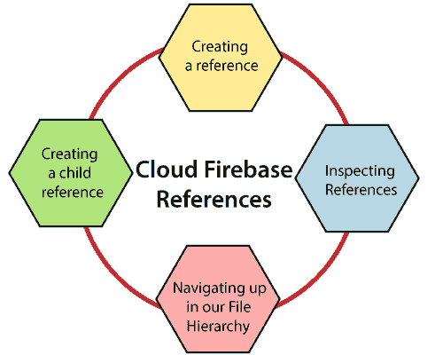

# 在云存储中创建引用

> 原文：<https://www.javatpoint.com/firebase-creating-references-in-cloud-storage>

当我们使用 Firebase 云存储时，我们所有的文件都存储在谷歌云存储桶中。就像我们本地硬盘中的文件系统，或者 Firebase 实时数据库中的数据一样，文件在存储桶中以分层结构呈现。

通过创建文件引用，我们的应用可以访问:

1.  上传或下载数据。
2.  获取或更新元数据。
3.  删除文件。

引用可以指向特定的文件，也可以指向层次结构中更高级别的节点。这些路径与 Firebase 实时数据库路径非常相似。唯一不同的是，我们的文件数据存储在谷歌云存储，而不是实时数据库。



## 创建引用

该引用可以被认为是指向云中文件的指针:

1.  轻量级，因此我们可以根据需要或要求创建任意多个。
2.  可重复用于多种操作。

引用是使用 FirebaseStorage 单例实例创建的，并将使用 getReference()方法调用它。

```

//Creating a storage reference from our app
var storageRef=storage.reference

```

## 创建子引用

我们可以创建对树中较低位置的引用。例如，通过在现有引用上使用 getChild()方法使用“images/season.jpg”。

```

//Creating a child reference. The imagesRef will points to "images".
var imagesRef:StorageReference?=storageRef.child

```

子引用也将采用路径。mountainRef 现在指向“images/mountain.jpg”，imagesRef 仍然指向“images”。

```

var mountainRef=storageRef.child("images/mountain.jpg")

```

## 在我们的文件层次结构中向上导航

在我们的文件层次结构中有两种向上导航的方法，即 getParent()和 getRoot()。getParent()向上导航一级，getRoot()一直导航到顶部。

父节点允许我们将引用移动到父节点，现在 imagesRef 指向“images”。

```

imagesRef=spaceRef.parent

```

根允许我们一直移回桶的顶部，rootRef 现在指向根。

```

val rootRef = spaceRef.root

```

引用可以多次链接在一起，mountainRef 指向“images/mountain.jpg”。

```

val mountainRef = spaceRef.parent?.child("mountain.jpg")

```

如果空引用为空，那么根的父项为空

```

val nullRef = spaceRef.root.parent

```

## 检查参考文献

我们可以检查引用以更好地理解它们所指向的文件。getPath()、getName()和 getBucket()方法将获得文件的完整路径、名称和存储桶。参考路径是“images/space.jpg”，类似于文件名。

```

spaceRef.name

```

参考存储桶是存储文件的存储桶

```

spaceRef.bucket

```

* * *