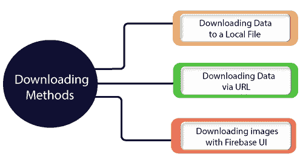

# 从云存储下载文件

> 原文：<https://www.javatpoint.com/firebase-download-files-from-cloud-storage>

在上一节中，我们学习了上传文件的不同方式。现在，我们将学习如何从云存储下载文件。要下载文件，首先，我们必须为要下载的文件创建云存储引用。


我们可以通过以下两种方式创建引用，即通过将子路径附加到存储根，以及从引用云存储中对象的现有 **gs://** 或 **https://URL** 开始。

```

// Creating a storage reference from our app
val storageRef = storage.reference

// Creating a reference with an initial file path and name
val pathReference = storageRef.child("images/stars.jpg")

// Creating a reference to a file from a Google Cloud Storage URI
val gsReference = storage.getReferenceFromUrl("gs://bucket/images/stars.jpg")

// Creating a reference from an HTTPS URL
// In the URL, characters are URL escaped!
val httpsReference = storage.getReferenceFromUrl(
        "https://firebasestorage.googleapis.com/b/bucket/o/images%20stars.jpg")

```

## 下载方法

创建好合适的引用后，我们调用各种方法下载文件，即 **getBytes()，getStream()，**或者我们可以用 **getDownloadUrl()** 获取下载 URL，用另一个库下载文件。



使用 **getBytes()** 方法是将文件下载到内存中最简单的方法。如果我们请求的文件大于我们应用程序的可用内存，我们的应用程序将崩溃。getBytes()需要下载的最大字节数。我们根据应用能力设置最大尺寸。

```

var jtpRef = storageRef.child("images/jtp.jpg")

val ONE_MEGABYTE: Long = 1024 * 1024
islandRef.getBytes(ONE_MEGABYTE).addOnSuccessListener {
    // Data for "images/jtp.jpg" is returned, use this as needed
}.addOnFailureListener {
    // Handling any errors
}

```

### 将数据下载到本地文件

如果我们想在脱机时访问文件或共享文件，那么我们使用 **getFile()** 方法。此方法将文件直接下载到本地设备。这个方法返回一个**下载任务**，我们可以用它来管理我们的下载和监控状态。

```

jtpRef = storageRef.child("images/jtp.jpg")

val localFile = File.createTempFile("images", "jpg")

jtpRef.getFile(localFile).addOnSuccessListener {
    // Local temp file has been created
}.addOnFailureListener {
    // Handling any errors
}

```

### 通过网址下载数据

如果我们已经有了基于 URL 的下载基础设施，或者只是想共享一个 URL，那么我们可以通过在存储上下文上调用 **getDownloadUrl ()** 方法来获取文件的下载 URL。

```

storageRef.child("users/me/profile.png").downloadUrl.addOnSuccessListener {
    // Getting the download URL for 'users/me/profile.png'
}.addOnFailureListener {
    // Handling any errors
}

```

### 使用 FirebaseUI 下载图像

用于消除样板代码和推广谷歌最佳实践。FirebaseUI 提供了简单的、定制的和生产就绪的本地移动绑定。使用 FirebaseUI，我们可以通过与 Glide 的集成，快速、轻松地从云存储中下载、缓存和显示图像。

首先，在我们的**应用程序/build.gradle** 中添加 FirebaseUI:

```

dependencies {
    // FirebaseUI Storage only
    implementation 'com.firebaseui:firebase-ui-storage:4.3.1'
}

```

然后我们可以将图像直接从存储器加载到 **ImageView** 中:

```

// Referencing to an image file in Cloud Storage
val storageReference = FirebaseStorage.getInstance().reference

// ImageView in our Activity
val imageView = findViewById(R.id.imageView)

// Downloading directly from StorageReference using Glide
Glide.with(this /* context */)
        .load(storageReference)
        .into(imageView) 
```

* * *