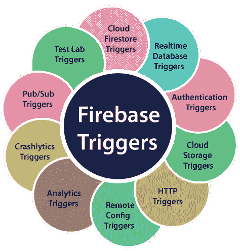

# Firebase触发器

> 原文：<https://www.javatpoint.com/firebase-triggers>

我们编写的**函数**可以响应由 **Firebase** 和**谷歌云**特性(称为**触发器**生成的事件。在开发我们的第一个云功能之前，我们探索一下最常见的触发器，我们可以将其用于**云功能**。有以下触发器:



## 云风暴触发器

Firebase SDK 的云函数导出了一个**函数. firestore** 对象，它允许我们创建绑定到特定云 firestore 事件的处理程序。需要注意的一点是，Cloud Firestore 事件只会在文档更改时触发。向特定字段添加事件是不可能的。

| S.No | 事件类型 | 引发 |
| 1. | onCreate(创建) | 第一次写入文档时触发。 |
| 2. | 联合国更新 | 当文档已经存在并且任何值都已更改时，会触发此事件。 |
| 3. | 他是个怪物 | 当文档与数据一起被删除时触发。 |
| 4. | 书写时 | 当 onCreate、onDelete 或 onUpdate 被触发时，它被触发。 |

## 实时数据库触发器

通过使用实时数据库触发器，我们可以响应 Firebase 实时数据库中的更改。为此，我们必须在特定的数据库路径**上注册事件。我们要注册的数据库路径作为参数传递。**

使用大括号，也可以将路径的这一部分定义为通配符。

```

functions.database.ref('/profiles/{userID}')

```

| S.No | 事件类型 | 引发 |
| 1. | onWrite() | 当数据被创建、更改或销毁时，它被激活。 |
| 2. | onCreate() | 它在创建新数据时被激活。 |
| 3. | onupdate() | 当数据更新时，它被激活。 |
| 4. | 下方() | 当数据被删除时，它被激活。 |

## 身份验证触发器

通过使用身份验证触发器，我们可以通过 Firebase 身份验证执行代码来响应用户帐户的创建和删除。**导出. NewUserCreated = functions . auth . user()。onCreate(event = >)...})** 用于创建事件处理函数，如果创建了新用户，则执行该函数。

在以下情况下会调用身份验证触发器:

1.  当用户创建电子邮件帐户和密码时。
2.  当用户在联合身份提供者的帮助下首次登录时。
3.  当开发人员使用 Firebase Admin SDK 创建帐户时。
4.  当用户首次登录到新的匿名身份验证会话时。

如果用户首次使用自定义令牌登录，则不会触发云功能事件。

## 云存储触发器

我们可以触发一个功能来响应云存储中文件和文件夹的更新、上传和删除。为了注册一个事件处理函数，我们必须以下列方式使用 function.storage 对象:

```

exports.storageChanges = functions.storage.object().onChange(event => {...});

```

在上面的代码行中，我们为默认存储桶上的所有对象更改注册了一个事件处理程序。如果我们想要指定一个特定的存储桶，我们还必须添加桶函数的调用:

```

exports.storageChanges = functions.storage.bucket('bucketName').object().onChange(event => {...});

```

在事件处理函数中，我们可以利用各种存储属性:

| S.No | 属性 | 描述 |
| 1. | 事件.数据 | 存储对象。 |
| 2. | 事件.数据.桶 | 包含文件的存储桶。 |
| 3. | event.data.name | 存储桶中文件的路径。 |
| 4. | event.data.contentType | 文件内容类型。 |
| 5. | 事件.数据.资源状态 | 存在或不存在。如果文件/文件夹已被删除，则设置 not_exists 值。 |
| 6. | event.data.metageneration | 它是文件元数据生成的次数，对于新对象，初始值为 1。 |

## http 触发器

HTTP 触发器可以和 Firebase 云函数一起使用。这些触发器是通过 HTTP 请求调用的，并使用函数进行注册。

```

exports.httpTest = functions.https.onRequest((req, res) => {...});

```

## 远程配置触发器

为了响应 Firebase 远程配置事件，我们可以触发一个函数，包括发布新的配置版本或回滚到旧版本。为了触发远程配置功能，我们使用了由**函数提供的 onUpdate 处理程序。**

onUpdate 返回 **TemplateVersion** 对象，该对象包含模板更新的关键元数据字段，例如更新的时间和版本号。我们还可以检索进行更新的用户的电子邮件，如果有的话，还可以检索图像和名称。

## 分析触发器

通过使用针对 Firebase 的谷歌分析，我们可以详细了解用户如何与我们的安卓应用和 iOS 应用进行交互。分析应用编程接口公开了各种事件。类型转换事件可用于注册云功能，如下所示:

```

exports.onPurchase = functions.analytics.event('in_app_purchase').onLog(event => {...});

```

## 防撞触发器

为了响应 Crashlytics 问题事件，包括新问题、速度警报和回归问题，我们可以触发一个函数。

为了触发 Crashlytics 函数，我们用**函数生成**问题生成器**。**

| S.No | 功能 | 描述 |
| 1. | 祝你好运() | 这是在我们的应用程序第一次遇到问题时触发的。

```
exports.sendOnNewIssue = functions.crashlytics.issue().onNew(async (issue) => {
  // ...
});

```

 |
| 2. | onRegressed() | 当问题在 Crashlytics 中关闭后再次出现时，会触发该事件。

```
exports.sendOnRegressedIssue = functions.crashlytics.issue().onRegressed(async (issue) => {
  // ...
});

```

 |
| 3. | onVelocityAlert() | 当给定生成中有统计上显著数量的会话崩溃时，就会触发该事件。

```
exports.sendOnVelocityAlert = functions.crashlytics.issue().onVelocityAlert(async (issue) => {
  // ...
});

```

 |

## 发布/子发布

谷歌云发布/订阅是一种全球分布式消息总线，可以根据我们的需要自动扩展。我们可以使用 functions.pubsub 创建一个处理谷歌云发布/订阅事件的函数

当一个新的发布/订阅消息被发送到一个特定的主题时，我们可以触发一个函数。我们必须指定用于触发我们的函数的发布/订阅主题名称，并在 onPublish()事件处理程序中设置事件。

```

exports.helloPubSub = functions.pubsub.topic('topic-name').onPublish((message) => {
  // ...
});

```

## 测试实验室触发器

我们可以在 **Firebase 测试实验室**中触发一个函数来响应测试矩阵的完成。用于创建一个新的函数，当测试矩阵与事件处理程序**完成时触发。完成()**:

```

exports.sendEmailNotification = functions.testLab.testMatrix().onComplete((testMatrix) => {
  // ...
});

```

* * *