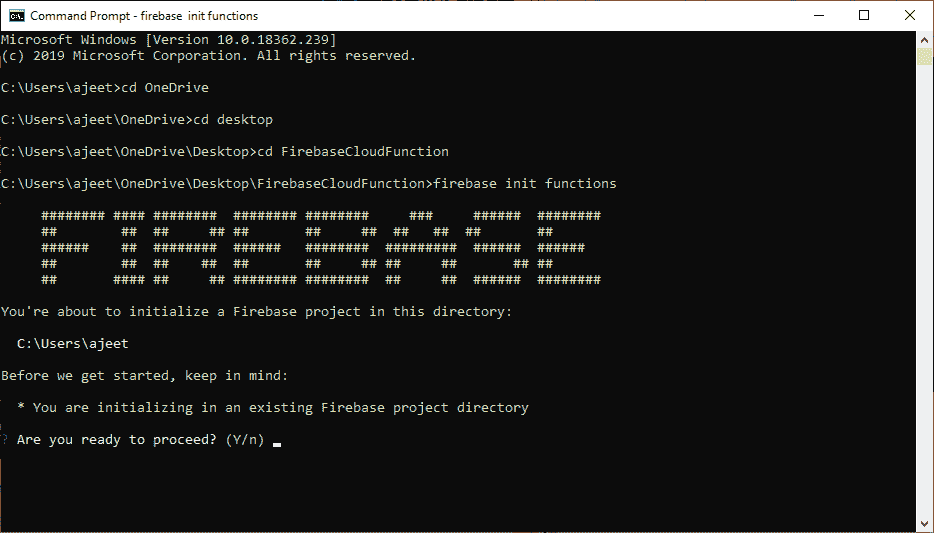
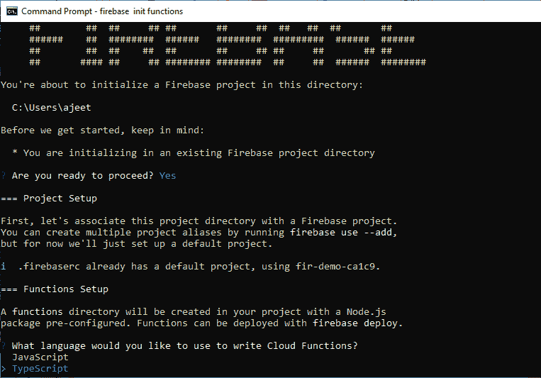
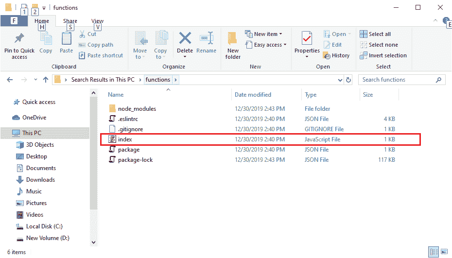
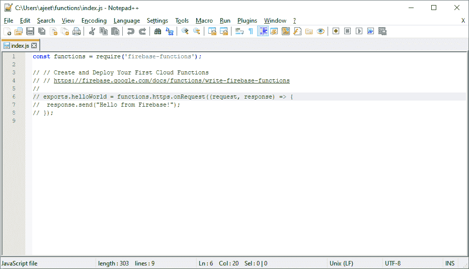
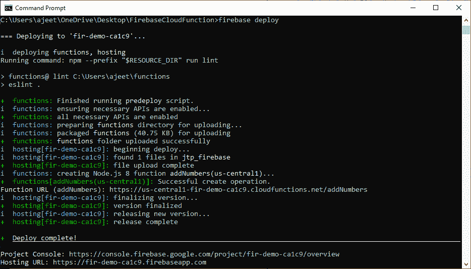
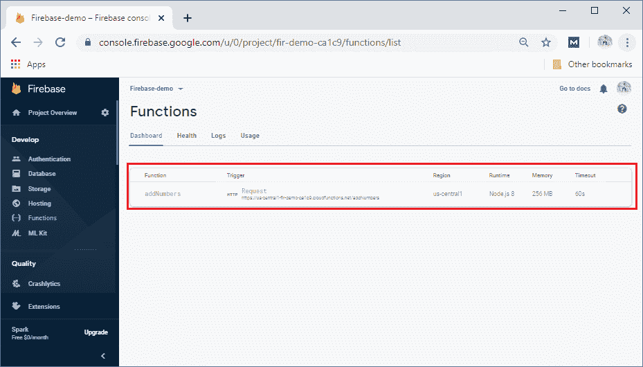

# Firebase 创建和部署云功能

> 原文：<https://www.javatpoint.com/firebase-creating-and-deploying-cloud-function>

在前面的部分中，我们学习了什么是云函数，为什么使用它们，它们是如何工作的，以及不同类型的触发器。

现在，我们将在 Firebase 中创建和部署云功能。为此，我们需要设置 **Node.js** 环境来编写函数，以及 **Firebase CLI** ，这也需要**node . js****NPM**来部署函数。

Firebase 强烈推荐使用 Node.js 8 来入门。对于安装 Node.js 和 npm，建议使用节点版本管理器。

**第一步:**

因此，我们将首先从以下站点下载 node . js:[https://nodejs.org/en/](https://nodejs.org/en/)。


下载并成功运行 node.js 后，我们的下一步是安装 Firebase CLI。安装 Node.js 会自动安装 npm 命令工具。之后，我们通过在命令提示符下运行以下命令，通过 npm 安装 Firebase CLI:

```

npm install -g firebase-tools

```


**第二步:**

现在，我们将登录并测试 Firebase 命令行界面。安装命令行界面后，我们必须对其进行身份验证。之后，我们可以通过列出我们的 Firebase 项目来确认身份验证。

1)我们运行以下命令，使用我们的谷歌帐户登录 Firebase。

```

firebase login

```

上面的命令将我们的本地机器连接到 Firebase，并授予对 Firebase 项目的访问权限。


当我们选择允许访问时，我们将切换到浏览器以允许访问 Firebase CLI:


当我们单击“允许”时，它会显示以下窗口:


2)现在，我们测试 CLI 是否正常工作并访问我们的帐户。这是通过在以下命令的帮助下列出我们的 Firebase 项目来完成的:

```

firebase projects: list

```


**第三步:**

现在，我们将在桌面上创建一个名为 FirebaseCloudFunction 的目录，并使用命令行参数移动到该目录中。


**第四步:**

现在，运行 **Firebase init functions** 命令，按照以下方式初始化函数:



它将开始创建目录结构。我们将选择“是”并继续。



在我的情况下，默认情况下，已经设置了一个名为 **fir-demo-ca1c9** 的项目。当你按 yes 时，它会要求选择一个项目，一旦你选择了你的项目，它会要求选择你的首选语言，即 JavaScript 或 TypeScript。我将选择 JavaScript 并继续进行。


它将要求使用 **ESLint** 来捕捉可能的 bug 并强制风格。我们会选择，是的，然后继续。


现在，它将要求安装 npm 的依赖项。我们也会在这里选择“是”并继续。


在这里，我们的 Firebase 初始化完成了，它将为我们提供一些目录结构。转到我们的 FirebaseCloudFunction 目录。


**第五步:**

现在，打开函数文件夹，打开 index.json 文件。在这个文件中，我们编写我们的函数。




我们在这里写代码。

```

'use strict';

const functions = require('firebase-functions');
const admin = require('firebase-admin');
admin.initializeApp();

// [starting allAdd]
// [starting addFunctionTrigger]
// adding two numbers to each other.
exports.addNumbers = functions.https.onCall((data) => {
// [ending addFunctionTrigger]
  // [starting readAddData]
  // Numbers are passed from the client.
  const firstNumber = data.firstNumber;
  const secondNumber = data.secondNumber;
  // [ending readAddData]

  // [starting addHttpsError]
  // check that attributes are present and are numbers.
  if (!Number.isFinite(firstNumber) || !Number.isFinite(secondNumber)) {
    // Throw an HttpsError. So that the client gets the error details. 
    throw new functions.https.HttpsError('invalid-argument', 'The function must be called with ' +
        'two arguments "firstNumber" and "secondNumber" which must both be numbers.');
  }
  // [ending addHttpsError]

  // [starting returnAddData]
  // returning result.
  return {
    firstNumber: firstNumber,
    secondNumber: secondNumber,
    operator: '+',
    operationResult: firstNumber + secondNumber,
  };
  // [ending returnAddData]
});
// [ending allAdd]

```

**第六步:**

现在，我们将部署函数。我们可以使用 **firebase 仅部署功能来部署一个功能:function_name** 或者使用 **firebase deploy** 来部署所有功能。



这里，功能部署成功。我们将前往 Firebase 控制台检查功能。



* * *