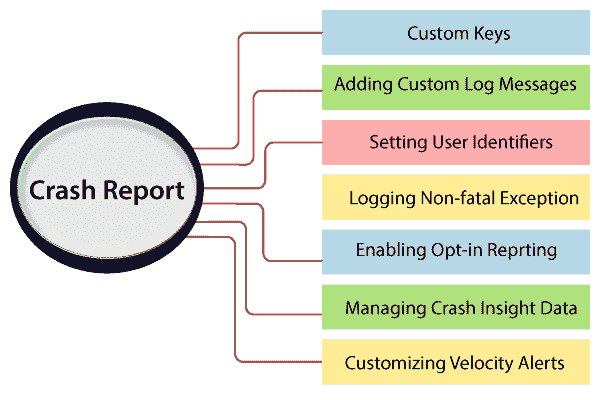
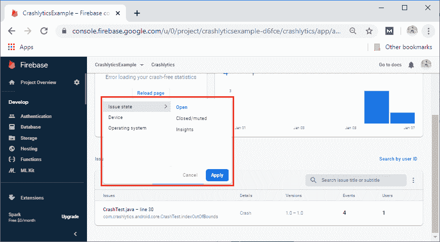

# 《火焰分解器》中的碰撞报告

> 原文：<https://www.javatpoint.com/crash-report-in-firebase-crashlytics>

在前一节中，我们了解了 Firebase Crashlytics，以及如何使用我们的应用程序设置和配置它。现在，我们将测试我们的 Firebase Crashlytics 实现。因此，我们必须为崩溃的发生设置应用程序，以便知道 Crashlytics 是否正常工作。

Firebase Crashlytics 提供了四种日志机制，可以让您更深入地了解崩溃报告。这些机制是:

1.  自定义密钥
2.  自定义日志
3.  用户标识符
4.  捕获到异常



## 自定义密钥

自定义键帮助我们获得应用程序的特定状态，导致崩溃。自定义键将任意键/值对与我们的崩溃报告相关联，并在 Firebase 控制台中看到它们。设置键有五种方法，每种方法处理不同的数据类型。

```

Crashlytics.setString(key, "foo" /* string value */)

Crashlytics.setBool(key, true /* boolean value */)

Crashlytics.setDouble(key, 1.0 /* double value */)

Crashlytics.setFloat(key, 1.0f /* float value */)

Crashlytics.setInt(key, 1 /* int value */)

```

重新设置密钥会更新其值:

```

Crashlytics.setInt("current_level", 3)
Crashlytics.setString("last_UI_action", "logged_in")

```

## 添加自定义日志消息

我们可以在我们的应用程序中添加定制的 Crashlytics 日志，为导致崩溃的事件提供更多的上下文。它将日志与我们的崩溃数据相关联，并使它们在 Firebase 控制台中可见。我们可以使用 Crashlytics.log 方法和 Log.println()将日志写入崩溃报告:

```

Crashlytics.log(Log.DEBUG,"tag","message")
//For crash report only
Crashlytics.log("message")

```

## 设置用户标识符

为了诊断一个问题，知道我们的哪些用户经历了给定的崩溃通常是有帮助的。Crashlytics 提供了一种在崩溃报告中匿名识别用户的方法。为了将用户标识添加到报告中，我们必须以标识号、令牌或哈希值的形式为每个用户分配一个唯一的标识符:

```

Crashlytics.setUserIdentifier("user123456789")

```

如果我们需要在设置用户标识符后清除它，请将该值重置为空字符串。当我们清除用户标识符时，它不会删除现有的 Crashlytics 记录。

## 记录非致命异常

记录非致命异常意味着我们可以在应用程序的 catch 块中记录捕获的异常:

```

try{
    methodThatThrows()
}catch(e: Exception){
    Crashlytics.logException(e)
    //handle our exception here
}

```

所有记录的异常在 Firebase 控制台中都显示为非致命问题。问题摘要包含了我们通常从崩溃中获得的所有状态信息，以及安卓版本和硬件设备的故障。

Crashlytics 在专用后台线程中处理异常，对应用程序的性能影响最小。

## 启用选择加入报告

默认情况下，Firebase Crashlytics 会自动收集所有应用程序用户的崩溃报告。我们可以通过启用对他们发送的数据的更多控制来使用**选择加入报告**。我们必须禁用自动收集，并只为选择加入的用户初始化 Crashlytics。我们可以在我们的 AndroidManifest.xml 文件中关闭带有元数据标签的自动收集:

```

<meta-data>
	android:name="firebase_crashlytics_collection_enabled"
	android: value="false"/>

```

我们可以通过从我们的应用程序活动之一 fabric . with(Crashlytics())中初始化 crash lytics 来为选定的用户启用收集。

## 管理崩溃洞察数据

Crash Insights 让我们通过将您的匿名堆栈跟踪与其他 Firebase 应用程序的跟踪进行比较来解决问题。

崩溃洞察数据在以下两方面有所帮助:

1.  它使您能够知道问题是否属于更大的趋势。
2.  它还可以提供有助于调试崩溃的资源。

Crash Insight 使用汇总的碰撞数据来识别常见的稳定性趋势。我们可以从 Firebase 控制台中 Crashlytics 问题列表顶部的 Crash Insight 菜单中选择退出 Crash Insight。

## 定制速度警报

当任何个别问题导致我们的应用程序出现紧急问题时，Velocity alerts 可以通知我们的团队。当我们的应用程序中的问题超过我们在 Firebase 控制台中定义的阈值时，就会触发速度警报。阈值是根据受崩溃影响的用户会话的百分比来定义的，该值设置在会话的 0.1%到 1%之间。

如果在特定时间段内出现以下情况，则会触发警报:

1.  当应用程序中的问题超过为该应用程序定义的阈值时。
2.  当应用程序在该时间段内有 250 个会话时。
3.  之前应用程序中没有针对该问题的警报。

要更新 velocity 警报，我们必须拥有必要的权限。在 Firebase 控制台中，转到 Crashlytics 仪表板:

*   从页面顶部的应用下拉列表中选择应用。
*   从问题窗格的顶部栏打开溢出菜单，然后选择速度警报设置。
*   要设置应用程序的警报阈值，请遵循屏幕上的说明。

我们可以使用电子邮件或集成方式将速度警报发送给我们的团队。让我们看一个例子，其中我们将创建一个应用程序，它有一个按钮，将模拟崩溃。

**activity_main.xml**


**MainActivity.kt**

```

package com.example.crashlyticsexample

import androidx.appcompat.app.AppCompatActivity
import android.os.Bundle
import android.util.Log
import android.view.ViewGroup
import android.widget.Button
import com.crashlytics.android.Crashlytics
import io.fabric.sdk.android.Fabric

class MainActivity : AppCompatActivity() {

    override fun onCreate(savedInstanceState: Bundle?) {

        super.onCreate(savedInstanceState)
        setKeysBasic("JasonTest");
        logReportAndPrint()
        logReportOnly()
        setUserId()
        logCaughtEx()
        enableDebugMode()
        forceACrash()

    }
    //Setting key-value pairs
    private fun setKeysBasic(key: String) {

	    Crashlytics.setString(key, "foo" /* string value */)

        Crashlytics.setBool(key, true /* boolean value */)

        Crashlytics.setDouble(key, 1.0 /* double value */)

        Crashlytics.setFloat(key, 1.0f /* float value */)

        Crashlytics.setInt(key, 1 /* int value */)
    }
    // Modifying keys 
    private fun resetKey() {
        Crashlytics.setInt("current_level", 3)
        Crashlytics.setString("last_UI_action", "logged_in")
    }

//Adding custom log and log messages     
private fun logReportAndPrint() {
        Crashlytics.log(Log.DEBUG, "tag", "message")
    }

// Only for log Report
    private fun logReportOnly() {
        Crashlytics.log("message")
    }

// Enabling at run time
    private fun enableAtRuntime() {
        Fabric.with(this, Crashlytics())
    }
// Setting user identifier
    private fun setUserId() {
        Crashlytics.setUserIdentifier("user123456789")
    }

    @Throws(Exception::class)
    private fun methodThatThrows() {
        throw Exception()
    }
// log exception
    private fun logCaughtEx() {
        try {
            methodThatThrows()
        } catch (e: Exception) {
            Crashlytics.logException(e)
            // handle your exception here
        }
    }
// Enabling debug mode
    private fun enableDebugMode() {
        val fabric = Fabric.Builder(this)
            .kits(Crashlytics())
            .debuggable(true) // Enables Crashlytics debugger
            .build()
        Fabric.with(fabric)
    }

    private fun forceACrash() {
        val crashButton = Button(this)
        crashButton.text = "Crash!"
        crashButton.setOnClickListener {
            Crashlytics.getInstance().crash() // Force a crash
        }

        addContentView(crashButton, ViewGroup.LayoutParams(
            ViewGroup.LayoutParams.MATCH_PARENT,
            ViewGroup.LayoutParams.WRAP_CONTENT))
    }
}

```




* * *