# 创建动态链接的 Firebase

> 原文：<https://www.javatpoint.com/firebase-creating-dynamic-link>

在 Firebase 中，我们可以通过四种方式创建**动态链接**。这些措施如下:

## 使用 Firebase 控制台

我们可以在 Firebase 控制台的帮助下创建一个动态链接。如果我们正在创建宣传片链接，以便在社交媒体上分享，这将非常有用。我们可以在 Firebase 控制台中为链接选择一个自定义后缀和名称。我们可以在 Firebase 控制台或通过 Analytics REST API 跟踪这些动态链接的性能。

## 使用动态链接生成器API

这是在我们的应用中动态创建链接的首选方式，用于用户对用户的共享或任何需要许多链接的情况。我们可以跟踪动态链接的性能，动态链接是使用构建器API使用动态链接分析API创建的。

## 使用 REST API

这是在没有构建器API的平台上动态创建链接的首选方式。分析休息API可用于跟踪在控制台中创建的促销活动的表现。

## 用手

如果我们不需要跟踪点击数据，也不在乎链接是否强大，我们可以使用 URL 参数手动构建动态链接

我们可以用 Firebase 动态链接生成器 API 创建短的或长的动态链接。它接受长动态链接或包含动态链接参数的对象。为了创建一个动态链接，我们必须有一个安卓应用，并将其添加到 Firebase 项目中。

我们首先创建一个安卓应用，并从 Firebase 控制台或手动将其添加到 Firebase。

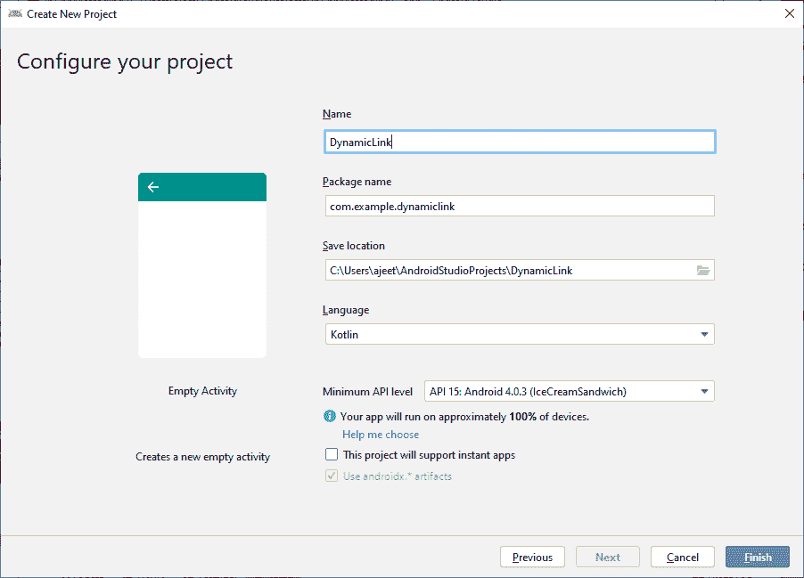

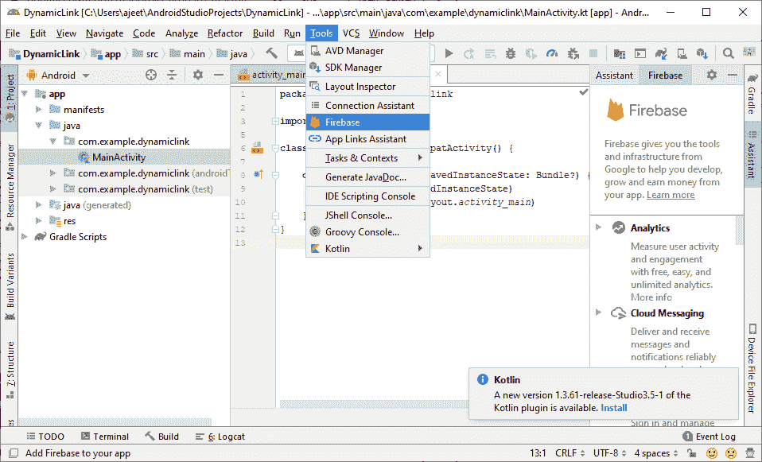

它还要求 SHA-1 和 SHA-256 键在控制台中启动安卓项目。

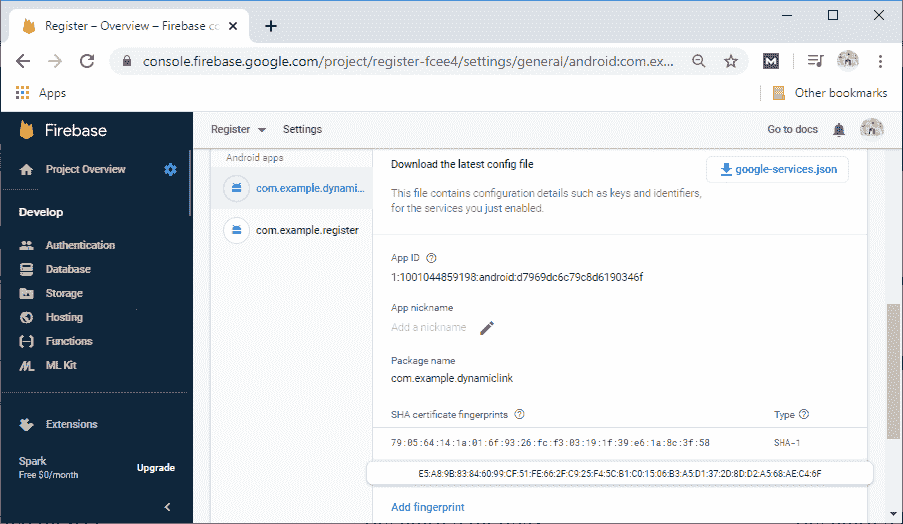

在下一步中，我们将添加所有的依赖项，即 firebase 核心和 Firebase 动态链接到我们的 Firebase 项目和应用级 build.gradle 文件。


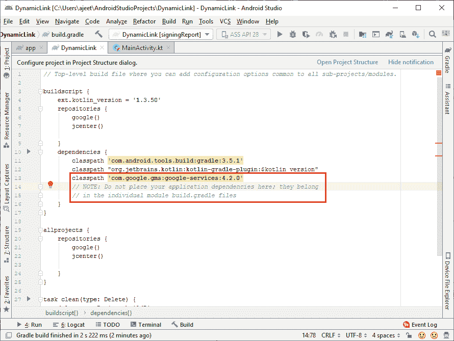

## 使用 Firebase 控制台创建动态链接

首先，我们将移至Firebase控制台**(Firebase- >成长- >动态链接)**中的**动态链接**部分。如果我们还没有接受服务条款，那么我们必须为我们的动态链接设置一个域，我们将在提示时这样做。如果我们已经有了一个动态链接域，当我们以编程方式创建动态链接时，我们必须提供一个动态链接域。

之后，我们将指定深度链接和回退链接中允许的 URL 模式。我们防止未经授权的一方创建动态链接，这将从我们的域重定向到我们无法控制的站点。如果我们想为测试目的或我们的营销团队生成一个动态链接，它可以用于类似社交媒体帖子的东西。最简单的方法是访问 Firebase 控制台，按照一步一步的形式手动创建一个。

因此，我们将转到 Firebase 控制台的动态链接部分。


现在我们点击**开始**。

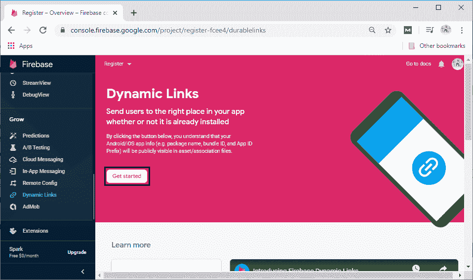

点击开始后，它会要求添加网址前缀和模式。如果我们没有自己的领域，我们可以使用示例下的领域。我们可以把它作为一个免费的**定制页面。链接**。所以，我们只需要想出一些我们以前没有用过的名字。

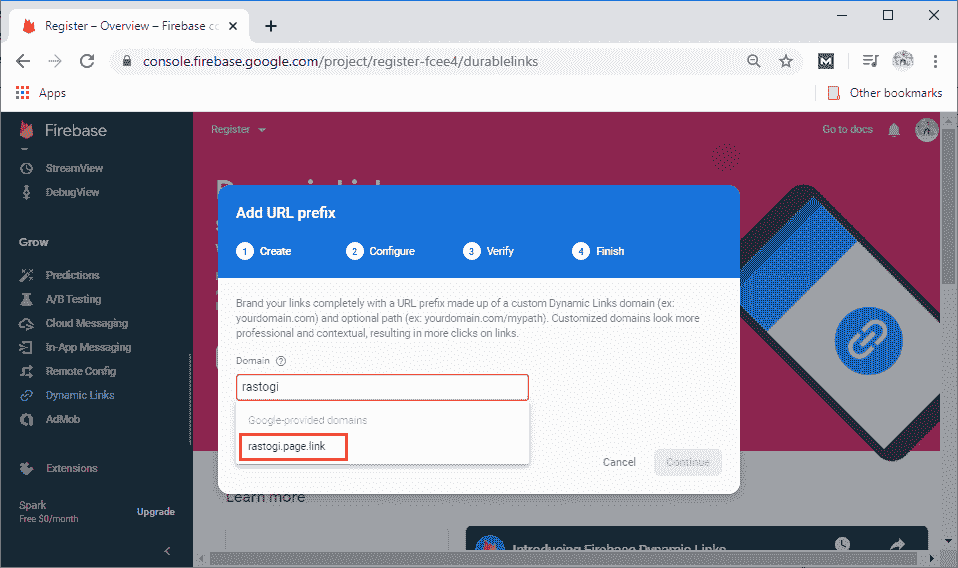

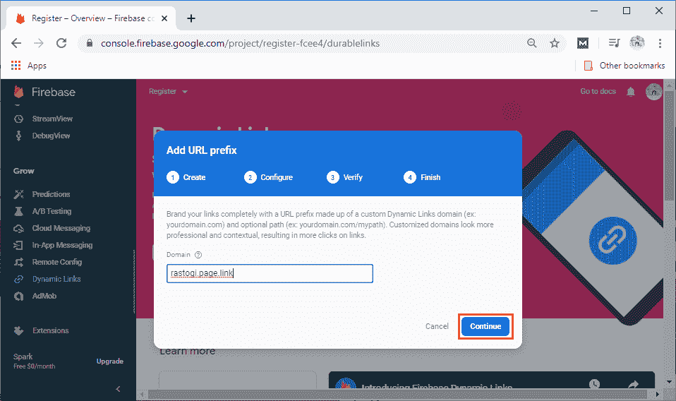

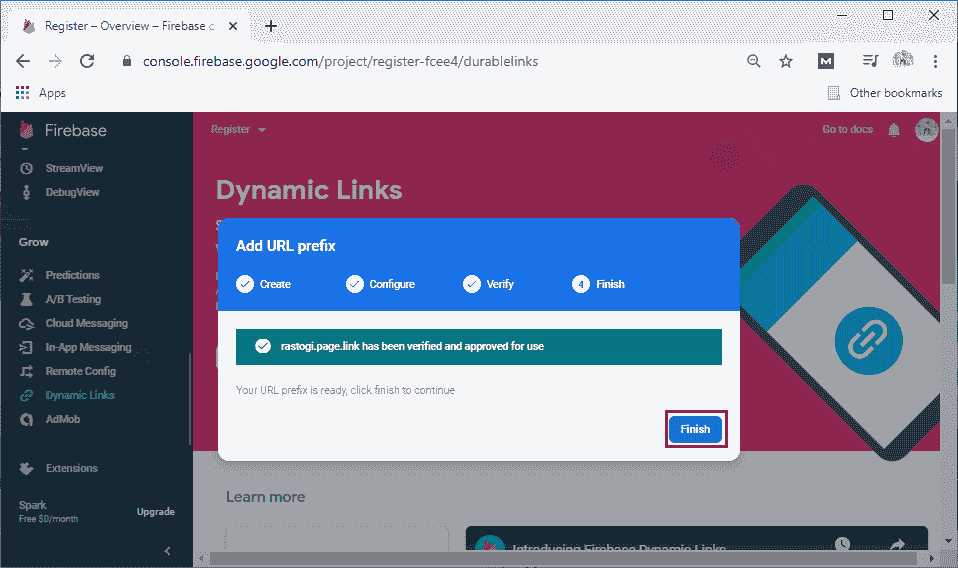


现在，没有动态链接。我们将通过点击**新建动态链接**来创建一个动态链接。

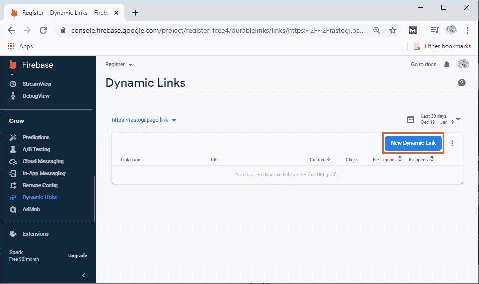

该点击将打开“创建**动态链接**门户”，并要求设置一个简短的网址链接、设置或动态链接，为 iOS 定义链接行为，为安卓定义链接行为，以及可选的活动跟踪、社交标签和高级选项。

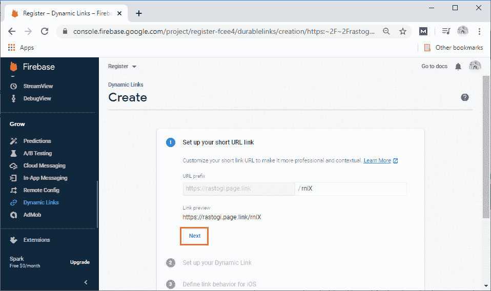


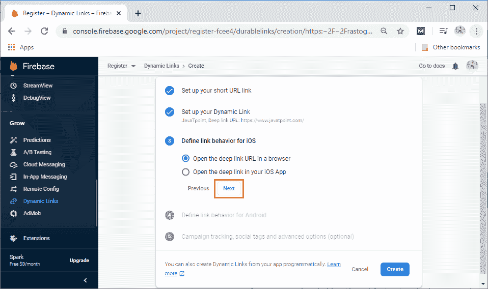


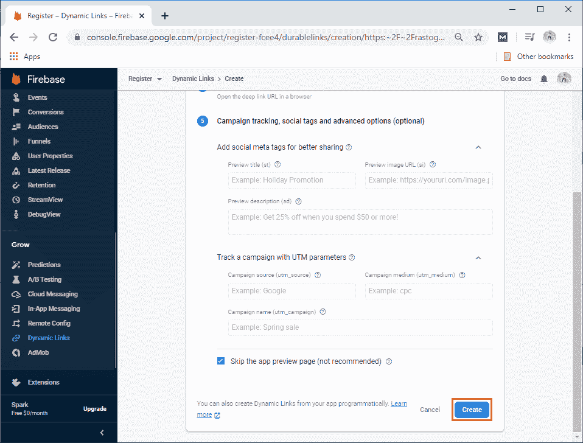


## 从参数创建动态链接

用于以编程方式创建动态链接

1.  用它的构建器创建一个新的动态链接对象。
2.  使用生成器方法指定动态链接参数。
3.  调用 buildDynamicLink 或 buildShortDynamicLink。

下面是创建一个到 https://www.example.com/.的长动态链接的例子。它用我们在安卓上的安卓应用和在 iOS 上的应用打开。

```

val dynamicLink =FirebaseDynamicLinks.getInstance().createDynamicLink()
	.setLink(Uri.parse(https://www.example.com/))
	.setDomainUriPrefix("https://example.page.link")
 //opening links with this app on Android 
	.setAndroidParameters(DynamicLink.AndroidParameters.Builder().build())
 //Opening links with com.example.iOS on iOS
	.setIosParameters(DynamicLink.IosParameters.Builder("com.examples.ios").build())
.buildDynamicLink()
val dynamicLinkUri=dynamicLink.uri

```

## 创建短动态链接

要创建短动态链接，请以相同的方式构建动态链接，然后调用 buildShortDynamicLink()。它需要一个网络调用，所以不是直接返回链接，而是 buildShortDynamicLink()返回一个 Task，并在请求完成时提供一个短链接。

```

val shortLinkTask = FirebaseDynamicLinks.getInstance().createDynamicLink()
	.setLink(Uri.parse("https://www.example.com/"))
	.setDomainUriPrefix("https://example.page.link")
 //Setting parameters 
	//…
	.buildShortDynamicLink()
	.addOnSuccessListener{ result->
		//Short link created
		val shortLink = result.shortLink
		val flowchartLink = result.previewLink
	}
	.addOnFailureListener{
		//Error
		//…
	}

```

## 动态链路参数

我们可以使用动态链接生成器API来创建带有任何支持参数的动态链接。

```

val dynamicLink = FirebaseDynamicLink.getInstance().createDynamicLink()
	.setLink(Uri.parse("https://www.example.com/"))
	.setDomainUriPrefix("https://example.page.link")
	.setAndroidParameters(
		DynamicLink.AndroidParameters.Builder("com.example.android")
			.setMinimumVersion(125)
			.build())
	.setIosParameters(
		DynamicLink.IosParameters.Buildert("com.example.ios") 
			.setAppStoreId("123456789")
			.setMinimumVersion("1.0.1")
			.build())
	.setGoogleAnalyticsParameters(
		DynamicLink.GoogleAnalyticsParameters.Builder()
			.setSource("orkut")
			.setMedium("social")
			.setCampaign("example-promo")
			.build())
	.setItuneConnectAnalyticsParameter(
		DynamicLink.ItuneConnectAnalyticsParameter.Builder()
			.serProviderToken("123456")
			.setCampaignToken("example-promo")
			.build())
	.setSocialMetaTagParameters(
		DynamicLink.SocialMetaTagParameters.Builder()
			.setTitle("Example of a Dynamic Link")
			.setDescription("This link works whether the app is installed or not!")
			.build())
	.buildDynamicLink()//Or buildShortDynamicLink()

```

* * *