# UML-构建模块

> 原文：<https://www.javatpoint.com/uml-building-blocks>

UML 由三个主要的构件组成，即事物、关系和图表。构建块通过围绕几个不同的块旋转来生成一个完整的 UML 模型图。它在开发 UML 图中起着至关重要的作用。下面列出了基本的 UML 构建块:

1.  东西
2.  关系
3.  图表

## 东西

任何真实世界的实体或物体都被称为事物。它可以分为几个不同的类别:

*   结构性的东西
*   行为事物
*   将事物分组
*   注释性的东西

### 结构性的东西

描述模型静态行为的名词被称为结构性事物。它们显示物理和概念组件。它们包括类、对象、接口、节点、协作、组件和用例。

**类:**类是一组相同的东西，概述了对象的功能和属性。它还表示其功能未定义的抽象类。它的符号如下:

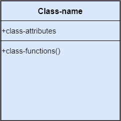

**对象:**:描述系统行为和功能的个体。对象的符号与类的符号相似；唯一的区别是对象名总是带下划线，其符号如下；

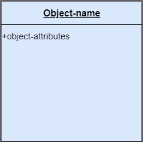

**接口:**描述一个类的功能的一组操作，每当实现一个接口时就实现这个类。

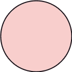

**协作:**它代表为达到目标而做的事情之间的交互。它被符号化为一个虚线椭圆，里面写着它的名字。

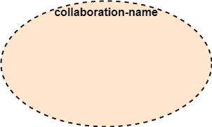

**用例:**用例是面向对象建模的核心概念。它描绘了系统为实现目标而执行的一组动作。

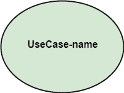

**Actor:** 在用例图下面。它是一个与系统交互的对象，例如用户。

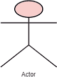

**组件:**代表系统的物理部分。

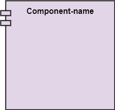

**节点:**运行时存在的物理元素。

### 行为事物

它们是包含模型动态部分的动词。它描述了系统的行为。它们包括状态机、活动图、交互图、分组、注释

**状态机:**它定义了一个实体在软件开发生命周期中经历的一系列状态。它记录了系统组件的几种不同状态。

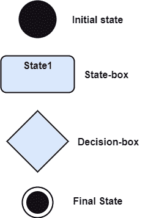

**活动图:**描绘了系统不同实体完成的所有活动。它的表示与状态机图相同。它由初始状态、最终状态、决策框和动作符号组成。

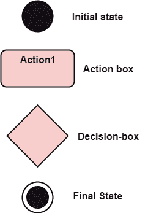

**交互图:**用于设想系统中几个组件之间的消息流。

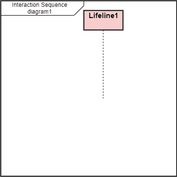

### 将事物分组

这是一种将 UML 模型的元素绑定在一起的方法。在 UML 中，包是唯一的东西，用于分组。

**Package:** Package 是唯一可用于对行为和结构事物进行分组的东西。

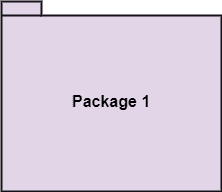

### 注释事物

它是一种捕获 UML 模型元素的注释、描述和注释的机制。在 UML 中，注释是唯一可注释的东西。

**注意:**用于将约束、注释和规则附加到模型的元素上。这是一种黄色的便利贴。

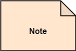

## 关系

它说明了事物之间有意义的联系。它显示实体之间的关联，并定义应用的功能。下面给出了四种类型的关系:

**依赖关系:**依赖关系是目标元素的变化影响源元素的一种关系，或者简单的说我们可以说源元素依赖于目标元素。这是 UML 中最重要的符号之一。它描述了从一个实体到另一个实体的依赖关系。

它由虚线表示，后面是箭头，如下所示，

**关联:**将实体与 UML 模型相关联的一组链接。它告诉我们有多少元素实际上参与了这种关系的形成。

它由两侧带有箭头的虚线表示，以描述与两侧元素的关系。

**泛化:**刻画一般事物(父类或超类)与该事物特定种类(子类或子类)之间的关系。它用来描述继承的概念。

它由一条直线表示，后面是一个空箭头。

**实现:**是两个事物之间的一种语义类型的关系，其中一个定义要执行的行为，另一个实现所提到的行为。它存在于接口中。

它由一条虚线表示，虚线的一侧有一个空箭头。

## 图表

图表是包含符号和文本的模型的图形实现。在 UML 图的上下文中，每个符号都有不同的含义。在 UML 2.0 中有十三种不同类型的 UML 图，这样每个图都有自己的一组符号。每个图都显示了系统的不同维度、视角和视图。

UML 图分为以下三类:

1.  结构图
2.  行为图
3.  交互图

**结构图:**通过刻画系统的结构来表示系统的静态视图。它显示了系统中的几个对象。下面是给出的结构图:

*   类图
*   目标图
*   包装图
*   组件图
*   配置图

**行为图:**描绘系统的行为特征。它处理系统的动态部分。它包含以下图表:

*   活动图
*   状态机图
*   用例图

**交互图:**是行为图的子集。它描述了两个对象之间的交互以及它们之间的数据流。以下是 UML 中的几个交互图:

*   时间图
*   程序表
*   协作图

* * *