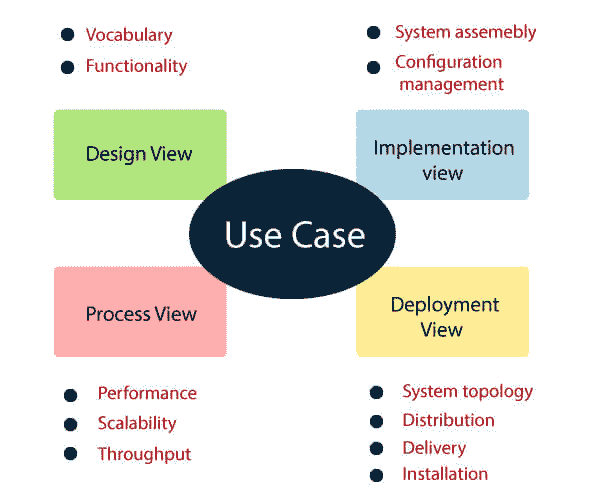

# UML-架构

> 原文：<https://www.javatpoint.com/uml-architecture>

软件架构是关于一个软件系统是如何在最高层次上构建的。需要从质量和设计的角度从多个角度考虑问题。软件团队与许多实际问题联系在一起，例如:

*   开发团队的结构。
*   企业的需求。
*   开发周期。
*   结构本身的意图。

软件架构提供了完整软件系统的基本设计。它定义了系统中包含的元素、每个元素具有的功能，以及每个元素如何相互关联。简而言之，它是整个系统的一个大的画面或整体结构，一切是如何一起工作的。

为了形成一个架构，软件架构师将考虑几个因素:

*   该系统将用于什么目的？
*   谁将使用该系统？
*   什么质量对他们来说很重要？
*   系统将在哪里运行？

架构师计划系统的结构来满足这样的需求。重要的是要有适当的软件架构，主要是对于大型软件系统。有一个完整系统的清晰设计作为起点，为开发人员遵循提供了坚实的基础。

每个开发人员都知道需要实现什么，以及如何有效地满足期望的需求。软件架构的主要优势之一是它为软件团队提供了高生产率。软件开发变得更加有效，因为它提供了一个适当的解释结构来协调工作，实现单独的特性，或者对潜在的问题进行基础讨论。有了清晰的架构，更容易知道系统中的关键职责在哪里，以及在哪里进行更改以添加新的需求或简单地修复故障。

此外，一个清晰的架构将有助于使用关注点分离等原则，在设计良好的结构下实现软件质量；系统变得更容易维护、重用和调整。软件体系结构对软件开发人员、项目经理、客户和最终用户都很有用。每个人都有不同的视角来看待这个系统，并且会给一个项目带来不同的议程。此外，它还提供了几个视图的集合。它可以被最好地理解为五个视图的集合:

1.  用例视图
2.  设计视图
3.  实施视图
4.  流程视图
5.  发展观点

### 用例视图

*   这是一种显示外部参与者所感知的系统功能的视图。
*   它揭示了系统的需求。
*   使用 UML，很容易在用例图中捕获这个视图的静态方面，而它？的动态方面被捕获在交互图、状态图和活动图中。

### 设计视图

*   这是一个视图，显示了如何在静态结构和动态行为方面在系统内部设计功能。
*   它捕捉问题空间和解决方案空间的词汇。
*   使用 UML，它在类图和对象图中表示这个视图的静态方面，而它的动态方面在交互图、状态图和活动图中被捕获。

### 实施视图

*   它是代表核心组件和文件的组织的视图。
*   它主要解决系统的配置管理？s 版本。
*   使用 UML，它的静态方面在组件图中表达，动态方面在交互图、状态图和活动图中捕获。

### 流程视图

*   正是这种观点证明了系统的并发性。
*   它结合了线程和进程，构成了并发系统和同步机制。
*   它主要解决系统的可扩展性、吞吐量和性能。
*   它的静态和动态方面的表达方式与设计视图相同，但更侧重于表示这些线程和进程的活动类。

### 部署视图

*   该视图显示了系统在物理架构方面的部署。
*   它包括形成系统硬件拓扑的节点，系统将在这些节点上执行。
*   它主要解决构建物理系统的部件的分发、交付和安装。

* * *