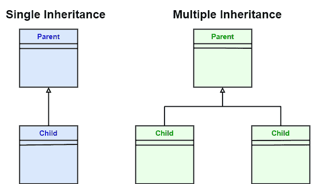
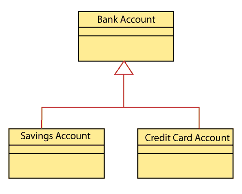

# UML-泛化

> 原文：<https://www.javatpoint.com/uml-generalization>

在 UML 建模中，泛化关系是实现称为继承的面向对象概念的关系。泛化关系发生在两个实体或对象之间，例如一个实体是父实体，另一个是子实体。子代继承其父代的功能，并且可以访问和更新它。

一般化关系用于类、组件、部署和用例图中，以指定子对象从其父对象继承动作、特征和关系。

为了满足 UML 的标准，必须在一般化关系中使用相同类型的模型元素，即一般化关系可以在参与者之间或者用例之间使用，但是不能在参与者和用例之间使用。

一般化关系被合并来记录父模型元素中的属性、操作和关系，以便它可以在一个或多个子模型元素中被继承。

父模型元素可以有多个子元素，子元素也可以有一个或多个父元素。但是最常见的是，可以看到有一个父模型元素和多个子模型元素。泛化关系不包含名称。泛化关系由一条实线表示，空心箭头指向子模型元素的父模型元素。

## 陈规定型观念及其制约因素

**< <实现> > -** 用于表示子对象由其父对象实现，使得子对象继承其父对象的结构和行为而不违背规则。刻板印象的**实现**多用于单一继承。

在泛化刻板印象中，有两种类型的约束，即**完整的**和**不完整的**来检查关系中是否涉及所有的子对象。

示例:

我们知道，银行账户可以有两种类型；储蓄账户和信用卡账户。储蓄和信用卡账户都继承了银行账户的广义属性，即账号、账户余额等。

* * *