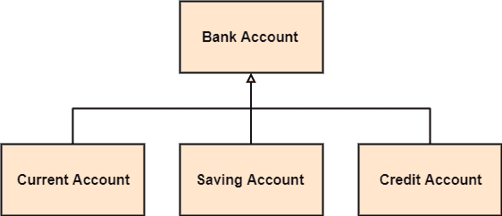
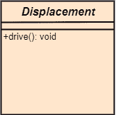
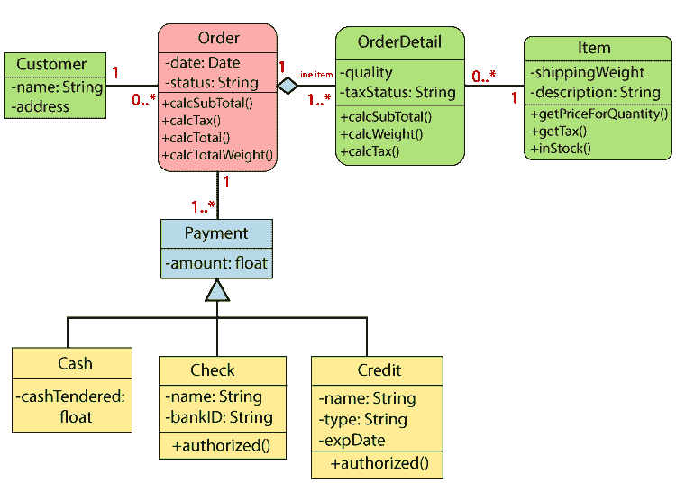

# UML 类图

> 原文：<https://www.javatpoint.com/uml-class-diagram>

类图描述了应用的静态视图。它表示驻留在系统中的对象类型以及它们之间的关系。一个类由它的对象组成，它也可以从其他类继承。类图用于可视化、描述和记录系统的各个不同方面，并构建可执行的软件代码。

它显示了属性、类、函数和关系，以给出软件系统的概述。它将类名、属性和函数组成一个独立的部分，有助于软件开发。因为它是类、接口、关联、协作和约束的集合，所以它被称为结构图。

## 类图的目的

类图的主要目的是构建应用的静态视图。它是唯一广泛用于构造的图，并且可以用面向对象的语言进行映射。它是最流行的 UML 图之一。下面是下面给出的类图的目的:

1.  它分析和设计应用的静态视图。
2.  它描述了系统的主要职责。
3.  它是组件和部署图的基础。
4.  它包括正向和反向工程。

## 类图的好处

1.  它可以表示复杂系统的对象模型。
2.  它通过在编码前提供应用的结构概述来减少维护时间。
3.  它提供了一个应用的一般示意图，以便更好地理解。
4.  它通过突出显示要编程的所需代码来表示详细的图表。
5.  这对利益相关者和开发者都有帮助。

## 类图的重要组成部分

类图由三部分组成:

*   **上段:**上段包含类的名称。类是共享相同关系、属性、操作和语义的相似对象的表示。下面给出了表示类时应考虑的一些规则:
    1.  将类名的首字母大写。
    2.  将类名放在上半部分的中间。
    3.  类名必须以粗体格式书写。
    4.  抽象类的名称应该用斜体格式书写。
*   **中段:**中段构成属性，描述类的质量。这些属性具有以下特征:
    1.  这些属性与其可见性因子一起写入，它们是公共(+)、私有(-)、受保护(#)和包(~)。
    2.  可见性因素说明了属性类的可访问性。
    3.  应该为属性分配一个有意义的名称，这将解释它在类中的用法。
*   **下段:**下段包含方法或操作。这些方法以列表的形式表示，其中每个方法都写在一行中。它演示了类如何与数据交互。

## 关系

在 UML 中，关系有三种类型:

*   **依赖关系:**依赖关系是两个或多个类之间的语义关系，其中一个类的变化导致另一个类的变化。它形成了一种较弱的关系。
    在以下示例中，学生姓名取决于学生身份证。

*   **泛化:**泛化是父类(超类)和子类(子类)之间的关系。在这种情况下，子类继承自父类。
    例如，经常账户、储蓄账户和信用账户是银行账户的广义形式。

*   **关联:**描述两个或多个对象之间的静态或物理连接。它描述了关系中有多少对象。
    例如，一个系与学院相关联。

**多样性:**它定义了属性允许实例的特定范围。如果没有指定范围，一个被认为是默认的多重性。

例如，一家医院收治多名患者。

**聚合:**聚合是关联的子集，代表有关系。它比联想更具体。它定义了部分-整体或部分关系。在这种关系中，子类可以独立于父类而存在。

公司包含多名员工，即使有一名员工辞职，公司依然存在。

**组成:**组成是聚集的子集。它描述了父对象和子对象之间的依赖关系，这意味着如果一部分被删除，那么另一部分也会被丢弃。它代表了一种整体-部分的关系。

一个通讯录包含多个联系人，如果删除该通讯录，所有联系人都将丢失。

## 抽象类

在抽象类中，没有任何对象可以是抽象类的直接实体。抽象类既不能声明也不能实例化。它用于跨类查找功能。抽象类的记法与类的记法相似；唯一的区别是类名是用斜体字写的。因为它不涉及给定函数的任何实现，所以最好将抽象类用于多个对象。

假设我们有一个名为**位移**的抽象类，其中声明了一个方法，该方法将被称为**驱动()**。现在，这个抽象类方法可以由任何对象实现，例如汽车、自行车、踏板车、自行车等。

## 如何绘制类图？

类图最广泛地用于构建软件应用。它不仅代表系统的静态视图，还代表应用的所有主要方面。类图的集合作为一个整体代表了一个系统。

绘制类图时需要牢记的一些要点如下:

1.  为了描述系统的一个完整方面，建议给类图起一个有意义的名字。
2.  对象和它们之间的关系应该事先确认。
3.  每个类的属性和方法(职责)必须是已知的。
4.  应该指定最少数量的所需属性，因为更多数量的不需要的属性将导致复杂的图表。
5.  开发人员可以根据需要使用注释来描述图表的各个方面。
6.  在产生最终版本之前，图表应该被重新绘制和修改多次，以使其正确。

## 类图示例

下面给出了描述销售订单系统的类图。

## 类图的使用

类图用于表示系统的静态视图。它在组件和部署图的建立中起着重要的作用。它有助于构建一个可执行的代码来为任何系统执行向前和向后的工程，或者我们可以说它主要用于构建。它代表了与面向对象语言(如 C++、Java 等)的映射。类图可用于以下目的:

1.  描述系统的静态视图。
2.  显示静态视图中每个实例之间的协作。
3.  描述系统执行的功能。
4.  使用面向对象语言构建软件应用。

* * *