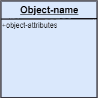
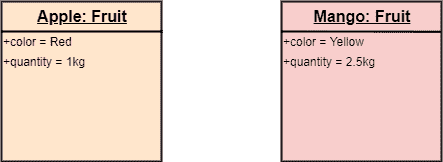

# UML对象图

> 原文：<https://www.javatpoint.com/uml-object-diagram>

对象图依赖于类图，因为它们是从类图派生的。它表示类图的一个实例。这些对象有助于描绘特定时刻面向对象系统的静态视图。

对象和类图在某种程度上都是相似的；唯一的区别是类图提供了系统的抽象视图。它有助于可视化系统的特定功能。

## 对象图的符号

## 对象图的目的

对象图与类图的目的相同。类图提供了由类及其关系组成的抽象视图，而对象图则表示特定时间点的实例。

对象图实际上类似于具体的(实际的)系统行为。主要目的是描绘系统的静态视图。

以下是列出的目的:

*   它用于执行正向和反向工程。
*   它用于实际理解对象行为及其关系。
*   它用于获取系统的静态视图。
*   它用于表示系统的一个实例。

## 对象图示例

## 如何绘制对象图？

1.  在开始绘制对象图之前，应该检查系统中存在的所有对象。
2.  在创建对象图之前，必须确认对象之间的关系。
3.  实体之间的关联关系必须已经清除。
4.  为了表示对象的功能，应该分配一个适当的有意义的名称。
5.  要检查对象以了解其功能。

## 对象图的应用

以下是可以使用对象图的应用领域。

1.  建立一个系统的原型。
2.  为复杂的数据结构建模。
3.  从实际的角度来看待这个系统。
4.  逆向工程。

## 类与对象图

| 序列号 | 类图 | 对象图 |
| 1. | 它描绘了系统的静态视图。 | 它描绘了系统的实时行为。 |
| 2. | 动态变化不包括在类图中。 | 在对象图中捕获动态变化。 |
| 3. | 这里不涉及实例的数据值和属性。 | 它合并了实体的数据值和属性。 |
| 4. | 对象行为在类图中被操纵。 | 对象是类的实例。 |

* * *