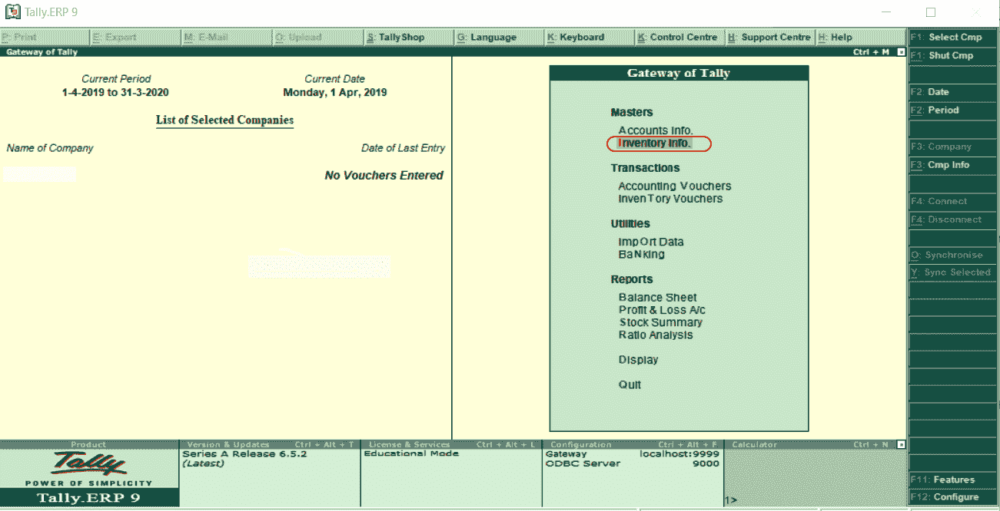
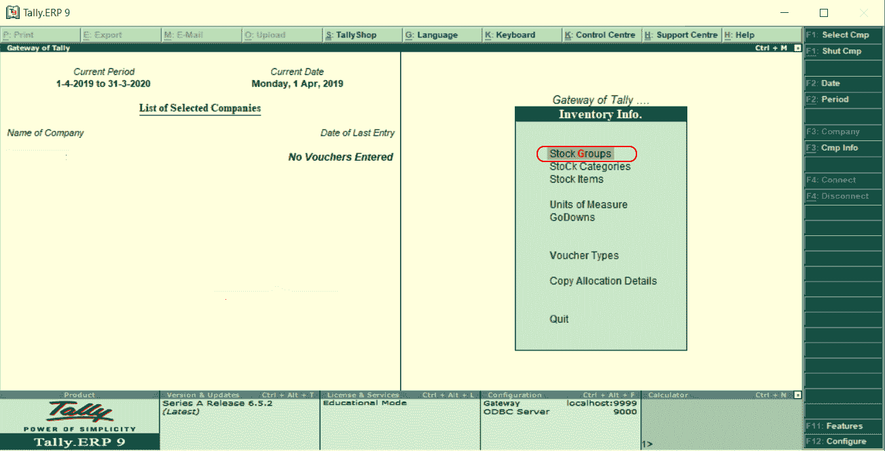

# Tally中的库存组

> 原文：<https://www.javatpoint.com/stock-group-in-tally>

在库存中，库存组类似于会计主数据中的组。在 Tally 中，股票组用于帮助根据股票项目的行为对其进行分类。在Tally中，股票分组使我们能够根据股票情况在报表中识别和报告。在股票组下，股票可以根据其产品类型、特征和品牌等进行分组。

### 股票组示例

假设 Javatpoint 销售音乐系统、个人电脑和笔记本电脑，下面的结构显示了正在销售的库存项目。

| 甲组计算机 |
| a1 -联想 | 13 英寸笔记本电脑- A1a |
| 联想 16 英寸电脑- A1b |
| A2 -戴尔 | 戴尔 13 英寸笔记本电脑- A2a |
| 戴尔 16 英寸 Pc - A2b |
| A3 -惠普 | 惠普 13 英寸笔记本电脑- A3a |
| 惠普 16 英寸电脑- A3b |

在这里，所有的个人电脑和笔记本电脑都归在电脑下面。主要股票组的计算机将在Tally中创建。

| B 组-音乐系统 |
| B1 -索尼 | 蓝光播放器- A2a |
| DVD 播放器- B2b |

在这里，音乐产品被归入音乐系统。主要股票组的音乐系统将在Tally中创建。

## 如何在Tally中打开库存组

**第一步:**前往Tally门户&库存信息

打开Tally应用后，选择主选项卡下的库存信息。

**第二步:**显示库存信息下的库存主数据列表，可以维护库存主数据。

1.  股票组
2.  股票类别
3.  库存项目
4.  计量单位
5.  仓库
6.  凭证类型
7.  复制分配详细信息

在Tally中，要使用股票组，请单击期权股票组。

**第三步:**显示股票组下的两类股票组。

1.  单一股票组
2.  多个股票组

在Tally中，我们可以创建、修改和显示单个和多个股票组。

在一个股票群中，我们可以找到特定时期的总销售额。

* * *