# Kubernetes 教程

> 哎哎哎:# t0]https://www . javatpoint . com/kubrines

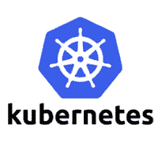

## 什么是 Kubernetes？

**Kubernetes** 也被称为**‘k8s’。**这个词来自希腊语，意为**飞行员**或**舵手**。
**Kubernetes** 是 **Google** 在 **2014** 中设计的一个可扩展、可移植、开源的平台。它主要用于跨节点集群自动化基于容器的应用的部署、扩展和操作。它还设计用于使用不同的方法来管理容器化应用的服务，这些方法提供了可伸缩性、可预测性和高可用性。

它实际上是管理长时间运行的流程和批处理作业的“**博格**的增强版本。如今，许多云服务提供了基于 Kubernetes 的基础设施，在此基础上可以将其部署为平台提供服务。这种技术或概念适用于许多容器工具，如 **docker、**，并遵循客户机-服务器架构。

### 库本内特的主要对象

以下是库本内特斯中存在的主要对象:

**下的**

它是 Kubernetes 应用中最小和最简单的基本单元。该对象指示集群中正在运行的进程。

**节点**

一个**节点**不过是一台主机，用来运行虚拟机或物理机。Kubernetes 集群中的一个节点也称为迷你节点。

**服务**

Kubernetes 中的**服务**是一组逻辑的豆荚，它们协同工作。在服务的帮助下，用户可以轻松管理负载平衡配置。

复制集

Kubernetes 中的**副本集**用于识别在给定时间运行的特定数量的 pod 副本。它取代了复制控制器，因为它功能更强大，允许用户使用“基于集合”的标签选择器。

**命名空间**

**Kubernetes** 支持各种虚拟集群，称为名称空间。这是一种在两个或多个用户之间划分集群资源的方式。

## 库本内特人的特征

以下是 Kubernetes 的基本特征:


1.  **Pod:** 是 Kubernetes 中的一个部署单元，只有一个互联网协议地址。
2.  **水平缩放:**这是库本内特人的一个重要特征。此功能使用**水平控制台自动缩放器**根据观察到的 CPU 利用率自动增加或减少部署、复制控制器、副本集或有状态集中的控制台数量。
3.  **自动装箱:** Kubernetes 帮助用户为其容器申报计算机的最大和最小资源。
4.  **服务发现和负载平衡:** Kubernetes 为一组容器分配 IP 地址和一个域名系统名称，并在它们之间平衡负载。
5.  **自动展开和回滚:**使用这些展开，Kubernetes 将更改和更新分发给应用或其配置。如果系统中出现任何问题，那么这项技术会立即为您回滚这些更改。
6.  **持久存储:** Kubernetes 提供了一个名为“**持久存储”**的基本功能，用于存储数据，在 pod 被杀死或重新调度后，数据不会丢失。Kubernetes 支持各种存储系统来存储数据，例如**谷歌计算引擎的持久磁盘(GCE PD)或亚马逊弹性块存储(EBS)。**还提供分布式文件系统: **NFS 或 GFS** 。
7.  **自愈:**这个特性在 Kubernetes 的概念中起着重要的作用。那些在执行过程中失败的容器，Kubernetes 会自动重新启动它们。而且，那些不回复用户定义的健康检查的容器，会自动停止工作。

## 不可思议的建筑

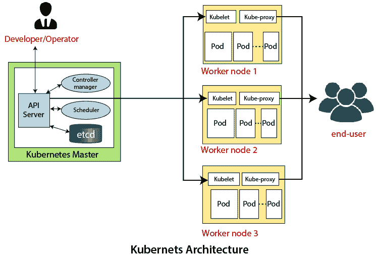

Kubernetes 的架构实际上遵循客户机-服务器架构。它由以下两个主要部分组成:

1.  主节点(控制平面)
2.  从属/工作节点

### 主节点或库本内特控制平面

Kubernetes 架构中的主节点用于管理集群的状态。它实际上是所有类型管理任务的入口点。在 Kubernetes 集群中，有多个主节点用于检查容错。

以下是主节点或库本内特控制平面中存在的四个不同组件:

1.  应用编程接口服务器
2.  调度程序
3.  控制器管理器
4.  和 CD

**应用编程接口服务器**

Kubernetes API 服务器接收用户发送的 REST 命令。接收后，它验证 REST 请求，处理它们，然后执行它们。执行 REST 命令后，集群的最终状态将作为分布式键值存储保存在“ **etcd** ”中。

**调度器**

主节点中的调度器将任务调度给工作节点。并且，对于每个工作节点，它用于存储资源使用信息。
换句话说，它是一个负责将 pods 分配给可用工作节点的过程。

**控制经理**

控制器管理器也称为控制器。它是一个在非终止控制循环中执行的守护程序。主节点中的控制器执行任务并管理集群的状态。在 Kubernetes 中，控制器管理器执行各种类型的控制器来处理节点、端点等。

**和 CD**

它是一个开源的、简单的分布式键值存储，用于存储集群数据。它是用 GO 编程语言编写的主节点的一部分。

现在，我们已经了解了主节点的功能和组件；让我们看看从/工作节点的功能是什么，它的组件是什么。

### 工作/从节点

Kubernetes 中的 Worker 节点也称为奴才。工作节点是使用 pods 执行应用的物理机器。它包含允许用户将资源分配给预定容器的所有基本服务。

以下是工作节点或从节点中存在的不同组件:

**立方结构**

该组件是在集群中的每个工作节点上执行的代理服务。它确保了豆荚和它们的容器平稳运行。每个工作节点中的每个 **kubelet** 都与主节点通信。它还启动、停止和维护由主节点直接组织成容器的容器。

**多维数据集代理**

它是 Kubernetes 的代理服务，只需在集群中的每个工作节点上执行。这个组件的主要目的是请求转发。每个节点通过 **Kube 代理**与 Kubernetes 服务交互。

**豆荚**

一个**容器**是一个或多个容器的组合，它们在节点上一起逻辑执行。一个工作节点可以轻松执行多个 pod。

## 在 Linux 上安装 Kubernetes

在 Linux 上安装 Kubernetes 是一个简单的过程。按照以下步骤安装 Kubernetes。在 Kubernetes 的安装中，每一步都是强制性的。

**步骤 1:** 在这一步中，我们必须使用两个命令更新系统的必要依赖关系。

第一个命令用于获取所有更新。在终端执行以下命令；它会要求输入系统的密码。

```

sudo apt-get update

```

**输出:**


成功执行第一个命令后，键入下面的第二个命令，该命令用于创建存储库。

```

sudo apt-get install -y apt-transport-https

```

**输出:**


**第二步:**以上步骤成功执行后，这一步我们要安装 docker 的依赖项。

键入以下命令安装 docker。在安装过程中，我们必须选择 Y 来确认安装。

```

sudo apt install docker.io 

```

**输出:**

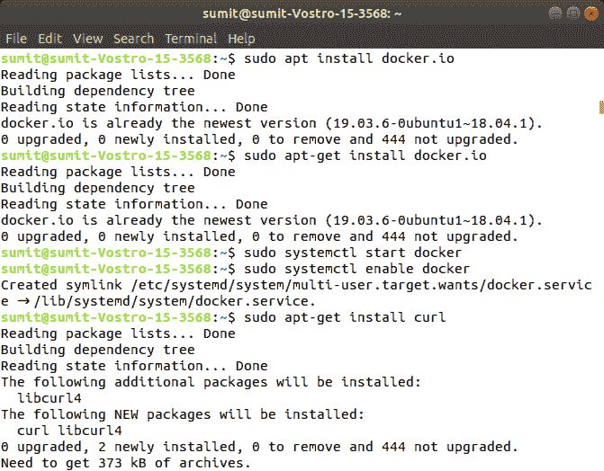

安装 docker 后，我们必须键入两个不同的命令来启动和启用 docker。键入以下第一个命令，启动 docker:

```

sudo systemctl start docker

```

现在，键入下面的第二个命令，它将启用 docker:

```

sudo systemctl enable docker

```

**输出:**


现在，我们可以通过键入以下命令来检查 docker 的版本:

```

Docker -version

```

**输出:**


**第三步:**第二步所有命令成功执行后，我们要安装 curl 命令。curl 用于使用 url 语法发送数据。

现在，使用以下命令安装 curl。在安装中，我们必须键入 y。

```

sudo apt-get install curl

```

**输出:**

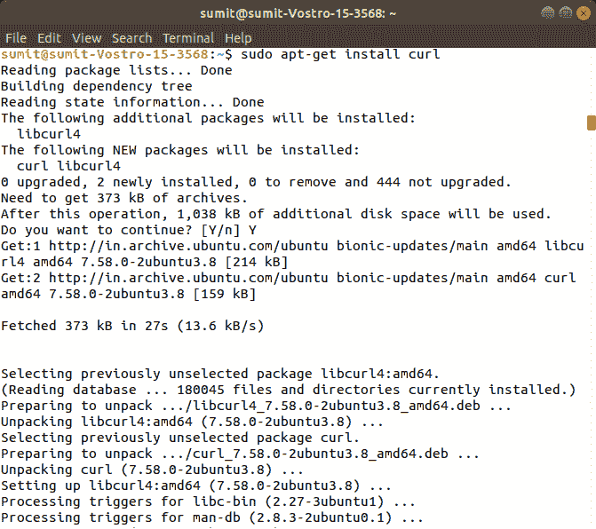

现在，我们必须通过以下命令为 Kubernetes 下载添加包密钥:

```

sudo curl -s https://packages.cloud.google.com/apt/doc/apt-key.gpg | sudo apt-key add

```

**输出:**

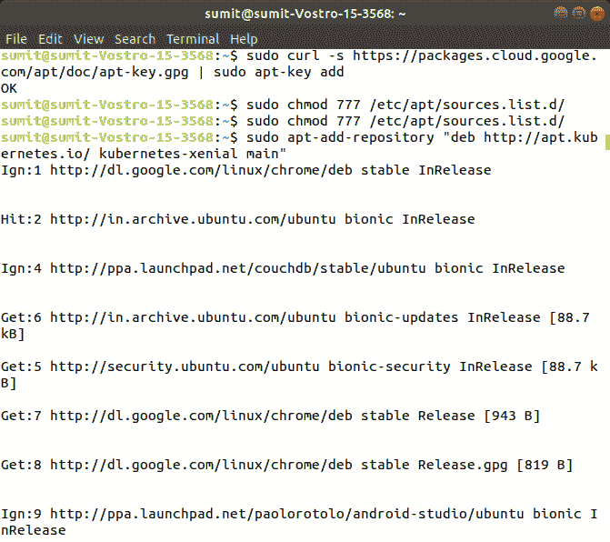

如果您从上面的命令中得到一个错误，那么这意味着您的 curl 命令没有成功安装，所以首先安装 curl 命令，然后再次运行上面的命令。

现在，我们必须通过以下命令添加 Kubernetes 存储库:

```

sudo apt-add-repository "deb http://apt.kubernetes.io/ kubernetes-xenial main"

```

**输出:**

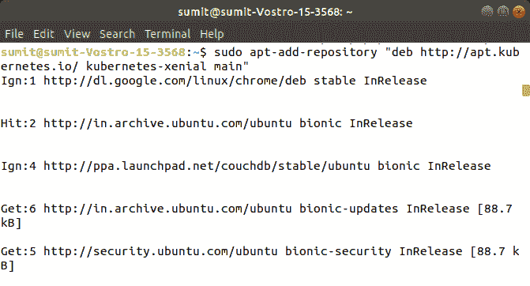

成功执行上述命令后，我们必须通过执行以下命令来检查任何更新:

```

sudo apt-get update

```

**输出:**

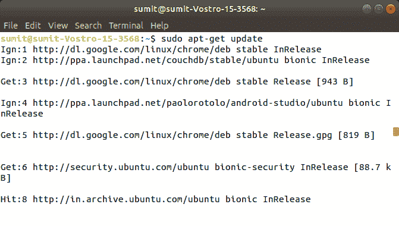

**第四步:**执行完上述步骤中的上述命令后，我们必须通过执行以下命令来安装 Kubernetes 的组件:

```

sudo apt-get install -y kubelet kubeadm kubectl kubernetes-cni

```

**输出:**

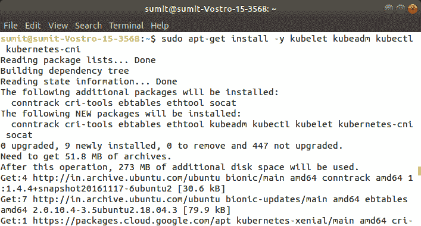

**第五步:**完成上述安装后，我们必须通过执行以下命令来初始化 kubeadm。以下命令禁用其他设备上的交换:

```

sudo swapoff -a

```

**输出:**


现在，我们必须通过执行以下命令来初始化 kubeadm:

```

sudo kubeadm init

```

**输出:**

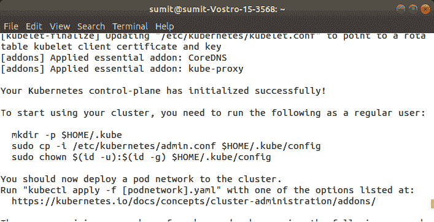

**第六步:**上述命令成功执行后，我们要运行以下命令，这些命令在 kubeadm 的初始化中给出。这些命令显示在上面的截图中。以下命令用于启动群集:

```

mkdir -p $HOME/.kube
sudo cp -i /etc/kubernetes/admin.conf $HOME/.kube/config
sudo chown $(id -u):$(id -g) $HOME/.kube/config

```


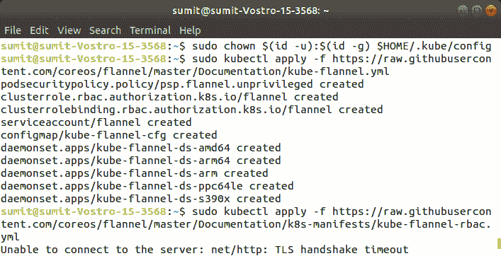

**输出:**

**步骤 7:** 在这一步中，我们必须使用以下命令部署路径:

```

sudo kubectl apply -f https://raw.githubusercontent.com/coreos/flannel/master/Documentation/kube-flannel.yml

```

**输出:**

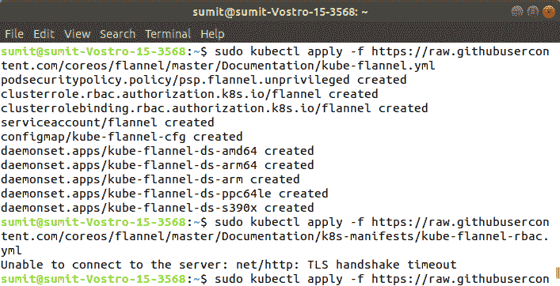

**步骤 8:** 执行完上述命令后，我们必须运行以下命令来验证安装:

```

sudo kubectl get pods --all-namespaces 

```

**输出:**


如果输出显示如上截图所示。这意味着 Kubernetes 已经成功安装在我们的系统上。

* * *