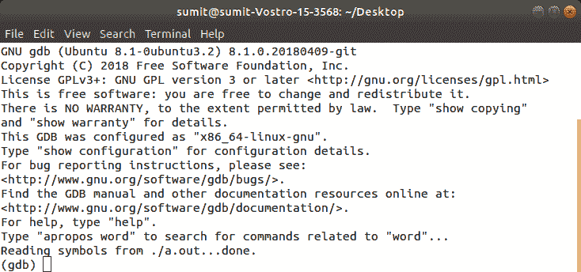

# GDB 教程

> 原文：<https://www.javatpoint.com/gdb>


## 什么是 GDB？

**GDB** 代表 **GNU 调试器**。是调试 C、Fortran、Go、C++等多种编程语言程序的有力工具。它运行在类似 Unix 的操作系统上。这个概念是由**理查德·斯托尔曼**在 1986 年写的。它实际上是一个自由软件，是在 GNU GPL 下发布的。这个调试器是用 C 语言编写的。

以下是 GDB 支持的各种语言:

*   语言
*   装配
*   C
*   FORTRAN 语言
*   去
*   OpenCL(打开 CL)
*   Modula-2
*   C++
*   D
*   帕
*   锈

GDB 使用简单的命令行界面，因此用户或程序员可以很容易地理解它。它允许用户在程序或代码执行过程中的特定时刻检查程序或代码在做什么。

它还使用户/程序员能够在某一点停止程序，并在该点打印特定变量的值。它还对编译过程中产生的二进制文件进行操作。

## 安装 GDB

首先，我们必须检查 GNU 调试器是否已经安装在 Unix 或 Linux 操作系统上。为此，我们必须在终端中运行以下命令:

```

gdb -help

```

如果已经安装了 GDB，那么上面的命令将显示 GDB 可用的选项。如果这个工具没有安装，那么我们必须在我们的系统上安装 GDB。

我们可以使用以下两种不同的方法或过程在我们的 Linux 机器上轻松安装 GDB:

**1。使用预构建的 gdb 二进制文件:**

在这个过程中，我们必须在 ubuntu 终端上运行以下两个命令。以下第一个命令用于更新依赖关系:

```

sudo apt-get update

```

成功执行上述命令后，运行安装 GDB 的以下命令:

```

sudo apt-get install gdb

```

**2。使用下载源代码的编译过程**

在此过程中，我们必须按照给定的步骤下载 GDB:

1.在这一步中，我们必须使用命令中的[http://ftp.gnu.org/gnu/gdb/](https://ftp.gnu.org/gnu/gdb/)站点下载源代码。

```

wget "http://ftp.gnu.org/gnu/gdb/gdb-7.11.tar.gz

```

2.现在，我们必须提取下载的源代码:

```

tar -xvzf gdb-7.11.tar.gz

```

3.提取后，我们必须通过逐一运行以下三个命令来配置和编译源代码:

```

cd gdb-7.11
gdb-7.11$ ./configure
gdb-7.11$ make

```

4.完成上述命令后。现在，我们必须使用下面给出的命令安装 GDB:

```

make install

```

默认情况下，上述命令在 **/usr/local/lib** 中安装 GDB **/usr/local/bin** 和 GDB 的二进制文件。

在成功执行上述命令后，我们已经成功编译并在我们的 Linux 系统中安装了 GNU 调试器。

之后，我们可以通过键入以下命令轻松查看 GDB 版本，并验证它是否已成功安装:

```

gdb --version

```

## GDB 司令部

GDB 是一个命令行工具。所以，在学习如何使用 GDB 之前，我们必须先学习 GDB 的命令。

GDB 提供了各种命令，帮助用户调试代码或程序。下表显示了命令列表及其说明:

| 南号码 | 命令的名称 | 描述 |
| 1. | **连接** | 该命令将 GNU 调试器与正在运行的进程连接起来。 |
| 2. | **回溯** | 此命令显示当前选定线程的调用堆栈。 |
| 3. | **回溯满** | 该命令显示局部变量的值。 |
| 4. | **b 好玩** | 该命令在函数开始时设置断点。 |
| 5. | **b N** | 该命令在当前正在执行的文件的第 n 行设置断点。 |
| 6. | **b 主** | 该命令在程序开始时设置断点。 |
| 7. | **b** | 该命令在正在执行的文件的当前行设置断点。 |
| 8. | **b +N** | 该命令在文件当前行的 N 行之后设置一个断点。 |
| 9. | **Bt** | 此命令显示堆栈跟踪。 |
| 10. | **C** | 这个“命令”允许 GDB 运行程序直到下一个断点或错误。 |
| 11. | **清除** | 此命令删除特定位置的断点。 |
| 12. | **检查点** | 此命令有助于创建新的检查点。 |
| 13. | **d** | 该命令从程序中删除或移除所有断点。该命令不同于清除命令。 |
| 14. | **d N** | 该命令删除第 n 行的断点。 |
| 15. | **d 1 2** | 此命令从程序中删除或移除断点 1 和 2。 |
| 16. | **删除检查点** | 此命令删除或移除以前创建的检查点。 |
| 17. | **分离** | 该命令将 GNU 调试器从进程中分离出来。 |
| 18. | **禁用** | 此命令禁用程序的所有断点或特定断点。 |
| 19. | **下降** | 该命令仅选择向下一级的帧。 |
| 20. | **向下 N** | 该命令选择那些降 N 级的帧。 |
| 21. | **启用** | 此命令启用程序的所有断点或特定断点。 |
| 22. | **启用一次** | 此命令启用断点，在第一次命中后，它会自动禁用。 |
| 23. | **启用删除** | 此命令启用断点，在第一次命中后，它会被自动删除。 |
| 24. | **完成** | 该命令继续执行到函数结束。 |
| 25. | **框架** | 该命令选择堆栈帧。它还显示当前选定的堆栈框架。 |
| 26. | **gdb** | 这个命令启动 GNU 调试器。它从没有调试文件开始。 |
| 27. | **gdb -帮助** | 该命令描述了命令行的各种选项。 |
| 28. | **gdb 版本** | 这个命令打印 GDB 的版本和一些关于 GDB 的信息。 |
| 29. | **帮助** | 此命令显示命令类别列表。 |
| 30. | **帮助**T2【cmd> | 该命令描述了如何使用该命令。 |
| 31. | **i** | 该命令提供所有信息命令的列表。 |
| 32. | **信息地址** | 此命令显示指定符号的地址。 |
| 33. | **信息 b** | 此命令显示所有断点的列表。 |
| 34. | **信息断点** | 此命令显示关于断点的信息。 |
| 35. | **信息检查点** | 此命令提供创建的检查点列表。 |
| 36. | **信息功能** | 该命令显示程序的功能列表。 |
| 37. | **信息寄存器** | 该命令显示正在使用的寄存器的内容/列表。 |
| 38. | **信息观察** | 该命令显示定义的观察点。 |
| 39. | **信息来源** | 此命令显示当前使用的文件的信息。 |
| 40. | **信息来源** | 此命令提供所有正在使用的源文件的列表。 |
| 41. | **信息符号** | 该命令打印位于特定地址的符号名称。 |
| 42. | **信息行** | 此命令显示代码中指定源代码行的开始和结束地址。 |
| 43. | **info args** | 该命令显示当前使用的框架函数的参数值。 |
| 44. | **本地人信息** | 该命令显示关于局部变量的信息。 |
| 45. | **信息框** | 此命令显示关于堆栈框架的高级信息。 |
| 46. | **信息中断** <断点-编号> | 该命令打印关于特定断点的信息。 |
| 47. | **信息向量** | 该命令显示矢量寄存器的信息。 |
| 48. | **信息变量** | 该命令显示被调试程序或代码中存在的静态或全局变量的列表。 |
| 49. | **击杀** | 该命令停止程序的执行。 |
| 50. | **打印** | 此命令显示指定表达式的值。 |
| 51. | **p 有** | 该命令打印或显示当前使用的变量“var”的值。 |
| 52. | **p/x 变量** | 该命令以十六进制格式打印整数变量值。 |
| 53. | **p/d 变量** | 该命令将变量值打印为有符号整数。 |
| 54. | **p/o 变量** | 该命令以八进制格式打印整数变量值。 |
| 55. | **p/a 变量** | 该命令将变量值打印为十六进制地址。 |
| 56. | **q** 或**退出** | 该命令退出 GNU 调试器。 |
| 57. | **运行**或 **r** | 这个命令从头到尾或者到下一个断点运行程序。 |
| 58. | **s** | 该命令执行程序的下一行或下一条语句。 |
| 59. | **s N** | 该命令执行程序的下一个第 n 行或语句。 |
| 60. | **选择-框架** | 该命令用于选择堆栈帧。 |
| 61. | **显示 args** | 此命令显示参数列表。 |
| 62. | 设定 args | 该命令指定空的参数列表。 |
| 63. | **设置** var = v | 该命令将值“v”赋给变量“var”。 |
| 64. | 设定 args arglist | 此命令指定调试程序的默认参数。 |
| 65. | **显示环境** | 该命令显示所有环境变量。 |
| 66. | **显示 env‘**var’ | 该命令显示“var”的值，它是一个环境变量。 |
| 67. | **步骤** | 这个命令执行下一行代码。 |
| 68. | **第 N 步** | 这个命令执行代码的第 n 行。 |
| 69. | **t 突破** | 该命令类似于 break 命令，但它是一个临时断点。命中断点后，断点将被自动删除。 |
| 70. | **向上** | 该命令仅选择向上一级的帧。 |
| 71. | **向上 N** | 该命令选择 N 级以上的帧。 |
| 72. | **无争议** | 该命令删除自动显示的表达式，该表达式由**显示**命令设置。 |
| 73. | **取消设置环境**变量 | 该命令从环境中删除变量“var”。 |
| 74. | **其中** | 此命令显示当前行的编号和您所在的函数。 |
| 75. | **x** 地址表达式 | 该命令在命令中给出的地址显示内存信息。 |

## 如何使用 GNU 调试器

到目前为止，我们已经研究了什么是 GDB 以及它的命令是什么，现在我们必须了解这个例子以及如何使用它。

在本节中，我们将学习如何使用 GNU 调试器调试程序。

现在，我们必须遵循如何与 GDB 一起运行程序的步骤:

**第一步:**首先我们要在文本编辑器中创建一个 C 或者 C++的程序。因此，我们创建了下面的代码来寻找一个数的阶乘。并且，我们用**保存这个代码。c** 分机。

```

# include <stdio.h>
int main()
{
      int i, number, j; //Declare three variables
      printf ("Enter the number: "); 
      scanf ("%d", &number );   // Enter the Number whose factorial to be calculate
     for (i=number; i>0; i--)  // This loop executes (number-0) times.         
     {
	j=j*i;    
      }
      printf("The factorial of %d is %d\n",number,j);
}

```

**第二步:**现在我们要借助调试符号，在终端编译构建上面的**程序. c** 。

```

gcc -g program.c

```

在上面的命令中，我们使用了 **-g** 选项，用于在调试模式下编译程序。

**步骤 3:** 现在，我们必须用 GDB 运行程序，所以在上面的命令之后，在终端中键入以下命令:

```

gdb a.out

```

上面的命令给出了当前程序的 GDB 控制台。

```

GNU gdb (Ubuntu 8.1-0ubuntu3.2) 8.1.0.20180409-git
Copyright (C) 2018 Free Software Foundation, Inc.
License GPLv3+: GNU GPL version 3 or later <http://gnu.org/licenses/gpl.html>
This is free software: you are free to change and redistribute it.
There is NO WARRANTY, to the extent permitted by law.  Type "show copying"
and "show warranty" for details.
This GDB was configured as "x86_64-linux-gnu".
Type "show configuration" for configuration details.
For bug reporting instructions, please see:
<http://www.gnu.org/software/gdb/bugs/>.
Find the GDB manual and other documentation resources online at:
<http://www.gnu.org/software/gdb/documentation/>.
For help, type "help".
Type "apropos word" to search for commands related to "word"...
Reading symbols from a.out...done.
(gdb) 

```

在这个控制台中，我们必须使用 GDB 命令来分析和调试程序。

**第四步:**最后调试完毕，在 GDB 的提示下，输入**退出**或 **q** 命令退出 GDB。

## GDB 的例子

在本节中，我们将以 C 编程语言为例，学习如何使用 GDB 的命令:

本示例查找给定数字的阶乘。在这个程序中，为了调试的目的，有一个错误。

```

# include <stdio.h>
int main()
{
      int i, number, j; //Declare three variables
      printf ("Enter the number: "); 
      scanf ("%d", &number );   // Enter the Number whose factorial to be calculate
     for (i=number; i>0; i--)  // This loop executes (number-0) times.         
     {
	j=j*i;    
      }
      printf("The factorial of %d is %d\n",number,j);
}

```

现在，通过在终端中键入以下两个命令来检查程序的输出。第一个命令用于编译程序:

```

gcc program.c

```

第二个命令是运行程序:

```

./a.out

```

键入上述命令后，我们将看到以下输出:

```
Enter the number: 6
The factorial of 6 is 23592240

```

在这个输出中，6 的阶乘是错误的，所以我们必须使用命令中的 **-g** 选项再次编译上述程序进行调试:

```

gcc -g program.c

```

现在，通过键入以下命令启动 GDB 调试器来调试问题。在这个命令中，a.out 是编译后生成的文件。

上面的命令给出了下面的控制台，它允许我们运行 GDB 的命令进行调试:



现在，我们使用以下步骤来调试上述程序:

**第一步:**首先，我们必须使用以下语法在这个阶乘程序中设置一个断点:

```

break line number

```

在 c 程序中放置断点后，调试器将在断点处停止，并提示我们进行调试。因此，在开始执行程序之前，我们必须在程序中放置给定的断点:

```

break 10

```

该命令给出以下语句:

```

Breakpoint 1 at 0x776: file program.c, line 10.

```

**步骤 2:** 现在，我们必须使用以下语法从 gdb 调试器中开始执行 c 程序:

```

run <args>

```

使用上面的命令，我们可以很容易地从开始运行程序。我们还可以通过在上面的命令中传递参数来为代码提供命令行参数。但是，我们的程序不需要命令行参数，所以我们只使用 run:

```

run

```

键入上述命令后，它会给出以下调试提示，并执行程序直到第一个断点:

```

Starting program: /home/sumit/Desktop/a.out 
Enter the number: 6

```

键入 6 后，它将给出以下提示:

```

Breakpoint 2, main () at program.c:10
10			j=j*i; 

```

**第 3 步:**现在，我们必须使用以下语法打印在该程序中使用的变量值:

```

print <variable>

```

键入以下命令，在控制台上显示上述程序的变量值:

```

(gdb) print i
$1 = 6    // This is the values of variable i, because in for loop we assign the value of num to variable i.
(gdb) print number
$2 = 6    // This is the value of variable number.
(gdb) print j
$3 = 32767  // This is the value of a variable j. 
(gdb) 

```

在上面的值中，**变量 j** 的值是垃圾，因此阶乘程序的输出是错误的。

因此，首先我们要将变量 **j** 的值初始化为 **1** ，再次执行上述程序。

* * *