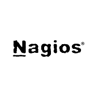
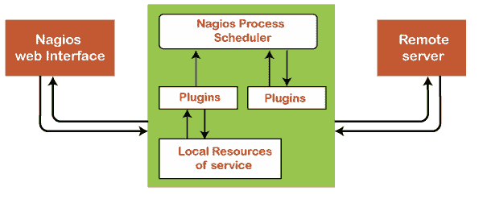
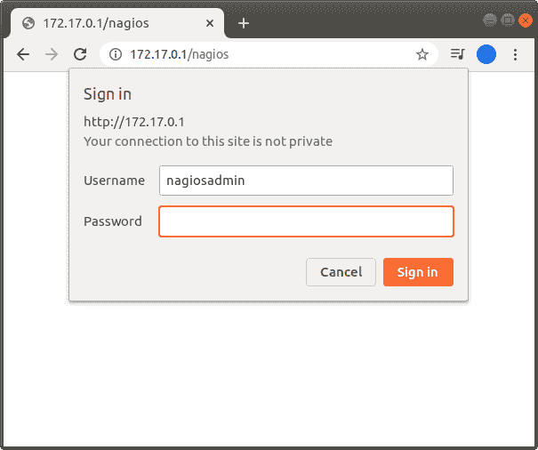

# Nagios 教程

> 原文：<https://www.javatpoint.com/nagios>



## 什么是 Nagios？

Nagios 是一个用于计算机系统的免费开源软件应用。它用于监控系统、网络和基础设施。

它最初的名字是由伊桑·加尔斯塔德在 1999 年与一些开发人员一起开发的网圣。

该软件应用主要为 [DevOps](https://www.javatpoint.com/devops) 文化内部的交换机、应用和服务器提供监控和告警服务。

它还用于在事情变坏时通知用户，并在事情变好时提醒他们。

这个软件应用是用 [C 语言](https://www.javatpoint.com/c-programming-language-tutorial)编写的，主要是设计运行在 **[Linux](https://www.javatpoint.com/linux-tutorial)** 操作系统下。但也可以在 Unix 和 [Windows 操作系统](https://www.javatpoint.com/windows)下运行。

该软件应用有以下两种变体:

1.  **Nagios 核心:**Nagios 也被称为 Nagios 核心。它是一个开源产品。于 2002 年 3 月 1 日<sup>发布。</sup>
2.  **Nagios XI:** 是 Nagios 的扩展版。它提供了用于监控的高级组件和工具。这种变体需要软件许可。

## 为什么是 Nagios？

以下是使用 Nagios 软件应用的一些原因:

1.  它用于监控服务器的性能问题。
2.  它帮助该软件应用的用户轻松找到任何问题的根本原因。
3.  它还用于检测所有可能的网络。
4.  我们可以轻松地维护安全问题，还可以检测服务的可用性。
5.  当出现问题时，此应用会自动修复这些问题。
6.  用户可以在任何操作系统上轻松运行它。
7.  在系统出现故障之前，它可以帮助您更新基础架构。
8.  使用此应用，用户可以快速检测任何类型的基础架构问题。
9.  它还监控数据库的各种服务器，如 SQL Server、MySQL。

## 纳吉奥斯的历史

**1996:**

今年，Ethan Galstad 使用用于创建 Nagios 的第三方应用创建了一个新应用。

**1998:**

今年，Ethan 开始使用设计在 Linux 下运行的思想和架构构建一个新的应用。

**1999:**

他在 1998 年发布了他的作品，作为一个名为“网圣”的自由开源项目。他希望有十几个人对这个应用感兴趣。

**2002:**

今年，他决定将项目名称更名为 Nagios，因为“NetSaint”名称存在商标问题。而且，“网圣”的插件项目也移到了“Nagios”的插件项目。

**2005:**

今年 6 月，Nagios 项目成为 SourceForge.Net 项目。

**2007:**

今年，**LinuxWorld.com**将企业中的 Nagios 项目评为 5 大开放安全工具之一。

**2009:**

今年，Nagios 更名为 **Nagios Core** ，Nagios 的企业发布了第一个商业版的 Nagios 为 **Nagios XI** 。

**2011 年:**

今年，Nagios BPI 发布，用于监控业务流程。并且，**WebHostingSearch.com**授予 Nagios“T2”最佳网络工具。

**2013 年:**

今年，Nagios Core 第 4<sup>版本发布。</sup>

**2016 年:**

今年，Nagios Core 从 SourceForge.Net 网站下载了 750 万次。

## Nagios 的特性

以下是 Nagios 应用的各种特性:

1.  这个应用提供了一个吸引人的网络界面。
2.  它高度安全且可扩展。
3.  用户可以轻松管理它。
4.  这个软件应用完美地存储了数据，因为有一个日志管理系统。
5.  这个应用中有数据绘图插件。
6.  它定义了在服务期间运行的事件处理程序。
7.  它支持后端数据库。
8.  它还支持实现不必要的监控主机。
9.  它有一个可选的 web 界面，用于查看通知、日志文件等。
10.  如果用户需要在多个地点安装监控系统进行监控，他们也可以在“分布式”系统中设置此应用。
11.  它帮助用户使用父主机定义网络主机的层次结构。
12.  它监控网络的各种服务，如 SMTP、HTTP、FTP、SSH。
13.  它还监控服务器的各种资源，如内存、处理器和磁盘驱动器、系统日志。
14.  用户可以通过一次操作轻松监控或检测整个信息技术基础设施和业务流程。
15.  它通过 SSL 和 SSH 加密隧道提供远程监控。

## Nagios 的架构

Nagios 的架构建立在服务器-客户端架构的基础上。

Nagios 的服务器通常运行在主机上，插件运行在要监控的远程服务器/或远程主机上。

Nagios 的插件收集有用的数据并将其发送给进程调度器，进程调度器通过图形用户界面显示信息。

以下是 Nagios 应用架构中的三个主要组件:

1.  调度程序
2.  图像使用者界面
3.  插件。



### 调度程序

调度程序是 Nagios 系统的服务器部分。该组件定期检查插件，并根据检查结果执行一些操作。

### 图像使用者界面

它是 Nagios 系统的用户界面，显示在 CGI 生成的网页上。 [GUI](https://www.javatpoint.com/gui-full-form) 可以一键切换到红色或绿色、图形、声音等。

当插件返回错误或警告时，图形用户界面上绿色的按钮变成红色。

### 插件

插件是 Nagios 系统的一个组件，可由用户配置。该组件检测服务并将结果返回给 Nagios 的服务器。

## Nagios 核心的安装

在本节中，我们将学习如何在 Linux 平台上安装 Nagios。因此，按照给定的步骤安装 Nagios:

**第一步:**在这一步中，我们必须安装**软件包 Apache 和 Php** ，这两个软件包需要在你的 ubuntu 系统上可用。

因此，首先在检查最新更新的 Linux 终端中键入以下命令:

```

sudo apt-get update

```

现在，完成上述命令后，逐一运行以下两个命令:

```

sudo apt-get install wget build-essential unzip openssl libssl-dev
sudo apt-get install apache2 php libapache2-mod-php php-gd libgd-dev 

```

**第二步:**在这一步中，我们必须在系统中为 Nagios 创建一个新的用户和组。

因此，首先键入以下命令为 Nagios 创建一个新用户:

```

sudo adduser nagios

```

之后，我们必须创建一个新的组，并将 Nagios 用户添加到 Apache 组中。

```

sudo groupadd nagcmd
sudo usermod -a -G nagcmd nagios
sudo usermod -a -G nagcmd www-data

```

**第三步:**这一步我们要从官方网站下载 Nagios Core 的最新包。

但是我们将首先使用以下 cd 命令将目录更改为/opt/

```

cd /opt/

```

现在，使用下面给出的命令下载最新的 Nagios 包:

```

wget https://assets.nagios.com/downloads/nagioscore/releases/nagios-4.4.5.tar.gz

```

现在，键入以下命令来提取 tar 文件。

```

tar xzf nagios-4.4.5.tar.gz

```

解压缩后，再次使用 cd 命令将目录更改为 nagios-4.4.5:

```

cd nagios-4.4.5

```

之后，运行给定的命令，从源代码编译 Nagios:

```

sudo ./configure --with-command-group=nagcmd

```

现在，我们必须使用 make 命令安装带有附加要求的 Nagios:

```

sudo make all
sudo make install
sudo make install-init
sudo make install-daemoninit
sudo make install-config
sudo make install-commandmode
sudo make install-exfoliation

```

成功执行上述命令后，现在，我们将需要使用以下两个命令在 libexec 目录下复制事件处理程序的脚本。

```

sudo cp -R contrib/eventhandlers/ /usr/local/nagios/libexec/
sudo chown -R nagios:nagios /usr/local/nagios/libexec/eventhandlers

```

**第四步:**这一步，我们要设置一个认证网关，防止对 Nagios 系统的未授权访问:

因此，首先我们必须使用以下命令为我们的 Nagios 服务器创建一个 Apache 配置文件:

```

sudo nano /etc/apache2/conf-available/nagios.conf

```

当文件在终端中打开时，您必须将以下代码键入或粘贴到您的文件中，然后保存并关闭文件。：

```

ScriptAlias /nagios/cgi-bin "/usr/local/nagios/sbin"
<Directory "/usr/local/nagios/sbin">
   Options ExecCGI
   AllowOverride None
   Order allow,deny
   Allow from all
   AuthName "Restricted Area"
   AuthType Basic
   AuthUserFile /usr/local/nagios/etc/htpasswd.users
   Require valid-user
</Directory>
Alias /nagios "/usr/local/nagios/share"
<Directory "/usr/local/nagios/share">
   Options None
   AllowOverride None
   Order allow,deny
   Allow from all
   AuthName "Restricted Area"
   AuthType Basic
   AuthUserFile /usr/local/nagios/etc/htpasswd.users
   Require valid-user
</Directory>

```

现在，我们需要通过执行以下命令为默认用户 **nagiosadmin** 设置一个 apache 的身份验证网关。

sudo htpasswd-c/usr/local/Nagios/etc/htpasswd . users Nagios admin

现在，我们必须启用 Apache 的配置，并使用以下三个命令重新启动 Apache:

```

sudo a2enconf nagios
$ sudo a2enmod cgi rewrite
$ sudo service apache2 restart

```

**第五步:**Nagios 核心服务安装配置完成后，我们要使用以下命令下载安装 Nagios 的插件。首先，我们必须将目录更改为/opt。

Cd /opt

现在，下载插件并提取 tar 文件:

```

wget http://www.nagios-plugins.org/download/nagios-plugins-2.2.1.tar.gz
tar xzf nagios-plugins-2.2.1.tar.gz
cd nagios-plugins-2.2.1

```

现在，我们必须使用以下命令编译和安装插件:

```

sudo ./configure --with-nagios-user=nagios --with-nagios-group=nagios --with-openssl

```

执行上述命令后，在终端上运行以下两个命令:

```

sudo make 
sudo make install

```

**步骤 6:** 现在，我们必须使用以下命令验证 Nagios 的安装和配置文件:

```

sudo /usr/local/nagios/bin/nagios -v /usr/local/nagios/etc/nagios.cfg

```

现在，键入以下命令来启动 Nagios 服务:

```

service nagios start

```

现在，让 Nagios 在系统启动时自动启动:

```

sudo systemctl enable nagios

```

第七步:这是最后一步，在这一步中，我们可以使用系统的 [IP](https://www.javatpoint.com/ip-full-form) 地址访问 Nagios 的 web 界面。如果您不知道系统的 Ip 地址，那么您可以通过在终端上运行以下命令来进行检查:

```

ifconfig

```

该命令给出以下输出。在这里，我们在下面指定 ip 地址:

```

docker0: flags=4099<UP,BROADCAST,MULTICAST>  mtu 1500
        inet 172.17.0.1  netmask 255.255.0.0  broadcast 172.17.255.255
        ether 02:42:4d:3e:03:3e  txqueuelen 0  (Ethernet)
        RX packets 0  bytes 0 (0.0 B)
        RX errors 0  dropped 0  overruns 0  frame 0
        TX packets 0  bytes 0 (0.0 B)
        TX errors 0  dropped 0 overruns 0  carrier 0  collisions 0
lo: flags=73<UP,LOOPBACK,RUNNING>  mtu 65536
        inet 127.0.0.1  netmask 255.0.0.0
        inet6 ::1  prefixlen 128  scopeid 0x10<host>
        loop  txqueuelen 1000  (Local Loopback)
        RX packets 58251  bytes 5650636 (5.6 MB)
        RX errors 0  dropped 0  overruns 0  frame 0
        TX packets 58251  bytes 5650636 (5.6 MB)
        TX errors 0  dropped 0 overruns 0  carrier 0  collisions 0
wlp1s0: flags=4163<UP,BROADCAST,RUNNING,MULTICAST>  mtu 1500
        inet 192.168.43.174  netmask 255.255.255.0  broadcast 192.168.43.255
        inet6 fe80::57fc:f515:2e2c:bf1c  prefixlen 64  scopeid 0x20<link>
        ether e8:9e:b4:49:49:ad  txqueuelen 1000  (Ethernet)
        RX packets 1033721  bytes 889387362 (889.3 MB)
        RX errors 0  dropped 0  overruns 0  frame 0
        TX packets 782902  bytes 214913360 (214.9 MB)
        TX errors 0  dropped 0 overruns 0  carrier 0  collisions 0

```

之后，我们必须在浏览器上键入以下网址。该网址使用 IP 地址后跟/nagios，如:

```

http://Ip-address/nagios

```

按下回车键后，浏览器将带我们进入 Apache 身份验证，在这里我们必须输入用户名和密码，这是我们在上述步骤中指定的:



成功登录后，您将获得 Nagios Core 的主页，如下图所示:


## Nagios 应用的优势

以下是 Nagios 的优势:

1.  这个应用是开源软件，所以我们可以自由使用和编辑它。
2.  它提供各种插件，可以免费下载和开发。
3.  你可以很容易地理解插件架构。
4.  这种应用软件的主要优点是，它可以快速检测失败的服务、服务器和批处理作业。
5.  它还可以快速监控或检测网络和协议的故障。
6.  该软件应用还处理警告和紧急情况。
7.  我们还可以在多个位置的各种机器上设置一个监控系统，这样它们就可以将其所有输出传送到中央 Nagios 服务器。

## Nagios 的缺点

以下是 Nagios 的限制或缺点:

1.  如果我们想添加 Nagios 的高级功能，那么这些功能在其免费版本中是不可用的，而只能在 Nagios XI 的应用上使用，这种应用使用起来非常昂贵。
2.  Nagios 核心的界面令人困惑。
3.  该应用软件不能管理网络，只能监控网络。
4.  它不能监控网络的吞吐量。
5.  在这个应用中，有各种各样的配置文件，用户很难配置它们。
6.  这个 Nagios 应用将每个设备视为一个主机。

* * *