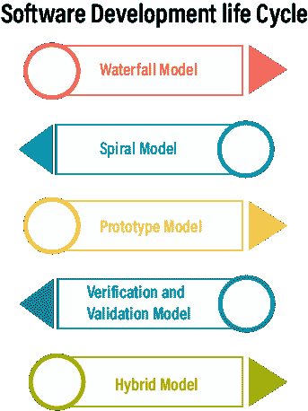

# 软件开发生命周期

> 原文：<https://www.javatpoint.com/software-development-life-cycle>

软件开发生命周期是一个创建软件开发结构的过程。SDLC 中有不同的阶段，每个阶段都有其不同的活动。它使开发团队能够设计、创建和交付高质量的产品。

SDLC 描述了软件开发的各个阶段以及各阶段的执行顺序。每个阶段都需要软件开发生命周期中前一阶段的可交付成果。需求转化为设计，设计转化为开发，开发转化为测试；测试后，它被交给客户。

让我们详细看看所有阶段:

软件开发周期的不同阶段

*   [需求阶段](#requirement-phase)
*   [设计阶段](#design-phase)
*   [构建/开发阶段](#build-development-phase)
*   [测试阶段](#testing-phase)
*   [部署/交付阶段](#deployment-deliver-phase)
*   [维护](#maintenance)

### 1.需求阶段

对于开发团队和项目经理来说，这是软件开发生命周期中最关键的阶段。在这个阶段，客户陈述需求、规格、期望以及与产品或软件相关的任何其他特殊需求。所有这些都是由服务提供公司的业务经理或项目经理或分析师收集的。

该要求包括如何使用该产品以及谁将使用该产品来确定操作负荷。从该阶段收集的所有信息对于按照客户要求开发产品至关重要。

### 2.设计阶段

设计阶段包括根据需求阶段对新软件的详细分析。这是系统开发生命周期中的高优先级阶段，因为系统的逻辑设计被转换为物理设计。需求阶段的输出是所需事物的集合，设计阶段给出了实现这些需求的方法。所有必需的基本工具的决策，例如像 Java 这样的编程语言。NET，PHP，一个像 Oracle，MySQL 一样的**数据库**，硬件和软件的结合提供了一个平台，在这个平台上软件可以毫无问题地运行。

有几种技术和工具，如数据流图、流程图、决策表和决策树，数据字典和结构化字典用于描述系统设计。

### 3.构建/开发阶段

在需求和设计阶段成功完成后，下一步是将设计实施到软件系统的开发中。在这个阶段，工作被分成小的单元，开发团队根据前一阶段讨论的设计和需求阶段讨论的客户需求开始编码，以产生期望的结果。

前端开发人员开发简单而有吸引力的 GUI 和必要的界面，与后端操作进行交互，后端开发人员根据所需操作进行后端编码。所有工作都按照项目经理演示的程序和指南进行。

由于这是编码阶段，对于软件开发生命周期中的开发人员来说，这需要最长的时间和更专注的方法。

### 4.测试阶段

测试是完成软件系统的最后一步。在这个阶段，在获得开发的图形用户界面和后端组合后，将根据需求阶段中陈述的需求对其进行测试。测试确定软件是否按照需求阶段的需求给出了结果。开发团队制定测试计划来开始测试。该测试计划包括所有类型的基本测试，如集成测试、单元测试、验收测试和系统测试。非功能测试也在这个阶段完成。

如果软件有任何缺陷或者没有按照预期工作，那么测试团队会向开发团队提供关于这个问题的详细信息。如果是有效的缺陷或者值得整理，就会被修复，开发团队用新的替换，也需要验证。

### 5.部署/交付阶段

当软件测试以令人满意的结果完成，并且在软件工作中没有遗留问题时，它被交付给客户使用。

一旦客户收到产品，建议他们首先进行测试。在测试版测试中，客户可以要求软件中没有但在需求文档中提到的任何更改或任何其他图形用户界面更改，以使其更加用户友好。除此之外，如果客户在使用软件时遇到任何类型的缺陷；它将被告知该特定软件的开发团队来解决问题。如果是严重的问题，那么开发团队会在短时间内解决；否则，如果不太严重，那么它将等待下一个版本。

在解决了所有类型的 bug 和变更之后，软件最终被部署到最终用户。

### 6.保持

维护阶段是软件开发生命周期的最后一个也是最持久的阶段，因为这是一个持续到软件生命周期结束的过程。当客户开始使用软件时，实际问题就开始出现，这时就需要解决这些问题。此阶段还包括对硬件和软件进行更改，以保持其运营效率，如提高性能、增强安全功能以及根据客户对即将到来的时间的要求。这个不时照顾产品的过程叫做维护。

“所以，所有这些都是软件开发生命周期(SDLC)的六个阶段，软件的开发过程就发生在这六个阶段之下。所有阶段都是强制性的，没有任何一个阶段的开发都是不可能的，因为开发是在软件的整个生命周期内持续进行的，并带有维护阶段”。

* * *

## 软件开发生命周期模型

软件开发模型是基于项目目标为项目开发选择的几个过程或方法。为了实现各种目的，我们有许多开发生命周期模型。这些模型确定了过程的多个阶段。选择正确的模型来开发软件应用是非常重要的，因为它将解释我们计划测试的内容、地点和时间。

以下是各种软件开发模型或方法:

*   **瀑布模型**
*   **螺旋模型**
*   **验证和确认模型**
*   **原型模型**
*   **混动车型**

### 瀑布模型

它是第一个序列线性模型，因为一个阶段的输出是下一个阶段的输入。简单易懂，用于小项目。瀑布模型的各个阶段如下:

*   **需求分析**
*   **可行性研究**
*   **设计**
*   **编码**
*   **测试**
*   **安装**
*   **维护**

有关瀑布模型的信息，请参考以下链接:

### 螺旋模型

它是中等水平项目的最佳套件模型。也称为**循环迭代**模型。每当模块相互依赖时，我们就采用这种模式。在这里，我们明智地开发应用模型，然后交给客户。螺旋模型的不同阶段如下:

*   **需求收集**
*   **设计**
*   **编码**
*   **测试**

有关螺旋模型的信息，请参考以下链接:

### 原型模型

从早期模型中客户拒绝较多的时候开始，我们就选择这种模型，因为客户拒绝较少。此外，它允许我们在流程的早期阶段准备一个样本(原型)，我们可以向客户展示，并获得他们的批准，然后开始原始项目的工作。这个模型指的是创建应用原型的动作。

有关原型模型的信息，请参考以下链接:

### 验证和确认模型

它是瀑布模型的扩展版本。它将分两个阶段实施，其中第一阶段，我们将执行验证过程，当应用准备就绪时，我们将执行验证过程。在这个模型中，实现以 V 形发生，这意味着验证过程在向下的流程中完成，验证过程在向上的流程中完成。

有关验证和确认模型的信息，请参考以下链接:

### 混合模型

当我们需要在单个模型中获取两个模型的属性时，使用混合模型。这种模式适用于小型、中型和大型项目，因为它易于应用、理解。

这两种模式的组合如下:

*   **V 和原型**
*   **螺旋和原型**

* * *