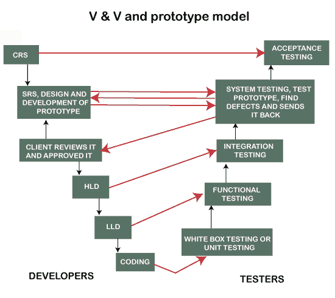

# 混合模型

> 原文：<https://www.javatpoint.com/hybrid-model>

混合模型是两个或多个主要(传统)模型的组合，并根据业务需求对它们进行修改。该模型依赖于其他 SDLC 模型，如螺旋、V 和 V 以及原型模型。混合模式主要用于小型、中型和大型项目。它侧重于产品的风险管理。

每当我们想要在单个模型中获得两个模型的特征时，我们就选择混合模型。当模型是依赖的，并且客户是行业的新手时。

两种模型最常用的组合如下:

*   **螺旋和原型**
*   **V & V 和原型**

#### 注意:
瀑布模型不能和任何模型组合，因为没有评审的要求。

### 螺旋和原型

螺旋和原型模型用于以下条件:

*   只要有依赖性，我们就选择螺旋模型和原型模型。
*   当客户分阶段给出需求，我们用这个模型分阶段开发产品。
*   当客户对软件行业非常陌生并且不清楚需求时。
*   当开发人员对特定软件不熟悉时。

### 螺旋过程和原型模型

螺旋和原型模型的过程将分几个步骤完成，如下所示:

*   这个模型的过程从**开始，收集客户对不同模块(如 A、B 和 C)的需求**
*   收集到软件的业务需求后，我们将**创建原型 A** 。
*   一旦我们开发了原型，我们将**测试原型 A** 。
*   原型测试成功后，我们将发送给客户进行**审核和批准**。
*   一旦他们审查并批准了原型，我们将为实际模块设计原型。
*   一旦设计阶段完成，**开发人员开始为模块编写代码**。
*   开发完成后，将发送给测试团队，**他们将测试模块**。
*   当测试阶段完成后，它将**部署到客户**。
    这个过程一直持续到软件中的所有模块(B，C)出现。

### V & V 和原型模型

我们选择这种模式的原因如下:

*   当客户和开发人员都是行业新人时。
*   当客户在要求的时间内期待非常高质量的产品时，因为每个阶段都经过测试，开发人员和测试团队并行工作。

### V & V 和原型模型过程

在混合模型中，测试团队参与测试原型。

在这种情况下，测试将从产品开发的早期阶段开始，这避免了 bug 的向下流动，这有助于我们减少重复工作。

V & V 模型和原型流程将通过以下步骤完成:

**第一步**

该过程从以 CRS 文档的形式收集业务需求开始，测试人员将执行以下操作:

*   查看 CRS
*   并编写用户验收测试用例和测试计划。

**第二步**

然后 BA 将这个 CRS 文档转换成 SRS 文档，web 开发人员将设计和开发 Prototype，发送给测试人员，测试人员将测试以下内容:

*   首先，他们将审查员工代表制度文件。
*   并编写系统测试测试用例和测试计划。

**第三步**

之后，测试团队将检查原型并识别错误，然后将其发送回相关开发人员。原型测试完成后，会发送给客户进行审查和批准。

**第四步**

一旦客户批准，我们将设计特定原型的高级设计，并将其发送给测试团队，在那里他们将执行以下操作:

*   审查高级别对话
*   编写集成测试测试文档。

**第五步**

一旦完成，我们将开始进行底层设计，并将其发送给测试人员，测试人员将执行以下操作:

*   回顾法学博士
*   并编写功能测试用例和测试计划。

**第六步**

之后，开发人员开始为特定的原型编写代码，并从他们的终端进行一轮白盒测试，然后将其发送给测试团队进行进一步的测试，在那里他们执行各种类型的测试。

这个过程一直持续到模块和原型稳定。然后它会交付给客户。

## 混合模型的优缺点

以下是混合模式的优缺点:

### 优势

*   混合模式非常灵活。
*   在这个模型中，由于原型，客户拒绝较少。
*   它易于实现，因为它具有同步的灵活性。
*   它易于使用和应用，尤其是中小型项目。
*   在这种情况下，开发过程将是平稳和快速的，因为这里我们只遵循相关的过程周期。

### 不足之处

*   每种混合动力车型都各不相同。
*   它不符合通常的标准。

* * *