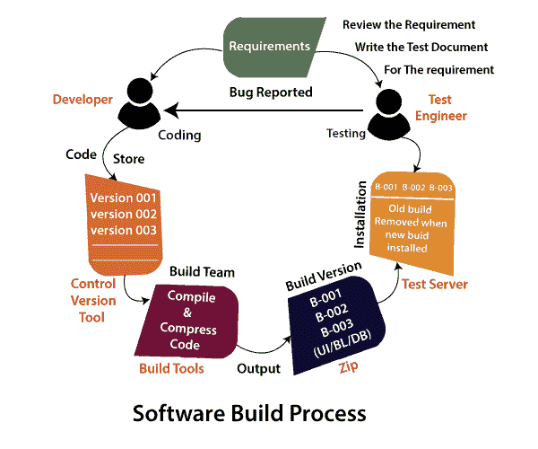
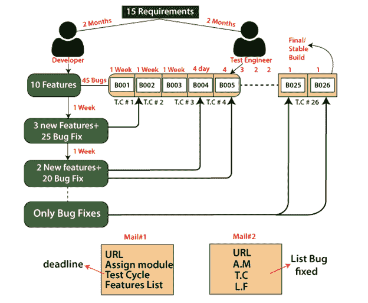

# 手动测试

> 原文：<https://www.javatpoint.com/manual-testing>

手动测试是一个软件测试过程，其中测试用例是在不使用任何自动化工具的情况下手动执行的。测试人员根据最终用户的观点手动执行的所有测试用例。它确保应用是否工作，正如需求文档中提到的那样。测试用例被计划和实现来完成几乎 100%的软件应用。测试用例报告也是手动生成的。

手动测试是最基本的测试过程之一，因为它可以发现软件的可见和隐藏缺陷。预期输出和软件给出的输出之间的差异被定义为缺陷。开发人员修复了缺陷，并将其交给测试人员进行重新测试。

在自动化测试之前，手工测试对于每个新开发的软件都是强制性的。这个测试需要很大的努力和时间，但是它保证了软件没有错误。手动测试需要手动测试技术的知识，但不需要任何自动化测试工具的知识。

手动测试是必不可少的，因为[软件测试](https://www.javatpoint.com/software-testing-tutorial)的基础之一是“100%自动化是不可能的。”

## 为什么我们需要手动测试

当一个应用进入市场时，它是不稳定的，或者在最终用户使用它时出现了错误或问题，或者产生了问题。

如果我们不想面对这种问题，我们需要执行一轮测试，使应用没有 bug 并且稳定，并向客户端交付高质量的产品，因为如果应用没有 bug，最终用户将更方便地使用应用。

如果测试工程师进行手动测试，他/她可以从最终用户的角度来测试应用，并对产品更加熟悉，这有助于他们编写正确的应用测试用例，并给出应用的快速反馈。

## 手动测试的类型

手动测试有多种方法。每种技术都是根据其测试标准使用的。手动测试的类型如下:

*   白盒测试
*   黑箱测试
*   灰盒测试

### 白盒测试

白盒测试由开发人员完成，他们在将代码交给测试工程师之前检查代码的每一行。由于代码在测试期间对开发人员是可见的，这就是为什么它也被称为白盒测试。

有关白盒测试的更多信息，请参考以下链接:

[https://www.javatpoint.com/white-box-testing](https://www.javatpoint.com/white-box-testing)

### 黑盒测试

黑盒测试由测试工程师完成，他们可以根据客户/客户的需求检查应用或软件的功能。在这种情况下，代码在执行测试时不可见；这就是为什么它被称为黑盒测试。

有关黑盒测试的更多信息，请参考以下链接:

[https://www.javatpoint.com/black-box-testing](https://www.javatpoint.com/black-box-testing)

### 灰盒测试

灰盒测试是白盒和黑盒测试的结合。它可以由既懂编码又懂测试的人来完成。如果一个人对应用执行白盒测试和黑盒测试，则称为灰盒测试。

要获得有关灰盒测试的更多详细信息，请参考以下链接:

[https://www.javatpoint.com/grey-box-testing](https://www.javatpoint.com/grey-box-testing)

## 如何执行手动测试

*   首先，测试人员观察所有与软件相关的文档，以选择测试区域。
*   测试人员分析需求文档，以涵盖客户提出的所有需求。
*   测试人员根据需求文档开发测试用例。
*   所有的测试用例都是通过黑盒测试和白盒测试手动执行的。
*   如果出现了错误，那么测试团队会通知开发团队。
*   开发团队修复了错误，并将软件交给测试团队进行重新测试。

## 软件构建过程

*   一旦需求被收集，它将提供给两个不同的团队开发和测试团队。
*   得到需求后，相关的开发人员将开始编写代码。
*   同时，测试工程师了解需求并准备所需的文档，到目前为止，开发人员可以完成代码并存储在**控制版本工具**中。
*   之后，代码在 UI 中发生变化，这些变化由一个单独的团队处理，这个团队被称为**构建团队**。
*   这个构建团队将获取代码，并在构建工具的帮助下开始编译和压缩代码。一旦我们得到一些输出，输出进入 zip 文件，这被称为 **Build** (应用或软件)。每个构建将有一些独特的数字，如(B001，B002)。
*   然后这个特定的构建将被安装在测试服务器中。之后，测试工程师将在测试网址的帮助下访问这个测试服务器，并开始测试应用。
*   如果测试工程师发现任何错误，他/她将被报告给相关的开发人员。
*   然后开发人员会在测试服务器中重现 bug 并修复 bug，再次将代码存储在 Control 版本工具中，它会安装新的更新文件并删除旧文件；这个过程一直持续到我们得到稳定的构建。
*   一旦我们获得了稳定的构建，它将被移交给客户。

### 注 1

*   一旦我们从控制版本工具收集了文件，我们将使用构建工具将代码从高级语言编译成机器级语言。编译后，如果文件大小会增加，那么我们将压缩该特定文件并转储到测试服务器中。
*   这个过程由**构建团队**、**开发人员**(如果构建团队不在，开发人员可以做)或者**测试负责人**(如果构建团队直接处理 zip，将应用安装到测试服务器，并通知测试工程师)来完成。
*   一般来说，我们不能为每个 bug 都获得一个新的构建；否则，大部分时间只会浪费在创建构建上。

### 附注 2

**建队**

构建团队的主要工作是创建应用或构建，并将高级语言转换为低级语言。

**建造**

它是软件，用于将代码转换成应用格式。它由一些特性和错误修复组成，被交给测试工程师进行测试，直到它变得稳定。

**控制版本工具**

它是一种软件或应用，用于以下目的:

*   在这个工具中，我们可以保存不同类型的文件。
*   它总是安全的，因为我们使用相同的登录凭证从工具访问文件。
*   这些工具的主要目标是跟踪对现有文件所做的更改。

### 构建过程示例

让我们看一个例子来理解如何在真实场景中构建流程工作:

测试工程师一拿到 bug，就会发给开发人员，他们需要一些时间来分析；之后，他/她只修复 bug(测试工程师不能给出 bug 的集合)。

开发人员根据他们的时间决定他能修复多少 bug。而测试工程师就决定了，应该根据他们的需求先修复哪个 bug，因为测试工程师是停不起测试的。

而收到邮件的测试工程师，他们只能通过 bug 修复的**列表**知道哪个 bug 被修复了。

时间会增加，因为在第一次构建时，开发人员应该用不同的特性编写代码。最后，他/她只能修复错误，并且天数会减少。

### 附注 3

**测试周期**

测试周期是给予测试工程师测试每个构建的持续时间。

**两个版本之间的差异**

在一个构建中发现的错误可以在未来的任何构建中修复，这取决于测试工程师的要求。每个新版本都是旧版本的修改版本，这些修改可能是错误修复或添加一些新功能。

**我们获得新版本的频率是多少**

最初，我们通常每周构建一次，但在测试的最新阶段，当应用变得稳定时，我们通常在 3 天、两天或每天一次获得新的构建。

**我们得到多少构建**

如果我们考虑一年的任何项目持续时间，我们得到了 22-26 个版本。

**当我们修复了错误**

一般来说，我们只在测试周期完成后才理解 bug 修复，或者 bug 的集合在一个构建中修复，并在下一个构建中移交。

## 手动测试的优势

*   使用黑盒方法时不需要编程知识。
*   它用于测试动态变化的图形用户界面设计。
*   测试人员以真实用户的身份与软件进行交互，以便他们能够发现可用性和用户界面问题。
*   它确保软件百分之百没有错误。
*   很划算。
*   对于新测试人员来说很容易学习。

## 手动测试的缺点

*   它需要大量的人力资源。
*   非常耗时。
*   测试人员基于他们的技能和经验开发测试用例。没有证据表明它们是否涵盖了所有功能。
*   测试用例不能再次使用。需要为每个新软件开发单独的测试用例。
*   它不提供测试的所有方面的测试。
*   由于两个团队一起工作，有时很难理解对方的动机，这会误导过程。

## 手动测试工具

在手动测试中，不同类型的测试，如单元、集成、安全、性能和 bug 跟踪，我们有各种工具，如[吉拉](https://www.javatpoint.com/jira-tutorial)、 [Bugzilla](https://www.javatpoint.com/bugzilla) 、螳螂、Zap、NUnit、Tessy、LoadRunner、Citrus、SonarQube 等。市场上有售。有些工具是开源的，有些是商业的。

有关测试工具的更多信息，请参考以下链接:

[https://www.javatpoint.com/software-testing-tools](https://www.javatpoint.com/software-testing-tools)

让我们逐一了解它们:

### 工具

它是最常用的性能测试工具。LoadRunner 主要用于支持各种过程、多种方法和应用环境的性能测试。

执行 LoadRunner 工具的主要目的是快速分类性能问题的最常见来源。

**负载转轮**的特性

*   LoadRunner 工具包含 n 个应用，这减少了理解和描述报告的时间。
*   我们可以通过使用 LoadRunner 工具获得全面的性能测试报告。
*   它将降低分布式负载测试的成本，并为部署跟踪提供操作工具。

### 柑橘属果树

Citrus 是一个集成测试工具，是最常用的测试框架。是用 **Java 编程**语言写的。它主要用于请求和响应服务器端和客户端，并验证 XML [JSON](https://www.javatpoint.com/json-tutorial) 文件。

为了完成端到端的用例测试，citrus 支持几种 HTTP、JMS 和 SOAP 协议。

**柑橘的特征**

以下是柑橘工具的一些重要特性:

*   它用于发送和接收消息。
*   柑橘既有开源的，也有市场许可的。
*   它提供了一个低成本的解决方案。
*   我们可以使用柑橘工具验证数据库。
*   它将描述消息的顺序，提供测试计划，并记录测试覆盖率。
*   它创建消息并验证响应。

### 活力

ZAP 是一个开源的网络应用安全扫描器。它代表 **Zed 攻击代理**。和其他一些工具一样，它也是用 [JAVA 编程语言](https://www.javatpoint.com/java-tutorial)编写的。是最有效的**开放网络应用安全项目**【OWASP】。

**ZAP**的特点

*   支持 Windows、Linux、OS X 等多种操作系统。
*   它有一个基于插件的架构。
*   它包含一个在线市场，允许我们添加新的或更新的功能。
*   ZAP 的 GUI 控制面板很容易使用。

### NUnit

NUnit 是最常用的单元测试工具之一。它是一个开源工具，主要源自 **JUnit** 。

完全是用 [C#编程语言](https://www.javatpoint.com/c-sharp-tutorial)写的，适合所有[。网络语言](https://www.javatpoint.com/net-framework)。

换句话说，我们可以说 NUnit 工具是完全重新设计的，以成为许多人的优势。网络语言素质。**例如:**

*   **反射相关能力。**
*   **其他自定义属性。**

**NUnit**的特性

*   它允许断言作为优势类的静态方法。
*   它支持数据驱动的测试。
*   它支持多个平台，例如。NET 核心的 Xamarin 移动、Silverlight 和高效框架。
*   NUnit 的能力帮助我们同时执行测试。
*   它使用控制台运行程序来加载和执行测试。

### 吉拉

最常用的 bug 跟踪工具是 **JIRA** ，这是一个开源工具。它用于错误跟踪、项目管理和问题跟踪。

在这个工具中，我们可以轻松地跟踪与软件相关的、由测试工程师产生的各种 bug 或缺陷。

**JIRA 特色**

*   这是一个节省时间的工具。
*   吉拉被用来跟踪缺陷和问题。
*   它用于建立文档任务。
*   吉拉是跟踪我们文件改进情况的非常有用的工具。

要获得有关吉拉工具的完整信息，请参考以下链接:[https://www.javatpoint.com/jira-tutorial](https://www.javatpoint.com/jira-tutorial)。

### 声纳员

手动测试的另一个测试工具是 SonarQube，它通过持续的代码质量和代码安全性来改进我们的工作流程。它可以灵活地使用插件。

它完全是用 JAVA 编程语言编写的。它提供全自动评估，并与 Ant、Maven、Gradle、MSBuild 和持续集成工具集成。SonarQube 能够记录度量历史并给出演化图。

**索纳曲贝**的特点

以下是 SonarQube 工具的一些重要特性:

*   它支持 C、C++、Python、JAVA、HTML、CSS、VB.NET、PHP、COBOL、PL/SQL 等多种编程语言。
*   根据 GNU 小通用公共许可证，Sonarqube 是免费提供的。
*   SonarQube 附属于一些重要的外部工具，如 GitHub、活动目录、LDAP 等。
*   由于**SonarQube**插件，SonarQube 与 Visual Studio、Eclipse 和 IntelliJ IDEA 开发环境合并。

### 测试工具

JMeter 是一个开源工具，用于测试静态和动态资源以及动态 web 应用的性能。

它完全是在 JAVA 应用上设计的，用于加载功能测试行为和测量应用的性能。

它方便用户或开发人员使用源代码开发其他应用。

**JMeter 的特性**

以下是 JMeter 的一些基本特性:

*   它是独立于平台的，接受类似 **Windows、Mac、Linux 等 JVM。**
*   它支持用户友好的图形用户界面，这是交互式的和直接的。
*   在多种类型的服务器中加载性能测试是不可思议的可扩展。

有关 JMeter 的更多信息，请参考以下链接:

[https://www.javatpoint.com/jmeter-tutorial](https://www.javatpoint.com/jmeter-tutorial)。

### 布吉拉

手动测试中使用的另一个 bug 跟踪工具是 [**Bugzilla**](https://www.javatpoint.com/bugzilla) 。

许多组织最广泛地使用它来跟踪应用的各种错误。

Bugzilla 是一个开源工具，帮助客户和客户跟踪缺陷。Bugzilla 也被认为是一个测试管理工具，因为在这种情况下，我们可以很容易地链接其他测试用例管理工具，比如 ALM、Quality Centre 等。

**布奇拉的特点**

Bugzilla 有一些附加功能，可以帮助我们轻松报告错误:

*   它支持各种操作系统，如 Windows、Linux 和 Mac。
*   在 Bugzilla 的帮助下，我们可以用几种格式列出一个 bug。
*   用户偏好可以衡量电子邮件通知。
*   Bugzilla 具有高级搜索功能。

### 螳螂

螳螂是一个基于网络的 bug 跟踪系统。ManitsBT 代表**螳螂虫跟踪器**。它用于跟踪软件缺陷，并以 PHP 编程语言执行。它也是一个开源工具。

**螳螂的特征**

特定工具的一些标准功能如下:

*   在这个工具的帮助下，我们拥有了全文搜索的可访问性。
*   对问题变更的审计跟踪。
*   它提供了版本控制系统集成。
*   文本字段和注释的修订控制

要获得更多关于 bug 跟踪工具的详细信息，请参考以下链接:[https://www.javatpoint.com/defect-or-bug-tracking-tool](https://www.javatpoint.com/defect-or-bug-tracking-tool)。

### 泰茜

另一个集成测试工具是 **Tessy** ，用于对嵌入式软件进行集成和单元测试。它还帮助我们发现软件或应用的代码覆盖率。

它可以轻松管理整个测试组织，包括业务需求、测试管理、覆盖数量和可追溯性。

Tessy 包含三个主要功能，如下所示:

*   测试界面编辑器
*   测试数据编辑器(TDE)
*   工作区。

**TESSY**的特点

TESSY 的标准特性如下:

*   它为测试执行结果生成测试报告。
*   它支持各种编程语言，如 C 和 C++。
*   Tessy 用于评估函数的接口，并描述该函数使用的变量。

有关集成测试工具的更多信息，请参考以下链接:[https://www.javatpoint.com/integration-testing-tools](https://www.javatpoint.com/integration-testing-tools)。

## 概观

在本文中，我们看到了关于**手动测试的详细信息，包括手动测试的定义、手动测试的必要性、手动测试的类型、手动测试工具、手动测试的过程以及手动测试的一些重要优缺点。**

最后，我们可以说，这是一个测试工程师需要非常坚持、创新和响应的过程。

在手动测试中，测试工程师需要像最终用户解释一样思考和执行。

为了实现手动测试，测试工程师需要生产技能和想象力。他们需要考虑多种情况或场景来测试特定的应用。

尽管目前我们可以借助自动化测试来测试几乎所有的应用，但是手动测试仍然是必要的，因为它是软件测试的基础。

* * *