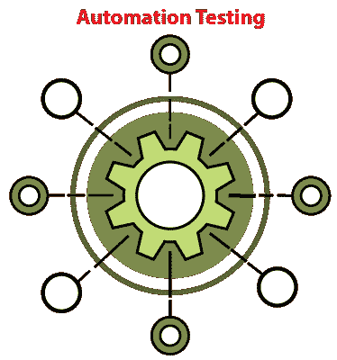
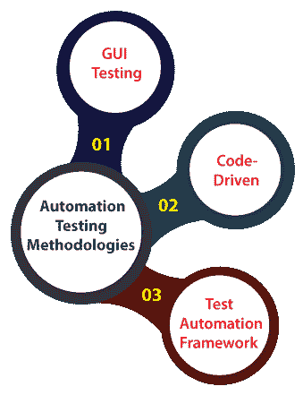
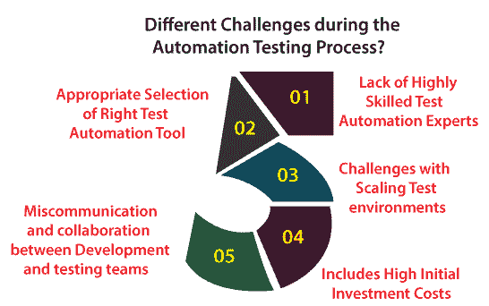
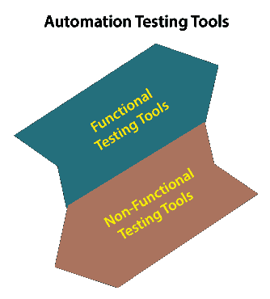
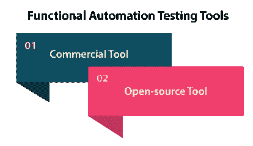
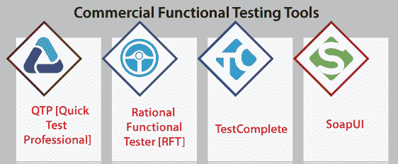
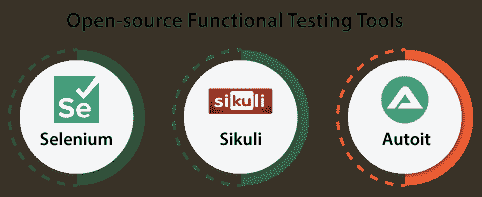
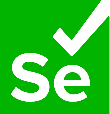
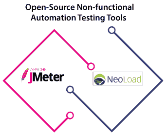

# 自动化测试

> 原文：<https://www.javatpoint.com/automation-testing>

在前面关于**软件测试**的文章中，我们了解到软件测试分为两种类型的测试，分别是**手动测试和**自动化测试。手动测试和自动化测试都有各自的特点和方法，这使得这两种测试技术互不相同。

在这里，我们将学习自动化测试的以下相关主题:

*   **自动化测试介绍**
*   **为什么我们需要执行自动化测试？**
*   **自动化测试中使用的不同方法**
*   **自动化测试流程**
*   **自动化测试过程中面临哪些不同的挑战？**
*   **自动化测试工具**
*   **自动化测试的优缺点。**

## 自动化测试导论

另一种[软件测试](https://www.javatpoint.com/software-testing-tutorial)方法是**自动化测试**，使用一些特定的工具执行测试脚本，没有任何人为干扰。这是提高软件测试的效率、生产率和测试覆盖率最容易接受的方法。

在[自动化测试工具](https://www.javatpoint.com/automation-testing-tool)的帮助下，我们可以轻松地接近测试数据，处理测试实现，并将实际输出与预期结果进行比较。

在**自动化测试**中，测试自动化工程师将编写测试脚本或使用自动化测试工具来执行应用。另一方面，在手动测试中，测试工程师将编写测试用例，并在编写的测试用例的基础上实现软件。

在测试自动化中，**测试工程师**可以执行重复性任务和其他相关任务。在手动测试中，一次又一次地重复执行是一个繁琐的过程。

换句话说，我们可以说**测试自动化**的主要集中是用系统或设备改变人工的人类活动。

**自动化测试**过程是一个节省时间的过程，因为它在探索性测试中花费更少的时间，而在保持测试脚本上花费更多的时间，同时增强了完整的测试覆盖率。

#### 注意:只要需求不存在，我们就执行探索性测试。

### 为什么我们需要执行自动化测试？

*   在软件测试中，需要自动化测试来测试应用，因为它用更少的努力和时间为我们提供了更好的应用。
*   一些组织仍然只执行手动测试来测试应用，因为这些公司并不完全了解自动化测试过程。
*   但是现在，他们意识到自动化测试，并在他们的应用开发过程中执行测试自动化过程。
*   为了实现自动化测试，我们需要相当可观的资源和资金投入。

自动化测试的执行为我们提供了各种优势，如下所述:

*   **可重用性**
*   **一致性**
*   **随时(24/7)运行测试**
*   **早期 Bug 检测**
*   **人力资源较少**

### 1.复用性

我们可以在自动化测试中重用测试脚本，并且我们不需要一次又一次地编写新的测试脚本。此外，我们还可以重新创建与前面的步骤一样详细的步骤。

### 2.一致性

与手动测试相比，自动化测试比执行常规的单调测试更一致，速度也更快，这些测试不能错过，但在手动测试时可能会导致错误。

### 3.全天候运行测试

在自动化测试中，我们可以在世界的任何地方随时随地开始测试过程。如果我们没有太多的方法或选择购买它们，甚至我们也可以远程完成。

### 4.早期错误检测

通过执行自动化测试，我们可以很容易地检测到软件开发过程初始阶段的关键错误。它还帮助我们花更少的工作时间来解决这些问题并降低成本

### 5.人力资源减少

为了实现自动化测试脚本，我们需要一个测试自动化工程师，他可以编写测试脚本来自动化我们的测试，而不是让几个人重复执行繁琐的手动测试。

## 自动化测试方法

自动化测试包含以下三种不同的方法和途径，这将帮助测试工程师提高软件产品的质量。

*   **图形用户界面测试**
*   **代码驱动**
*   **测试自动化框架**

现在，让我们逐一了解自动化测试的不同方法:

### 1.图形用户界面测试

在这种方法中，我们可以实现包含图形用户界面的软件或应用。因此，自动化测试工程师可以记录用户行为并多次评估它们。

我们知道**测试用例**可以用 [JAVA](https://www.javatpoint.com/java-tutorial) 、 [C#](https://www.javatpoint.com/c-sharp-tutorial) 、 [Python](https://www.javatpoint.com/python-tutorial) 、 [Perl](https://www.javatpoint.com/perl-tutorial) 等多种编程语言编写。

### 2.代码驱动的

代码驱动技术是自动化测试中使用的后续方法。在这种方法中，测试工程师将主要关注测试用例的执行，以便识别代码的几个部分是否按照给定的要求执行。

因此，它是 [**【敏捷】**软件开发](https://www.javatpoint.com/agile)中非常常用的方法。

### 3.测试自动化框架

自动化测试的另一种方法是**测试自动化框架**。测试自动化框架是一组规则，用于生成自动化测试活动的有价值的结果。

类似地，它汇集了测试数据源、函数库、对象细节和其他可重用模块。

## 自动化测试过程

自动化测试过程是一种系统的方法，以有限的资源提供最大的测试覆盖率的方式来组织和执行测试活动。测试的结构包括一个多步骤的过程，支持执行任务所需的、详细的和相互关联的活动。

自动化测试过程按以下步骤完成:

### 步骤 1:决定自动化测试

这是**自动化测试生命周期方法论(ATLM)** 的第一阶段。在这个阶段，测试团队的主要焦点是管理来自测试的期望，并找出正确应用自动化测试的潜在好处。

在采用自动化测试套装时，组织必须面对许多问题，下面列出了一些问题:

*   自动化测试需要测试工具专家，所以第一个问题，要指定一个测试设备专家。
*   第二个问题是，为特定功能的测试选择准确的工具。
*   自动化测试过程实施中的设计和开发标准问题。
*   分析各种自动化测试工具，选择自动化测试的最佳工具。
*   金钱和时间的问题发生在测试开始时，因为金钱和时间的消耗很高。

### 步骤 2:测试工具选择

测试工具选择代表了**自动化测试生命周期方法论(ATLM)** 的第二阶段。这个阶段指导测试人员评估和选择测试工具。

由于测试工具支持几乎所有的测试需求，所以测试人员仍然需要审查系统工程环境和其他组织需求，然后列出工具的评估参数列表。测试工程师根据提供的样本标准评估设备。

### 第三步:范围介绍

这个阶段代表了**自动化测试生命周期方法论(ATLM)** 的第三阶段。自动化的范围包括应用的测试区域。范围的确定基于以下几点:

*   每个软件应用拥有的软件应用的通用功能。
*   自动化测试设置了业务组件的可重用范围。
*   自动化测试决定了业务组件的可重用程度。
*   应用应该具有特定于业务的特性，并且必须在技术上可行。
*   自动化测试在跨浏览器测试的情况下提供了测试用例的重复。

这个阶段确保整体测试策略得到良好的管理，并在需要时进行修改。为了确保技能的可用性，针对特定软件应用所需的特定技能来分析特定成员和整个团队的测试技能。

### 步骤 4:测试规划和开发

测试规划和开发是自动化测试生命周期方法(ATLM)的第四个也是最重要的阶段，因为所有的测试策略都在这里定义。长期测试活动的规划、标准和指南的创建、创建测试环境所需的硬件、软件和网络组合的安排、缺陷跟踪程序、控制测试配置和环境的指南都在此阶段确定。测试人员确定整个项目的估计工作量和成本。测试策略和工作评估文档是这个阶段提供的可交付成果。测试用例执行可以在测试计划成功完成后开始。

### 步骤 5:测试用例执行

测试用例执行是自动化测试生命周期方法论(ATLM)的第六阶段。它发生在成功完成测试计划之后。在这个阶段，测试团队定义测试设计和开发。现在，测试用例可以在产品测试下执行。在这个阶段，测试团队通过使用自动化工具开始案例开发和执行活动。准备好的测试用例由测试团队的同行成员或质量保证负责人审查。

在测试程序的执行过程中，测试团队被要求遵守执行时间表。执行阶段实现之前在测试计划中定义的策略，如集成、验收和单元测试。

### 第六步:回顾和评估

评审和评估是自动化测试生命周期的第六个也是最后一个阶段，但是这个阶段的活动是在整个生命周期中进行的，以保持持续的质量改进。改进过程是通过评估矩阵、审查和评估活动来完成的。

在评审期间，审查员集中于特定的度量是否满足验收标准，如果是，那么它就可以在软件生产中使用。它是全面的，因为测试用例涵盖了应用的每个特性。

测试团队执行自己的调查，以询问过程的潜在价值；如果潜在的好处不够充分，测试团队可以改变测试工具。该团队还提供了一个样本调查表，要求最终用户就软件产品的属性和管理提供反馈。

## 自动化测试过程中面临哪些不同的挑战，以及如何克服这些挑战？

**自动化测试过程**为组织带来了大量的优势。通常，通过自动化测试，指定软件验证方法的测试团队可以完成扩大的测试覆盖范围。

尽管我们在自动化测试过程中可能会面临各种挑战；因此，我们需要一个彻底的后续过程来实现成功的测试自动化执行。

下面讨论了一些常见的挑战，在应用的测试自动化过程中，我们可能会遇到这些挑战:

### 1.缺乏高技能的测试自动化专家

*   缺乏自动化测试过程背后最根本的原因是缺乏高技能的自动化测试工程师。
*   为了设计和维护测试自动化框架和测试脚本，测试自动化工程师需要熟练掌握自动化技术技能的细节知识。
*   为了正确地创建测试脚本并维持它们，团队应该成功地实现测试脚本，以检查应用性能并修复技术问题。
*   为了实现可操作的自动化方面，自动化测试工程师应该对测试自动化框架有很强的知识，因为他们很容易设计和执行测试脚本。

### 2.正确选择测试自动化工具

*   执行自动化测试时，我们面临的下一个挑战是选择正确的自动化测试工具。
*   必须对被测应用进行适当的详细评估。
*   开源和付费工具都可以使用各种自动化测试工具。在接受工具之前，进行适当的检查是至关重要的。

### 3.扩展测试环境的挑战

*   作为不在云中提供测试环境的测试团队，这在当今是一个至关重要的挑战。
*   快速交付自动化测试所需的已更改的测试环境、测量它们、执行测试，以确保在云中测试时获得成功，这一点至关重要。
*   通常，内部团队拥有部分数量的测试环境，他们可以使用这些环境来执行更少的测试，并在任何给定的时间部署它们。
*   因此，测试需要更长的时间。为了克服这一点，**将测试环境迁移到云以扩展测试自动化**至关重要，这也将降低测试团队的运营成本。

### 4.包括高昂的初始投资成本

*   一般来说，自动化测试过程在初始阶段的执行有点昂贵，因为需要通过详细的自动测试分析来评估、设计和构建自动化测试框架、库或可重用功能。
*   此外，如果自动化测试工程师选择了许可的测试自动化工具，应该评估运行成本。
*   如果自动化测试工程师选择了开源工具，那么在学习、培训和维护这些工具上也应该付出巨大的努力。
*   后来，自动化工具的选择，无论是开源的还是授权的，都取决于自动测试的优先级和成本设施的可用性。

### 5.开发和测试团队之间的沟通不畅和缺乏协作

*   开发人员与测试工程师团队和操作团队之间的沟通不畅或缺乏适当的协作，并不能使我们成功实现测试自动化。
*   因此，让所有团队(开发人员、测试人员、操作人员)对测试自动化目标进行分类并设定目标是非常重要的。
*   为了确保测试自动化的成功，这些团队需要花一些时间来进行有效的沟通，并清楚地了解业务需求和项目规范。

## 自动化测试工具

自动化测试工具可以描述为两类，如下所示:

*   **功能测试工具**
*   **非功能测试工具**

让我们一个一个地详细了解它们:

### 功能自动化测试工具

自动化测试工程师使用功能自动化测试工具来实现功能**测试用例。例如**，重复回归测试在功能自动化测试工具下实现自动化。

这种工具可以进一步分为两个不同的部分，如下所示:

*   **商用工具**
*   **开源工具**

### 商业功能测试工具

商用[功能测试](https://www.javatpoint.com/functional-testing)工具是那些测试工具，市场上不免费提供。这些工具也被称为**特许工具**。与开源工具相比，许可工具包括各种特性和方法。

一些最重要的商业工具如下:

*   **QTP【快测专业】**
*   **理性功能测试器【RFT】**
*   **测试完成**
*   **皂水**

让我们看看上面列出的商业工具:

### 工具

*   QTP 意为**快速测试专业人员**，但现在它被称为微焦点 **UFT(统一功能测试)。**
*   它主要用于自动化基于 web 的应用或软件的功能回归测试用例。
*   为了测试应用、部署对象以及进行分析，它是在脚本语言上设计的，例如 **VBScript** 。
*   它遵循**关键字驱动测试**的概念来定义测试创建和维护。
*   新的测试工程师可以很容易地使用 QTP 工具，因为它允许他们从应用中开发测试用例。

**QTP 特色**

QTP 最标准的特征如下:

*   录制和回放功能增强了 QTP 工具的可信度。
*   技术和非技术测试工程师都可以操作 QTP 工具。
*   它支持 SAP、JAVA、Oracle 等多种软件开发环境**。**
*   我们可以使用 QTP 检查基于网络和基于桌面的应用。

### 射频变压器

*   RFT 代表 **Rational Functional Tester，**用于执行功能回归测试用例。
*   它遵循数据驱动测试和图形用户界面测试的概念。
*   它通过记录最终用户在被测系统上的活动并根据请求重复操作来执行测试，从而构建自动化功能测试。

**RFT 的特点**

RFT 工具包含以下特征:

*   RFT 支持广泛的应用和协议，如 **HTML、Java、。NET、Windows、Eclipse、SAP、Visual Basic、PowerBuilder**
*   它通过代理软件开发工具包(如 Java or.Net)支持自定义控件。
*   它允许开发人员开发关键字相关的脚本；因此，它可以再次重复使用，这提高了项目的生产率。

### 测试完成

*   另一个功能性自动化测试工具是 TestComplete，由**智能熊软件**获取。
*   TestComplete 具有一些内置功能，可以帮助测试工程师开发微软视窗、网络、安卓和 iOS 应用的自动化测试。
*   在这个工具中，可以用关键字驱动的过程记录、编写脚本或手动创建测试，并用于自动回放和错误记录。
*   它包括三个不同的模块，如网络、桌面和移动，其中所有模块都涉及在特定平台上开发自动化测试的功能。

**测试完成工具的特性**

以下是测试完成工具的基本特征:

*   用于测试 **Web、Windows、安卓、iOS、。NET、VCL 和 Java。**
*   它涉及问题跟踪模板，可用于开发或更改存储在问题跟踪系统中的项目。
*   它记录了重复测试的关键动作，并拒绝所有不必要的努力。

### 调试工具

*   SoapUI 是使用最广泛的自动化工具。主要用于测试 SOAP 和 **REST 接口**的 **web 服务**和**web API。**
*   它允许测试工程师在各种网络服务和API上测试功能、回归测试和其他测试类型。
*   SoapUI 工具开发了测试工程师可以测试真实应用的模型。
*   它完全是用 **JAVA** 和 Groovy 编程语言编写的。

**皂水**的特点

SoapUI 工具的一些最常见的特性如下:

*   SoapUI 的核心特性包含各种 web 服务，如**开发、嘲讽、检查、模拟和调用。**
*   支持 **HTTP、HTTPS、AMF、JDBC、SOAP、WSDL 等所有标准协议和技术。**
*   SoapUI 工具提供了一个快速有效的框架，可以创建许多 web 服务测试。
*   它提供了从多个 web 服务源获取数据的服务，而无需开发任何代码。

要获得更多关于 SoapUI 工具的信息，请参考以下链接:[https://www.javatpoint.com/soapui](https://www.javatpoint.com/soapui)。

### 开源功能测试工具

开源功能测试工具就是那些在市场上可以免费获得的工具。这些工具的功能和特性不如**商业/授权工具**，但有时使用商业工具成为一个昂贵的过程。

这就是为什么一些知名组织更喜欢使用开源工具。

以下是最常用的开源功能自动化测试工具:

*   **Selenium**
*   **锡库里**
*   **汽车**

让我们逐一了解开源的功能自动化测试工具:

### Selenium

每当我们谈论自动化测试的开源工具时，每个自动化测试工程师都会想到一个名字:Selenium。

*   Selenium是**极力推荐的**和广泛使用的功能测试工具，非常适合非功能测试工具。
*   Selenium 是一个开源工具，这意味着它不需要任何许可。
*   我们只能使用 selenium 工具测试 web 应用，独立应用无法在 Selenium 中实现自动化。
*   它最常用于实现功能测试脚本。
*   可以结合几种自动化测试工具，实现连续测试，例如 **Maven 和 Jenkins** 。
*   可以与 **TestNG、JUnit** 等多种设备关联，管理测试用例，生成测试报告。

### Selenium的特性

以下是Selenium的基本特性:

*   Selenium可以很容易地部署在几个平台上，如**视窗、Linux、Solaris 和 MacOS。**
*   此外，它还支持移动应用的操作系统，例如 iOS、Windows mobile 和 android 。
*   Selenium 支持 **C#、Java、Perl、PHP、Python、Ruby** 等多种编程语言。
*   当我们实现测试脚本并在多个浏览器上同时对其进行分析时，Selenium 变得非常足智多谋。
*   它提供了一个用户友好的界面，帮助测试工程师开发和执行测试脚本的资源和效率。

要获得关于Selenium的完整信息，请参考以下链接:[https://www.javatpoint.com/selenium-tutorial](https://www.javatpoint.com/selenium-tutorial)。

### 西库利

*   另一个开源的功能自动化测试工具是 **Sikuli** 。
*   这是一个基于图形用户界面的测试自动化工具，可以轻松地自动化闪存对象，因为像 selenium 这样的大多数自动化测试工具不支持闪存对象自动化。
*   最常见的是，Sikuli 用于与网页基础交互，并控制基于窗口的弹出窗口。
*   借助 Sikuli 工具，我们可以轻松测试 windows 应用。

**四库里**的特征

赛库里工具最标准的功能如下所述:

*   通过使用 Sikuli Jar 文件，Sikuli 工具可以很容易地与 Selenium WebDriver 和所有其他自动化测试工具相结合。
*   借助 Sikuli 工具，我们还可以实现桌面应用或独立应用的自动化。
*   它提供了一个简单的API，这意味着可以使用屏幕类对象检索所有方法。

#### 注意:我们知道 Selenium WebDriver 只能测试 web 应用，但另一方面，Sikuli 工具可以测试基于 web 以及基于窗口的应用。

### 你帮了我

*   **AutoIt** 是另一个用于功能自动化测试的开源工具。
*   这是一种免费的脚本语言，旨在测试视窗图形用户界面和一般脚本。
*   AutoIt 脚本是用主要语言编写的。
*   它可以复制击键、鼠标移动和窗口或控件操作的任何分组。

**自动测试功能**

自动测试工具包括以下功能:

*   它的脚本语言使用简单的语法，可以很容易地理解和执行，以自动化任何过程。
*   它有一个内置的 **RunAs** 功能，帮助使用一些外部用户执行任何外部程序。
*   它甚至可以自己记录和创建一个脚本，用于需要自动化的详细过程。
*   没有任何对象识别问题的所有类型的标准窗口控件和其他图形用户界面都可以很容易地与自动测试工具相关联。

### 非功能自动化测试工具

自动化测试工程师使用非功能自动化测试工具执行非功能性能**测试用例。**

**例如，**测试应用在重大负载下的响应时间，比如说，100 个用户。

就像功能自动化测试工具一样，非功能自动化测试工具分为两个不同的类别，如下所示:

1.  **商业工具**
2.  **开源工具**

### 商业非功能自动化测试工具

这些工具不能自由使用，因为它们需要适当的许可。与其他开源测试工具相比，商业工具具有额外的特性和功能。

使用这些工具有助于我们提高软件产品的效率。

让我们看看一些最常用的商业非功能自动化测试工具。

*   **装载机**
*   **丝绸表演者**

**LoadRunner【惠普性能测试仪】**

**LoadRunner** 是最受欢迎的[非功能性](https://www.javatpoint.com/non-functional-testing)工具之一。它主要用于支持多种协议、多种技术和应用环境的性能测试。LoadRunner 是许可的工具。

它可以快速对最大数量的性能问题进行分类。并精确预测应用的可伸缩性和大小。

**负载转轮的特性**

LoadRunner 工具的一些最重要的特性如下:

*   LoadRunner 工具将帮助我们降低分布式负载测试的成本和软硬件成本。
*   我们可以很容易地在测试脚本中查看和处理 XML 数据，因为它支持 XML 脚本语言。
*   我们可以通过使用 LoadRunner 工具获得详细的性能测试报告。
*   它为部署跟踪提供了操作工具。

**丝绸表演者**

另一个非功能性自动化测试工具是 Silk performance。它可以测试具有成千上万同时用户的各种应用环境。

当面对最高的客户使用率时，它可以确保应用和服务器的启动时间得以持续。

它是最常用的企业级负载和压力测试工具之一，支持广泛的协议。

**丝绸表演者特点**

以下是丝绸表演者工具的标准功能:

*   用来伪装多变的虚拟用户。
*   在这个工具中，相关性和参数化是用户友好的。
*   它支持集成的服务器监控。
*   它提供版本控制管理。
*   控制器或单个协议不需要许可证条件。
*   它可以快速创建带有表格和图形的报告，并允许自定义。

### 开源非功能自动化测试工具

开源的非功能自动化测试工具可以很容易地使用，因为它们可以在市场上免费获得。与商业测试工具相比，这些工具的功能较少。

但是因为它们是开源的并且使用很快，一些组织更喜欢使用这些工具，因为它们不需要任何成本。

一些最常用的开源非功能自动化测试工具如下:

*   **JMeter**
*   新负荷

**JMeter**

[JMeter](https://www.javatpoint.com/jmeter-tutorial) 是使用最广泛的开源非功能自动化测试工具之一。JMeter 完全是在 JAVA 应用上设计的，用于加载高效的测试性能和测量应用的生产率。

它主要是简化用户或开发人员使用源代码来增强其他应用。它用于测试静态和动态资源以及动态 web 应用的实现。

它用于再现服务器、对象或网络、服务器组上的巨大负载，以测试其能力或探索多种负载类型下的完整性能。

在几种类型的服务器中加载性能测试是高度可扩展的，例如:

*   **数据库服务器:JDBC LDAP**
*   **网络服务器:SOAP、HTTPS、HTTP**
*   **邮件服务器:POP3**

**JMeter 的特性**

JMeter 工具的一些重要属性如下:

*   它支持几种测试方法，**例如**、功能测试、分布式测试和负载测试。
*   它支持用户友好的图形用户界面，交互简单。
*   它是一个独立于平台的工具，因为它是在 JAVA 的帮助下开发的；因此，它可以在任何接受 JVM 的平台上执行，如 **Windows、Mac 和 Linux 等。**

有关 JMeter 的更多信息，请参考以下链接:[https://www.javatpoint.com/jmeter-tutorial](https://www.javatpoint.com/jmeter-tutorial)。

新负荷

自动化测试中另一个最常用的开源工具是 NeoLoad 和开发它的**Newtys**。

它用于测试性能测试场景，还帮助我们识别 web 和移动应用开发过程中的瓶颈区域。

与其他传统工具相比，它更快。NeoLoad 将支持广泛的 web、移动和打包应用，如 **SAP、Oracle、Salesforce** 等。，这涵盖了我们所有的测试需求。

**新载荷的特征**

以下是近地天体载荷的一些重要特征:

*   它还用于共享和管理测试资源。
*   它将支持 HTTP/2、HTML5、API、AngularJS、Web Socket、SOAP 等各种框架和协议。
*   它提供了一个健壮的无代码设计。
*   NeoLoad 可以将功能测试脚本修改为性能测试脚本。
*   NeoLoad 可以自动更新测试脚本并开发实时测试结果。

## 自动化测试的优势

*   自动化测试比手动测试花费更少的时间。
*   如果同一操作重复执行几次，测试人员可以测试软件的响应。
*   自动化测试在测试同一软件的不同版本时提供了测试用例的可重用性。
*   自动化测试是可靠的，因为它通过以同样的方式再次执行测试用例来消除隐藏的错误。
*   自动化测试是全面的，因为测试用例覆盖了应用的每一个特性。
*   它不需要很多人力资源，他们不需要编写测试用例并手动测试它们，而是需要一个自动化测试工程师来运行它们。
*   自动化测试的成本比手动测试低，因为它需要一些人力资源。

## 自动化测试的缺点

*   自动化测试需要高水平的熟练测试人员。
*   它需要高质量的测试工具。
*   当遇到不成功的测试用例时，整个事件的分析是复杂的。
*   测试维护是昂贵的，因为高收费许可证测试设备是必要的。
*   如果一个不太有效的错误没有被解决，调试是强制性的，它会导致致命的结果。

## 概观

在本教程中，我们已经了解了自动化测试、自动化测试方法、自动化测试过程、自动化测试工具、自动化测试过程中的不同挑战、自动化测试的优缺点。

最后，我们可以得出结论:**自动化测试**是**一种软件测试**技术，它是在专用自动化测试软件工具的帮助下实现的。

这是执行测试用例集的最佳方法，它帮助我们在软件测试中提高测试覆盖率、效率和性能速度。

自动化测试工具、测试过程和团队的选择是自动化成功的关键。

自动化测试高度依赖于被测应用所基于的技术。

测试自动化维护方法是一个自动化测试阶段，用来测试添加到软件中的新功能是否正常工作。

对于软件的成功测试过程，手动和自动化技术是齐头并进的。我们应该清楚自动化过程是用来减少某些类型测试的测试时间的。

* * *