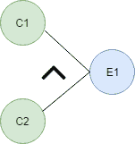
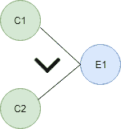
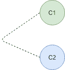
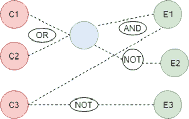

# 黑盒测试中的因果图

> 原文：<https://www.javatpoint.com/cause-and-effect-graph-technique-in-black-box-testing>

因果图属于黑盒测试技术，强调给定结果和影响结果的所有因素之间的关系。它用于编写动态测试用例。

当代码基于用户输入动态工作时，使用动态测试用例。例如，在使用电子邮件帐户时，在输入有效电子邮件时，系统会接受它，但是当您输入无效电子邮件时，它会抛出一条错误消息。在这种技术中，输入条件被赋予原因，这些输入条件的结果被赋予效果。

因果图技术是基于需求的集合，用于确定覆盖软件最大测试区域的最小可能测试用例。

因果图测试的主要优点是，它减少了测试执行的时间和成本。

这项技术旨在减少测试用例的数量，但仍然覆盖所有必要的测试用例，以获得最大的覆盖率，从而达到期望的应用质量。

因果图技术通过使用逻辑运算符“与”、“或”和“非”，将需求规格转换成输入和输出条件之间的逻辑关系。

## 因果图中使用的符号

**AND -** E1 是结果，C1 和 C2 是原因。如果 C1 和 C2 都是真的，那么 E1 效应也将是真的。

**OR -** 如果来自 C1 和 C2 的任何原因是真的，那么 E1 效应将是真的。

**NOT -** 如果原因 C1 是假的，那么效果 E1 就会是真的。

**互斥-** 只有一个原因为真时。

**我们试着用一些例子来理解这个技巧:**

### 情况:

第 1 列中的字符应该是 A 或 B，第 2 列中的字符应该是数字。如果两列都包含适当的值，则进行更新。如果第 1 列的输入不正确，即 A 和 B 都不正确，则显示信息 X。如果第 2 列中的输入不正确，即输入不是数字，则显示消息“是”。

*   文件必须更新，如果第一列中的字符是“A”或“B”，而第二列中的字符应该是数字。
*   如果第一列中的值不正确(字符既不是 A 也不是 B)，则将显示消息 X。
*   如果第二列中的值不正确(字符不是数字)，将显示消息 Y。

现在，我们将为上述情况制作一个因果图:

**原因为:**

*   C1 -第一栏中的字符是 A
*   C2 -第一栏中的字符是 B
*   C3 -第 2 列中的字符是数字！

**效果:**

*   E1 -更新完成(C1 或 C2)和 C3
*   E2 -显示按摩 X(不是 C1 也不是 C2)
*   E3 -显示按摩 Y(不是 C3)

其中“与”、“或”、“非”是逻辑门。

**效果 E1-更新制造-** 效果 E1 存在的逻辑是“ **(C1 或 C2)和 C3** ”。对于 **C1 或 C2** ，任何一个来自 C1 和 C2 的都应该是真的。对于逻辑**和 C3** (第 2 列字符应为数字)，C3 必须为真。换句话说，为了 E1 效应的存在，除了 C3，C1 和 C2 的任何一个都必须是真实的。我们可以在图中看到 C1 和 C2 是通过或逻辑连接的，而 E1 是通过与逻辑连接的。

**效果 E2 -显示按摩 X -** 效果 E2 存在的逻辑是“**不是 C1，也不是 C2** ”，也就是说 C1(第 1 列的人物应该是 A)和 C2(第 1 列的人物应该是 B)都应该是假的。换句话说，对于效应 E2 的存在，第 1 列中的字符不应该是 A 或 b。我们可以在图中看到， **C1 或 C2** 通过非逻辑与效应 E2 相连。

**效果 E3 -显示按摩 Y-** 效果 E3 存在的逻辑是“**不是 C3** ”，也就是说原因 C3(第 2 列的字符是数字)应该是假的。换句话说，对于效果 E3 的存在，第 2 列中的字符不应该是数字。我们可以在图中看到， **C3** 通过非逻辑与效果 E3 相连。

所以，这是给定情况下的因果图。测试人员需要将因果转换成逻辑语句，然后设计因果图。如果函数根据输入(原因)给出输出(效果)，那么它被认为是无缺陷的，如果没有这样做，那么它被发送到开发团队进行校正。

### 结论

步骤摘要:

*   画出影响和原因的圆圈。
*   先从效果开始，然后再来了解造成这种效果的原因。
*   最后画出互斥原因(通过一个结果和一个原因直接相连的互斥原因)。
*   使用逻辑门绘制动态测试用例。

* * *