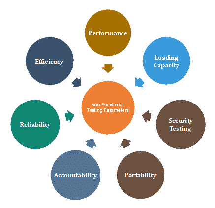

# 非功能测试

> 原文：<https://www.javatpoint.com/non-functional-testing>

非功能测试是一种软件测试类型，用于测试非功能参数，如软件的可靠性、负载测试、性能和责任。非功能测试的主要目的是根据非功能参数测试软件系统的读取速度。非功能性测试的参数在功能性测试之前从未测试过。

非功能测试与功能测试一样非常重要，因为它在客户满意度中起着至关重要的作用。

例如，非功能测试将测试有多少人可以同时在任何软件上工作。

## 为什么非功能测试

功能性和非功能性测试对于新开发的软件都是强制性的。功能测试检查内部功能的正确性，而非功能测试检查在外部环境中工作的能力。

它设置了软件安装、设置和执行的方式。用于内部研究和开发的测量和度量是在非功能测试下收集和产生的。

非功能测试给出了产品行为和使用技术的详细知识。它有助于降低软件的生产风险和相关成本。

## 在非功能测试下测试的参数

## 性能试验

性能测试消除了软件性能缓慢和有限背后的原因。软件的读取速度应该尽可能快。

对于性能测试，必须定义一个关于预期速度的结构良好且清晰的规范。否则，测试的结果(成功或失败)不会很明显。

## 负载测试

负载测试包括测试系统的负载能力。负载能力意味着越来越多的人可以同时在系统上工作。

## 安全测试

安全测试用于检测软件应用程序的安全缺陷。测试是通过调查系统架构和攻击者的心态来完成的。测试用例通过寻找最有可能发生攻击的代码区域来执行。

## 便携性测试

软件的可移植性测试用于验证系统是否可以在不同的操作系统上运行而不会出现任何错误。该测试还测试了当存在相同操作系统但不同硬件时软件的工作情况。

## 问责制测试

进行责任测试是为了检查系统是否正常运行。函数应该给出与其创建时相同的结果。如果系统给出了预期的输出，它就通过了测试，否则就失败了。

## 可靠性测试

可靠性测试假设软件系统是否在规定的条件下正常运行。系统必须运行特定的时间和进程数。如果系统在这些规定条件下出现故障，可靠性测试将失败。

## 效率测试

效率测试检查开发软件系统所需的资源数量，以及使用了多少资源。还包括这三点的测试。

*   软件系统必须满足客户的要求。
*   软件系统应该达到客户的规格。
*   应该做出足够的努力来开发一个软件系统。

## 非功能测试的优势

*   它提供了更高级别的安全性。安全性是一个基本特征，因为它可以保护系统免受网络攻击。
*   它确保了系统的加载能力，因此任何数量的用户都可以同时使用它。
*   它提高了系统的性能。
*   测试用例永远不会改变，所以不需要多次编写它们。
*   与其他测试过程相比，总体时间消耗更少。

## 非功能测试的缺点

*   每次软件更新时，都会再次执行非功能性测试。
*   由于软件更新，人们不得不付费重新检查软件；因此，软件变得非常昂贵。

* * *