# 集成测试

> 原文：<https://www.javatpoint.com/integration-testing>

集成测试是继单元测试之后软件测试过程的第二个层次。在这个测试中，软件的单元或单个组件在一个组中进行测试。集成测试级别的重点是在集成组件或单元之间交互时暴露缺陷。

[单元测试](https://www.javatpoint.com/unit-testing)使用模块进行测试，这些模块在集成测试中进行组合和测试。该软件由许多软件模块开发，这些模块由不同的编码员或程序员编码。集成测试的目标是检查所有模块之间通信的正确性。

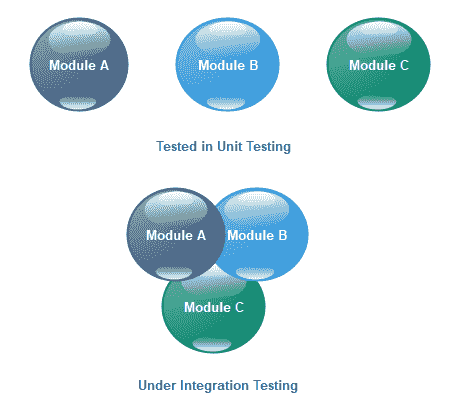

一旦所有组件或模块都独立工作，那么我们需要检查依赖模块之间的数据流称为**集成测试**。

让我们看一个银行应用程序的示例，如下图所示。

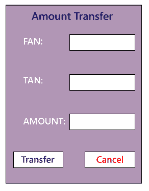

*   首先，我们将作为用户 **P** 登录进行金额转账并发送 Rs200 金额，确认消息应在屏幕上显示为**金额转账成功**。现在以 P 身份注销，以用户 **Q** 身份登录，进入金额余额页面，查看该账户余额=当前余额+已收余额。因此，集成测试是成功的。
*   此外，我们检查 P 用户帐户中的余额是否减少了 200 卢比。
*   点击交易，在 P 和 Q 中，应显示关于金额转账的数据和时间的信息。

## 集成测试指南

*   只有在应用程序的每个模块都完成了功能测试之后，我们才会进行集成测试。
*   我们总是通过一个模块接一个模块地挑选来进行集成测试，以便遵循一个适当的顺序，并且我们不会错过任何集成场景。
*   首先，确定测试用例策略，通过该策略可以根据测试数据准备可执行的测试用例。
*   检查应用程序的结构和体系结构，确定首先测试它们的关键模块，并确定所有可能的场景。
*   设计测试用例来详细验证每个接口。
*   选择测试用例执行的输入数据。输入数据在测试中起着重要的作用。
*   如果我们发现任何错误，那么将错误报告传达给开发人员，修复缺陷并重新测试。
*   执行**正负积分测试**。

在这里**阳性**测试意味着如果总余额为 15，000 卢比，我们正在转账 1500 卢比，并检查转账金额是否正常。如果是的话，那么测试就通过了。

而**阴性检测**的意思是，如果总余额为 15，000 卢比，我们正在转账 20，000 卢比，检查金额转账是否发生，如果没有发生，则检测为通过。如果发生这种情况，那么代码中有一个错误，我们将把它发送给开发团队来修复这个错误。

#### 注意:这个世界上的任何应用程序都必须进行功能测试，而集成测试只有在模块相互依赖的情况下才会进行。每个集成场景都必须有源→数据→目的地。只有当数据保存在目标中时，任何场景都可以被称为集成场景。

**例如**:在 Gmail 应用中，**来源**可以是**撰写**、**数据**可以是**邮件**、**目的地**可以是**收件箱**。

## 集成测试示例

让我们假设我们有一个 **Gmail** 应用程序，我们在其中执行集成测试。

首先，我们将在**登录页面**上进行**功能测试**，包括**用户名、密码、提交、取消**按钮等各种组件。那么只有我们可以执行集成测试。

不同的集成场景如下:

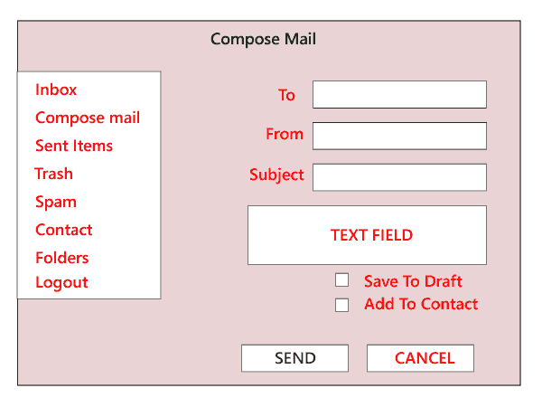

**场景 1:**

*   首先，我们以 **P** 用户身份登录，点击**撰写**邮件，对具体组件进行功能测试。
*   现在我们点击**发送**，同时查看**保存草稿**。
*   之后，我们发送一封**邮件**到 **Q** ，并在 P 的**发送项目**文件夹中进行验证，以检查发送邮件是否在那里。
*   现在，我们将**以 P 身份注销**并以 Q 身份登录，然后转到**收件箱**并验证邮件是否已到达。

**Secanrios2:** 我们还对**垃圾邮件**文件夹进行了集成测试。如果特定联系人已被标记为垃圾邮件，则该用户发送的任何邮件都应进入垃圾邮件文件夹，而不是收件箱。

#### 注意:我们将对所有功能进行功能测试，例如发送邮件、收件箱等。

如下图所示，我们将对所有**文本字段和每个功能**执行功能测试。然后对相关功能进行**集成测试**。我们先测试**添加用户、用户列表、删除用户、编辑用户、**然后**搜索用户**。

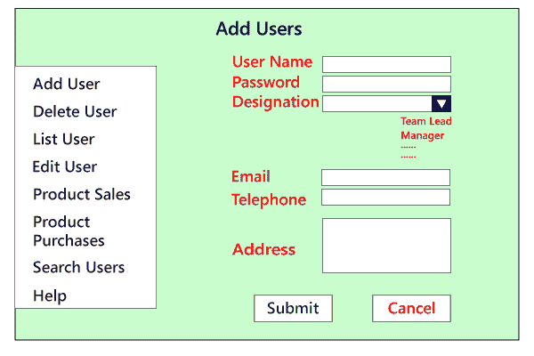

**注:**

*   有一些特性，我们可能只执行**功能测试**，还有一些特性，我们基于特性的需求执行**功能**和**集成测试**。
*   **优先级排序是必不可少的，**我们应该在所有阶段都执行，这意味着我们将打开应用程序并选择需要首先测试的功能。然后转到该功能，选择必须首先测试的组件。转到这些组件，并确定首先要输入的值。
    不要到处应用同样的规则，因为测试逻辑因特性而异。
*   在执行测试时，我们应该完全测试一个特性，然后只进行另一个功能。
*   在这两个特征中，我们必须只进行**正积分检测**或者同时进行**正积分和**负积分检测，这也取决于所需要的特征。

## 集成测试背后的原因

尽管软件应用程序的所有模块都已经在单元测试中进行了测试，但由于以下原因，错误仍然存在:

1.  每个模块都是由单独的软件开发人员设计的，他们的编程逻辑可能与其他模块的开发人员不同。集成测试对于确定软件模块的工作变得至关重要。
2.  检查软件模块与数据库的交互是否错误。
3.  需求可以在模块开发时改变或增强。这些新需求可能不会在单元测试级别进行测试，因此集成测试成为强制性的。
4.  软件模块之间的不兼容性会产生错误。
5.  测试硬件与软件的兼容性。
6.  如果模块之间的异常处理不充分，就会产生错误。

## 集成测试技术

任何测试技术(黑盒、白盒和灰盒)都可以用于集成测试；下面列出了一些:

### 黑箱测试

*   状态转移技术
*   决策表技术
*   边界值分析
*   全对测试
*   因果图
*   等价划分
*   猜错

### 白盒测试

*   数据流测试
*   控制流测试
*   分支覆盖测试
*   决策覆盖测试

## 集成测试的类型

集成测试可以分为两个部分:

*   **增量集成测试**
*   **非增量集成测试**

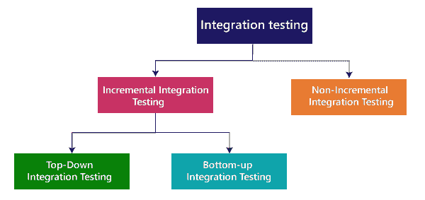

### 增量方法

在增量方法中，模块是按升序一个接一个或根据需要添加的。所选模块必须逻辑相关。一般是增加两个或两个以上的模块并进行测试，以确定功能的正确性。这个过程一直持续到所有模块测试成功。

**或**

在这种类型的测试中，依赖模块之间有很强的关系。假设我们采用两个或更多模块，并验证它们之间的数据流工作正常。如果是，则添加更多模块并再次测试。

**例如:**假设我们有一个 Flipkart 应用程序，我们将执行增量集成测试，应用程序的流程如下:

Flipkart→登录→主页→搜索→添加购物车→支付→注销

增量集成测试通过其他方法进行:

*   自上而下的方法
*   自下而上的方法

### 自上而下的方法

自上而下的测试策略处理用较低级别模块测试较高级别模块的过程，直到成功完成所有模块的测试。主要的设计缺陷可以被早期发现和修复，因为关键模块首先被测试。在这种类型的方法中，我们将递增地或一个接一个地添加模块，并以相同的顺序检查数据流。

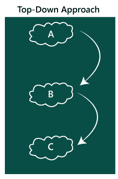

在自上而下的方法中，我们将确保我们添加的模块是上一个模块的**子模块，如子模块 C 是子模块 B 的子模块**等等，如下图所示:

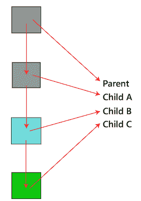

**优势:**

*   缺陷的识别是困难的。
*   早期的原型是可能的。

**缺点:**

*   由于存根数量很大，这变得相当复杂。
*   较低级别的模块测试不充分。
*   首先对关键模块进行测试，以便减少缺陷的机会。

### 自下而上的方法

自下而上的测试策略处理用较高级模块测试较低级模块的过程，直到成功完成所有模块的测试。顶层关键模块最后被测试，所以可能会导致缺陷。或者我们可以说，我们将从底部**到顶部**添加模块，并以相同的顺序检查数据流。

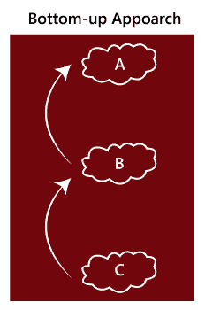

在自下而上的方法中，我们将确保我们正在添加的模块**是上一个模块**的父模块，如下图所示:

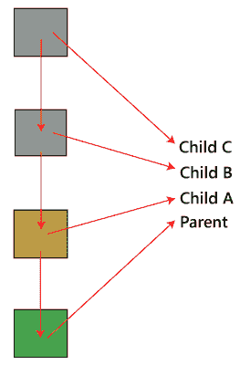

**优势**

*   缺陷的识别很容易。
*   不需要等待所有模块的开发，因为这样可以节省时间。

**缺点**

*   关键模块是最后测试的，因此会出现缺陷。
*   没有早期原型的可能。

在这种情况下，我们有一种称为**混合测试**的加法方法。

### 混合测试方法

在这种方法中，**自顶向下**和**自底向上**两种方法结合起来进行测试。在这个过程中，顶层模块用低层模块测试，低层模块同时用高层模块测试。因为每个模块接口都经过测试，所以出现缺陷的可能性较小。

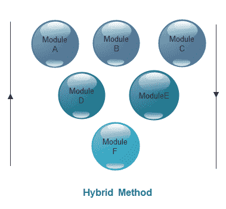

**优势**

*   混合方法提供了自下而上和自上而下方法的特点。
*   这是最节省时间的方法。
*   它提供所有模块的完整测试。

**缺点**

*   这种方法需要更高的浓度，因为该过程同时在两个方向进行。
*   复杂的方法。

### 非增量集成测试

当数据流非常复杂，很难找到谁是父母，谁是孩子的时候，我们会采用这种方法。在这种情况下，我们将在任何模块中创建数据，并在所有其他现有模块上运行，检查数据是否存在。因此，它也被称为**大爆炸法**。

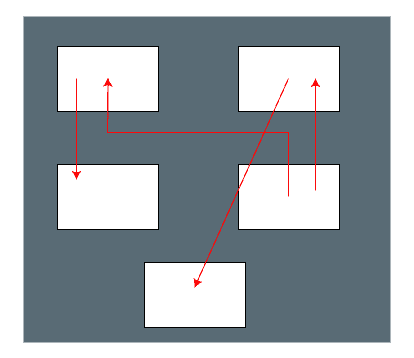

### 大爆炸法

在这种方法中，测试是通过一次集成所有模块来完成的。它对于小的软件系统来说是方便的，如果用于大的软件系统识别缺陷是困难的。

由于该测试可以在所有模块完成后进行，因此测试团队执行该过程的时间较少，因此内部链接的接口和高风险的关键模块很容易被遗漏。

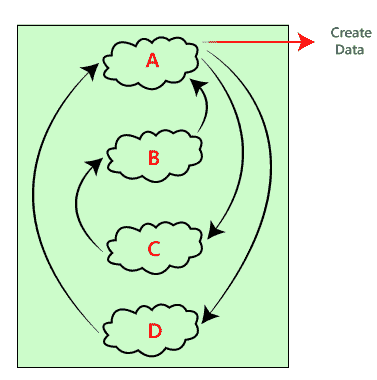

**优势:**

*   它对于小型软件系统来说很方便。

**缺点:**

*   缺陷的识别很困难，因为找到错误的来源是一个问题，我们不知道错误的来源。
*   小模块容易漏掉。
*   为测试提供的时间非常少。
*   我们可能会错过测试一些接口。

让我们看一些例子来更好地理解非增量集成测试或大爆炸方法:

**示例 1**

在下面的例子中，开发团队开发应用程序，并将其发送给测试团队的首席执行官。然后，首席执行官将登录应用程序，生成用户名和密码，并向经理发送邮件。之后，首席执行官会告诉他们开始测试应用程序。

然后，管理人员管理用户名和密码，生成用户名和密码，并将其发送给**测试主管**。而**测试引线**会将其发送给**测试工程师**进行进一步测试。这个从 CEO 到测试工程师的顺序是**自上而下的增量集成测试。**

同样，测试工程师完成测试后，向**测试负责人**发送报告，然后由**经理**提交报告，经理再向 **CEO** 发送报告。这个过程被称为**自下而上的增量集成测试**，如下图所示:

#### 注:增量集成测试和非增量集成测试的结合被称为三明治测试。

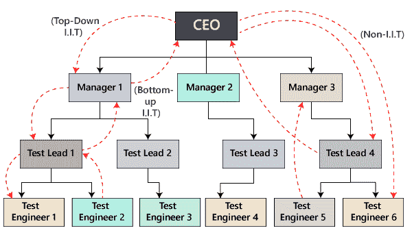

**示例 2**

下面的例子演示了 **Gmail 收件箱**的一个主页，在这里我们点击**收件箱**链接，我们被移动到收件箱页面。这里我们要做**非增量集成测试**因为没有父子概念。

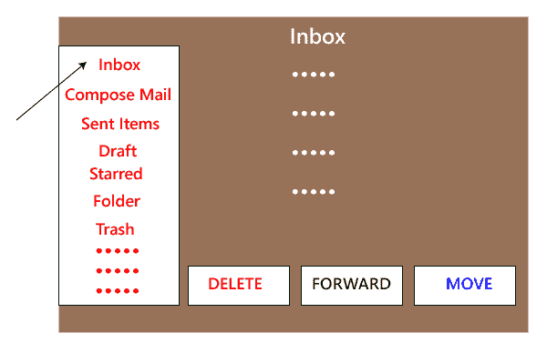

**注**

**存根和驱动程序**

**存根**是一个虚拟模块，它接收数据并创建大量可能的数据，但它的表现就像一个真实的模块。当一个数据从模块 P 发送到 Stub Q 时，它接收数据而不确认和验证它，并产生给定数据的估计结果。

驱动程序的功能用于验证来自 P 的数据并将其发送到存根，还检查来自存根的预期数据并将其发送到 P。

**驱动程序**是设置测试环境并负责通信、评估结果和发送报告的驱动程序。我们在测试过程中从不使用存根和驱动程序。

在 **[白盒测试](https://www.javatpoint.com/white-box-testing)中，自下而上的集成测试**是理想的，因为编写驱动程序是可访问的。在 **[黑盒测试](https://www.javatpoint.com/black-box-testing)** 中，不优先考虑任何测试，因为它取决于应用。

* * *