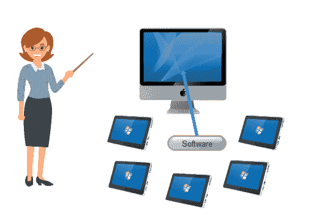
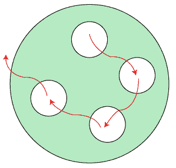
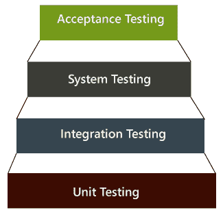
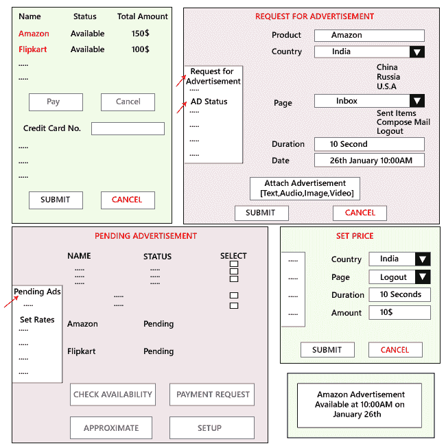
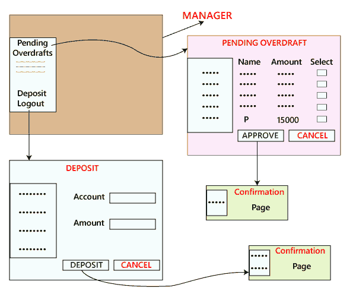
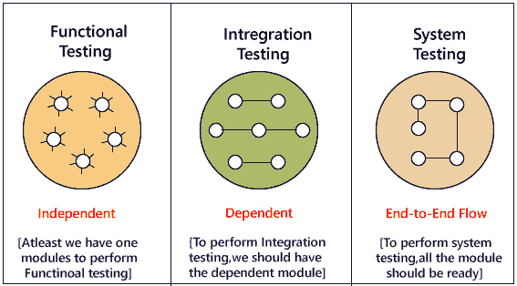
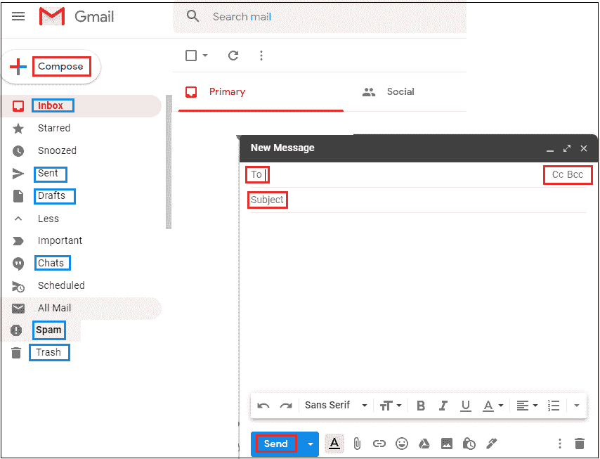

# 系统试验

> 原文：<https://www.javatpoint.com/system-testing>

系统测试包括测试完全集成的软件系统。一般来说，计算机系统是由软件集成而成的(任何软件都只是计算机系统的一个单一元素)。该软件以单元形式开发，然后与其他软件和硬件接口，以创建一个完整的计算机系统。换句话说，计算机系统由一组执行各种任务的软件组成，但只有软件不能执行任务；因为软件必须与兼容的硬件接口。系统测试是一系列不同类型的测试，目的是根据需求来练习和检查集成软件计算机系统的全部工作。

以用户身份检查应用程序或软件的端到端流程称为**系统测试**。在这种情况下，我们导航(浏览)应用程序的所有必要模块，检查终端功能或终端业务是否正常工作，并测试整个系统的产品。

是**端到端测试**，测试环境和生产环境类似。

[软件测试](https://www.javatpoint.com/software-testing-tutorial)有四个级别:[单元测试](https://www.javatpoint.com/unit-testing)、[集成测试](https://www.javatpoint.com/integration-testing)、系统测试和[验收测试](https://www.javatpoint.com/acceptance-testing)，均用于测试目的。用于测试单个软件的单元测试；集成测试用于测试一组软件单元，系统测试用于测试整个系统，验收测试用于测试业务需求的可接受性。这里我们讨论的是系统测试，这是第三级测试。

## 测试级别的层次结构

软件测试主要有两种广泛使用的方法，一种是**白盒测试**使用内部编码设计测试用例，另一种是[黑盒测试](https://www.javatpoint.com/black-box-testing)使用 GUI 或用户视角开发测试用例。

*   白盒测试
*   黑盒测试

**系统测试属于黑盒测试**，因为它包括软件外部工作的测试。测试遵循用户的视角来识别微小的缺陷。

系统测试包括以下步骤。

*   验证应用程序的输入功能，以测试它是否产生预期的输出。
*   通过包括外部外围设备来检查各种组件之间的相互作用，从而对集成软件进行测试。
*   对整个系统进行端到端测试。
*   通过 auser 的经验对应用程序进行行为测试

## 系统测试示例

假设我们打开一个应用程序，比如说**www.rediff.com**，在那里我们可以看到一个广告显示在主页的顶部，它会在那里停留几秒钟，然后消失。这些类型的广告由广告管理系统(AMS)完成。现在，我们将对这类领域进行系统测试。

以下应用程序以下列方式工作:

*   假设亚马逊希望在 1 月 26 日上午 10 点整在 Rediff 的印度国家主页上展示一则促销广告。
*   然后，销售经理登录网站，创建一个日期为上述日期的广告请求。
*   他/她附加一个可能是广告的图像文件或视频文件的文件并应用。
*   第二天，Rediffmail 的 AMS 管理器登录到应用程序中，并验证等待的广告请求。
*   AMS 经理将检查那些亚马逊广告请求是否未决，然后他/她将检查空间是否在特定的日期和时间可用。
*   如果有空间，他/她会评估以每秒 15 美元的速度投放广告的成本，10 秒钟的广告总成本大约为 150 美元。
*   AMS 经理点击付款请求，并将估计值连同付款请求一起发送给亚马逊经理。
*   然后亚马逊经理登录广告状态并确认付款请求，他/她按照所有细节进行付款，并点击**提交**和**支付**
*   一旦雷迪夫的 AMs 经理收到金额，他/她将在雷迪夫邮件的主页上设置特定日期和时间的广告。

各种系统测试场景如下:

**场景 1:** 第一个测试是一般场景，正如我们上面讨论的。测试工程师将对底层情况进行系统测试，在这种情况下，亚马逊经理为广告创建一个请求，并且广告在特定的日期和时间使用。

**场景 2:** 假设亚马逊经理觉得 AD 空间太贵，取消了请求。同时，Flipkart 在 1 月 26 日上午 10:00 请求广告位。那么亚马逊的请求已经取消了。因此，Flipkart 的推广广告必须安排在 1 月 26 日上午 10 点。

毕竟，请求和付款已经做出。现在，如果亚马逊改变主意，他们觉得他们准备在 1 月 26 日上午 10 点付款，这应该是给的，因为 Flipkart 已经使用了那个空间。因此，亚马逊必须开放另一个日历来预订。

**场景 3:** 在这种情况下，首先我们以 AMS 管理器的身份登录，然后点击设置价格页面，将注销页面上 AD 空间的价格设置为每秒 10 美元。

然后以亚马逊经理的身份登录，并在注销页面上选择张贴广告的日期和时间。付款应该是 100 美元的 10 秒钟的广告在雷迪夫邮件注销页面。

#### 注意:一般来说，每个测试工程师只在他们指定的模块上进行功能、集成和系统测试。

如下图所示，我们有三个不同的模块，如**贷款、销售和透支**。这些模块将由他们指定的测试工程师进行测试，只是因为如果数据在这些模块或场景之间流动，那么我们需要明确它将进入哪个模块，测试工程师应该检查那个东西。

让我们假设这里我们正在对利息估算进行系统测试，其中客户第一次和第二次都使用透支。

在此特定示例中，我们有以下场景:

**场景 1**

*   首先，我们将以用户身份登录；让我们看看 P，并申请透支 Rs15000，点击申请，然后注销。
*   之后我们以经理身份登录，审批 P 透支，注销。
*   我们将再次以 P 身份登录并检查透支余额；Rs15000 应存入并注销。
*   将服务器日期修改为未来 30 天。
*   以 P 身份登录，检查透支余额为 15000+ 300+200=15500，然后注销
*   以经理身份登录，点击存款，存款 Rs500，注销。
*   以 P 身份登录，偿还透支金额，查看透支余额，为 Rs 零。
*   申请提前透支作为两个月工资。
*   经经理批准，第一次处理费用将计入贷方金额和利息。
*   登录用户→首页【贷款、销售、透支】→透支页面【金额透支、申请透支、偿还透支】→申请
*   登录管理器→首页【贷款、销售、透支】→透支页面【金额透支、申请透支、偿还透支、审批透支】→审批页面→审批申请。
*   以用户 P 身份登录→首页【贷款、销售、透支】→透支页面【金额透支、申请透支、偿还透支】→已审批透支→金额透支
*   以用户 P 身份登录→首页【贷款、销售、透支】→透支页面【金额透支、申请透支、偿还透支】→偿还透支→带手续费+利息金额。

**场景二**

现在，我们测试另一个场景，银行提供一个报价，说第一次拿 45000 卢比作为透支的客户不会收取手续费。客户第三次选择再次透支时，手续费不予退还。

我们要测试第三种情况，客户第一次拿走了 45000 卢比的透支款，还要验证透支款在第三次申请再次透支后还了余额。

**场景三**

在这一点上，我们会反映申请被所有客户普遍使用，突然银行决定对新客户降低手续费至 100 卢比，我们对新客户进行了透支测试，检查是否只接受 100 卢比。

但是我们在需求中得到冲突，假设客户已经申请了 15000 卢比作为透支，当前的处理费用为 200 卢比。在经理尚未批准之前，银行将处理费降至 100 卢比。

现在，我们必须测试对待定客户的透支收取什么处理费用。测试团队不能假设任何事情；他们需要与业务分析师或客户沟通，了解他们在这些情况下想要什么。

因此，如果客户提供了第一套需求，我们必须提出最大可能的场景。

## 系统测试的类型

系统测试分为 50 多种类型，但是软件测试公司通常使用其中的一些。下面列出了这些内容:

### 回归测试

回归测试是在系统测试下执行的，以确认和识别系统中是否存在由于系统其他部分的修改而导致的任何缺陷。它确保了在开发过程中所做的任何更改都没有引入新的缺陷，并且也提供了保证；随着时间的推移，旧的缺陷不会随着新软件的增加而存在。

有关回归测试的更多信息，请参考以下链接:

[https://www.javatpoint.com/regression-testing](https://www.javatpoint.com/regression-testing)

### 负载测试

负载测试在系统测试下进行，以明确系统是否能在实时负载下工作。

### 功能测试

对系统进行功能测试是为了发现系统中是否有任何缺失的功能。Tester 列出了应该在系统中的重要功能，这些功能可以在功能测试期间添加，并且应该提高系统的质量。

### 恢复测试

系统的恢复测试是在系统测试下进行的，以确认系统的可靠性、可信度和可问责性，所有这些都取决于系统的恢复技能。它应该能够从所有可能的系统崩溃中成功恢复。

在这个测试中，我们将测试应用程序，以检查它从崩溃或灾难中恢复的情况。

恢复测试包含以下步骤:

*   每当软件崩溃时，它不应该消失，而应该写入**崩溃日志消息或错误日志消息**，其中应该提到崩溃的原因。**例如**:**C://程序文件/QTP/Cresh.log**
*   它应该在消失之前杀死自己的程序。比如，在 Windows 中，我们有任务管理器来显示哪个进程正在运行。
*   我们将引入 bug 并使应用程序崩溃，这意味着有人将引导我们了解应用程序将如何以及何时崩溃。或者**通过体验**，在参与产品工作几个月后，我们可以知道应用程序将如何以及何时崩溃。
*   重新打开应用程序；应用程序必须使用早期设置重新打开。

**例如**:假设我们正在使用谷歌 chrome 浏览器，如果断电，那么我们打开系统重新打开谷歌 Chrome，我们会收到一条消息询问我们是要**开始新的会话**还是**恢复之前的会话**。对于任何开发的产品，开发人员编写一个恢复程序，描述软件或应用程序崩溃的原因，崩溃日志消息是否被写入等。

### 迁移测试

执行迁移测试是为了确保如果系统需要在新的基础架构中进行修改，那么应该毫无问题地进行修改。

### 可用性测试

该测试的目的是确保系统对用户非常熟悉，并且满足其目标。

有关可用性测试的更多信息，请参考以下链接:

[https://www.javatpoint.com/usability-testing](https://www.javatpoint.com/usability-testing)

### 软件和硬件测试

本次系统测试旨在检查[硬件](https://www.javatpoint.com/hardware)和[软件](https://www.javatpoint.com/software)的兼容性。硬件配置必须与软件兼容，才能正常运行。兼容性通过提供硬件和软件之间的交互来提供灵活性。

## 为什么系统测试很重要？

*   系统测试提供了百分之百的系统性能保证，因为它涵盖了系统的端到端功能。
*   它包括系统软件架构和业务需求的测试。
*   即使在生产之后，它也有助于减轻实时问题和错误。
*   系统测试使用现有系统和新系统来输入两者中的相同数据，然后比较添加的功能和现有功能的差异，以便用户能够理解系统新添加功能的好处。

## 测试任何应用程序

在这里，我们将测试 **Gmail** 应用程序，以了解**的功能、集成和系统测试**是如何工作的。

假设我们要测试 **Gmail** 应用的**登录、撰写、草稿、收件箱、已发送项目、垃圾邮件、聊天、帮助、注销**等各个模块。

我们先对所有模块进行[功能测试](https://www.javatpoint.com/functional-testing)，然后只有我们可以进行集成测试和系统测试。

在功能测试中，至少我们有一个模块来执行功能测试。这里我们有一个组合模块，在这里我们执行功能测试。

化合物

撰写模块的不同组件有**至、抄送、密件抄送、主题、附件、正文、已发送、保存至草稿、关闭。**

*   首先，我们将对**至**进行功能测试

| 投入 | 结果 |
| **正输入** |  |
| [【邮件保护】](/cdn-cgi/l/email-protection) | 接受 |
| [【邮件保护】](/cdn-cgi/l/email-protection) | 接受 |
| [【邮件保护】](/cdn-cgi/l/email-protection) | 接受 |
| **负输入** |  |
| [【邮件保护】](/cdn-cgi/l/email-protection) | 错误 |
| [【邮件保护】](/cdn-cgi/l/email-protection) | 错误 |

*   对于 **CC** & **BCC** 组件，我们将采用与 **To 组件相同的输入。**
*   对于**主题**组件，我们将采用以下输入和场景:

| 投入 | 结果 |
| **正输入** |  |
| 输入最大字符数 | 接受 |
| 输入最小字符 | 接受 |
| 空白区 | 接受 |
| 统一资源定位器 | 接受 |
| 复制和粘贴 | 接受 |
| **负输入** |  |
| 交叉最大位数 | 错误 |
| 粘贴图像/视频/音频 | 错误 |

*   **最大字符**
*   **最小字符**
*   **Flash 文件(GIF)**
*   **微笑**
*   **格式**
*   **空白**
*   **复制&粘贴**
*   **超链接**
*   **签名**

*   对于**附件**组件，我们将借助以下场景对组件进行测试。
    *   **最大文件大小**
    *   **不同的文件格式**
    *   **文件总数**
    *   **同时附加多个文件**
    *   **拖动&放下**
    *   **无附件**
    *   **删除附件**
    *   **取消上传**
    *   **查看附件**
    *   **浏览器不同位置**
    *   **附加打开的文件**
*   对于**发送的**组件，我们会写下整个字段，点击**发送的**按钮，确认消息；**消息发送成功**必须显示。
*   对于**保存到草稿**组件，我们将写入整个字段并点击**保存到草稿**，并且必须显示确认消息。
*   对于**取消**组件，我们将写入所有字段并点击取消按钮，**窗口将关闭**或移至**保存草稿**或所有字段必须刷新。

一旦我们完成了对组合模块的功能测试，我们将对 Gmail 应用程序的各个模块进行集成测试:

**登录**

*   首先，我们将输入登录应用程序的用户名和密码，并在主页上检查用户名。

化合物

*   撰写邮件，发送邮件，并在“已发送邮件[发件人]”中检查邮件
*   撰写邮件，发送邮件并检查收件人[收件箱]中的邮件
*   撰写邮件，发送邮件并检查自己[收件箱]中的邮件
*   撰写邮件，单击另存为草稿，然后签入发件人草稿。
*   撰写邮件，向其发送无效 id(有效格式)，并检查未送达的邮件。
*   撰写邮件、关闭和签入草稿。

**收件箱**

*   选择邮件、回复并签入已发送邮件或收件人收件箱。
*   在收件箱中选择要回复的邮件，另存为草稿并签入草稿。
*   选择邮件，然后将其删除，并检入废纸篓。

**发送项目**

*   选择邮件、已发送项目、回复或转发，并签入已发送项目或收件人收件箱。
*   选择邮件、已发送项目、回复或转发、另存为草稿，并在草稿中进行验证。
*   选择邮件，删除它，然后检入废纸篓。

**草稿**

*   选择电子邮件草稿，转发并选中已发送项目或收件箱。
*   选择电子邮件草稿，删除并在废纸篓中验证。

聊天

*   与保存在接收者收件箱中的离线用户聊天。
*   与用户聊天，并在聊天窗口中验证。
*   与用户聊天并查看聊天记录。

#### 注意:在测试过程中，我们需要等待一段特定的时间，因为系统测试只能在所有模块准备就绪并执行功能和集成测试时执行。

* * *