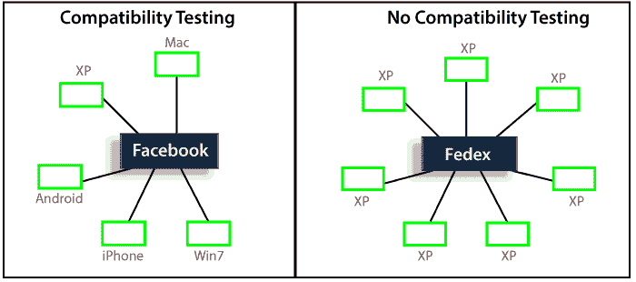
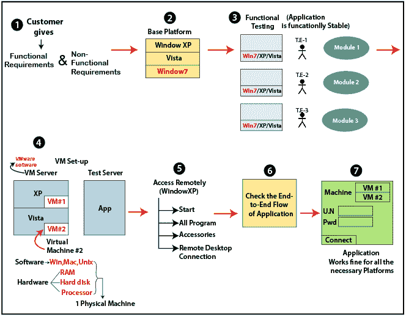
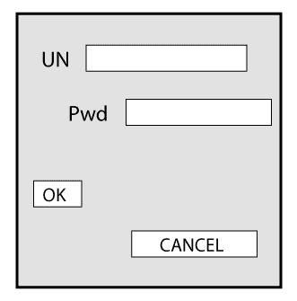
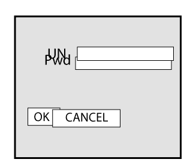
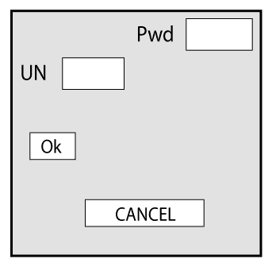
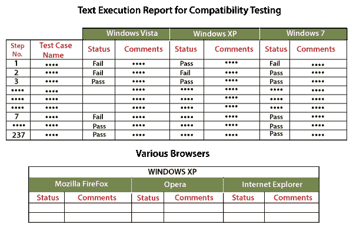

# 兼容性测试

> 原文：<https://www.javatpoint.com/compatibility-testing>

在本节中，我们将了解什么是兼容性测试，为什么要使用它，什么时候应该执行它，兼容性测试的类型，兼容性测试过程，以及兼容性错误和工具。

## 什么是兼容性测试？

这是非功能测试的一部分。

> 在不同的软件、硬件平台、网络和浏览器上检查应用的功能被称为兼容性测试。

## 我们为什么使用兼容性测试？

一旦应用稳定了，我们就把它移到生产中，它可能会被不同平台上的多个用户使用或访问，他们可能会面临一些兼容性问题，为了避免这些问题，我们做了一轮兼容性测试。

## 我们应该什么时候进行兼容性测试？

一般来说，只有当应用或软件功能稳定时，我们才会进行兼容性测试。

#### 注:
不是每个应用都做；我们将只为我们无法控制用户使用的平台的应用这样做。

## 兼容性测试的类型

以下是兼容性测试的类型:

*   **软件**
*   **硬件**
*   **网络**
*   **移动**

### 软件

这里的软件是指不同的操作系统(Linux、windows 和 Mac)，还要检查 Win98、Window 7、Window 10、Vista、Window XP、Window 8、UNIX、Ubuntu 和 Mac 等不同版本操作系统上的软件兼容性。

并且，我们有两种类型的版本兼容性测试，如下所示:

*   **前向兼容性测试:**在新版本或最新版本上测试软件或应用。
    **例如:**最新版平台(软件)
    **Win 7→Win 8→Win 8.1→Win 10**
*   **向后兼容性测试:**在旧版本或以前的版本上测试软件或应用。
    **例如:**
    Window XP→Vista→Win 7→Win 8→Win 8.1

以及**谷歌 Chrome、火狐、**和**互联网浏览器**等不同的浏览器。

### 五金器具

该应用兼容不同的大小，如内存、硬盘、处理器和显卡等。

### 移动的

检查应用是否与 iOS、安卓等移动平台兼容。

### 网络

检查软件在不同网络参数(如运行速度、带宽和容量)下的兼容性。

## 测试兼容性测试最具挑战性的部分是什么？

在执行兼容性测试时，最具挑战性的事情是确定需要测试的必要需求。

我们不能在所有现有平台上进行测试，因为这将是一个耗时的过程。

因此，我们只选择最终用户常用的平台。

## 兼容性测试过程

这里，我们正在执行操作系统兼容性测试过程。

*   首先，客户会给出功能性需求和非功能性需求。
*   得到非功能需求后，一个基础平台会根据最常用的平台来决定。
*   之后，测试工程师将在基础平台上开始功能测试，直到应用功能稳定。
*   我们必须在不同的平台上测试应用，因此为此，我们有一个 VMware 软件。

#### 注 1:
VMware 软件:在 VMware 的帮助下，我们可以将一个物理机分成多个虚拟机，可以同时访问。

*   为了进行兼容性测试，我们将使用虚拟机服务器来安装所有必要的操作系统和浏览器，并使用远程桌面连接来访问该服务器。
*   我们远程访问 VMware set，之后，测试工程师将在平台上进行一轮兼容性测试，并检查端到端流程。
*   端到端流程将继续进行，直到应用稳定，应用在所有必要的平台上正常工作并移交给客户。

#### 注 2:

*   For the browser compatibility test, we don't need VMware settings, because multiple browsers can be installed on one machine or accessed at the same time.
*   In the case of different versions of the same browser, we must use VMware set up, because multiple versions of browsers cannot be accessed from a single system at the same time.
*   We can do software compatibility tests on different platforms.

## 兼容性测试错误/问题

这些 bug 发生在一个平台上，但不会发生在另一个平台上。

通常，兼容性缺陷是用户界面问题，一些用户界面问题如下:

*   对齐问题
*   重叠问题
*   分散发行
*   观感问题

### 对齐问题

对齐问题是页面元素没有以正确的格式对齐，如下图所示:

### 重叠问题

当一个属性与另一个属性重叠时，这可能发生在我们试图在不同的平台、浏览器上打开应用时，如下图所示:

### 分散发行

当测试工程师对应用进行兼容性测试时，该应用并不兼容所有浏览器和平台，这就是为什么会出现分散的问题，如下图所示:

在不同平台上测试功能、集成和端到端流程是我们在兼容性测试中所做的。

**兼容性问题:**当应用功能在一个操作系统中不工作，但在其他操作系统中工作正常时。发生这种情况是因为开发人员编写的程序不是只在一个平台上运行，而是在所有其他平台上都运行良好。

**功能问题:**某个功能在所有操作系统/平台中不工作时。这也被称为功能缺陷问题。

对于兼容性测试，测试执行报告如下所示:

## 兼容性测试工具

一些最常用的兼容性测试工具如下:

*   **LambdaTest**
*   **浏览返回**
*   **浏览商场**
*   **测试弹**

### LambdaTest

它是云中的开源浏览器兼容性测试工具。在这个工具的帮助下，我们可以在几乎任何移动浏览器和桌面浏览器上测试我们的 web 应用。LambdaTest 有一个截图功能，可以让我们对网页进行整页截图。

在这个工具中，我们可以在真正的浏览器上测试我们的应用，用户有大量的移动和桌面浏览器选项来检查应用的兼容性。

### 浏览器返回

这个工具帮助我们测试网站和移动应用在多个浏览器和平台上的兼容性。

在这种情况下，我们可以在各种浏览器中测试一个网络应用，并在所有移动设备中测试安卓和 iOS 等移动应用。

BrowserStack 工具的主要产品有 Live、Automate、App Live、App Automate，在这些工具的帮助下，我们可以维持成本。

这些工具帮助我们减少与测试相关的时间、价格和维护开销。

### 浏览器模式

该工具可以在不同的操作系统上运行应用，如 Linux、Windows 和 macOS，是一个跨浏览器的测试工具。

它用于在所有移动浏览器和桌面上测试应用，我们可以直接在本地机器和本地网络中使用它。

我们可以在没有任何网络延迟的情况下执行回归和可视化测试，我们还可以针对许多桌面和移动浏览器录制和播放自动化测试。

### 测试机器人

该工具用于在各种浏览器上执行测试，如火狐、Chrome、Edge、IE、Safari 等。在这种情况下，我们可以比较来自多个浏览器和平台的截图，并测试应用的响应布局。

它将为自动化测试的即时使用提供大量的浏览器版本。

* * *