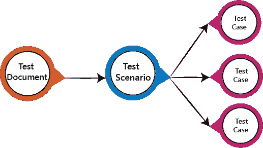

# 测试场景

> 原文：<https://www.javatpoint.com/test-scenario>

测试场景是一个测试用例的详细文档，它在 liner 语句中涵盖了软件应用程序的端到端功能。liner 语句被视为一个场景。测试场景是可测试需求的高级分类。这些需求根据模块的功能进行分组，并从用例中获得。

在测试场景中，由于有许多相关的测试用例，所以有一个详细的测试过程。在执行测试场景之前，测试人员必须考虑每个场景的测试用例。

在测试场景中，测试人员需要把自己放在用户的位置上，因为他们在用户的角度下测试软件应用程序。场景的准备是最关键的部分，需要向客户、利益相关者或开发人员寻求建议或帮助来准备场景。

**注:**

测试场景永远不能用于文本执行过程，因为它不包括导航步骤和输入。

这些是高级文档，讨论使用应用程序的所有可能的组合或多种方式或组合，测试场景的主要目的是理解应用程序的整体流程。

## 如何编写测试场景

作为测试人员，按照以下步骤创建测试场景-

*   阅读被测软件的需求文档，如业务需求规范、系统需求规范和功能需求规范。
*   确定每个需求的所有技术方面和目标。
*   找到用户操作软件的所有可能方式。
*   确定由于哪个系统可能被滥用而导致的所有可能情况，并检测可能是黑客的用户。
*   阅读需求文档并完成预定分析后，列出各种测试场景，以验证软件的每个功能。
*   列出所有可能的测试场景后，创建一个可追溯性矩阵，找出每一个需求是否都有相应的测试场景。
*   项目主管审查所有方案。随后，项目的其他利益相关者会对它们进行评估。

## 测试场景的特征

*   测试场景是一个指导测试人员进行测试序列的线性语句。
*   测试场景降低了产品的复杂性和重复性。
*   测试场景意味着详细地谈论和思考测试，但是用线性语句来编写它们。
*   这是一系列的操作。
*   当测试人员没有足够的时间编写测试用例，并且团队成员同意详细的线性场景时，测试场景就变得更加重要。
*   测试场景是一项节省时间的活动。
*   它提供了简单的维护，因为测试场景的添加和修改是简单和独立的。

**注:**

当我们编写测试场景时，必须遵循一些规则:

*   请务必列出用户最常用的功能和模块。
*   我们总是通过一个模块接一个模块地挑选来开始场景，以便遵循适当的顺序，并且我们不会错过任何模块级别。
*   通常，场景是模块级的。
*   删除场景应该永远是最后的选择，我们将浪费大量时间再次创建数据。
*   应该用简单的语言写。
*   每个场景应该写在一行或最多两行，而不是段落中。
*   每个场景都应该由操作和检查组成。

## 测试场景示例

这里我们以 **Gmail 应用**为例，针对最常用的**登录、撰写、收件箱、垃圾邮件**等不同模块编写测试场景

### 登录模块上的测试场景

*   输入有效的登录详细信息(用户名、密码)，并检查主页是否显示。
*   输入无效的用户名和密码，并检查主页。
*   将用户名和密码留空，并检查显示的错误消息。
*   输入有效的登录名，单击取消，并检查字段是否重置。
*   输入无效登录，超过三次，并检查该帐户是否被阻止。
*   输入有效登录，检查主屏幕上是否显示**用户名**。

### 组合模块上的测试场景

*   检查所有用户是否可以在**至、抄送和密件抄送**中输入电子邮件 id。
*   检查整个用户是否可以在“收件人”、“抄送”和“密件抄送”中输入各种电子邮件 id。
*   撰写邮件，发送邮件，并检查确认消息。
*   撰写邮件，发送邮件，并登记发件人的已发送邮件和收件箱。
*   撰写邮件并发送，检查无效和有效的电子邮件 id(有效格式)，检查发件人收件箱中的邮件。
*   编写主文档，丢弃，然后检查确认消息和签入草稿。
*   撰写邮件单击另存为草稿并检查确认消息
*   撰写邮件点击关闭并检查确认保存为草稿。

### 收件箱模块上的测试场景

*   点击收件箱，确认所有收到的邮件都显示并突出显示在收件箱中。
*   检查最近收到的邮件是否已正确显示给发件人的电子邮件 id。
*   选择邮件，回复并转发发送；检查发送者的已发送项目和接收者的收件箱。
*   检查邮件中是否有下载的附件。
*   下载前，请检查附件是否已正确扫描病毒。
*   选择邮件、回复和转发另存为草稿，并在草稿部分检查确认消息和检查。
*   检查所有标记为已读的电子邮件是否未突出显示。
*   检查 **Cc** 中的所有邮件收件人是否对所有用户可见。
*   检查**密件抄送**中用户看不到的所有电子邮件收件人。
*   选择邮件，删除，然后在**垃圾桶**部分勾选。

### 垃圾桶模块的测试场景

*   打开垃圾桶，检查所有已删除的邮件。
*   从废纸篓恢复邮件；签入相应的模块。
*   从废纸篓中选择邮件，将其删除，并检查邮件是否被永久删除。

* * *