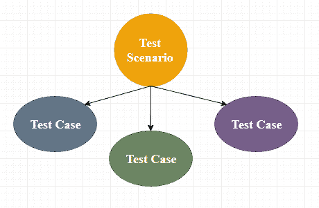
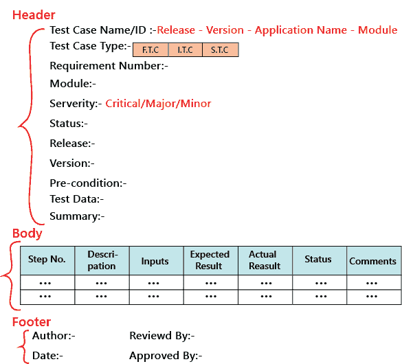
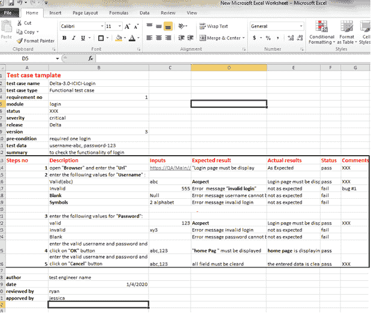
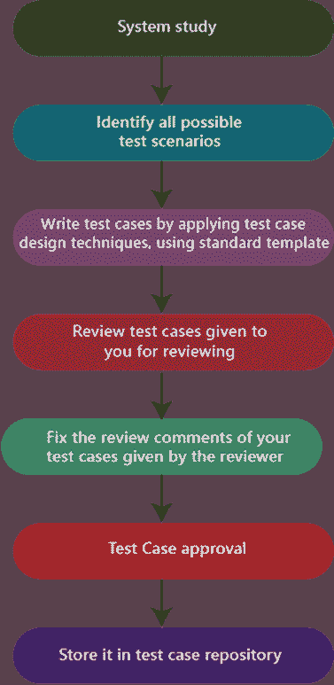

# 判例案件

> 原文：<https://www.javatpoint.com/test-case>

测试用例被定义为一组条件，在这些条件下，测试人员确定软件应用是否按照客户的要求工作。测试用例设计包括前提条件、用例名称、输入条件和预期结果。测试用例是一个第一级的动作，并且源自测试场景。

它是一个详细文档，包含所有可能的输入(正的和负的)和导航步骤，用于测试执行过程。编写测试用例是一次性的尝试，可以在将来的回归测试中使用。

测试用例给出了关于测试策略、测试过程、前提条件和预期输出的详细信息。这些在测试过程中执行，以检查软件应用是否正在执行它被开发的任务。

测试用例通过将缺陷与测试用例标识联系起来，帮助测试人员进行缺陷报告。详细的测试用例文档对测试团队来说是一个全面的保护，因为如果开发人员遗漏了什么，那么在执行这些全面测试用例的过程中就会被发现。

为了编写测试用例，我们必须有导出输入的需求，并且必须编写测试场景，这样我们就不会错过任何测试特性。那么我们应该有测试用例模板来保持一致性，或者每个测试工程师都遵循相同的方法来准备测试文档。

通常，每当开发人员忙于编写代码时，我们都会编写测试用例。

## 我们什么时候写测试用例？

当我们得到以下信息时，我们将编写测试用例:

*   当客户给出业务需求时，开发人员开始开发，并说他们需要 3.5 个月来构建这个产品。
*   同时，测试团队将**开始编写测试用例**。
*   完成后，它会将其发送给测试主管进行审查。
*   当开发人员完成产品开发时，它被移交给测试团队。
*   测试工程师在测试产品文档时从来不看需求，因为测试是持续的，不取决于人的情绪而不是测试工程师的质量。

#### 注意:当编写测试用例时，实际的结果不应该被编写，因为产品还在开发过程中。那个？这就是为什么实际的结果应该只在测试用例执行之后才写。

## 为什么我们要编写测试用例？

出于以下原因，我们将编写测试:

*   **要求测试用例执行的一致性**
*   **确保更好的测试覆盖率**
*   **取决于过程而不是一个人**
*   **避免对产品上的每个新测试工程师进行培训**

**要在测试用例执行中要求一致性:**我们将看到测试用例并开始测试应用。

**为了确保更好的测试覆盖率:**为此，我们应该覆盖所有可能的场景并记录下来，这样我们就不需要反复记住所有的场景。

**这取决于过程而不是一个人:**一个测试工程师在第一次发布、第二次发布期间测试了一个应用，在第三次发布时离开了公司。因为测试工程师理解了一个模块，并通过导出许多值来彻底测试应用。如果这个人不在第三个版本中，那么对于新人来说就变得困难了。因此，所有导出的值都被记录下来，以便将来使用。

**避免给产品上的每一个新测试工程师都进行培训:**测试工程师离开时，他/她带着大量的知识和场景离开。这些场景应该被记录下来，以便新的测试工程师可以用给定的场景进行测试，也可以编写新的场景。

#### 注意:当开发人员为第一个版本开发第一个产品时，测试工程师编写测试用例。在第二个版本中，当新特性被添加时，测试工程师也为其编写测试用例，在下一个版本中，当元素被修改时，测试工程师将改变测试用例或者也编写新的测试用例。

## 测试用例模板

编写测试用例的主要目的是实现应用的效率。

我们知道**实际结果**是在测试用例执行之后写的，很多时候会和**预期结果**一样。但是如果测试步骤失败了，那就不一样了。所以，实际的结果字段可以跳过，在**评论**部分，我们可以写关于 bug 的内容。

并且**输入字段**可以删除，该信息可以添加到**描述字段**中。

我们上面讨论的模板不是标准模板，因为每个公司和每个应用都可能不同，这是基于测试工程师和测试负责人的。但是，为了测试一个应用，所有的测试工程师都应该遵循一个通用的模板，这个模板是公式化的。

测试用例应该用简单的语言编写，这样新的测试工程师也可以理解和执行。

在上面的示例模板中，标题包含以下内容:

**步数**

这也是很重要的，因为如果第 20 步失败了，我们可以记录错误报告，从而确定工作的优先级，并决定它是否是一个关键的错误。

**测试用例类型**

它可以是功能、集成或系统测试用例，也可以是阳性或阴性或阳性和阴性测试用例。

**释放**

一个版本可以包含多个版本。

**预条件**

这些是每个测试工程师在开始测试执行过程之前需要满足的必要条件。或者需要为测试创建数据配置或数据设置。

**例如**:在一个应用中，我们正在编写测试用例来添加用户、编辑用户、删除用户。如果在编辑和删除用户 A 之前添加了用户 A，将会看到每个条件。

**测试数据**

这些是我们需要根据每个条件创建的值或输入。

**例如**、用户名、密码、用户账号。

可以向测试负责人提供测试数据，如用户名或密码，以测试应用，或者测试工程师可以自己生成用户名和密码。

**严重程度**

严重性可以是**主要、次要和关键**，测试用例中的严重性说明了特定测试用例的重要性。所有的文本执行过程总是依赖于测试用例的严重性。

我们可以根据模块选择严重性。模块中包含许多特性，即使一个元素是关键的，我们也声称测试用例是关键的。这取决于我们为其编写测试用例的函数。

**例如**我们将以 Gmail 应用为例，让我们根据模块来查看严重性:

| 模块 | 严重 |
| 注册 | 批评的 |
| 帮助 | 较小的 |
| 合成邮件 | 批评的 |
| 环境 | 较小的 |
| 收件箱 | 批评的 |
| 已发送的项目 | 重要的 |
| 注销 | 批评的 |

对于银行应用，严重性可能如下:

| 模块 | 严重 |
| 金额转账 | 批评的 |
| 反馈 | 较小的 |

**简述**

测试工程师已经为一个特定的特性编写了一个测试用例。如果他/她现在来阅读测试用例，他/她不知道是什么特性写的。因此，简短的描述将帮助他们编写哪个特性测试用例。

## 测试用例模板的例子

这里，我们正在为 **ICICI 应用的登录**模块编写一个测试用例:

## 测试用例的类型

我们有不同类型的测试用例，如下所示:

*   **功能测试用例**
*   **集成测试用例**
*   **系统测试用例**

### 功能测试用例

首先，我们检查我们将为哪个领域编写测试用例，然后进行相应的描述。

在功能测试中，或者如果应用是数据驱动的，我们需要输入列 else 这有点耗时。

**编写功能测试用例的规则:**

*   在预期结果栏中，尽量使用**应为**或**必须为**。
*   突出显示对象名称。
*   我们只需要描述那些我们最需要的步骤；否则，我们不需要定义所有的步骤。
*   为了减少多余的执行时间，我们将正确地编写步骤。
*   编写一个通用测试用例；不要试图硬编码它。

假设它是金额转账模块，那么我们正在为它编写功能测试用例，然后还指定它不是登录功能。

金额转账模块的功能测试用例在下面的 Excel 文件中:

### 集成测试用例

在这种情况下，我们不应该写已经在功能测试用例中涉及到的东西，我们在集成测试用例中已经写的东西也不应该再写在系统测试用例中。

**编写集成测试用例的规则**

*   首先，了解产品
*   确定可能的场景
*   根据优先级编写测试用例

当测试工程师编写测试用例时，他们可能需要考虑以下几个方面:

如果测试用例是详细的:

*   他们将努力实现最大的测试覆盖率。
*   所有测试用例值或场景都被正确描述。
*   他们会试着从执行的角度去思考。
*   用于编写测试用例的模板必须是唯一的。

#### 注意:当我们涉及的步骤数量较少或者覆盖率较多的时候，应该是最好的测试用例，当这些测试用例交给任何人的时候，他们都会很容易理解。

### 系统测试案例

我们将为端到端业务流编写系统测试用例。我们已经准备好了整个模块来编写系统测试用例。

## 编写测试用例的过程

编写测试用例的方法可以完成如下步骤:

**系统研究**

在本文中，我们将通过查看客户给出的需求或服务请求来了解应用。

**识别所有场景:**

*   当产品推出时，最终用户可以通过哪些可能的方式使用软件来识别所有可能的方式。
*   我已经在一个文档中记录了所有可能的场景，这个文档叫做测试设计/高级设计。
*   测试设计是包含所有可能场景的记录。

**编写测试用例**

通过应用测试用例设计技术和使用标准的测试用例模板，将所有识别的场景转换为测试声明，并将与它们的特性相关的场景分组，确定模块的优先级，并编写测试用例，这意味着为项目决定的测试用例模板。

**评审测试用例**

通过将测试用例交给团队负责人来评审测试用例，然后修正评审者给出的评审反馈。

**测试用例批准**

根据反馈修复测试用例后，再次发送以获得批准。

**存储在测试用例库中**

在特定的测试用例被批准后，存储在熟悉的地方，也就是测试用例存储库。

要获得关于测试用例审查过程的完整信息，请参考下面的链接:

[https://www.javatpoint.com/test-case-review-process](https://www.javatpoint.com/test-case-review-process)

* * *