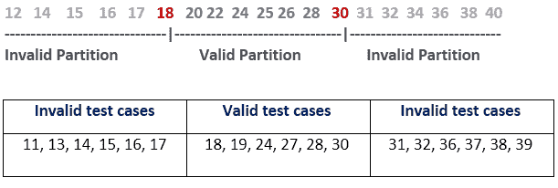

# 边界值分析

> 原文：<https://www.javatpoint.com/boundary-value-analysis-in-black-box-testing>

边界值分析是黑盒测试中广泛使用的案例设计技术之一。它用于测试边界值，因为边界附近的输入值出错的几率更高。

每当我们通过边界值分析进行测试时，测试人员都会在输入边界值时关注软件是否产生了正确的输出。

边界值是包含变量上限和下限的值。假设，年龄是任何函数的变量，它的最小值是 18，最大值是 30，那么 18 和 30 都将被认为是边界值。

边界值分析的基本假设是，使用边界值创建的测试用例最有可能导致错误。

有 18 和 30 是边界值，这就是为什么测试人员更关注这些值，但这并不意味着像 19、20、21、27、29 这样的中间值被忽略。测试用例是为这个范围的每个值开发的。

边界值的测试是通过创建有效和无效的分区来完成的。测试无效分区是因为在不利条件下测试输出也是必不可少的。

**我们通过实际来了解一下:**

想象一下，有一个函数接受 18 到 30 之间的数字，其中 18 是最小的，30 是有效分区的最大值，这个分区的其他值是 19、20、21、22、23、24、25、26、27、28 和 29。无效分区由小于 18 的数字组成，如 12、14、15、16 和 17，大于 30 的数字，如 31、32、34、36 和 40。Tester 为有效和无效分区开发测试用例，以捕获系统在不同输入条件下的行为。

如果软件系统接受了一个有效的数字并给出了期望的输出，那么它将通过测试，如果没有，那么它是不成功的。在另一种情况下，软件系统不应该接受无效的数字，如果输入的数字无效，那么它应该显示错误信息。

如果正在测试的软件遵循所有的测试指南和规范，那么它将被发送给发布团队，否则将被发送给开发团队来修复缺陷。

* * *