# 测试计划

> 原文：<https://www.javatpoint.com/test-plan>

测试计划是描述软件测试领域和活动的详细文档。它概述了测试策略、目标、测试时间表、所需资源(人力资源、软件和硬件)、测试评估和测试交付。

测试计划是每个软件测试的基础。这是最重要的活动，它确保所有计划活动的列表以适当的顺序可用。

测试计划是一个模板，用于将软件测试活动作为一个定义好的过程来进行，并由测试经理进行全面的监控。测试计划由测试主管(60%)、测试经理(20%)和测试工程师(20%)编制。

## 测试计划的类型

测试计划有三种类型

*   主测试计划
*   阶段测试计划
*   测试类型特定测试计划

### 主测试计划

主测试计划是一种具有多级测试的测试计划。它包括一个完整的测试策略。

### 阶段测试计划

阶段测试计划是一种针对测试策略的任何一个阶段的测试计划。例如，工具列表、测试用例列表等。

### 特定测试计划

为安全测试、负载测试、性能测试等主要测试类型设计的特定测试计划。换句话说，为非功能测试设计的特定测试计划。

## 如何编写测试计划

制定测试计划是测试管理过程中最关键的任务。根据 IEEE 829，按照以下七个步骤准备测试计划。

*   首先，分析产品结构和架构。
*   现在设计测试策略。
*   定义所有测试目标。
*   定义测试区域。
*   定义所有可用的资源。
*   以适当的方式安排所有活动。
*   确定所有测试可交付成果。

## 测试计划组件或属性

测试计划由不同的部分组成，这些部分帮助我们得出整个测试活动。

**目标:**由模块、特性、测试数据等信息组成。，它表明应用的目的意味着应用的行为、目标等。

**范围:**它包含需要针对应用进行测试的信息。范围可以进一步分为两部分:

*   在范围内
*   超出范围

**范围:**这些是需要严格(详细)测试的模块。

**超出范围:**这些是模块，不需要严格测试。

**例如**，假设我们有一个要测试的 Gmail 应用，其中**要测试的功能**如**撰写邮件、已发送邮件、收件箱、草稿**和**不要测试的功能**如**帮助**等等，这意味着在计划阶段，我们将根据产品中给出的时间限制来决定是否要检查哪些功能。

现在**我们如何决定哪些功能不需要测试？**

我们有以下几个方面可以决定哪些功能不需要测试:

*   正如我们在上面看到的 **Help** 特性不会被测试，因为它是由技术作者编写和开发的，并由另一个专业作者审查。
*   假设我们有一个应用具有 **P、Q、R 和 S** 特性，需要根据需求进行开发。但是在这里，S 特性已经被其他公司设计和使用了。因此，开发团队将从该公司购买 S，并与 P、Q 和 r 等附加功能集成。

现在，我们不会对 S 特性进行功能测试，因为它已经被实时使用。但是我们将在 P、Q、R 和 S 特性之间进行集成测试和系统测试，因为新特性可能无法与 S 特性正常工作，如下图所示:

*   假设在产品第一次发布的时候，已经开发出来的元素，比如 **P、Q、R、S、T、U、V、W…..x，Y，Z** 。现在客户将在第二个版本中提供改进产品的新功能需求，新功能是 **A1、B2、C3、D4 和 E5。**

之后，我们将在测试计划中把范围写成

**范围**

**待测特性**

A1、B2、C3、D4、E5(新功能)

p，Q，R，S，T

**不需要测试的特性**

W…..x，Y，Z

因此，我们将首先检查新功能，然后继续旧功能，因为添加新功能后可能会受到影响，这意味着它也会影响影响区域，因此我们将对 P，Q，R…，T 功能进行一轮回归测试。

### 测试方法:

它包含关于执行不同类型测试的信息，如功能测试、集成测试和系统测试等。在申请表上。在这种情况下，我们将决定什么类型的测试；我们将根据应用需求执行各种功能。在这里，我们还应该定义我们将在测试方法中使用什么样的测试，这样每个人，像管理层、开发团队和测试团队，都可以很容易地理解，因为测试术语不是标准的。

**例如，**对于独立应用，如 **Adobe Photoshop** ，我们将执行以下类型的测试:

冒烟测试→功能测试→集成测试→系统测试→即席测试→兼容性测试→回归测试→全球化测试→可访问性测试→可用性测试→可靠性测试→恢复测试→安装或卸载测试

假设我们必须测试[https://www.jeevansathi.com/](https://www.jeevansathi.com/)应用，那么我们将执行以下类型的测试:

| 烟雾测试 | 功能测试 | 集成测试 |
| 系统试验 | 专项测试 | 兼容性测试 |
| 回归测试 | 全球化测试 | 无障碍测试 |
| 可用性测试 | 性能试验 |  |

### 方法

该属性用于在执行测试时描述应用的流程，以供将来参考。

我们可以借助以下几个方面来了解应用的流程:

*   **通过编写高层场景**
*   **通过写流程图**

#### 通过编写高级场景

**例如**，假设我们正在测试 **Gmail** 应用:

*   登录 Gmail-发送一封电子邮件，并检查它是否在“已发送邮件”页面中
*   登录到……
*   ……
*   …....

我们写这篇文章是为了描述测试产品必须采取的方法，并且只针对我们将要编写高级场景的关键特性。在这里，我们不会关注于覆盖所有的场景，因为特定的测试工程师可以决定哪些特性需要测试或者不需要测试。

#### 通过写流程图

编写流程图是因为编写高级场景是一个耗时的过程，如下图所示:

我们正在创建流程图，以实现以下优势，例如:

*   覆盖很容易
*   合并很容易

该方法可分为以下两部分:

*   从上到下的方法
*   自下而上的方法

### 假定

它包含了在测试过程中可能出现的问题的信息，当我们编写测试计划时，像资源和技术这样有保证的假设会被提出。

### 风险

这些是我们在当前版本中测试应用时需要面对的挑战，如果假设会失败，那么就涉及到风险。

**例如，**对于某个应用的效果，发布日期变得推迟。

### 缓解计划或应急计划

这是一个后备计划，准备克服风险或问题。

让我们一起看一个假设、风险和应急计划的例子，因为它们是相互关联的。

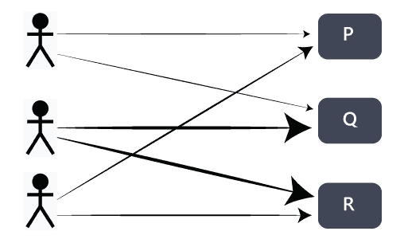

在任何产品中，我们将做出的**假设**是，所有 3 个测试工程师都将在那里，直到产品完成，并且他们每个人都被分配了不同的模块，例如 P、Q 和 r。在这个特定的场景中，**风险**可能是，如果测试工程师在中途离开项目。

因此，**应急计划**将为每个功能分配一个主要和从属所有者。因此，如果一个测试工程师要离开，从属所有者将接管该特定功能，并帮助新的测试工程师，这样他/她就可以理解他们分配的模块。

假设、风险和缓解或应急计划对产品本身总是精确的。各种类型的风险如下:

*   客户视角
*   资源方法
*   技术意见

### 角色和责任

它定义了需要由整个测试团队执行的完整任务。当一个大项目来了，那么**测试经理**就是写测试计划的人。如果有 3-4 个小项目，那么测试经理会将每个项目分配给每个测试主管。然后，测试负责人为他/她分配的项目编写测试计划。

让我们看一个例子，其中我们将理解测试经理、测试主管和测试工程师的角色和职责。

**角色:测试经理**

**名称:莱恩**

**责任:**

*   准备(撰写和审核)测试计划
*   与开发团队一起主持会议
*   与测试团队召开会议
*   主持与客户的会议
*   每月召开一次站立会议
*   签署发行说明
*   处理升级和问题

**角色:测试引线**

**姓名:哈维**

**责任:**

*   准备(撰写和审核)测试计划
*   举行每日站立会议
*   审查和批准测试用例
*   准备 RTM 和报告
*   分配模块
*   处理计划

**角色:测试工程师 1、测试工程师 2、测试工程师 3**

**姓名:路易斯、杰西卡、唐娜**

**分配模块:M1、M2 和 M3**

**责任:**

*   编写、评审和执行由测试用例和测试场景组成的测试文档
*   阅读、评审、理解和分析需求
*   编写应用的流程
*   执行测试用例
*   相应模块的 RTM
*   缺陷跟踪
*   准备测试执行报告，并将其传达给测试主管。

### 安排

它用来解释工作的时间，需要做什么，或者这个属性涵盖了每个测试活动应该在什么时候开始和结束？对于特定日期的每个测试活动，也会提到确切的数据。

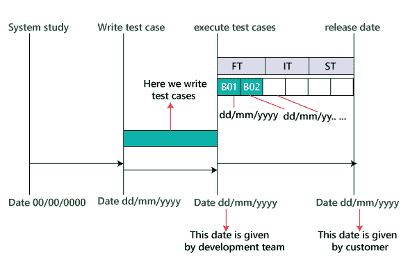

因此，正如我们在下图中看到的，对于特定的活动，将有一个开始日期和结束日期；对于特定构建的每个测试，都会有指定的日期。

**例如**

*   编写测试用例
*   执行过程

### 缺陷跟踪

这通常是在工具的帮助下完成的，因为我们不能手动跟踪每个 bug 的状态。我们还评论了我们如何传达测试过程中发现的错误，并将其发送回开发团队，以及开发团队将如何回复。这里我们还提到了 bug 的优先级，如高、中、低。

以下是缺陷跟踪的各个方面:

*   **追踪臭虫的技术**
    …..
    ……
    ……
    ………
*   **Bug 追踪工具**
    我们可以评论一下工具的名字，我们会用它来追踪 Bug。一些最常用的 bug 跟踪工具有吉拉、Bugzilla、螳螂和 Trac 等。<
*   **严重程度**
    严重程度可能如下:
    **阻断药或止痛剂**
    …..
    …..(测试计划中举例说明)
    **比如**，模块会有缺陷；我们不能进一步测试其他模块，因为如果 bug 被阻止，我们可以继续检查其他模块。
    **临界**
    ……
    …..(测试计划中举例说明)
    这种情况下，缺陷会影响业务。
    **少校**
    …。
    ……。(测试计划中举例说明)
    **次要**
    …..
    …..(测试计划中举例说明)
    这些缺陷就是影响应用观感的缺陷。
*   **优先**
    **高-P1**
    …..
    **中-P2**
    …..
    **低-P3**
    …..
    …..
    T16】P4

因此，根据 bug 的优先级，如高、中、低，我们将其分为 P1、P2、P3 和 P4。

### 测试环境

这些是我们将要测试应用的环境，这里我们有两种类型的环境，分别是**软件**和**硬件**配置。

**软件配置**是指不同**操作系统**的细节，如**视窗、Linux、UNIX 和 Mac** 以及各种**浏览器**如**谷歌浏览器、火狐、Opera、互联网浏览器**等。

**硬件配置**是指不同大小的**内存、只读存储器和处理器**的信息。

**例如**

*   **软件**包括以下内容:

**服务器**

| **操作系统** | Linux 操作系统 |
| web 服务器 | Apache Tomcat |
| **应用服务器** | 万维网环球服务系统 |
| **数据库服务器** | 甲骨文或微软 |

#### 注意:以上服务器是测试团队用来测试应用的服务。

**客户端**

| **操作系统** | 视窗 XP，Vista 7 |
| **浏览器** | Mozilla Firefox、谷歌 Chrome、Internet Explorer、Internet Explorer 7 和 Internet Explorer 8 |

#### 注意:以上细节提供了测试团队将在其中测试应用的各种操作系统和浏览器。

*   **硬件**包括以下内容:

**服务器**:太阳星猫 1500

测试团队可以使用这个特定的服务器来测试他们的应用。

**客户端:**

它具有以下配置，如下所示:

| **处理器** | 2GHz 整数 |
| ram | 2GB |
| …. | …. |

#### 注意:它将提供作为测试团队的测试工程师的系统配置。

*   **安装软件的过程**
    ……
    …..
    …..

开发团队将提供如何安装软件的配置。如果开发团队还没有提供这个过程，那么我们将在测试计划中把它写成基于任务的开发(TBD)。

### 入境和出境标准

这是一个必要条件，需要在开始和停止测试过程之前满足。

#### 入围标准

进入标准包含以下条件:

*   白盒测试应该完成了。
*   理解和分析需求，准备测试文档或测试文档准备好的时候。
*   测试数据应该准备好。
*   构建或应用必须准备好
*   模块或特性需要分配给不同的测试工程师。
*   必要的资源必须准备好。

#### 退出标准

退出标准包含以下条件:

*   当所有的测试用例都被执行的时候。
*   大部分测试用例必须是**通过**。
*   取决于 bug 的严重程度，这意味着不能有任何阻止程序或主要 bug，而存在一些次要 bug。

在我们开始执行功能测试之前，应遵循上述所有**进入标准**。在我们执行功能测试之后，在我们进行集成测试之前，应该遵循功能测试的**退出标准，因为退出标准的百分比是由与开发和测试经理的会议决定的，因为他们的合作可以达到该百分比。但是如果没有遵循功能测试的退出标准，那么我们就不能继续进行集成测试。**

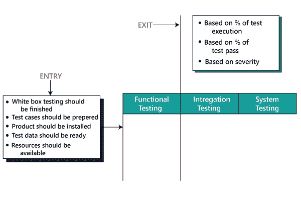

这里**基于 bug 的严重程度**意味着测试团队已经决定在接下来的阶段继续进行。

### 测试自动化

在这方面，我们将做出以下决定:

*   哪些功能必须自动化，哪些不能自动化？
*   我们将在哪个自动化框架上使用哪个测试自动化工具？

我们只在第一次发布后自动化测试用例。

这里出现的问题是，我们**将在什么基础上**决定哪些特性需要测试？****

**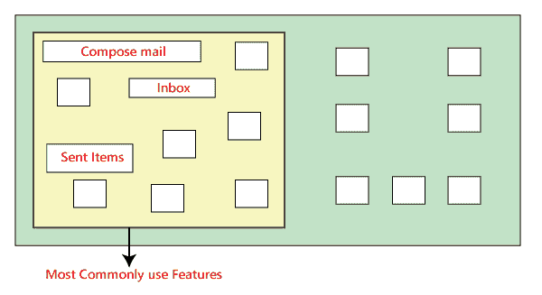

在上图中，我们可以看到，最常用的特性需要反复测试。假设我们必须检查 Gmail 应用，其中的基本功能是**撰写邮件、发送邮件和收件箱**。因此，我们将测试这些特性，因为在执行手动测试时，它需要更多的时间，并且它也成为一项单调的工作。

现在，**我们如何决定哪些特性不被测试？**

假设**Gmail 应用的 Help** 功能没有反复测试，因为这些功能没有经常使用，所以我们不需要经常检查。

但是**如果有些特性不稳定，有很多 bug**，这意味着我们不会测试那些特性，因为在做手工测试的时候要反复测试。

如果**有一个必须频繁测试的特性**，但是我们期望该特性的需求改变，所以我们不检查它，因为与自动化测试脚本中的改变相比，改变手动测试用例更舒服。

### 努力评估

在这方面，我们将计划每个团队成员需要付出的努力。

### 测试可交付成果

这些文件是测试团队的输出，我们把它们和产品一起交给了客户。它包括以下内容:

*   **测试计划**
*   **测试用例**
*   **测试脚本**
*   **需求可追溯矩阵**
*   **缺陷报告**
*   **测试执行报告**
*   **图表和指标**
*   **发行说明**

#### 图形和度量

**图形**

在本文中，我们将讨论我们将发送的**图**的类型，我们还将提供每个图的示例。

正如我们所看到的，我们有五个不同的图表，显示了测试过程的各个方面。

**Graph1:** 在这里，我们将展示每个模块中已经识别了多少个缺陷，修复了多少个缺陷。

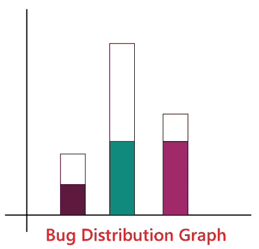

**图 2:** 图一显示了每个模块识别出的关键、主要和次要缺陷数量，以及各自模块修复的缺陷数量。

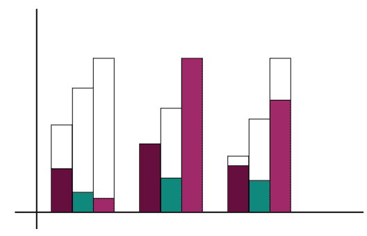

**图 3:** 在这个特定的图中，我们表示**构建明智图**，这意味着在每个构建中，每个模块有多少缺陷被识别和修复。基于该模块，我们已经确定了错误。我们将添加 **R** 来显示 P 和 Q 中的缺陷数量，我们还将添加 **S** 来显示 P、Q 和 R 中的缺陷

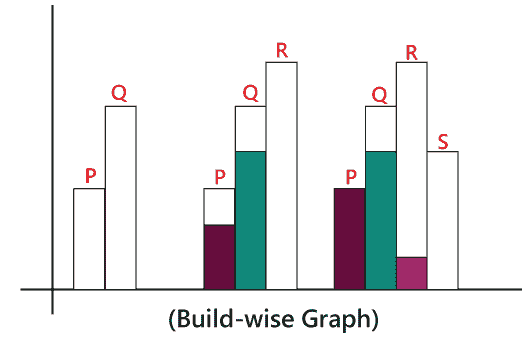

**图 4:** 测试负责人将设计每月创建的 **Bug 趋势分析**图，并将其发送给管理层。这就像在产品的最后做的预测。在这里，我们也可以**对错误修复**进行评级，因为我们可以观察到**弧线**在下图中有**向上的趋势**。

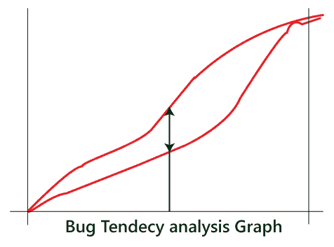

**图 5:****测试经理**设计了这种类型的图。此图旨在了解 bug 评估中的差距和已经发生的实际 bug，并且此图还有助于改进未来对 bug 的评估。

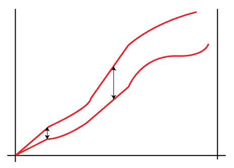

**指标**

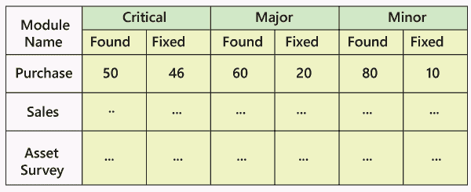

如上所述，我们创建了 bug 分布图，如图 1 所示，在上述数据的帮助下，我们还将设计度量标准。

**例如**

在上图中，我们保留了特定项目中所有测试工程师的记录，以及已经识别和修复了多少缺陷。我们也可以将这些数据用于未来的分析。当一个新的需求到来时，我们可以根据上面的度量标准，根据他们之前发现的缺陷数量，决定由谁来提供这个具有挑战性的特性进行测试。我们将会更好地了解谁能很好地处理有问题的特性，并找到最大数量的缺陷。

**发布说明:**是在产品发布过程中准备的文件，由测试经理签字。

在下图中，我们可以看到最终产品已经开发并部署给客户，最新的发布名称为 **Beta** 。

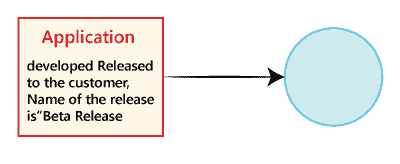

**发行说明**包括以下内容:

*   用户手册。
*   待定和未决缺陷列表。
*   添加、修改和删除的功能列表。
*   测试产品的平台(操作系统、硬件、浏览器)列表。
*   不测试产品的平台。
*   当前版本中修复的 bug 列表，以及上一版本中修复的 bug 列表。
*   安装过程
*   软件版本

**例如**

假设 **Beta** 是第一个版本 **Alpha** 发布后的第二个版本。第一个版本中发现的一些缺陷，在后来的版本中已经修复。在这里，我们还将指出从 alpha 版本到 beta 版本新添加、修改和删除的功能列表。

### 模板

这一部分包含了将在产品中使用的文档的所有模板，所有的测试工程师将在项目中只使用这些模板来维护产品的一致性。这里，我们有在整个测试过程中使用的不同类型的模板，例如:

*   测试用例模板
*   测试用例审查模板
*   RTM 模板
*   错误报告模板
*   测试执行报告

让我们看看测试计划文档的一个示例

第-1 页

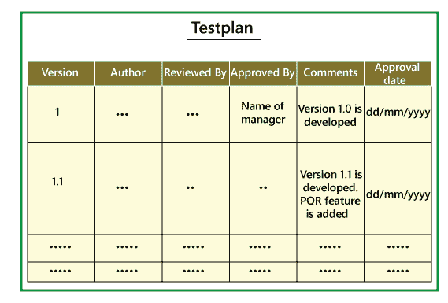

**第 3 页第 18 页**

**第-20 页**

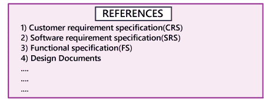

在第 1 页中，我们主要只填写**版本、作者、注释和审核人**字段，在经理批准后，我们将在**批准人和批准日期**字段中提及详细信息。

大多数情况下，测试计划由测试经理批准，测试工程师只审核测试计划。而当新特性来临时，我们会修改测试计划，在**版本**字段做必要的修改，然后再次发送给经理进一步审核、更新、审批。每当发生任何变化时，都必须更新测试计划。在第 20 页上，**参考资料**详细说明了我们将要用来编写测试计划文档的所有文档。

**注:**

**谁写测试计划？**

*   测试引线→60%
*   测试经理→20%
*   测试工程师→20%

因此，从上面我们可以看到，在 60%的产品中，测试计划是由测试主管编写的。

**谁审核测试计划？**

*   试铅
*   测试经理
*   测试工程师
*   顾客
*   开发团队

测试工程师从模块角度审查测试计划，测试经理根据客户意见审查测试计划。

**谁批准测试计划？**

*   顾客
*   测试经理

**谁编写测试用例？**

*   试铅
*   测试工程师

**谁审核测试用例？**

*   测试工程师
*   试铅
*   顾客
*   开发团队

**谁批准测试用例？**

*   测试经理
*   试铅
*   顾客

## 测试计划指南

*   瓦解你的测试计划。
*   避免重叠和冗余。
*   如果您认为您不需要上面已经提到的部分，那么删除该部分并继续。
*   具体点。例如，当您指定软件系统作为测试环境的一部分时，请提及软件版本，而不是仅提及名称。
*   避免冗长的段落。
*   尽可能使用列表和表格。
*   需要时更新计划。
*   不要使用过期和未使用的文档。

## 测试计划的重要性

*   测试计划给我们的思考指明了方向。这就像一本规则书，必须遵守。
*   测试计划有助于确定在测试下验证软件应用质量的必要努力。
*   测试计划帮助那些人理解与外部相关的测试细节，如开发人员、业务经理、客户等。
*   测试计划中记录了重要的方面，如测试时间表、测试策略、测试范围等，以便管理团队可以审查它们，并在其他类似的项目中重用它们。

* * ***