# Bug 生命周期

> 原文：<https://www.javatpoint.com/software-testing-bug-life-cycle>

在本节中，我们将了解 bug 生命周期以及 bug 和 bug 报告模板的不同状态。

在这里，我们将从 bug 被**发现、修复、重新测试和关闭**的阶段开始讨论 bug 的完整生命周期。

我们有一些不同状态的 bug，比如**新/打开、分配、修复、重新打开和关闭**。

一旦测试工程师发现错误，状态就会显示为“新”，这表示刚刚发现了一个错误。

这个新的 bug 需要通过将状态更改为**已分配**来报告给相关的开发人员，以便负责人处理这个 bug。

然后开发人员首先检查错误，这意味着开发人员阅读所有的导航步骤来决定它是否是一个有效的错误。

基于此，如果 bug 有效，开发人员开始在应用程序上重现 bug，一旦 bug 成功重现，开发人员将分析代码并进行必要的更改，并将状态更改为 **Fixed** 。

一旦代码更改完成，bug 被修复，测试工程师重新测试 bug，这意味着测试工程师再次执行 bug 报告中提到的相同操作，并相应地更改状态:

**关闭**，如果 bug 修复得当，功能上按要求工作。

**或**

**重新打开**，如果 bug 仍然存在或者没有按照要求正常工作，那么 bug 会再次发送回开发者。

这个过程持续进行，直到所有的错误都被修复并关闭。

#### 注 1:
测试工程师无法将 bug 口头告知开发人员，原因如下:

*   Developers may ignore bugs.
*   Developers misunderstand bugs.
*   Forget bug
*   Bug may not be in the exact location.

## 给谁分配 bug

该错误可归因于以下原因:

*   开发商
*   开发者领先
*   试铅

**开发者:**如果我们知道是谁开发了那个特定的模块。

**开发人员领导:**如果我们不知道开发特定模块的开发人员。

**测试领导:**当我们和开发团队没有任何互动的时候。

当 bug 被**修复并关闭**时，或者如果它对其他模块有任何影响，那么我们会进行新的 bug 报告。

**或**

当 bug 状态为**重新打开(未修复)**并影响另一个模块时，那么我们就要准备新的 bug 报告了。

#### 注 2:

*   Whenever we find a bug and the developer fixes it, we have to check the affected area.
*   If the old bug is fixed correctly, change the status to closed.
*   And if we find a bug in the impact area, report it as a new bug.
*   If the old bug is not fixed correctly, change the status to reopen.
*   Or, if we find a bug affected area, change the status to New or report it as a new bug.

## bug 的另一种状态

一旦我们准备了一份 bug 报告并将其发送给开发人员，开发人员就会接受这个 bug，并开始进行必要的代码更改，这些更改将成为 bug 生命周期的**正向流程**。

可能会有一些情况，开发人员可能没有进行必要的代码更改，并根据情况而定，这成为 bug 生命周期的**负流程或状态**。

以下是 bug 生命周期的不同状态:

*   **无效/被拒绝**
*   **复制**
*   **延期/延期**
*   **无法修复**
*   **不可复制**
*   **RFE(增强请求)**

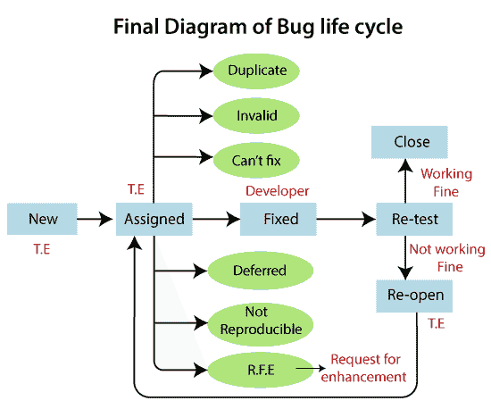

### 无效/被拒绝

当测试工程师因为误解需求而写了一个不正确的 bug 报告时，那么开发人员将不会接受这个 Bug，并给出状态为**无效**并发回。(有时开发人员也会误解需求)。

> 开发人员不接受的任何错误都被称为无效错误。

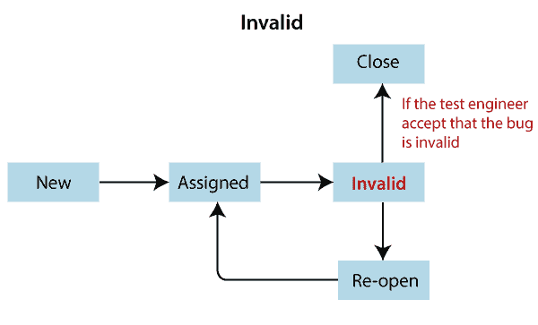

**错误状态无效的原因**

错误的无效状态是由以下原因造成的:

*   **测试工程师误解了要求**
*   **开发者误解了需求**

让我们看一个测试工程师和开发人员误解需求的例子，如下图所示:

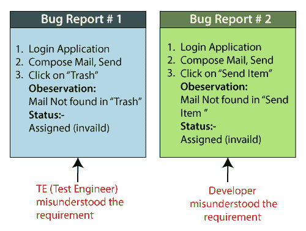

### 复制

当同一错误被不同的测试工程师报告多次时，被称为**重复**错误。

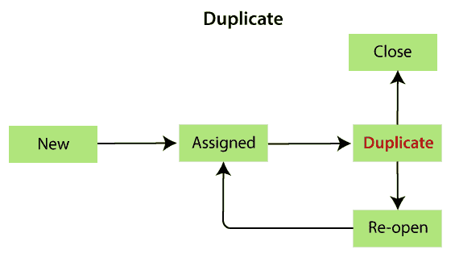

**bug 状态重复的原因**

以下是重复状态的原因:

*   **常用功能:**
    **例如:**假设我们有测试工程师 P 和 Q 在测试软件，测试工程师 P 和 Q 会像**一样测试他们的功能登录应用程序**。
    这里，测试工程师 P 输入有效的用户名和密码，点击登录按钮。
    P 一旦点击登录按钮，就会打开一个空白页，说明是 bug。
    之后，P 为特定的 bug 准备一份 bug 报告，并发送给开发人员。
    然后测试工程师 Q 也登录了应用，得到了同样的 bug。q 还要准备一份 bug 报告，并将其发送给开发人员。
    一旦开发人员得到两个测试工程师的 bug 报告，他/她就把 bug 报告发回给 Q，说是重复的。
*   **从属模块**
    如下图所示，测试工程师想要**撰写邮件**，那么首先测试工程师需要**登录**，那么只有他/她能够撰写邮件。
    如果在**登录模块**中发现 bug，测试工程师无法进行进一步的处理，因为组成模块依赖于登录模块。

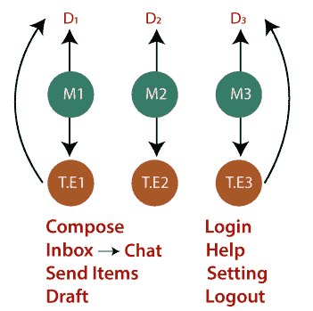

*   **为了避免重复的 bug**
    如果开发者得到了重复的 bug，那么他/她会去 bug 库搜索 bug 并检查 bug 是否存在。
    如果存在相同的**bug**，则无需在报告中再次记录相同的 bug。
    **或**
    如果 bug **不存在**，则记录一个 bug 并存储在 bug 库中，发送给【CC】中添加的开发人员和测试工程师。

#### 注 1:

*   Normally, we don't search the repository for every bug in order to check the discrepancy.
*   To save time, we only search for bugs with common and subordinate characteristics.

#### 注 2:
每当我们比较两个 bug 报告，看是否重复时，总要看两件事，如下:

*   The navigation steps should be the same.
*   Except for the closed state, any other state should exist, and we should not record the bug, otherwise it will become a repeated bug, as shown in the figure below:

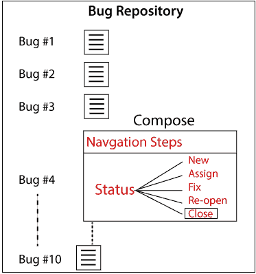

### 不可复制

开发人员接受了这个错误，但由于某些原因无法重现。

> 这些是开发人员在完成测试工程师在错误报告中给出的导航步骤后无法找到的错误。

**bug 不可重现状态的原因**

错误状态不可再现的原因如下:

*   **不完整的 bug 报告**
    测试工程师在报告中没有提到完整的导航步骤。
*   **环境不匹配**
    环境不匹配可以用两种方式来描述:
    *   **服务器不匹配**
    *   **平台不匹配**

**服务器不匹配:**测试工程师使用不同的服务器(**测试服务器**)，开发人员使用不同的服务器(**开发服务器**)来重现 bug，如下图所示:

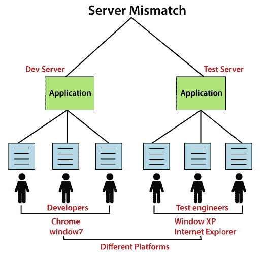

**平台不匹配:**测试工程师使用不同的平台(**窗口 7 和谷歌浏览器**，开发人员也使用不同的平台(**窗口 XP 和互联网浏览器**)。

*   **数据不匹配**
    测试时测试工程师使用的不同值&开发人员使用的不同值。
    **例如:**
    对管理员和用户都有要求。

| **测试工程师(用户)**采用以下要求: | **开发人员(管理员)**使用以下要求: |
| 用户名→ abc
密码→ 123 | 用户名→ aaa
密码→ 111 |

也就是说，两者对同一个登录模块使用不同的值。

*   **构建不匹配**
    测试工程师会在一个构建中发现错误，而开发人员在另一个构建中复制相同的错误。该错误可能会在修复另一个错误时自动修复。
*   **不一致 Bug**
    Bug 是在某个时间发现的，有时候不会发生。
    **不一致 bug 解决方案:**
    我们一发现 bug，首先**拍截图**，然后开发者会**重新确认**bug，如果存在就修复。

### 无法修复

当开发人员接受了这个 bug 并且还能够重现，但是由于一些限制而无法进行必要的代码更改。

**无法修复 bug 状态的原因**

以下是无法修复错误的限制或原因:

*   **没有技术支持:**我们使用的编程语言本身不具备解决问题的能力。
*   **Bug 在代码核心(框架):**如果 Bug 是**次要的**(不重要，不影响应用)，开发负责人说可以在下一个版本中修复。
    或者如果 bug 是**关键**(经常使用并且对业务很重要)并且开发主管不能拒绝 bug。
*   **修复一个 bug 的成本比保留它还多。**

#### 注意:

*   If any bug is small, but the developer can't fix it, it means that the developer can fix it, but this bug is affecting the existing technology because it exists in the core of the code.
*   Every bug that can't be fixed is a minor bug.

### 延期/延期

延迟/延期是一种状态，在这种状态下，由于时间限制，bug 被推迟到将来的版本。

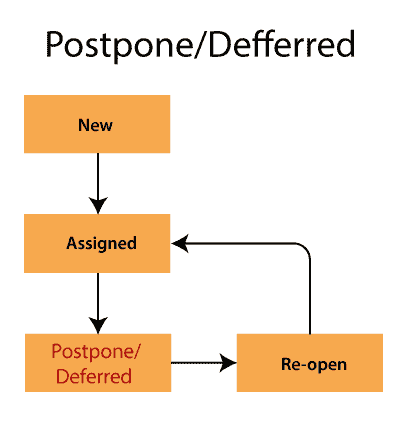

由于时间限制，错误的延迟状态在最初的构建中没有被修复。

如下图所示:

**Bug ID-B001** bug 在初始构建时被发现，但不会在同一个构建中修复，会延期，**在下一个版本**中修复。

而 **Bug ID- B0024、B0025、B0026** 就是那些 Bug，是在构建的最后阶段**发现的，会被修复，因为这些 Bug 都是小 Bug**。

#### 注意:

*   All small bugs can't be postponed, but all postponed bugs are small bugs.
*   Whenever there is no future version, the deferred bug will only be fixed in the maintenance phase.

### RFE(增强请求)

这些是测试工程师以错误报告的形式给出的增强应用程序的建议。RFE 代表**增强请求**。

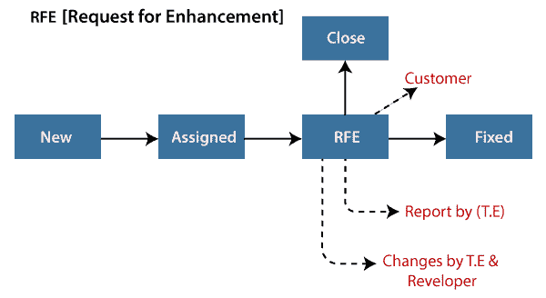

从下面的示例图片中我们可以看到，测试工程师认为应用程序或软件的观感不好，因为测试工程师是作为最终用户来测试应用程序的，他/她会将状态更改为 **RFE** 。

如果客户说**是**，那么状态应该是**修复**。

**或**

如果客户说**没有**，那么状态应该是**关闭**。

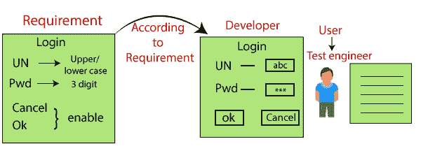

## 错误报告模板(excel)

错误报告模板如下:

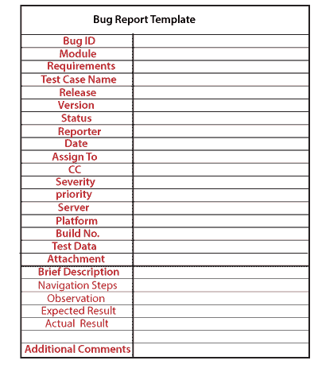

让我们看一个错误报告的例子:

| **Bug ID** | Boo12 |
| **模块** | 注册 |
| **要求** | one |
| **测试用例名称** | Gmail _ login _ 撰写邮件 |
| **记者** | 测试工程师姓名 |
| **释放** | 三角洲 |
| **版本** | Three |
| **状态** | 分配 |
| **日期** | 23-02-2020 |
| **分配给** | YY 开发商 |
| **CC** | 测试负责人，开发人员 |
| **严重程度** | 批评的 |
| **优先级** | P2 |
| **平台** | 视窗 XP，互联网探索 7.0 |
| **建筑编号** | B02 |
| **测试数据** | 用户名=xyz，密码= 123 |
| **简述** |  |
| 导航步骤 | 

*   Log in to Gmail app
*   Write the email and display a confirmation message.

 |
| observationMail | 在收件箱中未找到 |
| 预期的结果邮件 | 也应该在收件箱里。 |
| 实际效果 | 收件箱中找不到邮件 |
| **附加注释** | - |

在这里，我们描述了 bug 报告的一些重要属性。

**Bug ID:** 是赋予 Bug 的唯一编号。

**测试用例名称:**当我们发现一个 bug 时，我们会发送一个 bug 报告，而不是测试用例给相关的开发人员。供测试工程师参考。

**严重性:**是 bug 对应用程序的影响。它可以是阻击，关键，主要和次要的。

**优先级:**在这种情况下，我们要决定先修复哪个 bug。可能是 P1/P2/P3/P4，紧急，高，中，低。

**状态:**bug 的不同状态，可以分配、无效、重复、延期等。

**记者:**在这里，我们将提到发现 bug 的人的名字。可能是测试工程师，有时可能是开发人员、业务分析师、客户等。

**日期:**提供发现 bug 的日期。

**发布/构建版本:**它提供了出现 bug 的版本号，以及应用程序的构建版本。

**平台:**提到平台细节，我们到底在哪里找到 bug。

**描述:**在此，我们将解释特定 bug 的导航步骤、预期和实际结果。

**附件:**附上 bug 的截图，我们捕捉到这个截图是因为它帮助开发者看到了 bug。

## 手动错误报告的缺点

以下是手动错误报告的缺点:

*   **耗时**
    在搜索 bug 报告中的每一个 bug 时，都将是耗时的过程。
*   **人为错误的可能性**
    一个 bug 可能会重复出现，bug 报告中提到了错误的数据，错过了 bug 报告中需要补充的内容。
*   **无安全**
    任何人都可以更改或删除。
*   **繁琐流程**
*   **无集中存储库**

* * *