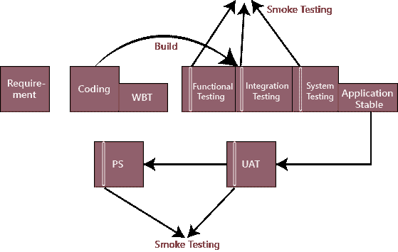
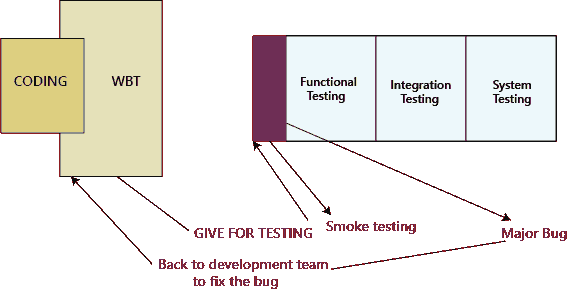
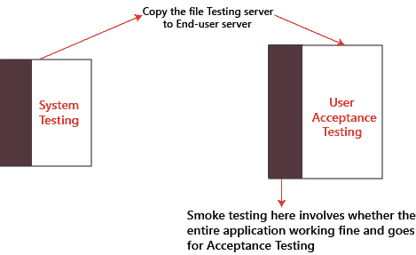
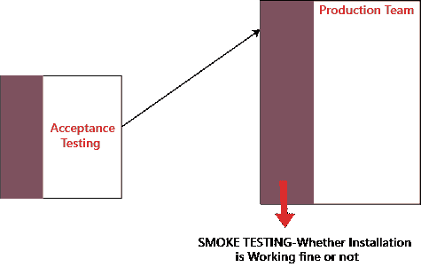
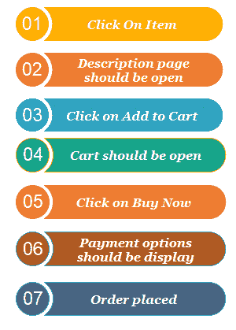

# 烟雾测试

> 原文：<https://www.javatpoint.com/smoke-testing>

烟雾测试在从开发团队接收构建软件时出现。冒烟测试的目的是确定构建软件是否可测试。这是在“构建软件”的时候完成的。这个过程也被称为“第 0 天”。

这是一个节省时间的过程。它减少了测试时间，因为测试只在应用程序的关键特性不起作用或者关键错误没有被修复时进行。烟雾测试的重点是应用程序核心和主要功能的工作流程。

在进行一轮深入、严格的测试(在检查所有可能的正值和负值之前)之前，测试应用程序的基本和关键特性被称为冒烟测试。

在烟雾测试中，我们只关注应用程序的正流量，只输入有效数据，不输入无效数据。在冒烟测试中，我们验证每个构建是否可测试；因此，它也被称为**构建验证测试。**

当我们执行冒烟测试时，我们可以在早期识别阻塞程序错误，这样测试工程师就不会闲着，或者他们可以进一步测试**独立的可测试模块。**

**注:**

*   测试工程师知道模块是独立可测试的，因为我们已经对它们进行了一轮冒烟测试。
*   开发团队可以花时间修复 bug，他们不会因为测试团队没有闲着而感到压力，发布也不会被推迟，因此这是一个节省时间的过程。

## 进行烟雾测试的流程

冒烟测试不需要设计测试用例。只需要从已经设计好的测试用例中选择所需的测试用例。

如上所述，烟雾测试关注核心应用程序的工作流程；我们选择覆盖应用程序主要功能的测试用例。测试用例的数量应该尽可能少，执行时间不能超过半小时。

## 当我们进行烟雾测试时

通常，每当安装新版本时，我们都会执行一轮冒烟测试，因为在最新版本中，我们可能会遇到拦截器错误。毕竟，可能会有一些改变破坏了一个主要特性(修复了一个 bug 或者添加了一个新特性可能会影响到原始软件的一个主要部分)，或者我们会在安装的地方进行冒烟测试。

当稳定的构建安装在任何地方(测试服务器、生产服务器和用户验收测试)时，我们会进行冒烟测试来发现拦截器错误。

让我们使用一些不同的场景，这有助于我们更好地理解何时进行烟雾测试:

### 情景 1

开发人员开发应用程序并移交给测试团队，测试团队将开始功能测试

假设给我们四天时间进行**功能测试**。第一天，我们检查一个模块，第二天，我们将去检查另一个模块。第四天，我们发现一个**关键 bug** 给了开发者；他/她说还需要两天才能修好。然后我们不得不把发布日期推迟两天。

为了克服这个问题，我们执行**冒烟测试**，让我们看看它是如何工作的，在上面的情况下，与其一个模块一个模块地彻底测试，最后得出关键的 bug，不如在我们进行功能、集成和系统测试之前，先做**冒烟测试**，也就是说，在每个模块中，我们必须测试必要或关键的特性，然后进行进一步的测试，如下图所示:

### 场景 2

在执行功能测试时，如果测试工程师在早期阶段发现了主要的 bug，有时开发人员在初始阶段发现主要的 bug 是不合适的。因此，测试工程师将在进行功能、集成、系统和其他类型的测试之前执行冒烟测试。

在进行烟雾测试时，测试工程师发现了主要的错误；他/她将为修复错误向开发团队提供帮助。错误修复后，测试工程师将继续进行进一步的测试，如下图所示:

### 情景 3

在这种情况下，如果我们已经执行了冒烟测试并发现了拦截器错误，并且也解决了该错误。执行系统测试后，我们会将应用程序从测试服务器发送到最终用户服务器，进行一轮用户验收测试。当客户执行验收测试并且没有发现任何问题并且对应用程序感到满意时，因为我们已经执行了冒烟测试。

### 情景 4

验收测试完成后，应用程序将部署到生产服务器上。我们已经在生产服务器上做了一轮冒烟测试，以检查应用程序是否安装正确。如果任何真正的最终用户发现了任何阻止程序错误，他们会感到恼火，不会再使用该应用程序，这可能会导致客户业务的损失，如下图所示:

为了以后不出现这个问题，开发团队经理，测试团队经理，会带着客户登录，做一轮冒烟测试。

**比如**，使用脸书应用的真实用户以及我们每次内部更新的新功能，实际用户都不会受到影响，因为他们不会察觉到内部的变化而正确使用应用。

在生产服务器中，烟雾测试可以由**业务分析师(BA)、开发团队经理、测试团队经理、构建团队和客户来完成。**

## 我们为什么要做烟雾测试？

*   我们将进行烟雾测试，以确保产品是可测试的。
*   我们将在开始时执行冒烟测试，并检测基本特性中的错误，并将其发送给开发团队，以便开发团队有足够的时间来修复错误。
*   我们进行冒烟测试，以确保应用程序安装正确。

**注:**

*   在应用程序开发的早期阶段，如果我们进行冒烟测试，它将获取更多数量的 bug。但是在应用程序开发的后期，如果我们进行冒烟测试，我们在冒烟测试中捕获的 bug 数量将会非常少。因此，通常在烟雾测试上花费的精力较少。
*   **我们什么时候对每一个建筑进行烟雾测试？**

每当安装新的构建时，我们都要确保构建是可测试的，如果它是可测试的，我们就执行冒烟测试，如下图所示:

## 烟雾测试的类型

烟雾测试分为两种类型:

### 正式烟雾测试

在这种情况下，开发团队将应用程序发送给测试主管。然后，测试负责人将指示测试团队进行烟雾测试，并在进行烟雾测试后发送报告。一旦测试团队完成烟雾测试，他们会将烟雾测试报告发送给测试负责人。

### 非正式烟雾测试

在这里，测试主管说应用程序已经准备好进行进一步的测试。测试主管没有指定进行冒烟测试，但是测试团队仍然通过进行冒烟测试来开始测试应用程序。

## 实时示例:

假设，我们使用的是一个电商网站，这个网站的核心工作应该是登录，具体搜索，添加一个项目到购物车，添加一个项目到收藏夹，支付选项等。这里我们测试下订单的功能。测试之后，测试人员必须对应用程序功能的运行有把握和信心。

工作流程的步骤如下:

*   点击项目
*   描述页应该打开。
*   单击添加到购物车
*   手推车应该是开着的
*   点击立即购买
*   应显示付款选项。选择其中一个。
*   下订单

如果这个函数工作正常，那么测试人员将通过测试并测试同一应用程序的下一个函数。

## 烟雾测试的优点

*   这是一个节省时间的过程。
*   在早期阶段，我们可以找到 bug。
*   这将有助于恢复系统的质量，从而降低风险。
*   执行测试很容易，因为它节省了我们的测试工作和时间。

* * *