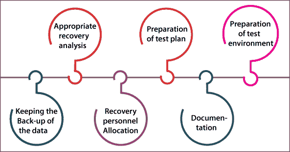

# 恢复测试

> 原文：<https://www.javatpoint.com/recovery-testing>

在本节中，我们将了解**恢复测试**，这是**非功能测试**的重要组成部分，用于测试应用程序从硬件崩溃或故障中恢复的速度。

并且我们也了解了它的**流程，为什么需要进行恢复测试，谁进行恢复测试，例如，优势和劣势**。

## 恢复测试简介

恢复测试是测试工程师将测试应用程序，以检查软件或应用程序从灾难或崩溃中恢复的情况。

它是[性能测试](https://www.javatpoint.com/performance-testing)下最重要的 **[非功能测试](https://www.javatpoint.com/non-functional-testing)** 类型之一。

换句话说，我们可以说，恢复测试是为了验证应用程序在经历任何**软件、硬件崩溃或网络故障**等之后，能够以多快、多好的速度改进或学习软件的能力。

这是软件要求的**故障**以多种方式确认恢复正常执行。

在执行恢复测试时，我们应该首先进行备份，并将其保存到安全的位置，以避免在数据未成功恢复时出现任何数据丢失。

**执行恢复测试时，软件/硬件强制验证以下方面失败:**

*   丢失的数据可以完全恢复，也可以不恢复。
*   它无法验证系统可以恢复的场景的比例。
*   未能验证软件的任何其他附加操作是否可以完成。

#### 注意:一个好的软件应用程序是能够从崩溃、硬件故障或其他类似故障中迅速恢复的应用程序。

## 恢复测试示例

让我们看一下我们可以理解恢复测试是如何执行的场景:

### 情景 1

假设我们正在使用浏览器，比方说**谷歌 Chrome** ，电源关闭。当我们再次打开系统并重新打开谷歌 Chrome 时，我们会看到一个消息窗口，显示我们是要启动一个新的会话还是要恢复以前的会话。

因此，在这种情况下，当我们在浏览器有一定数量的会话时重新启动系统，并检查浏览器是否可以恢复所有会话。

**一些最常见的需要测试恢复的故障:**

这里，我们列出了在执行恢复测试时需要测试的一些最常见的故障:

*   **外部设备无响应**
*   **网络发行**
*   **无线网络信号丢失**
*   **停电**
*   **服务器无响应**
*   **数据库过载**
*   **外部服务器不可达**
*   **DLL 文件缺失**
*   **身体状况**
*   **停止服务**

## 为什么恢复测试很重要？

如果我们为用户开发应用程序，而用户将决定我们组织的成败，那么恢复测试是非常重要的。T

因此，我们需要开发具有足够一致性和可恢复性的软件。

## 我们什么时候需要执行恢复测试？

*   每当我们发布或升级时，我们都需要检查系统特定的恢复测试。
*   为了执行恢复测试，我们需要确保每个人都包括在彼此的角色和职责中。
*   当出现故障或灾难时，关键业务功能可以正常运行。

## 谁实施恢复测试？

恢复测试是业务连续性规划(BCP)的一部分，涉及许多角色。以下相关人员可以执行恢复测试:

*   可以由**生产服务和服务管理团队**执行，他们具有管理此类停机的知识和经验。
*   **技术型中小企业**识别硬件维护的核心系统。
*   恢复测试可以由管理服务器和其他硬件基础设施的 **IT 运营团队**执行。

## 恢复测试生命周期

恢复测试生命周期包括以下各个阶段:

*   **标准操作**
*   **灾难和故障发生**
*   **标准流程中断**
*   **恢复过程**
*   **重建流程**

让我们逐一详细了解它们:

*   **标准操作**

在标准操作阶段，我们将根据软件和硬件要求建立系统，其中特定系统可以按预期执行。它用于定义系统计划的工作方式。

*   **灾难和故障发生**

在恢复测试的下一阶段，我们可以确定系统的几个故障，这些故障如下:

*   **停电**
*   **硬件故障**
*   **身体状况**
*   **服务器不可达，还有更多。**

*   **标准流程中断**

它导致我们在业务、财务损失、与客户的关系、市场声誉等方面遭受损失。

*   **恢复过程**

在恢复测试中，**恢复过程**用于远离公司中最重要的损失，并具有对中断系统影响最小的备份计划。

*   **重建流程**

恢复测试过程的最后一个阶段是重建过程，它包含已经指定的文档和必须遵循的过程。在这个阶段，所有的配置文件和文件夹都会被恢复，以恢复丢失的数据。

## 实施恢复测试前要执行的步骤:

在执行恢复测试过程之前，需要执行以下步骤，以确保恢复测试的性能:

### 步骤 1:适当的恢复分析

在实施恢复测试之前，我们应该确保进行适当的分析，以验证恢复的可能性。恢复分析对于我们更好地理解可能影响系统工作的与恢复相关的修改是必要的。

要完成适当的分析，我们可以观察以下几个方面:

*   系统分配额外资源的能力，如在关键故障或额外的中央处理器的情况下分配服务器。
*   如何跟踪故障？
*   故障的影响、可能发生的故障以及故障的解决方案。

### 第二步:测试计划的准备

在下一步中，我们将根据分析结果准备测试用例，这在上一步中已经讨论过了。

### 步骤 3:测试环境的准备

准备好测试用例后，我们进入下一步，根据**恢复分析结果**设计测试环境。

### 步骤 4:保留数据备份

在准备好测试用例和测试环境之后，我们可以进行下一步，保留与软件相关的备份数据，例如软件和数据库的**几种状态**。

同样，如果数据很重要，那么**我们可以根据关键程度保留备份数据，借助以下策略:**

*   在一个或多个位置备份数据。
*   单备份或多备份。
*   每隔 **n** 分钟自动设置备份，例如 20 分钟。
*   在线和离线备份。
*   为了执行和跟踪备份，我们可以有一个单独的团队。
*   恢复测试的资源分配。

### 第五步:回收人员分配

一旦数据备份成功，我们将有足够的知识进行恢复测试，并分配恢复人员。

### 步骤 6:文档

在最后一步中，我们将记录恢复测试之前和整个过程中执行的所有步骤，因为在出现故障的情况下，可以测试系统的性能。

## 恢复测试的优缺点

### 优势

执行恢复测试的一些主要**好处**如下:

*   **恢复测试**最重要的优势之一就是恢复系统质量，因为只要检测到并修复了 bug，就能提高系统质量。
*   恢复测试将帮助我们消除风险。
*   这有助于我们降低软件产品在市场上失败的风险。
*   当我们实施恢复测试时，我们可以很容易地识别与性能相关的问题，并在软件产品上市之前解决它们。
*   一旦我们执行了恢复测试，系统将更加稳定、可靠和无错误。

### 不足之处

以下是恢复测试的**缺点**:

*   恢复测试是一个**耗时的过程**，因为测试用例是随机的。
*   这是一个昂贵的过程。
*   熟练人员对于测试恢复测试至关重要；如果未经培训的测试工程师实现了恢复测试，他们应该拥有所有用于测试的数据:数据和备份文件。
*   在恢复测试中，我们可能在少数情况下检测不到所有潜在的错误，因为有时问题是不可预测的。

## 概观

在上面的**恢复测试**教程中，我们已经了解了众多的恢复测试特性，这有助于了解系统或程序在出现故障后是否满足其要求。

如果我们有任何彻底改造业务流程或技术的项目，恢复测试是必要的。万一发生故障，它有助于我们验证恢复。

执行**恢复测试**的发生与故障对系统的影响成反比。因此，反复测试在最小化影响方面起着重要作用。

正如我们所知，由于许多常见的原因，故障可能随时发生，例如**恢复测试消除了关键错误**，这使得系统准备好从这些故障中恢复。

* * *