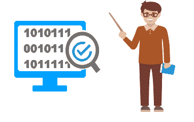
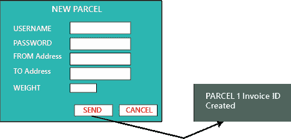
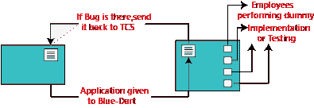
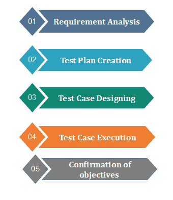

# 验收测试

> 原文：<https://www.javatpoint.com/acceptance-testing>

验收测试是基于用户需求和功能处理的正式测试。它确定软件是否符合规定的要求和用户要求。它是作为一种黑盒测试进行的，其中所需用户的数量涉及测试系统的验收水平。这是软件测试的第四个也是最后一个层次。

用户验收测试(UAT)是一种测试，由客户在接受最终产品之前完成。一般来说，UAT 是由客户(领域专家)为他们的满意度而做的，并根据给定的业务场景、实时场景检查应用是否在工作。

在这种情况下，我们只关注客户经常使用的功能和场景，或者主要是业务的用户场景，或者最终用户或客户日常使用的场景。

然而，该软件已经通过了三个测试级别(单元测试、集成测试、系统测试)，但是仍然有一些小错误，当最终用户在实际场景中使用该系统时，这些小错误可以被识别出来。

验收测试是对之前所有测试过程的挤压。

**注:**

它是在客户所在地的独立环境中完成的，这就是所谓的 UAT 环境。用户验收测试是由一个不同的团队完成的，这个团队被称为领域专家，对应用来说是已知的。

一般来说，小公司没有领域专家，因为应用中不会经常发生变化。

## 验收测试背后的原因

一旦软件通过了单元测试、集成测试和系统测试，验收测试可能看起来是多余的，但它是必需的，原因如下。

*   在项目开发过程中，如果需求有变化，可能无法有效地传达给开发团队。
*   开发人员根据自己的理解通过检查需求文档来开发功能，可能不理解客户的实际需求。
*   可能有一些小错误只有当最终用户在实际场景中使用系统时才能识别，因此，要找出这些小错误，验收测试是必不可少的。

#### 注意:
一旦我们从客户那里收集了需求并完成了编码过程，那么测试工程师就开始所有不同类型的测试，直到应用变得稳定。

一旦应用没有 bug，我们就把它交给客户，没有客户在使用之前盲目接受应用。因此，他们为自己的满意度做一轮测试，这就是所谓的用户接受度测试。

## 谁执行用户验收测试？

验收测试可以由不同的人在不同的情况下执行。

例如，blue-dart 公司向 TCS 提出了开发应用的要求，TCS 将接受这些需求，并同意在两个版本中交付应用，如下图所示:

8 月 10 日，测试经理告诉项目经理，应用中有一个关键的 bug，还需要四天才能修复。

但是项目经理说我们必须在给定的时间内交付软件。修复缺陷还需要 30 天，否则，我们将不得不在给定的发布日期后每天支付罚款。这是真实情况吗？不，让我们看三个不同的案例，了解谁执行验收测试。

**案例 1**

在本文中，我们将讨论如何执行验收测试，这里测试工程师将进行验收测试。

大多数情况下，测试应用的实际流程会在上面的图片中看到，但这里没有什么区别，因为我们知道端到端测试或系统测试在哪里结束，验收测试将在哪里进行。要理解这种情况，请遵循以下流程:

蓝镖提供需求，TCS 开发应用，并执行所有测试和移交给蓝镖公司。

现在问题来了，一旦蓝镖从 TCS 获得应用，他们会使用它吗？不是，蓝镖公司拿到软件后有一批测试工程师，这个团队会开始对应用进行测试，这个端到端的测试是在客户环境下完成的，叫做**用户验收测试**。

让我们看看 **TCS 测试工程师**和**蓝镖工程师**的区别:

在 **TCS** 中，测试人员将执行**功能测试、集成测试和系统测试**，而在**蓝镖**中，测试人员将仅执行**端到端或系统测试，这被称为验收测试**。

TCS 端对端测试和 blue-dart 端对端测试的区别如下:

*   蓝镖测试工程师是给出需求的人
*   蓝镖工程师非常了解产品
*   蓝镖工程师是领域专家。
*   他们在应用上测试实时数据。

为了理解这一点，我们可以看看下面的例子，或者如果我们有这样的应用格式:

当应用交给蓝镖测试工程师时，他们将执行测试，应用应生成一条文本消息“**包裹 1 发票标识已创建**”需求中没有提到它，或者它在那里，TCS 没有修复它。然后罚款(惩罚)只计算在内，而 TCS 的测试工程师不知道这一点，因此，我们可以看到 TCS 和 Blue-dart 的测试之间的区别。

**案例 2**

在这种情况下，我们将看到员工如何成为最终用户并执行验收测试。

该应用在 TCS 环境中开发和测试，然后发送到 blue-dart。在蓝镖中，他们的测试工程师更少，所以他们不能做验收测试。因此，在 blue-dart 的 300 名员工中，他们将向 30 名员工提供应用，并将该应用安装到他们的系统中，并要求他们开始使用该应用并发现任何缺陷或问题。

现在，30 名员工将执行虚拟实现，这意味着他们将数据提供给应用，并手动写入数据。在这里，员工成为最终用户，并在使用应用时识别错误和问题。

这些问题根据要求进行了核实，现在对交通投诉收取罚款(有时罚款是按小时收取的)。如果发现的缺陷不符合要求，蓝镖可以选择**增强请求【REF】和变更请求【CR】。**

其中**增强请求**表示如果蓝镖觉得某个特定模块可以用更好的方式改进和开发，那么他们可以发送**客户需求规格【CRS】**，因为 REF 和 TCS 将遵循 CRS，并确保进行必要的更改。

而**变更请求**的意思是，如果需求没有被准确地指定，那么蓝镖提供确切的需求和变更请求。

因此，验收测试也可以定义为端到端测试，这可以由在客户端环境中工作的工程师来完成。在这里，他们采取实时场景，检查应用是否正常工作，我们也可以制定实时业务场景，因为最终用户知道业务流如何工作。

**注:**

如果我们获得了更多的验收测试版本，这意味着:

*   收到申请后，客户的想法越来越多，所以他们要求的改变也越来越多。
*   我们交付给客户的软件质量不合适，开发和测试都没有正确完成。
*   开始时给出的要求不清楚。

**案例 3**

在这种情况下，如果蓝镖客户成为最终用户。

在这里，应用是在 blue-dart 生产服务器上开发、测试和实现的，n 个用户开始使用该应用，这是第一个版本。在使用应用时，蓝镖会带来更多的功能和增强，这些功能和增强会与 CRS 一起发送给 TCS，然后 TCS 会对模块进行进一步的更改，并将其发送回蓝镖。

因此，这里发生的事情是，当 blue-dart 从最终用户和客户那里收集到需求时，应用就被开发出来了。

发布数量取决于以下事实:

*   模块难度
*   模块的数量。
*   新模块如何影响旧模块。

**注:**

**修复程序:**在生产环境中，每当客户发现关键 bug 时，我们都会执行以下操作

*   开发人员修复了错误。
*   测试工程师小组将测试软件。
*   在客户端环境中重新安装应用。
*   客户端开始使用新软件。

整个过程被称为修补程序，可以在几个小时或一天内完成。

**例如:**如果重要模块，假设登录模块本身不在生产服务器上工作，那么客户端会立即发送它进行修复，这必须尽快完成。

**短时释放**

在两个主要版本之间，这是一个短暂的改进版本，当客户端需要一些小功能来紧急更改时，就会出现这种情况。

**比如**，如果我们有 60 个开发人员，这 10 个开发人员在哪里出来，在 40 个测试工程师中，这 3 个测试工程师出来，他们开发测试应用。在将其添加到生产服务器之前，客户需要进行一轮简短的验收测试。

## 执行验收测试的步骤

### 需求分析:

在这一步中，测试团队分析需求文档以找出开发软件的目标。通过使用需求文档、流程图、系统需求规范、业务用例、业务需求文档和项目章程来完成测试计划。

### 测试计划创建:

Test Plan Creation outlines the whole strategy of the testing process. This strategy is used to ensure and verify whether the software is conforming specified requirements or not.

### 测试用例设计:

This step includes the creation of test cases based on test plan documents. Test cases should be designed in a way that can cover most of the acceptance testing scenario.

### 测试用例执行:

Test Case Execution includes execution of test cases by using appropriate input values. The testing team collects input values from the end user then all test cases are executed by both tester and end user to make sure software is working correctly in the actual scenario.

### 目标的确认:

After successful completion of all testing processes, testing team confirms that the software application is bug-free and it can be delivered to the client.

## 验收测试中使用的工具

验收测试可以通过使用几种工具来完成；以下是一些例子:

使用几种工具完成；以下是一些例子:

### 瓦蒂:

验收测试使用这个工具来执行自动化的基于浏览器的测试用例。它使用 Ruby 语言进行进程间通信。

### 健身工具:

该工具用于输入输入值并自动生成测试用例。用户需要输入值，这些值被工具用来执行测试用例和产生输出。它使用 Java 语言进行进程间通信。这个工具使得创建测试用例以及以表格的形式记录它们变得容易。

## 验收测试的优势

*   当客户测试应用本身时，它增加了他们的满意度。
*   软件的质量标准是在早期阶段定义的，因此测试人员已经决定了测试点。它给出了测试策略的清晰视图。
*   通过验收测试收集的信息被利益相关者用来更好地理解目标受众的需求。
*   它改进了需求定义，因为客户根据他的需求测试需求定义。

## 验收测试的缺点

根据测试计划，客户必须用自己的话自己写需求，但是

1.  客户不愿意这样做；它违背了验收测试的全部要点。
2.  如果测试用例是别人写的，客户不理解，所以测试人员只能自己执行检查。

如果过程以这种方式完成，它会破坏验收测试的存在。

* * *