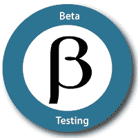
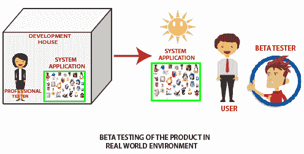

# 测试介绍

> 原文：<https://www.javatpoint.com/beta-testing>

如果我们比较为开发理想的软件而进行的各种活动，我们会发现软件测试的重要性类似于软件开发过程的重要性。测试是确保开发过程的准确性，同时验证其功能和性能的活动之一。

## 什么是 Beta 测试？

测试版测试是最关键的测试之一，在软件发布前执行，是一种类型的 **U** ser **A** 接受 **T** 测试。测试是现场测试的一种。该测试在 ***软件*** 测试生命周期结束时执行。这种类型的测试可以被认为是外部用户验收测试。这是一种显著的测试。真正的用户执行这个测试。该测试在阿尔法测试之后执行。在这个新版本中，测试版发布给有限的受众，以检查可访问性、可用性和功能性等。

*   测试版测试是测试的最后阶段，在客户或客户的现场进行。

* * *

## beta 测试的特点是什么？

产品测试由软件应用程序的真实用户在真实环境中执行。该软件的测试版发布给有限数量的最终用户，以获得产品质量的反馈。Beta 测试降低了失败的风险，并通过客户验证提供了产品的质量。这是将产品运送给客户之前的最后测试。Beta 测试从客户那里获得直接反馈。它有助于在客户环境中测试产品。

**beta 测试的特点是:**

*   在用户站点的真实环境中使用的 Beta 测试。Beta 测试有助于提供质量的实际位置。
*   由客户、利益相关者和最终用户执行的测试。
*   Beta 测试总是在 alpha 测试之后、发布到市场之前进行。
*   Beta 测试是黑盒测试。
*   测试在没有测试人员和真实用户的情况下进行
*   Beta 测试在 alpha 测试之后、最终产品发布之前进行。
*   测试版测试通常用于测试软件产品，如实用程序、操作系统和应用程序等。

* * *

## 什么是软件的测试版？

该软件的测试版交付给数量有限的用户，以接受他们对质量改进的反馈和建议。因此，测试版有两种类型:

**1)封闭测试版:**封闭测试版，也叫私人测试版，是发布给一群被选中和邀请的人。这些人将测试软件并评估它们的特性和规格。这个测试版代表了能够交付价值的软件，但是它还没有准备好被每个人使用。因为它显示了缺少文档或缺少重要功能等问题。

**2)公测版:**公测版也叫公测版。公开测试版向公众开放。作为测试人员的任何用户都可以评估测试版，以提供相关的反馈和评论。开放测试版提高了最终版本的质量。这个版本有助于发现各种未检测到的错误和问题。

***测试版测试流程定位这个测试版。*T3】**

* * *

## Beta 测试的生命周期是什么？

一组最终用户执行测试。没有任何策略或测试计划，这个过程就无法执行。在测试人员之前，最终用户执行这种类型的测试。

测试过程遵循以下步骤:

1.  **规划:**和另一个测试过程一样，beta 测试也支持适当的规划。在这个阶段，团队准备一个测试策略并定义测试的目标。在这种情况下，团队确定用户对测试、持续时间和与过程相关的必要细节的需求。
2.  **参与者招募:**这是 beta 流程的第二阶段，团队招募一组选定的最终用户进行测试。该组可以根据组织和产品的要求进行更改。
3.  **产品发布:**一个用户(测试人员)团队招募时。产品的测试版在客户端或用户端推出或安装，用户将测试产品的质量保证。
4.  **收集和评估反馈:**测试结束后，开发人员会收集测试人员提供的反馈并进行评估。最后，根据反馈，问题和 bug 由负责的个人团队修复和解决。
5.  **结束:**当所有的问题都解决了，并且组织满足退出标准时，beta 测试就实现了，并且奖励给了测试团队。

* * *

## beta 测试有哪些类型？

Beta 测试有六种类型。每种类型都有软件的不同方面。所有这些都有助于开发人员提高软件的质量，并允许他们交付提供卓越用户体验的产品。以下是不同类型的 beta 测试:

1.  **开放测试版测试:**开放测试版测试涉及在最终发布前由大量人员对软件产品进行测试。组织决定在发布软件产品之前向公众开放该产品。开放测试版包括公众的广泛参与，以相应地使用和评估软件产品。
    用户向组织报告错误，并提出改进软件质量的建议。
2.  **封闭 beta 测试:**与开放 Beta 测试相反。由有选择性且人数有限的人员执行的封闭测试。这个组织招募这些人。在此测试软件产品不对公众开放。
3.  **传统 Beta 测试:**在这个测试中，一个软件产品交付到目标市场，收集用户的反馈。这种类型的测试有助于 beta 测试，软件质量得到提高，开发人员可以进行更改。
4.  **公测测试:**这类测试类似于开放测试。借助世界上各种在线渠道，公共测试版还允许产品交付给全球最终用户。由此，反馈和评估数据也被收集并基于需求变化，开发团队实现修改。
5.  **技术 beta 测试:**技术 beta 测试也是 Beta 测试必不可少的类型。这个测试包括将软件产品交付给组织的内部团队。但是，组织员工提供的数据和反馈。
6.  **集中测试版测试:**这种类型的测试侧重于监控和评估软件的特定特性或组件。在集中测试中，软件被发布到市场，用户的体验被评估和收集，以做出所需的改变。
7.  **发布后 Beta 测试:**在本次测试中，产品交付市场供最终用户使用。他们的反馈、反应和经验是为软件的未来发布收集的。

* * *

## 何时执行测试版测试？

验收测试是测试的最后阶段，它结合了 alpha 和 beta 测试，以确保产品完美发布。在用户端执行的测试。这种测试总是在阿尔法测试之后，但在产品发布到市场之前进行。在这个阶段，产品预计完成 90%到 95%。

任何正在进行测试的产品在发布前都应该对整个清单进行审查。

其中一些是:

*   产品的所有组件都准备好开始测试了。
*   最终用户应准备好文档-安装、安装、使用、卸载应详细说明。
*   产品管理团队应审查所有功能是否处于良好状态。
*   收集错误、反馈等的程序。应该在发布前确定。

* * *

## Beta 测试中有哪些利益相关者和参与者？

产品管理、质量管理和用户体验团队是 beta 测试中的利益相关者，他们密切监控阶段的每一步。

***真正使用产品的用户是参与者。*T3】**

**Beta 测试策略**

*   产品的业务目标。
*   Beta 测试计划
*   参与者遵循的测试方法。
*   用于检测错误、测量生产率、收集反馈的工具。
*   何时以及如何结束这个测试阶段？

* * *

## 什么是测试计划？

测试计划可以用多种方式编写，

**目标:**我们应该提到项目的目标，为什么即使在执行内部测试之后，仍然需要进行 beta 测试。

**范围:**在这个计划中，我们应该提到要测试或不测试的区域。

**测试方式:**我们要提清楚的是，测试是在深层的，重点是什么——功能、UI、响应等。

**时间表:**我们必须明确规定开始和结束日期，以及时间、周期数和每个周期的持续时间。

**工具:** Bug 记录工具和机器的使用情况应该识别。

**预算:**根据严重程度激励 bug。

**反馈:**收集反馈和评估方法。

*   ***识别并审核出入境标准。*T3】**

### Beta 测试的进入标准是什么？

*   签署阿尔法测试的文件。
*   软件的测试版应该准备好了。
*   环境应该准备好向公众发布软件应用程序。
*   为了捕捉实时故障，环境应该做好准备。

### Beta 测试的退出标准是什么？

*   所有的大事小事都解决了。
*   反馈报告应该准备好。
*   测试总结报告的交付。

* * *

## Beta 测试的优势是什么？

在软件测试生命周期结束时执行的测试。Beta 测试为测试人员、软件开发人员以及用户提供了许多好处。在这种测试的帮助下，它使开发人员、测试人员能够在产品上市之前对其进行测试。这

1.  测试侧重于客户的满意度。
2.  它有助于通过用户验证降低产品失败的风险。
3.  Beta 测试有助于获得用户的直接反馈。
4.  它有助于检测系统中的缺陷和问题，这些缺陷和问题被软件测试团队忽略和未被发现。
5.  Beta 测试帮助用户安装、测试和发送关于开发软件的反馈。

* * *

## Beta 测试的缺点是什么？

beta 测试的缺点是:

1.  在这种类型的测试中，软件工程师无法控制测试过程，因为真实环境中的用户执行测试。
2.  这种测试可能是一个耗时的过程，可能会延迟产品的最终发布。
3.  测试版测试并不深入测试软件的功能，因为软件仍在开发中。
4.  根据没有正确使用软件的用户的反馈来工作是浪费时间和金钱。

* * *

## 包裹

牢记 beta 测试的特点可以得出结论，beta 测试可能被认为是组织所期望的。Beta 测试提供了真实用户的反馈，这有助于在产品上市之前提高软件质量。

* * *