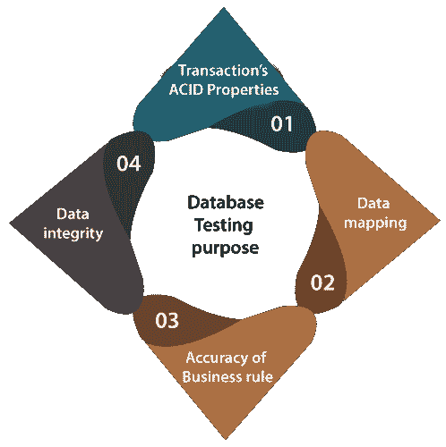
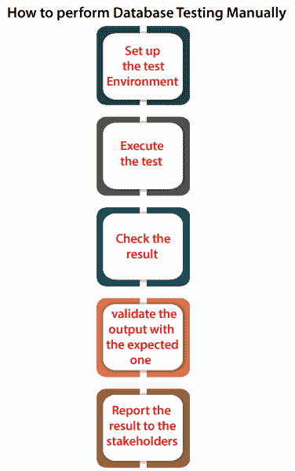
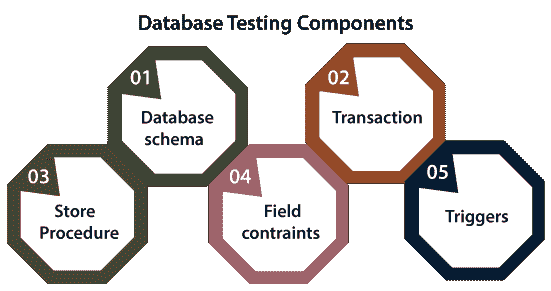
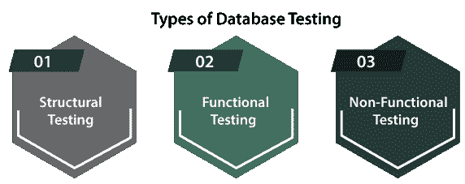
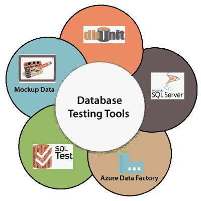
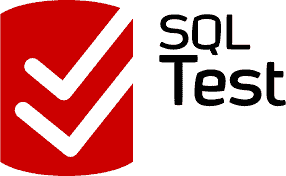
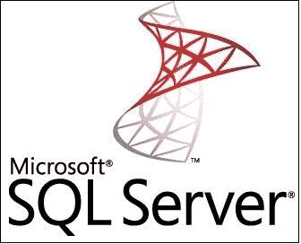

# 数据库测试

> 原文：<https://www.javatpoint.com/database-testing>

在本节中，我们将了解**数据库测试**，它检查模式、表、触发器等。正在测试的数据库的。

我们还了解了以下数据库测试概念:

*   **为什么我们需要使用数据库测试**
*   **数据库测试流程**
*   **数据库测试类型**
*   **如何手动和借助自动化工具**进行数据库测试
*   **在数据库测试过程中，我们可能会面临哪些不同的挑战？**
*   **数据库测试的组件。**

在讨论**数据库测试**之前，我们先了解一下**数据库的定义。**

### 什么是数据库？

一个数据库是预先安排好的包含信息的数据集合，有助于数据操作。用户可以轻松管理和检索数据库。我们可以将数据建立到表、行、列和索引中，从而更容易识别合适的数据。

在数据库中，数据管理变得非常容易，因为我们可以将数据库用作**数据库来检索**信息，如用于存储数据的**表、用于数据操作的函数、触发器以及用于数据表示的视图。**

#### 注意:随着时间的推移，由于软件系统中存储了大量数据，数据库变得更加困难。

在理解了数据库的概念之后，我们现在来主要讨论一下**数据库测试**。

## 数据库测试简介

在[软件测试](https://www.javatpoint.com/software-testing-tutorial)中，**数据库测试**是测试，用来分析模式、表、触发器等。正在测试的数据库的。它还评估数据的完整性和一致性，这可能包括创建困难的查询来加载和压力测试数据库并检查其响应性。

一般来说，它包含分层的过程，包括**数据访问、用户界面、业务层以及数据库层。**

在数据库测试期间，我们可以涵盖以下数据库活动，例如:

*   **测试数据完整性**
*   **检查数据有效性**
*   **性能检查相关**
*   **数据库中的触发器和函数**
*   **测试各种程序**

## 为什么我们需要执行数据库测试？

如果我们执行数据库测试，它将确保数据库的效率、最大稳定性、性能和安全性。

并且这些特性可以被搁置一旁，偶尔进行检查，以确认软件应用在竞争环境中部署后是稳定的。要进行数据库测试，我们必须具备 **SQL** 的基础知识。

要获得更多关于 SQL 的信息，我们可以参考以下链接:[https://www.javatpoint.com/sql-tutorial](https://www.javatpoint.com/sql-tutorial)

## 数据库测试的目的是什么？

执行数据库测试的主要目标是确保它们遵循各个方面:

*   **交易的酸性属性**
*   **数据映射**
*   **业务规则的准确性**
*   **数据完整性**



### 1.交易的酸性属性

数据库测试将确保交易的 ACID 属性。

数据库执行这四种 ACID 属性。酸的性质如下:

*   **原子性**
*   **一致性**
*   **隔离**
*   **耐久性**

**原子性**

*   术语**原子性**在事务细节中，数据保持原子性，这意味着如果对数据执行任何操作，它应该完全执行或实现，或者根本不应该实现。
*   也被称为**全有或全无**。

**一致性**

*   术语**一致性**指定在事务中完成事务后，该值应始终保持不变。
*   数据的完整性非常重要，因此，数据库在事务前后保持一致。数据应该总是正确的。

**隔离**

*   在事务中，术语**隔离**意味着分离，这意味着多个事务可以同时实现，而不会相互影响，也不会改变数据库状态。
*   或者，如果两个或多个事务同时发生，一致性应该保持不变。

**耐久性**

*   **耐久性**这个词确保了事物的持久性，这进一步暗示了如果一个事务被提交，不管外部因素的影响如何，它都将保持修改没有任何失败。
*   数据的持久性应该是完美无缺的，即使系统出现故障，数据库仍然存在。

### 2.数据配置

**数据映射**是数据库测试中必不可少的功能，主要是验证应用和后端数据库之间来回传递的数据。

以下是在数据映射中测试的一些重要特性:

*   我们分析用户界面或前端方法是否不断地与数据库表中的等价字段进行映射。
*   典型地，这个映射信息在需求文档中被指定。
*   当一个特定的动作在应用的前端完成时，一个等价的**创建、检索、更新和删除【CRUD】**活动在后端被使用。
*   然后，测试工程师必须评估是否使用了正确的活动，以及用户操作本身是否有效。

### 3.商业规则的准确性

*   数据库测试确保了业务规则的准确性，因为我们知道复杂的数据库会导致复杂的组件，如**存储过程触发器和关系约束。**
*   因此，测试工程师将提出适当的 SQL 命令来验证复杂的对象。

### 4.数据完整性

*   数据库测试还确保了数据的完整性，我们可以在那里进行更新，最新的共享数据值应该出现在所有的表单和屏幕上。
*   如果该值不应该在一个屏幕上修改，而在另一个屏幕上显示旧的值，则可以同时更新状态。

## 如何执行数据库测试

我们可以手动或者借助一些自动化工具来执行数据库测试。

### 如何手动执行数据库测试

要手动执行数据库测试，需要遵循以下流程:

*   首先，我们将在本地系统中打开 **SQL 服务器**。
*   之后，我们将打开**查询分析器**来写命令和检索数据。
*   一旦我们能够检索到指定的数据，我们就会将详细的数据与预期的结果进行比较。
*   然后，我们可以更新或删除数据，以检查软件应用的性能。
*   测试数据库的一般测试过程与任何其他应用没有什么不同。因此，要运行测试，我们可以遵循以下步骤:



**步骤 1:设置测试环境**

首先，我们需要准备测试环境来测试软件应用。

**步骤 2:执行测试**

一旦我们建立了测试环境，我们将运行特定的测试用例。

**第三步:检查结果**

当测试用例成功执行而没有任何问题时，我们将检查指定的测试用例结果。

**步骤 4:用预期的输出来验证输出**

在检查测试用例结果之后，我们将验证与例外输出相同的输出。如果结果满足预期输出，测试用例将被视为通过；否则，它将被标记为失败。

**第五步:向利益相关者报告结果**

最后，我们将向特定软件应用的涉众报告结果。

#### 注意:如果我们设置环境，测试工程师和开发人员将开发所有可能的场景，这些场景可以通过应用执行。

然后，测试将涉及运行这些查询并检查数据完整性，这意味着结果数据需要真实、准确、完整、可检索和可验证。

测试还可以包括监控数据映射、不同的 ACID 属性，以及确保实现的业务规则的准确性。

## 自动化如何帮助数据库测试

在软件测试中，**自动化测试**用于减少重复性的人工工作，这有助于测试工程师更加专注于关键特性，这些特性对于数据库测试来说是一样的。

让我们看看自动化对测试工程师非常有用的几个场景:

*   **数据库模式中的修改**

当每个模式都被修改时，数据库需要进行深入测试，以确保一切就绪。以及根据数据库的大小涵盖的场景数量。如果我们手动完成，这个过程会很耗时。

*   **监控数据完整性问题**

由于人为错误或其他问题，可能会出现一组数据在恢复或其他操作中损坏的情况。

但是，如果我们考虑自动化的监控过程，发现这些变化变得更加容易，我们可以尽快修复它们。

*   **新的或频繁更改的应用**

众所周知，敏捷方法是测试的新时代，在每个冲刺阶段结束时，我们都会有一个新的版本投入生产，这意味着每 2-3 周就要完成一轮测试。

但是在自动化特性的帮助下，这在最近的冲刺中是完全不变的，我们可以专注于新的修改后的需求。

## 数据库测试组件

以下是数据库测试的组成部分:

*   **数据库模式**
*   **交易**
*   **储存程序**
*   **字段约束**
*   **触发**



### 1.数据库模式

数据库模式用于描述数据库及其组织中的数据工作。换句话说，我们可以说它只不过是对数据在数据库中的规划方式进行了适当的分类。

为了测试这些条件，我们有两种方法，解释如下:

**根据工具的重要性，可以使用以下方法之一:**

*   我们可以使用 **SchemaCrawler** 工具，这是一个免费的数据库模式发现和理解工具。
*   **正则表达式**是验证特定字段名称及其值的好方法。
*   要验证模式，我们可以使用以下 SQL 命令:

```

DESC<table name>

```

**根据数据库操作找到需求**

*   **字段名**以明确的字符开始或结束。
*   主键需要在设计任何其他字段之前生成。
*   特定值可以插入或不能插入具有约束的字段中。
*   为了便于恢复和搜索，外键必须完全编入索引。

### 2.处理

最重要的数据库测试组件之一是**事务**，因为当我们执行数据库测试时，ACID 属性需要满足。

*   最常用的语句如下:

```

BEGIN TRANSACTIONTRANSACTION#
END TRANSACTIONTRANSACTION#

```

*   为了确保数据库保持一致的状态，我们可以使用下面的**回滚**命令:

```

ROLLBACK TRANSACTION#

```

*   为了确保修改被复制，我们可以在执行上述命令后使用**选择**命令:

```

SELECT * FROM TABLENAME < Transactions Tables >

```

#### 注意:在上面的语句中，事务表是包含事务的表。

### 3.存储过程

存储过程与用户定义的函数相对平行。整个系统以最一致和正确的结果运行。

可由 **Execute 或调用 Procedure** 命令使用，一般输出为结果集格式。存储过程系统用于数据保存在关系数据库管理系统中的多个应用。

我们可以在整个**白盒和黑盒测试中测试存储过程。**

*   **白盒测试:**在白盒测试中，使用 Stubs 调用存储过程，然后验证输出是否与期望值相矛盾。
*   **黑盒测试:**在这里，我们可以操作**应用的前端(UI** )。并评估存储过程及其输出的实现。

### 4.字段约束

下一个数据库测试组件是**字段约束**，整个系统使用**默认值、排他值和外键。**

在这种情况下，我们可以很容易地验证从 SQL 命令中检索到的结果

为了确保实现数据库中的对象条件，我们可以执行前端(用户界面)操作。

### 5.扳机

**触发组件**用于独立实现一个完整的表格来记录输出。换句话说，我们可以说，如果特定事件发生在精确的表上，触发器(一段代码)可以被自动指示执行。

让我们看一个**示例**，在这里我们可以了解数据库测试中触发器组件的工作情况:

*   假设一个新员工加入了一家公司。而员工在做两个任务，分别是**开发和**测试。然后该员工被添加到**员工表中。**
*   一旦他/她被添加到**员工表中，**一个**触发器**可以将该员工添加到等效的**任务的**中
*   之后，我们可以按照常见的流程进行测试，首先将 SQL 命令独立植入触发器，然后记录结果。
*   最后，我们可以按照这个过程作为一个完整的系统来执行触发器，然后比较结果。

这些类型的测试以两种方式完成，如下所示

*   **[白盒测试](https://www.javatpoint.com/white-box-testing)**
*   **[黑盒测试](https://www.javatpoint.com/black-box-testing)**

白盒测试和黑盒测试都有自己的程序和规则集，帮助我们获得精确的结果。

## 数据库测试的类型

数据库测试分为以下三种不同类型的测试:

*   **结构测试**
*   **[功能测试](https://www.javatpoint.com/functional-testing)**
*   **[非功能测试](https://www.javatpoint.com/non-functional-testing)**



让我们逐一了解每种类型:

### 结构数据库测试

*   **It** 是最重要的数据库测试技术，用于验证数据存储库中的所有元素，这些元素主要用于数据存储，不允许最终用户直接操作。
*   如果我们想成功完成这个测试，我们必须对 SQL 命令有一个完整的理解。
*   在结构化数据库测试中，我们可以测试用户不可见的数据库组件。
*   结构化数据库测试主要用于验证数据库。

### 功能数据库测试

*   最重要的数据库测试方法是功能数据库测试，它用于从最终用户的解释中授权数据库的功能需求。
*   功能数据库测试的主要目的是测试最终用户的事务和操作是否按照预期连接到数据库工作。

### 非功能测试

在数据库测试的主题中，根据业务需求，非功能测试可以分为几类。

非功能测试的一些重要部分如下:

*   负载测试
*   压力测试
*   [安全测试](https://www.javatpoint.com/security-testing)
*   [可用性测试](https://www.javatpoint.com/usability-testing)
*   [兼容性测试](https://www.javatpoint.com/compatibility-testing)

#### 注意:负载测试和压力测试属于性能测试，这有助于实现两个特定的非功能测试目标。

## 数据库测试有哪些不同的挑战？

在执行数据库测试时，我们可能会遇到以下挑战。

在下表中，我们列出了一些常见挑战及其解决方案:

| 不同的挑战 | 解决方法 |
| **测试海量数据和生产模拟数据库** | 

*   Reducing or enhancing the database will be the best solution, because it is as close to the production data set as possible.
*   Although testing in a production-like environment is a good method, sometimes testing on a large amount of data can become very challenging and time-consuming.

 |
| **数据的重新可用性再次用于测试和测试数据创建** | 

*   To solve this specific problem, we need a better strategy to generate all necessary data for all stretching repetitions. Then, we can use the detailed data carefully.
*   All commands need to be separated from each other; For example, the input data and output of one command will not modify the output of another command.

 |
| **数据和查询的分离** | 

*   Product quality depends on cost.

 |
| **从海量数据库中获取数据需要花费成本和时间** | 

*   Therefore, it is very important to keep a balance among the project schedule, expected quality and data load and other factors.

 |
| **频繁更改数据库结构** | 

*   When performing database tests, database test engineers often face this challenge.
*   The best solution to specific challenges is that database testers need to create test cases and SQL commands derived from specific structures, which are modified at the time of implementation or through any other retesting.
*   In order to avoid the final delay, we need to intercept the modification and influence as soon as possible.

 |
| **不需要的数据修改** | 

*   The best solution for unnecessary data modification in DB test is access control.
*   We can only provide modification permission for a limited number of people.
*   And access to edit and delete options should be restricted.

 |

## 与数据库测试相关的误解或误区

当我们执行数据库测试时，我们可能会对数据库测试有一些误解。

让我们一个接一个地看到它们，也理解相关神话的现实:

| 误解还是神话 | 现实 |
| **由于数据库测试，整体开发过程会变慢。** | 对于这个神话，现实是数据库测试帮助我们提高了数据库应用的整体质量。 |
| **数据库测试是一项单调的工作，涉及大量的专业知识。** | 在软件测试中，数据库测试是一个高效的过程，它为整个应用提供了长期的功能稳定性。 |
| **数据库测试是一个昂贵的过程。** | 数据库测试的费用是必需的，因为数据库测试的任何费用都是长期投资，会导致应用的长期健壮性和恒定性。 |
| **数据库测试增加了瓶颈的额外工作。** | 相反，在数据库测试的帮助下识别隐藏的缺陷会提高整体工作的价值。 |

## 数据库测试中使用的自动化工具

我们在市场上有几种数据库测试工具，但是这里我们讨论一些最常用的数据库测试自动化工具，如下所示:

*   数据工厂
*   SQL 测试
*   实体模型数据
*   微软
*   DbUnit



### 数据工厂


*   数据工厂是最流行的数据库测试工具之一。
*   大多数情况下，它用于商业数据库测试工具，这意味着这个庞大的项目可以通过数据工厂工具进行测试。
*   它在数据库测试环境中充当数据生成器和数据管理器。
*   对于处理具有大量数据的复杂命令，它是最有效的工具。
*   该工具为我们提供了一个平台，可以轻松地对数据库执行压力或负载测试。

### SQL 测试



*   SQL 测试是市场上最常用的数据库测试工具。
*   它是一个开源工具 **tSQLt** 框架，这意味着它至少可以被所有的数据库测试工程师使用一次。
*   它允许我们执行 SQL Server 数据库的单元测试。
*   在这个工具的帮助下，我们可以轻松地执行大量的 SQL 测试。
*   该工具的主要缺点是与市场上的其他数据库测试工具相比速度较慢。

### 模型数据


*   实体模型数据测试工具也属于测试数据生成器类别，并且是商业测试工具。
*   在这个工具中，我们需要在表中添加列来验证输出。
*   它帮助我们用准确的数据创建了大量的数据、CSV 文件和数据库。
*   它会快速创建大量数据，并测试几个表与外键的关系。

### 微软



*   微软的 SQL 服务器工具被广泛用于执行单元测试。
*   这是一个商业工具，我们可以在 VB 或 C#项目中生成，测试工程师应该在开始测试之前了解项目模式。
*   即使我们是从数据库项目创建测试，我们也可以使用 SQL Server 对象资源管理器。
*   这个工具的主要缺点是没有任何好的用户界面。

### DbUnit


*   它是一个开源工具，也被称为**JUnit 扩展**。
*   它可以帮助我们将数据导入和导出到数据库，处理大型数据库。
*   最初执行**清洁-插入**操作；这就是为什么它不执行任何进一步的清理。
*   在**DBunit**工具的帮助下，我们可以探索数据并连接关系数据库和多维数据库。

## 结论

在**数据库测试**部分，我们学习了以下主题:

*   数据库测试是测试，用于分析模式、表、触发器等。正在测试的数据库的。
*   为了理解数据库测试过程的关键概念，数据库测试工程师必须了解数据库测试的各种特性、类型、手动和自动化过程以及数据库测试工具。
*   在本教程的帮助下，我们了解了数据库测试的误解或解决方案。

* * *