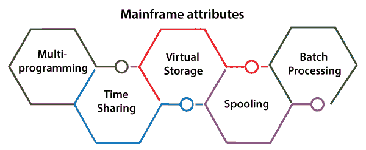
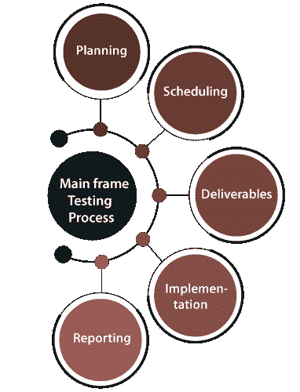
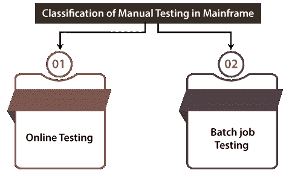

# 主机测试

> 原文：<https://www.javatpoint.com/mainframe-testing>

在本节中，我们将了解**大型机测试**，它用于测试大型机系统上开发的软件或应用程序和服务。

我们还了解了大型机属性、大型机测试的类型、如何执行、执行大型机测试时的不同挑战和故障排除、大型机测试中使用的各种命令、大型机测试期间面临的一些常见问题以及大型机自动化测试工具。

在理解大型机测试的概念之前，我们将了解大型机。

## 什么是大型机？

大型机是一个多用户、高性能和高速的计算机系统。大型机是最可靠、最可扩展、最安全的机器系统。

换句话说，我们可以说这些系统用于更大规模的计算，这涉及到很高的可用性和安全性。大型机系统主要用于各种细分领域，如零售、保险、金融和其他需要多次处理海量数据的关键领域。

在这种情况下，借助以下几个方面，我们可以每秒执行大约百万条指令[高达 **569，632 MIPS** :

*   **最大输入输出带宽**:如果我们有极致的输入输出带宽，那么驱动器和处理器之间的连接会有几个卡点。
*   **可靠性**:主机经常同意**优雅降级**并在系统运行的情况下服务。
*   **可靠的单线程性能**:对于针对数据库的实际操作很重要。
*   **最大输入/输出连接**:最大输入/输出连接意味着大型机擅长提供巨大的磁盘场。

了解了大型机概念之后，现在我们来了解一下 ***大型机测试*** 的主要讨论点。

## 什么是大型机测试？

大型机测试的主要目标是通过验证和确认方法来确保应用程序或服务的可靠性、性能和卓越性，并检查它是否准备好部署。

测试人员在执行大型机测试时只需要知道 CICS 屏幕的导航，因为这些是为特定应用程序定制的。

如果 COBOL、JCL 等中的代码发生任何修改，测试人员也不必担心机器上设置的仿真器。

### 我们在哪里进行主机测试？

通常，大型机测试是在输入文件中设置了多个数据组合的部署代码上执行的。换句话说，我们可以说**大型机应用程序**必须在生产运行之前完成测试。

大型机应用程序，或者称为批处理作业，是在与需求相矛盾的测试用例中进行测试的。

运行在主机上的软件或应用程序可以通过终端仿真器检索。

在理解了大型机测试之后，我们将研究大型机测试的几个特征。

## 大型机测试方法

在大型机测试中，软件或应用程序由**最终用户**以不同于网络应用程序的方式检索。

应用程序测试人员应该知道这些显著的差异，如下所示:

| 网络应用 | 大型机应用程序 |
| 网络应用程序通过两层架构**【客户端/服务器】**或三层架构【**表示层/应用程序/数据库存储层**】获得。 | 在大型机应用程序中，最终用户必须直接登录系统。 |
| 网络应用通过**浏览器或用户界面**进行检索。 | **终端仿真器**必须检索网络应用程序。 |
| 在这种情况下，测试可以直接在应用程序屏幕上执行。 | 在这方面，测试人员应该对大型机操作有精确的了解。 |
| 在 web 应用程序中，一些处理是在客户端完成的，在测试开始之前，应用程序应该安装在正确的位置。 | 在大型机测试中，**终端仿真器**是唯一的软件，它必须加载到客户端机器中，用于测试主服务器中存在的应用程序。 |

## 大型机属性

在大型机测试中，我们有以下大型机特性；让我们一个一个来看:

*   **多道程序设计**
*   **分时**
*   **虚拟存储**
*   **缠绕**
*   **批量加工**

**多道程序设计**

*   多道程序属性是一种工具，它允许我们有效地利用 CPU。
*   计算机同时执行各种程序。

**分时**

*   **分时**处理又称为**前台处理**，而**批量作业处理**称为**后台处理**。因此，它被称为**交互处理**，因为它允许用户直接与计算机联系。
*   在分时系统中，每个用户都可以通过终端设备访问系统。

**虚拟存储**

*   虚拟存储使用磁盘存储作为真实存储的扩展。
*   这是一种有效使用内存来存储和执行许多大小的任务的技术。

**缠绕**

*   假脱机是指**外围设备同时在线操作，**用于累积程序或应用程序的输出。
*   如果需要，假脱机输出将被定向到输出设备，如打印机。

**批量加工**

*   批处理是一种我们可以以单位完成任何任务的技术，也称为**作业**。
*   我们可以根据作业按顺序执行一个或多个程序。
*   作业计划程序总结了作业执行的顺序。
*   根据工作的重要性和类别来计划工作，以使平均产出最大化。
*   批处理借助**作业控制语言(JCL)为我们提供必要的信息。**

## 如何进行大型机测试

主机测试可以通过两种方式进行，手动**或者使用一些 **[自动化工具](https://www.javatpoint.com/automation-testing-tool)** 如 **QTP、REXX、IBM 应用性能分析器等。**但一般情况下，我们会手动执行主机测试**。****

 ****要进行大型机测试，我们需要遵循以下步骤:

**第一步:规划**

首先**业务团队**或**开发团队**构建**测试计划**，包括**业务需求文档、系统需求文档**、其他**项目文档**和**输入**。它还控制着一个特定的项目或过程在发布周期中如何被改变。

同时，为了提前准备测试场景和测试用例，测试团队将协调开发和项目管理团队。

**第二步:调度**

一旦需求文档准备成功，它将被移交给开发团队和测试团队。测试时间表应该和项目交付计划一起书写，应该是准确的。

**第三步:可交付成果**

收到文档后，他们将检查可交付成果。交付成果应该很好地描述，没有任何不确定性，并且应该满足测试目标的范围。

**第四步:实施**

之后，应该按照计划和交付成果进行实施。

一般来说，应用程序的 15-25%将直接受到发布中修改后的需求的影响。另外 60-75%的发布将取决于开箱即用的特性，例如测试应用程序和流程。

因此，我们需要以两种方式测试大型机应用程序:

*   **测试要求**
*   **测试集成**

**测试需求:**我们将针对需求文档中披露的特性或修改对应用程序进行测试。

**测试集成:** [回归测试](https://www.javatpoint.com/regression-testing)是本次测试活动的主要关注点。我们将测试整个过程或其他接收或发送数据到珍贵应用程序的应用程序。

**第五步:报告**

之后，我们将定期与开发团队分享测试结果。为了保持连续性，测试团队应该与开发团队保持联系，以便在关键条件下进行即时修改。

## 大型机手动测试的分类

主机**手动测试**可分为以下两种类型:

*   **在线测试**
*   **批量作业测试**

### 在线测试

*   在线测试是指对 **CICS 屏幕**的测试，相当于**对**的网页测试，现有屏幕的功能可以改变，也可以增加新的屏幕。
*   各种应用程序可以有查询和修改屏幕，其中屏幕的功能需要作为在线测试的一部分进行测试。

### 批量作业测试

*   一般在批处理作业测试中，测试过程包含功能的**批处理作业**，在现有版本中执行。
*   测试结果将从输出文件中提取，并且数据库应该被测试和记录。

## 大型机测试命令

在大型机测试中，我们使用了各种命令，这些命令在测试应用程序或软件时非常有用。

下表显示了大型机测试中最常用的一些命令:

| 命令 | 描述 |
| **复制** | COPY 命令用于**复制数据集。** |
| **提交** | SUBMIT 命令用于**提交后台作业。** |
| **重命名** | RENAME 命令用于**重命名**数据集。**** |
| **删除** | DELETE 命令用于**移除数据集。** |
| **作业扫描** | JOB SCAN 命令用于**修复带有库、程序、文件、**等的 JCL，而不实现它。 |
| **取消** | 取消命令用于**取消****后台作业。** |
| **分配** | ALLOCATE 命令用于**分配数据集。** |

#### 注意:在执行大型机测试时，我们有一些其他命令，但它们并不经常使用；因此，只要需要，我们就使用这些命令。

## 大型机操作的必备统计信息

在应用程序上执行大型机测试时，测试人员应该掌握关于大型机操作的以下信息:

*   **菜单操作必须使用 ISPF【交互式系统生产力设施】**。
*   **TSO【分时选项】**是一种借助命令访问虚拟存储和管理数据集的方法。
*   测试软件时必须使用**文件传输协议**或其他传输协议。
*   如果主机是后端，我们应该使用**跨平台操作**。
*   **SDSF【系统显示和搜索设施】**必须用于控制操作和系统资源。
*   必须遵循批处理作业管理。
*   CICS 事务必须用于测试 IBM 大型机。

## 大型机测试挑战和故障排除

如果我们在应用程序上执行大型机测试，我们可能会遇到一些挑战，对于这些挑战，我们有一些特定的方法，如下表所示:

| 挑战 | 说明 | 方法 |
| **要求不明确或不完整** | 有时，用户可以访问**用户手册或培训指南**，但它们与文档要求不相似。 | 

*   Test engineers should actively participate in the software development life cycle (SDLC) from the requirements stage to overcome the ambiguous requirements.
*   If the requirements are testable, this will help them easily verify.

 |
| **识别或数据设置** | 有时，测试人员可能有条件按照需求重用当前数据。但偶尔也很难从目前的数据中找到强制性的细节。 | 

*   In order to overcome the challenge of data setting, we can use domestic tools as needed.
*   To get the existing data, the query should be carried out in advance.
*   If there is any problem, please ask **data management team** to generate or copy important data.

 |
| **作业设置** | 当作业保存到产品数据系统中时，需要在质量保证区域设置作业。
因此，提交的作业不带有生产限定词。 | 

*   Therefore, you can use the job setting tool to overcome the human error in the setting process.

 |
| **临时请求** | 有时，我们可能会遇到由于上游或下游应用出现问题而需要维护**端到端测试**的情况。**特别请求**增加执行周期的时间和精力。 | 

*   In order to overcome specific challenges, we can use some regression scripts, automation scripts and skeleton scripts, which can reduce the time and energy costs.

 |
| **范围变更的按时放行** | 有时，我们会遇到代码效果可能会完全改变系统外观的情况。修改可能发生在测试用例、脚本和数据中。 | 

*   Therefore, the process of impact analysis and scope change management should be put in a proper position.

 |

## 大型机测试中要遵循的步骤

执行大型机测试时，需要遵循以下步骤:

**第一步:烟雾测试**

第一步，我们将执行[烟雾测试](https://www.javatpoint.com/smoke-testing)，在这里我们检查安装的代码是否在正确的测试环境中。它还确保代码没有关键问题，这节省了测试人员测试错误构建的时间。

**步骤 2:功能测试/系统测试**

烟雾测试完成后，我们将进行一轮功能测试或[系统测试](https://www.javatpoint.com/system-testing)，以独立和相互关联的方式测试各种型号的功能。

以下是实施系统测试时必须进行的测试类型。

*   **批量测试**
*   **在线测试**
*   **在线批量集成测试**
*   **数据库测试**

*   **批量测试**

我们将执行批处理测试，以验证输出文件上的测试结果以及批处理作业使用测试规范完成的数据修改。

#### 注意:批处理作业是一组事件，无需用户与可访问的计算资源进行任何交互即可实现。

*   **在线测试**

在线测试中，我们将测试大型机应用的**前端**功能。在线测试涵盖了各个方面，例如**用户友好性、数据输入验证、外观&感觉、屏幕内导航等。**

应该测试应用程序的准确输入字段，如计划利息、保险计划等。

*   **在线批量集成测试**

可以在具有批处理和在线应用的系统上执行在线批处理集成测试。在这里，我们还测试了在线流程与后端流程的集成特性。

基本上，在这个测试中，我们验证了数据流的准确性以及屏幕和后端系统之间的交互。批处理作业用于检查在线屏幕之间的数据流和通信。

*   **数据库测试**

数据库测试用于测试事务存储的数据是否符合系统规范。数据库验证了它们的布局和数据存储，数据存储包含来自大型机应用程序的数据，例如 **IMS、IDMS、DB2、VSAM/ISAM、顺序数据集、GDGs** 是

而在数据库测试中，我们也可以认证**数据完整性**等数据库参数的理想性能。

**第三步:系统集成测试**

系统集成测试用于检查与被测系统相关的系统功能。它是在单元级测试之后执行的，因为测试接口和一些消息类型很重要，如**作业成功、作业失败、数据库更新等。**

为了确保正确性，我们将测试跨模块和应用程序的数据流。执行系统集成测试是为了确保构建为部署做好准备。

在系统集成测试中，我们可以执行以下测试:

*   **批量测试**
*   **在线测试**
*   **在线批量集成测试**

**步骤 4:回归测试**

任何测试最重要的阶段是回归测试。回归测试是确保**批处理作业和在线屏幕**不能与被测系统直接相关，不受当前项目发布的影响。

回归测试保证在模块中完成修改，并且不影响父应用程序和集成应用程序的整体功能。

应该根据测试用例的复杂性接受一组特定的测试用例，并且应该创建一个**测试用例库**来获得一个成功的回归测试。无论何时有新的功能进入发布版本，都应该修改特定的测试。

**第五步:性能测试**

在大型机测试中，下一步是性能测试。在性能测试中，我们将尝试寻找重要领域的瓶颈，如前端数据、在线数据库升级，并预测应用程序的可扩展性。

在大型机应用程序中，我们可能会遇到以下性能缺陷:

*   在线**响应时间**可能会很慢，导致用户失望。
*   有时**批处理作业和后台进程**需要额外的时间，这影响了在线用户的系统可访问性。
*   可扩展性问题。

为了克服上述缺陷，我们应该在以下方面的帮助下适当地测试应用程序:

*   系统集成参数
*   应用程序和数据库设计
*   编码
*   系统和数据库参数
*   后端作业的定时

**第六步:安全测试**

安全测试包括评估**威胁、风险、漏洞**，并为应用程序和网络建议补救措施。

安全测试应涵盖**身份和访问管理、风险&合规管理、数据保护&隐私政策遵守方面的用例。**

换句话说，我们可以说，执行安全测试是为了检查应用程序的设计和开发情况，以应对相互冲突的反安全攻击。

安全测试应在两类安全系统上完成:**主机安全和网络安全。**

在安全测试中，我们需要测试以下几个方面:

*   批准
*   完整
*   证明
*   机密
*   有效

**步骤 7:敏捷方法**

敏捷方法用于简化应用程序的逐步开发，并快速响应修改。

#### 注意:在敏捷开发场景中，我们可以使用增量测试方法。

## 大型机自动化测试工具

我们在市场上有各种类型的大型机自动化测试工具。一些最常用的大型机自动化测试工具如下:

*   qtp
*   **REXX**

### QTP[快速测试专家]

QTP 工具用于测试基于 web 的应用程序的功能回归测试用例。QTP 代表**快测专业**，现在被称为**微焦点 UFT【统一功能测试】**。

这对新的测试工程师很有帮助，因为他们可以很快理解这个工具。QTP 是基于像 VB 脚本这样的脚本语言设计的，用于自动化应用程序。

**QTP 特色**

以下是 QTP 最常见的特征:

*   在这个工具中，我们可以执行 **BPT【业务流程测试】。**
*   QTP 使用脚本语言来部署对象，出于分析目的，它提供测试报告。
*   技术和非技术测试人员都可以使用 QTP。
*   QTP 支持多种软件开发环境，如甲骨文、思爱普、JAVA，
*   我们可以在 QTP 的帮助下测试桌面和网络应用。

### 重组扩展执行器

它是一种解释编程语言，建立于 **IBM** 。REXX 是为阅读和学习而设计的高级结构化编程语言。REXX 代表**重组扩展执行者**。

它被用作**脚本和宏**语言。换句话说，我们可以说 REXX 经常用于**处理文本、数据和生成报告**。

支持 **MVS、OS/2、AmigaOS、VM 等多种操作系统。**而 REXX 也可以在其他一些软件中作为**内部宏语言**，例如 **KEDIT、ZOC 终端仿真器、SPFPC 等。**

**REXX**的特点

以下是 REXX 最常见的特性:

*   它支持**不区分大小写的标记**，其中包含变量名。
*   通过使用 REXX，我们可以轻松访问系统服务和命令。
*   REXX 可以支持与特定情况相关的各种过程、函数和命令。
*   它支持基本的输入/输出优势。
*   它支持没有声明的动态数据类型。

## 执行大型机测试的优势

执行大型机测试过程的优势将在以下方面帮助我们:

*   它优化利用资源。
*   有助于避免多余的返工。
*   它增强了用户体验。
*   它减少了生产停机时间。
*   它有助于我们扩大客户保留。
*   这也有助于我们降低信息技术运营的整体成本。

## 概观

在大型机测试部分，我们学习了以下主题:

*   为了有效地测试应用程序，测试工程师应该参加由业务和开发团队安排的**设计会议。**
*   大型机测试与从**需求收集、测试设计、测试执行和结果报告**开始的任何其他测试过程一样。
*   我们已经理解了**主机属性**，如**多道程序、分时、虚拟存储、假脱机和批处理。**
*   我们了解到主机测试分类分为**在线测试和**批量测试两部分。在线和批量测试可以有效地实现，而不会遗漏需求规范文档中提到的任何功能。
*   我们已经了解了各种**大型机测试挑战和方法。**
*   我们学习了主机测试最常用的**命令**。
*   我们已经了解了几个**大型机自动化测试工具，**，它们帮助我们增强了大型机测试的流程。

* * *****