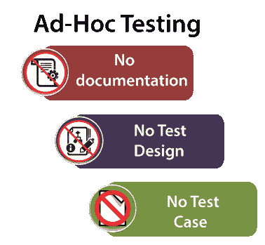
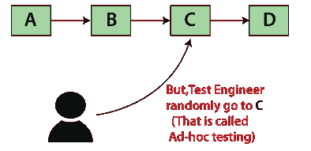

# 专项测试

> 原文：<https://www.javatpoint.com/adhoc-testing>

在这一节中，我们将了解即席测试、即席测试的类型、即席测试的必要性以及即席测试的优缺点。

## 什么是即席测试？

当构建在被检查的序列中时，我们进行这个测试，然后我们通过随机检查应用程序来进行即席测试。

即席测试也被称为**猴子测试和大猩猩测试**。

它是阴性测试，因为我们将根据客户的要求测试应用程序。

当最终用户随机使用应用程序时，他/她可能会看到一个 bug，但是专业的测试工程师系统地使用软件，所以他/她可能不会发现相同的 bug。

## 临时测试示例

**场景 1**

假设我们将对软件进行一轮功能测试、集成和系统测试。

然后，我们点击一些功能，而不是进入登录页面，它会进入空白页面，那么它将是一个 bug。

为了避免这种情况，我们进行了一轮即席测试，如下图所示:

**场景二**

在 Adhoc 测试中，我们不遵守要求，因为我们随机检查软件。我们的需求是 A？b？c？但是在执行 Adhoc 测试时，测试工程师直接进入 C 并测试应用程序，如下图所示:

**场景三**

假设我们使用两种不同的浏览器，如谷歌浏览器和 Mozilla Firefox，并在这两种浏览器中登录脸书应用程序。

然后，我们将在谷歌 Chrome 浏览器中更改密码，然后在另一个浏览器(火狐)中，我们将执行一些操作，比如发送消息。

它应该导航到登录页面，并要求再次填写登录凭据，因为我们在另一个浏览器(Chrome)中更改了我们的凭据，这个过程称为即席测试。

## 为什么我们需要执行即席测试？

当产品发布到市场上时，我们会进行 Adhoc 测试，因为客户从来不会为了这个目的按顺序/系统地使用应用程序；我们通过随机检查进行 Adhoc 测试来检查应用程序。

随机检查应用程序，不遵循任何顺序或程序由于用户不知道如何使用应用程序，他们可能会随机使用它，并找到一些问题来解决这个问题我们做一轮即席测试。

### 当我们进行即席测试时

当执行所有类型的测试时，我们会进行即席测试。如果时间允许的话，我们会在专项测试中检查所有的阴性情况。

## 特殊测试的类型

以下是特别测试的类型:

*   **伙伴测试**
*   **配对测试**

**伙伴测试**

好友测试至少由两名成员完成。一个成员来自测试团队，另一个来自开发团队。

当在应用程序上执行单元测试时，只有我们可以执行伙伴测试。这种类型的测试有助于开发团队和测试团队完成他们的工作。

**配对测试**

在这种类型的测试中，两个测试人员将一起工作来测试软件，在那里他们可以分享他们的想法并识别应用程序中的错误或缺陷。

其中一个将测试应用程序，另一个可以审查和分析应用程序。

## 即席测试的优势

以下是即席测试的一些好处:

*   即席测试不能遵循任何流程；这就是为什么它可以在软件开发生命周期的任何时候执行。
*   测试工程师可以用他们的新方法测试应用程序，这有助于我们找出许多与实际测试过程相比的错误。
*   开发人员还可以在开发模块时执行即席测试，帮助他们以更好的方式编码。
*   当需要更少时间进行深入测试时，可以进行专项测试，并按时交付优质产品。
*   专项测试不需要任何文件；这就是为什么测试人员可以更专注地测试应用程序，而不用担心正式的文档。

## 临时测试的缺点

以下是即席测试的缺点:

*   即席测试依赖于测试工程师的产品知识，因为他/她知道应用程序的流程，所以他/她知道应用程序可能在哪里崩溃，新的测试工程师可能不太熟悉应用程序。
*   有时复制 bug 很困难，因为在这个测试中，我们没有遵循任何计划。

* * *