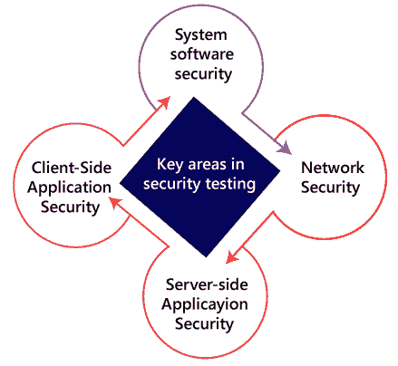
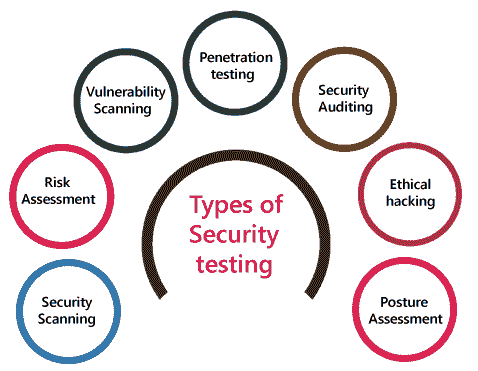
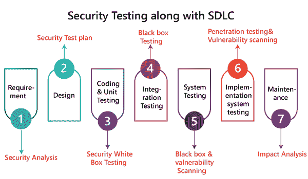

# 安全测试

> 原文：<https://www.javatpoint.com/security-testing>

## 什么是安全测试？

安全测试是软件测试不可分割的一部分，用于发现软件应用中的弱点、风险或威胁，并帮助我们阻止来自外部的恶意攻击，确保我们的软件应用的安全性。

安全测试的主要目标是发现应用的所有潜在歧义和漏洞，以便软件不会停止工作。如果我们执行安全测试，那么它将帮助我们识别所有可能的安全威胁，并帮助程序员修复这些错误。

它是一个测试程序，用于定义数据将是安全的，并继续软件的工作过程。

## 安全测试原理

在这里，我们将讨论安全测试的以下方面:

*   有效
*   完整
*   批准
*   机密
*   证明
*   不可否认性

### 有效

在这种情况下，数据必须由官方人员保留，他们还保证数据和报表服务随时可以在我们需要时使用。

### 完整

In this, we will secure those data which have been changed by the unofficial person. The primary objective of integrity is to permit the receiver to control the data that is given by the system.

完整性系统经常使用一些类似的基本方法作为保密结构。不过，它们通常包括通信数据，以创建算法检查的来源，而不是加密所有通信。并验证正确的数据是否从一个应用传送到另一个应用。

### 批准

它是定义允许客户端执行操作并接收服务的过程。授权的例子是访问控制。

### 机密

这是一个安全过程，它延长了外部人员泄露数据的时间，因为这是我们确保数据安全的唯一方法。

### 证明

认证过程包括确认个人的个性，追踪允许访问私人信息或系统所必需的产品来源。

### 不可否认性

它被用作数字安全的参考，并且它是一种保证消息的发送者不能不同意已经发送了消息并且接收者不能否认已经接收了消息的方式。

不可否认性用于确保声称发送和接收消息的人已经发送和接收了所传递的消息。

## 安全测试的关键领域

在 web 应用上执行安全测试时，我们需要集中精力在以下几个方面来测试应用:

### 系统软件安全

在本文中，我们将基于不同的软件评估应用的漏洞，如**操作系统、数据库系统**等。

### 网络安全性

在这里，我们将检查网络结构的弱点，如**策略和资源**。

### 服务器端应用安全性

我们将进行服务器端应用安全，以确保服务器加密及其工具足以保护软件免受任何干扰。

### 客户端应用安全性

在这方面，我们将确保任何入侵者都不能在客户使用的任何浏览器或工具上操作。

## 安全测试的类型

根据开源安全测试技术，我们有如下不同类型的安全测试:

*   **安全扫描**
*   **风险评估**
*   **漏洞扫描**
*   **渗透测试**
*   **安全审计**
*   **道德黑客**
*   **姿势评估**

### 安全扫描

[自动化测试](https://www.javatpoint.com/automation-testing)和[人工测试](https://www.javatpoint.com/manual-testing)都可以进行安全扫描。该扫描将用于查找基于 web 的应用、网站、网络或文件系统中的漏洞或不需要的文件修改。之后，它将带来帮助我们减少这些威胁的结果。这些系统需要安全扫描，这取决于它们使用的结构。

### 风险评估

为了降低应用的风险，我们将进行风险评估。在本文中，我们将探讨在关联中可以检测到的安全风险。风险可以进一步分为三个部分，分别是**高、中、低**。风险评估流程的主要目的是评估漏洞并控制重大威胁。

### 漏洞扫描

它是一个应用，用于确定和生成包含与网络相关的台式机、服务器、笔记本电脑、虚拟机、打印机、交换机和防火墙的所有系统的列表。漏洞扫描可以在自动化应用上执行，还可以识别那些已确认安全漏洞的软件和系统。

### 渗透测试

渗透测试是一种安全实施，网络安全专家试图识别和利用计算机系统中的弱点。这种测试的主要目的是模拟疫情，同时发现系统中的漏洞，并同样从入侵者那里获得好处。

### 安全审计

安全审计是一种评估组织安全措施的结构化方法。在此，我们将对应用和[控制系统](https://www.javatpoint.com/control-system-tutorial)进行内部审查，以了解安全故障。

### 道德黑客

[道德黑客](https://www.javatpoint.com/ethical-hacking-tutorial)用于发现系统中的弱点，也帮助组织在可恶的黑客暴露之前修复那些安全漏洞。道德黑客将帮助我们提高协会的安全地位，因为有时道德黑客使用的技巧、工具和技术与讨厌的黑客相同，但得到了官方人员的批准。

道德黑客的目标是增强安全性，保护系统免受恶意用户的攻击。

### 姿势评估

它是**道德黑客、风险评估和安全扫描**的组合，帮助我们展示一个组织的完整安全态势。

## 我们如何执行安全测试

安全测试需要在[软件开发生命周期](https://www.javatpoint.com/software-development-life-cycle)的初始阶段进行，因为如果我们在 SDLC 的软件执行阶段和部署阶段之后进行安全测试，会花费我们更多的成本。

现在让我们了解我们如何在软件开发生命周期(SDLC)的每个阶段并行执行安全测试。

**第一步**

**SDLC:** 需求阶段

**安全程序:**在 SDLC 的需求阶段，我们会做业务需求的安全分析，也验证哪些案例是可操作的、浪费的。

**第二步**

**SDLC:** 设计阶段

**安全程序:**在 SDLC 的设计阶段，我们将对设计进行**风险安全测试**探索，并在测试计划的制定阶段进行安全测试。

**第三步**

**SDLC:** 发育或编码阶段

**安全程序:**在 SDLC 的编码阶段，我们将执行白盒测试以及静态和动态测试。

**第四步**

**SDLC:** 测试([功能测试](https://www.javatpoint.com/functional-testing)、[集成测试](https://www.javatpoint.com/integration-testing)、[系统测试](https://www.javatpoint.com/system-testing))阶段

**安全程序:**在 SDLC 的测试阶段，我们会进行一轮**漏洞扫描**以及黑盒测试。

**第五步**

**SDLC:** 实施阶段

**安全程序:**在 SDLC 的实施阶段，我们将再次进行**漏洞扫描**，同时进行一轮**渗透测试**。

**第 6 步**

**SDLC:** 维护阶段

**安全程序:**在 SDLC 的维护阶段，我们将对影响区域进行**影响分析**。

**测试计划**应包含以下内容:

*   测试数据应该与安全测试相联系。
*   对于安全测试，我们需要测试工具。
*   借助各种安全工具，我们可以分析几个测试输出。
*   编写依赖于安全目的的测试场景或测试用例。

## 安全测试示例

通常，安全测试的类型包括基于过度思考的有问题的步骤，但是有时简单的测试将帮助我们发现最重要的安全威胁。

让我们看一个示例来了解我们如何在 web 应用上进行安全测试:

*   首先，登录 web 应用。
*   然后退出 web 应用。
*   然后单击浏览器的“后退”按钮，验证它是在要求我们再次登录，还是我们已经登录了应用。

## 为什么安全测试对 web 应用至关重要

目前，web 应用日益增长，大多数 web 应用都处于风险之中。在这里，我们将讨论 web 应用的一些常见弱点。

*   客户端攻击
*   证明
*   批准
*   命令执行
*   逻辑攻击
*   信息披露

### 客户端攻击

[客户端攻击](https://www.javatpoint.com/client-side-attacks)意味着在 web 应用中发生了一些外部代码的非法实现。数据欺骗行为占据了用户认为作用于 web 应用的特定数据是有效的地方，并且它不是来自外部来源。

#### 注意:在这里，欺骗是一种创建重复网站或电子邮件的技巧。

### 证明

在这种情况下，认证将涵盖针对认证用户身份的 web 应用方法的爆发，其中用户帐户的个性化将被窃取。不完整的身份验证将允许攻击者在不执行正确身份验证的情况下访问功能或敏感数据。

**例如****蛮力攻击**，蛮力攻击的主要目的是获取对 web 应用的访问。在这里，入侵者将反复尝试 n 个用户名和密码，直到它进入，因为这是阻止暴力攻击的最精确的方法。

毕竟，一旦他们尝试了所有规定数量的不正确密码，账户就会被自动锁定。

### 批准

每当一些入侵者试图从 web 应用中非法检索敏感信息时，授权就出现了。

**比如**，一个完美的授权例子就是**目录扫描**。在这里，目录扫描是一种将缺陷传递到 web 服务器中的爆发，以实现对公共区域中未提及的文件夹和文件的非法访问。

一旦入侵者成功获得访问权限，他们就可以下载脆弱的数据，并在服务器上安装有害的软件。

### 命令执行

当恶意攻击者控制 web 应用时，将使用命令执行。

### 逻辑攻击

当拒绝服务(DoS)爆发时，逻辑攻击被使用，避免了网络应用帮助常规的客户操作，也限制了应用的使用。

### 信息披露

信息披露被用来向入侵者展示敏感数据，这意味着它将涵盖那些计划获取关于网络应用的精确信息的事件。在这里，当 web 应用公开敏感数据时，就会发生信息泄露，比如错误消息或开发人员的评论，它们可能会帮助攻击者滥用系统。

**例如，**密码正在传递给服务器，这意味着在通过网络进行通信时，应该对密码进行编码。

**注:**

web 应用在访问和数据安全方面需要更多的安全性；这就是为什么网络开发人员会以这样的方式制作应用，以保护应用免受**暴力攻击、 [SQL 注入](https://www.javatpoint.com/sql-injection)、会话管理、限制 URL 访问失败和跨站点脚本(XSS)** 。此外，如果 web 应用简化了远程访问点，那么它也必须受到保护。

这里，**会话管理**:用于检查 cookies 在登录阶段是否可以在另一个计算机系统中重复使用。

**SQL 注入:**这是一种代码注入方法，破坏性的 SQL 语句被植入到一些查询中，并由服务器实现。

**跨站点脚本(XSS):** 这是一种技术，通过这种技术，用户在 web 应用的用户界面中引入客户端脚本或 HTML，其他用户可以看到这些添加的内容。

## 安全测试的神话和事实

在这里，我们将讨论安全测试的神话和事实:

| 神话 | 事实 |
| 在安全测试中，资产没有利润。 | 安全测试可以突出增强的部分，这有助于我们提高生产率和减少中断，并允许最大的输出。 |
| 如今，互联网不安全，我们将购买硬件或软件来挽救业务和保护系统。 | 在这里，事实是购买任何软件或硬件，公司首先了解安全性，然后遵循安全流程。 |
| 如果我们有一个小企业，我们不需要安全程序。 | 在这种情况下，事实是每个组织都需要一个安全程序。 |
| 唯一安全的方法是断开它。 | 保护关联的一个也是最优秀的方法是识别完美安全。在这里，与业务、许可和制造验证相比，通过执行实现可以实现完美的安全性。 |

## 安全测试工具

我们在市场上有各种安全测试工具，如下所示:

*   声纳员
*   活力
*   Netsparker
*   蛛形纲动物
*   铁黄蜂

有关这些工具的更多信息，请参考以下链接:

[https://www.javatpoint.com/security-testing-tools](https://www.javatpoint.com/security-testing-tools)

## 结论

对于应用或软件，有必要执行安全测试，以验证敏感信息仍然是私有的。在软件测试中，安全测试是必不可少的，因为它帮助我们最终保存必要的数据。在这种情况下，测试工程师将充当入侵者，测试系统或检测安全缺陷。

* * *