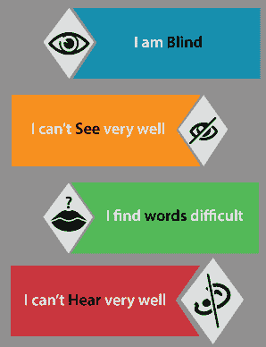
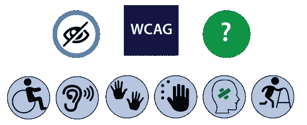
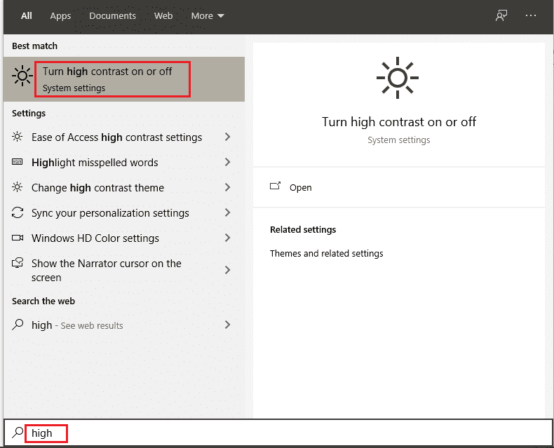
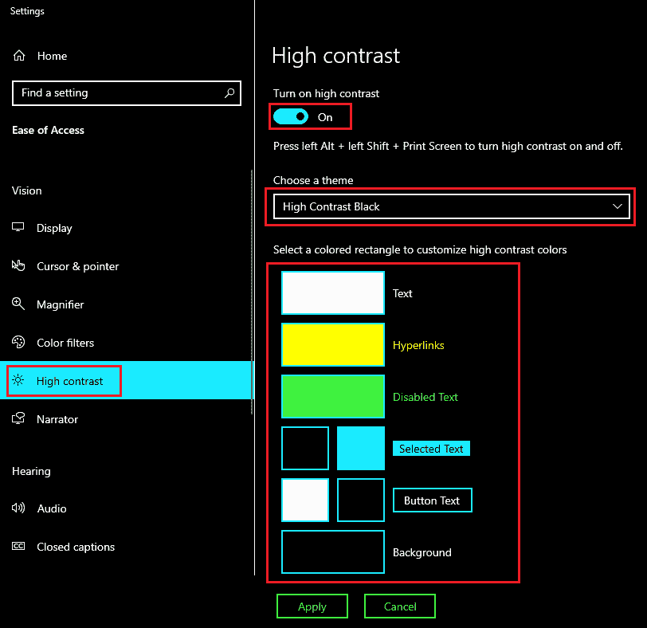
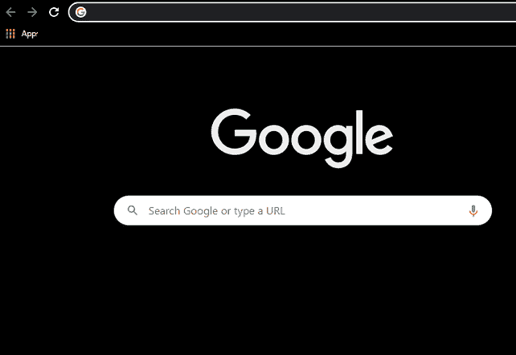
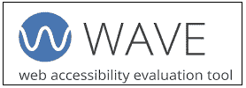

# 无障碍测试

> 原文：<https://www.javatpoint.com/accessibility-testing>

在软件测试中，**可访问性测试**被广泛用于检查**残疾人**的应用程序，并确保开发人员将创建所有类型的用户都可以访问的应用程序，如普通用户和残障人士(色盲、学习障碍等)。

在本节中，我们将讨论**可访问性测试**、我们**如何执行可访问性测试、**使用该测试的**目标**以及可访问性测试的**工具**。

## 什么是可访问性测试？

可访问性测试是另一种类型的[软件测试](https://www.javatpoint.com/software-testing-tutorial)，用于从残障人士的角度测试应用程序。这里的身体残疾可能是老年、听力、色盲和其他弱势群体。它也被称为 **508 符合性**测试。在本文中，我们将测试一个 web 应用程序，以确保每个用户都可以访问该网站。

对于可访问性测试，我们有一些确定的规则和条例，也需要遵守。

**无障碍测试法:**

*   **网站内容可访问性指导原则:**制定这些策略是为了服务于一个目的，这有助于我们提高网站的用户友好性。
*   **康复法，第 504 条和第 508 条:**

**第 504 条:**该条将通过提供工作空间、教育和其他组织来帮助残疾人。

**第 508 节**:第 508 节将通过让这些人获得技术来帮助他们。

*   **美国残疾人法案(ADA):**ADA 规则规定，所有领域，如学校和组织、公共建筑，都应该制造人人使用的工具。

身体有障碍的人将使用辅助工具来帮助他们开发软件产品。让我们看看市场上有哪些工具:

*   **专用键盘:**我们有一些用户可以快速打字的专用键盘，这些键盘是专门为有电机控制问题的用户设计的。
*   **屏幕阅读器软件**:这类软件是用来读出文字的，显示在屏幕上。
*   **语音识别软件:**语音识别软件将口语单词转换为文本，并作为计算机系统的输入。
*   **屏幕放大软件:**这种软件是为了帮助视力障碍者而设计的，因为它可以扩大屏幕，使阅读变得容易。

## 可访问性测试示例

让我们假设，如果一个盲人使用互联网，并点击任何东西，反应连接到声音，这个人可以听到，然后使用它。浏览器应该阅读回复，并对发票进行评论。

无论发送到浏览器的是什么响应，都可以很容易地读取，应用程序或软件应该这样设计。响应应立即连接到语音。因此盲人可以很容易地接近它。

应用程序的设计应确保即使是身体有缺陷的人也能够访问应用程序，而不会遇到任何困难。

可访问性测试有许多规则可以在开发软件或应用程序时遵循。一些基本策略如下:

*   不应使用或显示红色和绿色对象。
*   所有的注释都应该有 Alt 标记。
*   应用程序应该能够在关键字的帮助下访问所有组件。

## 可及性测试的目的

无障碍测试的主要目的是为残疾人提供便利，例如:

*   **听力不足:**在这种情况下，人听不清或听不清，并有听觉障碍和耳聋等感觉问题。
*   **学习障碍:**面临阅读困难的人群。
*   **肢体残疾:**在这种类型的残疾中，人们不能单手使用键盘或鼠标，面临手部活动、肌肉滞留和运动能力下降的问题。
*   **视觉障碍:**视觉或视觉障碍定义为当一个人完全失明、视觉能力差、色盲、闪光效果问题和视觉频闪时。
*   **认知不足:**在这种情况下，人会记忆力差，无法识别更复杂的场景，学习困难。

## 关于可访问性测试的神话和事实

| 神话 | 事实 |
| **无障碍测试只针对身体有缺陷的人。** | 所有类型的用户都可以使用可访问性测试，因为它们提高了软件的可信度。 |
| **我们正在将无法接近的应用程序修改为可用的应用程序，这给我们带来了大量的时间和金钱？** | 我们可以处理对有挑战的用户来说必不可少的典型需求，因为有时不需要一次集成所有的修改。 |
| **可达性测试成本高。** | 如果除了广泛的测试之外，我们还认识到设计阶段的可访问性问题，那么这种测试的成本并不高，这可以帮助我们降低成本并节省大量的返工。 |
| **可及性测试是一个基本且繁琐的执行过程。** | 在这里，我们可以用所有类型的用户都可以使用的方式来准备我们的应用程序。 |

## 如何执行可访问性测试

我们既可以手动执行**，也可以在**自动化**的帮助下执行可访问性测试。首先，我们看到我们如何手动执行可访问性测试**:****

 **对于可及性测试，我们市场上有很多可用的工具，但是在使用的同时，我们可能会面临一些问题**，比如预算、知识较少**等等。为了克服这些问题，我们将手动执行可访问性测试。

让我们看看一些场景，在这些场景中，我们手动测试应用程序的可访问性:

*   **将字体大小修改为大:**我们可以使用大字体大小，并检查可用性。
*   **测试字幕:**在这里，我们将测试一个字幕应该是可见的，并且也确保它是有表现力的。我们知道，当我们访问脸书应用程序时，有时图像和视频需要花费大量时间来加载，其中的标题将帮助我们理解图片和视频中的内容。
*   **通过停用样式:**我们可以禁用该方法，测试表格的内容是否准确对齐。
*   **我们可以使用高对比度模式:**如果我们可以使用高对比度模式，我们可以突出网站的内容。当我们在窗口中打开高对比度模式时，网站的内容会自动高亮显示，变成白色或黄色，背景变成黑色。

打开**高对比度模式**，在系统开始菜单的搜索框中搜索**高对比度模式**，如下图所示:

在这里，首先我们**打开高对比度，**，我们也可以从给定的下拉列表中选择一个**主题**，就像我们选择**高对比度**主题一样，如下图所示:

修改设置后，我们的浏览器将如下所示:

*   **跳过导航:**我们有时也可以跳过导航，因为它对有运动障碍的人有帮助。我们可以通过点击 **Ctrl +主页**将我们的努力转移到页面顶部
*   **关闭 CSS【层叠样式表】:**一般来说，层叠样式表是用来定义文档外观的。如果我们关闭它，我们可以测试应用程序的文本显示、文本样式和背景颜色。
*   **使用字段标签:**如果我们使用字段标签，因为它将帮助我们归档表单，因此，我们可以在网上订购和登录时看到模板并填写所需的信息。
*   **PDF 文档:**在我们可以尝试将 PDF 文件以文本的形式保存，并测试内容的顺序是否保持。
*   **内容缩放:**我们可以在缩小的同时检查图像的可读性。

### 自动化方法

通常，自动化技术用于各种测试方法。[自动化测试](https://www.javatpoint.com/automation-testing)流程包含多个工具来执行可访问性测试。

一些最常用的工具如下:

*   **赫拉**
*   **波**
*   **无障碍代客**
*   **TAW**
*   **ad signer**
*   **WebAnywhere**
*   **网页辅助工具工具栏**

### 赫拉

赫拉工具是根据 WCAG 的要求测试网页的可访问性。它用于在页面上进行一组初始测试，还可以发现自动检测到的问题。它将通过突出显示页面的各个部分来帮助我们进行手动修改，提供如何执行测试的指南，并验证带有多语言偏好的应用程序的风格。

### 波浪

这是一个由 WEBAIM 推出的网络辅助工具。它是一个开源工具，可以自动测试网页的几个可访问性阶段。这是一套评估工具，确保作者让身体有障碍的人更容易获得他们的内容。

它用于识别 WCAG(网络内容可访问性工具栏指南)问题，但也简化了对网络内容的人工评估。WAVE 工具将确保我们的可访问性报告得到保护和百分之百的隔离。

有关 WAVE 的更多信息，请参考以下链接:

[https://wave.webaim.org/](https://wave.webaim.org/)

### 无障碍代客

除了网络内容可访问性指南[WCAG]协议外，可访问性代客工具还用于测试网页。该工具包括各种功能，例如:

*   它是一个脚本工具。
*   它将向开发者显示详细的报告。
*   它将提供自动清理。
*   它将帮助我们把 Html 转换成 Xhtml。
*   该工具还将为语义网和万维网提供元数据。

### 射石弹者站立的基线

这是一个工具，将有助于探索符合 W3c 网站可访问性策略的网站，并显示可访问性问题。这是一个定义我们网站可访问性的在线工具。网络可访问性测试问题进一步分为优先级 1、优先级 2 和优先级 3。该工具还将提供 WCAG 1.0 的子集。

### 设计者

aDesigner 工具由 [IBM](https://www.javatpoint.com/ibm-full-form) 建立，帮助我们了解视障人士。因此，设计师可以认识到残障人士的必要性，并创建应用程序。

### 声网宝

它是一个开源工具，是一个基于网络的屏幕阅读器。屏幕阅读器允许盲人从任何计算机系统访问网络。该工具将帮助读者阅读网页，因为它可以在任何设备上轻松访问。

### Web 辅助功能工具栏

它是 Opera 或 Internet Explorer 的扩展，允许借助合适的功能设计网页。这个工具最重要的特点是**灰度**，有助于识别设计中的小对比点。

## 结论

最后，我们可以说可访问性测试是测试每个用户可以使用软件或应用程序的地方。测试工程师可以从每个用户的角度执行可访问性测试，因为测试工程师测试应用程序的目的是验证所有策略是否得到满足。所有用户都应该能够轻松访问该应用程序。

* * ***