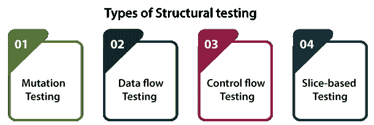

# 结构测试

> 原文：<https://www.javatpoint.com/structural-testing>

在本节中，我们将了解**结构测试**，这是**软件测试**的重要组成部分。

我们还了解了它的需求、**结构测试的类型、与结构测试兼容的工具、优势和劣势。**

## 结构测试介绍

另一种类型的 [**软件测试**](https://www.javatpoint.com/software-testing-tutorial) 技术是**结构测试**，用于测试软件的内部设计或特定软件的编码结构。

在这个测试中，开发团队成员被包括在测试团队中，以执行软件的内部设计。结构测试的工作与**行为测试**相反。

换句话说，我们可以说结构测试基于应用的类型来测试它的不同特性。

结构测试也称为白盒测试、**玻璃盒子测试**、**透明盒子测试**。开发人员主要通过实现它来识别问题并快速修复它们。

结构测试过程需要对编程语言有深入的了解，与功能测试相反。

对于测试工程师来说，了解代码的内部执行以及软件是如何实现的是实现结构测试的必要条件。

在整个结构测试中，测试工程师打算关注软件如何运行，它可以在所有测试级别使用。

**例如**，菜单选项或重要业务交易的覆盖范围可以是系统的结构元素或验收测试。

## 结构测试的类型

结构测试分为四个不同的类别，如下所示:

*   **突变检测**
*   **数据流测试**
*   **控制流测试**
*   **基于切片的测试**

### 突变测试

*   它用于检查测试用例的质量，该测试用例应该没有通过突变代码。
*   变异测试包括开发新的测试，在软件测试过程中实施。
*   当我们识别出各种错误时，这意味着要么程序是正确的，要么测试用例在定位错误方面效率低下。
*   在突变测试中，开发人员对以前可访问的软件测试进行小的修改，并生成旧软件测试的突变。
*   它通常会导致程序出错，这意味着执行变异测试是为了评估测试用例的生产率。

关于突变检测的详细信息，请参考以下链接:[https://www.javatpoint.com/mutation-testing](https://www.javatpoint.com/mutation-testing)

### 数据流测试

*   它是一组测试方法，用于观察程序的控制流，根据一系列事件发现变量的顺序。
*   它实现了一个控制流图，并分析了代码可以改变数据的地方。
*   如果我们执行数据流测试技术，信息在代码实现过程中保持安全和不变。

有关数据流测试的详细信息，请参考以下链接:[https://www . javatpoint . com/data-flow-testing-in-white-box-testing](https://www.javatpoint.com/data-flow-testing-in-white-box-testing)

### 控制流测试

*   **控制流测试**是**结构测试**的基本模型。
*   它是检查控制结构上代码的命令或语句的实现顺序。
*   在控制流测试中，测试工程师选择扩展程序的特定部分来设置测试路径。
*   通常，控制流测试技术用于单元测试。
*   在这个测试中，整个测试是基于控件在代码中是如何执行的。
*   执行控制流测试需要所有软件特性和逻辑的完整信息。

关于控制流测试的详细信息，请参考以下链接:[https://www . javatpoint . com/Control-flow-testing-in-white-box-testing](https://www.javatpoint.com/control-flow-testing-in-white-box-testing)

### 基于切片的测试

*   它最初是为了保存软件而创建的。
*   基本思想是将完整的代码分成小块，然后仔细评估每个部分。
*   基于切片的测试对于软件的维护以及应用的修复都非常有益。

#### 注意:开发人员可以根据自己的需求使用这四种类型的结构测试。

## 结构测试工具

像其他测试有他们的工具一样，结构测试也包含一些有他们功能的开源和商业工具。

**一些最常用的结构测试工具如下:**

*   **黄瓜**
*   **jbemore**
*   **Cfix** 的缩写形式
*   6 月

让我们一个个详细了解它们:

### 黄瓜

它是行为驱动开发广泛使用的工具，因为它为**系统验收**和自动化测试提供了易于理解的测试脚本。

它是一个软件工具，被测试工程师用来开发测试软件行为的测试用例。

关于黄瓜工具的更多信息，我们可以参考以下链接:[https://www.javatpoint.com/cucumber-testing-introduction](https://www.javatpoint.com/cucumber-testing-introduction)

### JBehave

这是一个行为驱动开发的框架。BDD 是 **TDD(测试驱动开发**)和验收测试驱动设计的发展。计划让初学者和专业人士更容易接触和自发地进行这些练习。

**JBehave 的特性**

JBehave 的一些常用特性如下:

*   它纯粹是用 Java 编程语言执行的，很适合基于 Java 的企业。
*   在这里，我们可以用**jbehavior 语法/ Gherkin 语法**编写用户故事。
*   用户故事可以实现为 **JUnit**
*   它提供了基于注释的配置和步骤类规范。
*   它允许通过蚂蚁任务执行故事。

### 断续器

另一个结构测试工具是 [C](https://www.javatpoint.com/c-programming-language-tutorial) / [C++编程语言](https://www.javatpoint.com/cpp-tutorial)支持的 XUnit 测试框架 **Cfix、**。

在这个工具中，单元测试被编译并链接到一个动态链接库中。它被设计为与 **Visual Studio** 和 **WinDBG** 等 **Windows 调试器**结合使用。

**Cfix**的特性

以下是 Cfix 的常用功能:

*   它支持用户和内核模式单元测试的开发。
*   失败的测试用例可以在实现时高度定制。

### 单元测试

JUnit 是结构测试的基本工具之一。它是一个开源的单元测试框架，是用 Java 语言编写的。

它将帮助我们提高开发人员的效率，这提供了开发代码的一致性，并减少了调试的时间。

关于 **JUnit 的更多细节，**参考以下链接:[https://www.javatpoint.com/junit-tutorial](https://www.javatpoint.com/junit-tutorial)

## 结构测试的优缺点

以下是结构测试的优点和缺点:

### 结构测试的优势

结构测试的好处如下:

*   结构测试不需要大量的手工工作，因为它是一个自动化的过程。
*   结构测试不是一个耗时的过程。
*   所有早期缺陷都很容易识别
*   它可以轻松删除无用的代码(额外的代码)或语句。
*   它提供了简单的编码和实现。
*   它提供软件的详细测试。

### 结构测试的缺点

结构试验的**缺点**如下:

*   要进行结构测试，需要对编程语言有深入的了解。
*   尽管结构测试是自动的，但它可能会变得非常困难，因为它涉及到测试工具的培训。
*   就金钱而言，这是昂贵的，因为有时需要资源来有效地执行结构测试。
*   有些命令、语句或分支也很有可能被无意中遗漏。

## 概观

在本教程中，我们已经了解了结构测试，结构测试的类型，优点和缺点。

学完所有具体题目，我们很容易得出结论:结构测试，也叫**白盒测试、玻璃盒测试、清盒测试**是用来验证代码结构的。

除此之外，我们可以说，在执行不同类型的软件测试时，不能保证产品的 100%效率。因此，如果我们将不同类别的测试和方法联系起来，总是有帮助的。

我们已经看到的各种结构测试类型，例如数据流测试、变异测试、基于切片的测试和控制流测试，都可能被复制回错误，例如:

*   突变测试(使用错误的操作符)。
*   数据流测试(在使用变量之前引用它)。

如果有人想使用结构测试方法，他们需要考虑结构测试的优点和缺点。

此外，他们需要注意结构测试成功实施的事实。

* * *