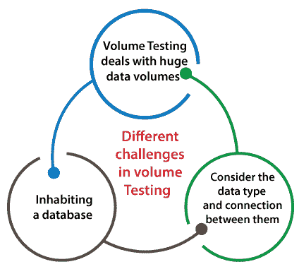
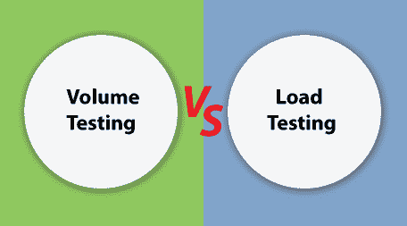
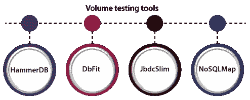

# 容量测试

> 原文：<https://www.javatpoint.com/volume-testing>

在这一节中，我们将了解**容量测试**，它通过在数据方面插入大量负载来帮助我们检查应用程序的行为。

我们也了解了它的过程，为什么我们需要执行容量测试，容量测试的目标，多个示例，容量测试的各种属性，优点和缺点。

## 容量测试简介

批量测试属于[软件测试](https://www.javatpoint.com/software-testing-tutorial)。它通过在数据方面插入大量负载来帮助我们检查应用程序的行为，这就是所谓的**容量测试**。

在批量测试中，我们将关注数据速率的数量，而不是用户的数量。也叫**洪水测试**。

它被执行来分析当数据库中的数据量增加时对系统响应时间和行为的影响。在这个测试中，大量的信息被软件处理。

需要证明系统没有溢出或数据安全问题的风险。

#### 注:容量是容量，负载是数量，即负载测试意味着用户数，容量测试意味着数据量。

## 容量测试的目的

实施**卷测试**的最初目标是发现数据库中大量数据的系统性能。

让我们看看执行容量测试的其他一些目标:

*   **评估系统响应时间**

我们可以评估系统响应时间，因为我们知道批量测试是有成效的，它有助于**组织**主管确认软件性能没有中断。

*   **系统体积分类**

如果我们确定系统的容量，这有助于我们简化可伸缩性开发，这在准备应急计划时非常有用。

批量测试让开发人员了解，这有助于他们预测系统可以处理多少数据而不会出现任何故障。

**设计可扩展性计划**

我们可以通过执行卷测试来轻松设计可伸缩性计划。我们了解到，批量测试有助于业务主管了解我们是增加规模还是积累更多组件来支持系统。

*   **确保没有数据丢失**

在软件测试中，只有通过批量测试，项目团队才能保证不会随着系统负担和数据库大小的增加而出现数据丢失。

*   **接收低、中、高数据负载下的系统性能洞察**

实施容量测试的下一个目标是测量系统在**低负载和中等**负载下的性能，以确保其正常工作。在高数据负载下，数据丢失的风险会扩大。

*   **识别系统组件上受力引起的错误**

进行容量测试的目的是发现仅在**数据负载上升、响应时间延长、系统故障、**或**安全活动时显示的问题。**

## 容量测试的特点

它包含执行批量测试时必不可少的各种功能:

*   在开发阶段，只测试少量数据。
*   随着时间的推移，软件的执行越来越弱，因为随着时间的推移，有大量的数据。
*   在执行卷测试时，我们确保没有数据丢失，因为如果丢失任何数据，我们可能会丢失一些重要信息。
*   大多数情况下，测试数据生成器创建测试数据，这需要逻辑上的准确性。
*   为了分析系统的性能，我们可以使用测试数据。
*   应用程序的响应时间在容量测试期间测试，以及系统是否在固定时间内响应。
*   在容量测试中，我们还测试数据是否被适当地存储，因为如果信息没有被正确地存储，那么它会被相应地恢复到适当的位置。

## 为什么我们需要容量测试？

在我们理解容量测试的需求之前，我们将看到一个容量测试的例子。

假设有一个**电商 web 应用**，一般有 1000 个终端用户使用。在销售或节日期间，在网络应用程序上，大约有 4-5 万用户试图访问网络应用程序。

应用程序将崩溃，或者数据无法成功加载，这将为客户带来问题。

为了克服这种实时条件，我们需要执行一轮容量测试。以下方面将帮助我们理解批量测试的重要性:

*   当数据库的容量上升到特定限制时，容量测试将帮助我们检测任何数据丢失。
*   批量测试的执行对于在测试的早期阶段识别问题至关重要，这可能会增加数据库中的数据量。
*   批量测试可以在管理客户之前快速识别许多系统性能问题。

## 批量测试中有哪些不同的挑战？

在执行容量测试时，我们很少会记住一些事情

因为容量测试中的所有初始想法都需要处理数据。

*   **容量测试处理巨大的数据量。**

与其他类别的 [**性能测试相比，**](https://www.javatpoint.com/performance-testing) 容量测试处理巨大的数据量。

为了处理大量的数据，它需要大量的数据集和一个全面的测试工程师团队。程序员还必须处理管理由于定期测试会议而产生的数据。

*   **驻留在数据库中**

这是卷测试期间最常面临的挑战，因为我们处理的是关系数据库，它包含一个健壮的结构和许多相邻的表。

而且测试人员需要收集各种字段，既有包含大型二进制文件的必选字段，以确保测试数据的高质量。

*   **查看数据类型以及它们之间的联系。**

对于测试初学者来说，很难了解它们之间的联系、类型之间的差异以及软件的反应。

在容量测试期间，测试专业人员必须处理大量的有效、无效、缺失、边界或错误的数据。

## 容量测试和负载测试的区别

在下表中，我们列出了容量测试和负载测试之间的一些重要区别:

| 没有 | 批量测试 | 负载测试 |
| 1. | 它通过在数据方面插入大量负载来帮助我们检查应用程序的行为，这就是所谓的容量测试。 | 负载测试是通过施加小于或等于所需负载的负载来检查应用程序性能的测试。 |
| 2. | 批量测试在正常和不正常的情况下测试系统。 | 负载测试在正常情况下测试系统。 |
| 3. | 它分析系统的响应时间。 | 它分析系统的性能。 |
| 4. | 它主要强调验证系统的能力。 | 负载测试的重点是验证软件的稳定性。 |
| 5. | 它使系统容量可以在现实世界中使用。 | 它使系统能够根据最终用户。 |
| 6. | 它帮助我们节省了系统的维护成本。 | 并没有节省系统的维护成本。 |

## 批量测试工具

正如我们所知，自动化测试是一个节省时间的过程，与手动测试相比，它还能提供精确的结果。

使用卷测试工具的主要优势是我们可以在晚上执行测试，因此团队成员或其他团队不会受到数据库数据量的影响。

**让我们看看几个兼容批量测试的开源工具:**

*   **锤 DB**
*   **DbFit**
*   **JdbcSlim**
*   **鼻子地图**

### HammerDb

它是一个**开源**工具，也是全球数据库行业的数据库标杆应用。它用于自动化、多线程，还允许运行时脚本。

**HammerDB**的特性

以下是 HammerDB 的常用功能:

*   它是一个完全透明的企业评级软件，没有虚拟用户限制。
*   所有顶级科技公司都可以使用它。
*   它完全支持各种数据库，如 Oracle、MYSQL、SQL Server、PostgreSQL 等。
*   它允许专家级支持。
*   它提供完整和全面的文档。
*   功能齐全，支持 **Linux** 和 **Windows** 平台**。**

### DbFit

DbFit 是一个支持测试驱动开发的**开源工具**。DbFit 测试可以用作我们系统行为的现有可执行文档。

**DbFit**的特点

DbFit 的一些常用特性如下:

*   它支持敏捷实践，例如**测试驱动开发，重构**。
*   它支持多种数据库类型，如 SQL Server、Oracle 等。
*   它帮助我们提高产品的质量、设计和可维护性。
*   它给出了可读和可理解的语法，这改善了与非技术人员的交流。
*   它提供了带有示例的在线文档。

### JdbcSlim

另一个批量测试工具是 **JdbcSlim** ，在这里数据库语句和查询很容易集成到 **Slim FitNesse** 测试中。它主要强调清晰地保存配置、测试数据和 SQL 命令。

**JdbcSlim 的特性**

以下是 JdbcSlim 的常用功能:

*   了解 SQL 语言的开发人员、测试人员和业务用户可以使用 JdbcSlim 框架。
*   它支持 JDBC 驱动程序所针对的所有数据库
*   它还确保需求的编写独立于执行，并且易于用户理解。

### NoSQLMap

**NoSQLMap** 是一个开源的 **Python** 工具，旨在自动插入爆发并破坏数据库配置来评估威胁。

## 批量测试的优势

批量测试的一些好处如下:

*   它有助于节省用于应用程序改进的维护成本。
*   它只适用于 MongoDB 数据库。
*   它有助于早期发现瓶颈。
*   它支持更快地开始可扩展性计划。
*   批量测试确保系统能够在现实世界中使用。

## 容量测试的缺点

以下是容量测试的缺点:

*   通过使用容量测试，不可能对现实世界中使用的内存进行精确划分。
*   一个熟练的数据库性能测试团队对于获得批量测试是必不可少的，这将成为项目的额外费用。
*   真实环境的个体复制既困难又复杂。
*   执行全面的卷测试需要花费大量时间，这涵盖了所有测试场景，创建脚本并执行这些脚本，这可能会延迟应用程序的发布时间。

## 概观

在本教程中，我们将了解到卷测试用于分析高数据负载的系统性能。这是一种非功能测试。

批量测试是手动执行的，也可以借助一些自动化工具来检查系统性能。

容量测试非常重要，但挑战相对复杂。在实现它之前，我们需要一个特定概念的完整知识以及数据库语言。

如果任何测试初学者试图执行体积测试，他们需要使用一些工具和执行一些测试用例，这将有助于我们在实时使用它之前理解体积测试的概念。

* * *