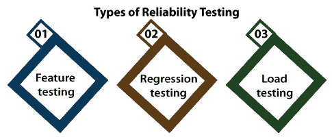
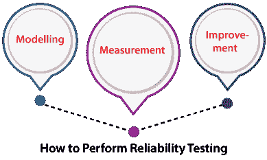
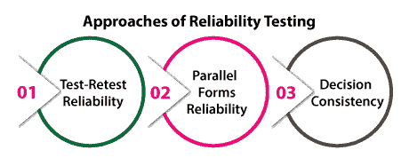

# 可靠性测试

> 原文：<https://www.javatpoint.com/reliability-testing>

在开发软件或应用程序时，软件有几个特征和方面，由软件工程师验证。

向最终用户交付高质量的产品是软件可靠性的基本特征之一，由团队在可靠性测试的帮助下进行测试和验证。

在这一节中，我们将探讨和讨论以下与**可靠性测试**相关的话题，这些话题有助于我们理解[软件测试](https://www.javatpoint.com/software-testing-tutorial)中可靠性测试和产品一致性的必要性。

*   **什么是可靠性测试？**
*   **可靠性测试的目标**
*   **可靠性测试的特点**
*   **可靠性测试类型**
*   **可靠性测试方法**

在深入上述所有主题之前，首先，我们将了解可靠性测试的定义。

## 什么是可靠性测试？

另一个重要的软件测试技术是 T2 可靠性测试。团队实施可靠性测试，以保证软件或应用程序在特定时期的每个环境条件下都能可靠地运行。

可靠性测试的实施确保了软件产品没有缺陷，并且对于其计划的目标是可靠的。

简而言之，我们可以说它验证了软件在技术环境中是否能够在特定时期内实现无故障运行。

一般来说，可靠性表示**产生相同的**；换句话说，**可靠**意味着**某样东西是可靠的**，两者每次都会提供相同的结果。在**可靠性测试**的情况下也是如此。

***【可靠性】*** 被描述为特定环境下特定时间内无缺陷软件运行的**概率。主要是为了保证软件的一致性。**

最终用户认为显示的数据是正确的，软件将持续正常运行。在上述情况下，可靠性测试的需求就出现在说明中。

定义系统已经被彻底验证和测试的功能是软件可靠性的真正含义。

## 可靠性测试的目的

以下是执行可靠性测试的一些重要目标:

*   测试软件在特定条件下的工作是可靠性测试的重要目的。
*   执行可靠性测试的目的是确定特定时期内的缺陷数量。
*   确定单调分解的知觉结构。
*   去发现软件令人讨厌的存在。
*   找出失败的主要原因。

## 可靠性测试的特点

可靠性测试的一些重要意义可以通过其各种特性来进一步理解，如下所述:

*   可靠性测试保证软件满足客户以及客户的可靠性需求。
*   它确保软件在没有任何故障的情况下运行，并按照计划的确定工作。
*   它可以被描述为软件在详细条件下精确工作的能力。
*   这是可靠性工程项目的一个重要方面。
*   数据收集自可靠性测试时软件开发的几个阶段**。**
***   在产品交付给最终用户之前，可靠性测试帮助我们识别软件产品中的缺陷和故障。*   它在几个软件开发级别执行，以提高产品的可靠性和可靠性。**

 **## 可靠性测试的类型

在软件测试中，可靠性测试分为三种类型，讨论如下:

*   **特性测试**
*   **回归测试**
*   **负载测试**

### 特征测试

第一类可靠性测试是**特性测试**。特性测试总结了适用性，这意味着它检查它是否按照预期的用途执行。

特性测试的主要目标是测试软件产品的属性和功能、系统的正确性，并验证在整个 beta 测试中是否没有发现缺陷。

在完成该测试时，我们将检查应用程序是否遵循特定标准，如**标准、规则**等。

在执行特性测试期间，会检查以下一些特征:

*   所有功能都需要团队至少完成一次。
*   每个功能都必须完全实现。
*   团队还应该检查每个操作的正确实施。
*   必须减少两个或多个功能之间通信。

#### 注意:除此之外，特性测试还会验证一些安全性和合规性。正如我们已经了解的，安全测试与禁止对应用程序的非法访问有关，无论是有意还是无意。

### 回归测试

可靠性测试的另一部分是**回归测试。**回归测试主要用于检查是否有任何新的 bug 或缺陷因为早期 bug 的修复而被声明。

简而言之，我们可以说，当原始功能发生本质变化时，回归测试可以在新的构建上实现。

回归测试的实现保证了代码即使在发生变化时也能工作。

**回归**是指**重新测试**应用程序中那些没有变化的部分。

在回归测试中，**软件质量的验证**和新组件的准确性被添加到软件产品中。以及变更执行后系统中产生的错误或缺陷的识别。

#### 注意:回归测试总是在构建软件的新版本或更新时执行。

有关回归测试的更多信息，请参考以下链接:

[https://www.javatpoint.com/regression-testing](https://www.javatpoint.com/regression-testing)。

### 负载测试

下一种可靠性测试是**负载测试**。该测试旨在确认软件在最大工作负载情况下的功能。

负载测试是通过施加小于或等于所需负载的负载来检查应用程序性能的测试。

在负载测试中，术语负载意味着当 **N 个用户同时使用应用程序或一次向服务器发送请求时。**

这种类型的测试将帮助我们检测应用程序的最大运行容量以及任何**阻塞**或瓶颈。

有关负载测试的更多信息，请参考以下链接:

[https://www.javatpoint.com/load-testing](https://www.javatpoint.com/load-testing)。

## 如何评价可靠性测试

可靠性测试可以用 ***平均故障间隔时间*** (平均故障间隔时间)来评估。

*   **平均故障间隔时间(MTBF):**

平均无故障时间结合了**平均故障时间(MTTF)** 和**平均维修时间(MTTR)。**

**MTBF = MTTF + MTTR**

在这里，

*   **平均故障时间(MTTF)**
    平均故障时间(MTTF)是两次连续故障之间的时间。
*   **平均修复时间(MTTR)**
    平均修复时间(MTTR)是修复故障所需的时间。

## 如何进行可靠性测试

为了执行任何软件测试，我们需要适当的计划和管理。与其他类型的软件测试相比，可靠性测试的执行有点昂贵。

可靠性测试的实施包括测试环境、测试进度、测试点等**数据。**

为了开始实施可靠性测试，测试工程师必须保留以下方面:

*   测试工程师需要使用测试结果来推动决策。
*   他们需要确定可靠性目标。
*   他们需要计划和执行测试。
*   测试工程师需要培养有效的剖面。

可靠性测试包含一些基本约束，如下所示:

*   无缺陷运行时间的测量。
*   无缺陷运行的可能性。
*   执行它的环境。

**可靠性测试**的分析可分为**三个部分**，讨论如下:

*   **造型**
*   **测量**
*   **改进**

为了让我们更好地理解，让我们逐一详细讨论它们:

### 第一部分:建模

我们可以通过应用合适的模型来获得有意义的结果。在可靠性测试中，**软件建模技术**可以分为两个子类别，如下所示:

*   **预测建模**
*   **估算建模**

**预测建模和估算建模**有一些显著差异，我们从下表中了解到:

| 问题 | 预测模型 | 估计模型 |
| **用于开发周期时** | 通常，预测模型是在开发或测试阶段之前开发的。 | 通常，评估模型是在软件开发生命周期的后期开发的。 |
| **数据参考** | 预测模型使用历史数据。 | 评估模型使用来自软件开发的现有数据。 |
| **时间范围** | 预测模型将预测未来的一致性。 | 估计模型将预测当前时间或未来时间的可靠性。 |

### 第二部分:测量

在软件测试中，我们不能直接测量软件的可靠性。因此，为了评估软件的可靠性，需要考虑一些其他相关的方面。

**软件可靠性度量**分为以下四种类型:

1.  **产品指标**
2.  **故障和失效度量**
3.  **流程指标**
4.  **项目管理指标**

让我们看看软件可靠性度量部分的详细信息:

### 1.产品指标

**产品度量**是软件可靠性度量的第一部分，它是四种不同类型度量的组合:

*   **复杂性**
*   **功能点度量**
*   **软件大小**
*   **测试覆盖率指标**

**复杂性**

*   复杂性的表示非常重要，因为它直接关系到软件的可靠性。
*   这是一个通过将代码简化为图形说明来定义程序控制结构难度的过程。

**功能点度量**

*   产品度量之下的另一个度量是**功能点度量，**，主要用于确定软件开发的功能。
*   功能点度量将采用输入、输出、主文件等的计数。
*   它计算交付给用户的那些组件，并且独立于编程语言。

**软件大小**

*   产品指标的下一部分是**软件尺寸**。在这个度量中，我们可以使用代码行(LOC)来测量软件的大小，因为它是一种内置的初始方法。

**测试覆盖率指标**

*   测试覆盖度量通过实现软件产品的全面测试来逼近故障和可靠性。

### 2.故障和故障度量

在故障和失败度量中，我们用来检查系统是否完全没有错误。这两种类型的故障都是在测试过程中发现的，也就是说在交付产品之前。

而为了完成目标，我们需要对用户在交付后报告的故障进行检查和总结。

### 3.过程度量

过程度量用于评估、显示和增强软件的可靠性和质量。正如我们已经知道的，产品的质量与工艺直接相关。

### 4.项目管理度量

软件可靠性度量的最后一部分是**项目管理度量**。我们知道，好的管理可以通过使用更好的风险管理流程、开发流程、配置管理流程等来实现高级可靠性。

### 第 3 部分:改进

软件可靠性测试的下一部分是**改进。**改进完全取决于应用程序或系统或软件功能中出现的困难。

改进的方法也将根据软件模块的复杂性而变化。**时间和预算**是限制软件可靠性改进尝试的两个主要约束。

众所周知，到目前为止，还没有很好的方法来克服软件的复杂性问题。

## 可靠性测试方法

在软件测试中，我们将执行可靠性测试，以确保在部署到用户站点之前，系统中存在的所有错误和故障都被指定的团队检测和修复。

有时评估精确的可靠性并不容易。但是可以借助几种方法进行评估。一些最常用的可靠性测试方法如下所述:

*   **重测信度**
*   **并联形式可靠性**
*   **决策一致性**

### 重测信度

*   可靠性测试的第一种方法是**重测信度。**这种可靠性方法解释了测试如何在时间内给出稳定、可靠的分数。
*   为了测试分数的恒定性和可靠性，在短时间内进行。简单来说，我们可以说团队通过几种测试技术对软件进行测试和**再测试**，以确认其可靠性和恒定性。

### 并行形式可靠性

*   软件可靠性测试的第二种方法是**并行形成可靠性**。
*   在这种特定的方法中，软件由两个不同的组测试，以测试这两种功能的形式有多平等。
*   通过使用这种方法，团队可以通过几种形式验证结果的可靠性。

### 决策一致性

*   可靠性测试的最后一种方法是**决策一致性**。
*   在这种方法中，前两种方法(重测信度和平行形式信度)的输出在决策一致性期间被测试。总结他们的成功和失败。

## 概观

在可靠性测试篇中，我们已经了解了可靠性测试的**工作、类型、特点、不同的方法、可靠性测试的评估以及可靠性测试的过程。**

看完上面提到的所有主题，我们可以得出结论，软件可靠性是软件质量的一个重要部分。

将可靠性测试与其他类型的测试进行比较是一个有点昂贵的过程，因为它需要适当的测试计划和测试管理。

**可靠性测试**的执行确保了开发团队和客户正在建立的软件是高度一致的，并且以期望的方式工作。它是否膨胀并不重要。

如果我们谈论的是软件开发生命周期，可靠性测试起着重要的作用。正如我们上面讨论的，可靠性标准的使用将给软件带来恒定性，并预测软件的未来。

**可靠性测试**有助于确保我们交付的是高质量的最终产品。它帮助我们识别和修复 bug，提高性能，并测试特性。

重复一遍，如果软件的复杂度很高，那么软件的可靠性就很难得到。我们可以保证我们的软件在可靠性测试的实施过程中完全正常工作。

* * ***