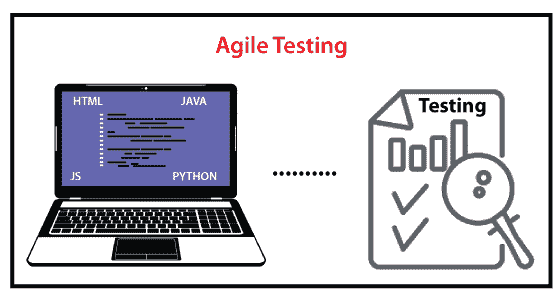
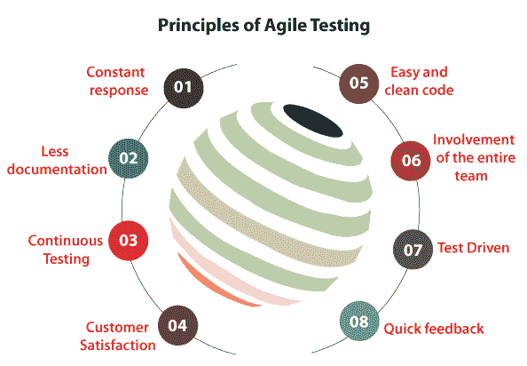
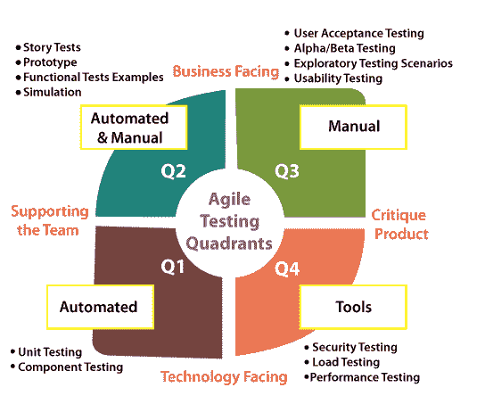
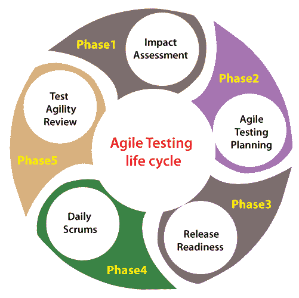

# 敏捷测试

> 原文：<https://www.javatpoint.com/agile-testing>

**软件测试**流程包含多种测试程序和技术，简化了测试流程，提高了效率。

在本教程中，我们将了解以下与被称为**敏捷测试**的指定测试相关的主题，这有助于我们增强对敏捷测试的了解:

*   **敏捷测试介绍**
*   **敏捷测试原理**
*   **敏捷方法在测试中是如何使用的？**
*   **敏捷测试策略**
*   **敏捷测试象限**
*   **敏捷测试生命周期**
*   **在敏捷测试过程中，我们面临哪些不同的挑战？**
*   **敏捷测试的优势**
*   **敏捷测试的缺点**

## 敏捷测试简介

在这里，我们讨论另一个必不可少的[软件测试](https://www.javatpoint.com/software-testing-tutorial)技术，被称为 ***敏捷测试*** 。敏捷测试遵循敏捷软件开发的标准。

敏捷测试是**客户**和**自建团队**合作过程中发展起来的**迭代和增量方法**和必需品。

在敏捷测试中，**敏捷**这个词主要表示可以快速、立即执行的事情，但也包括在**软件开发**领域。

核心功能敏捷团队实现它是为了测试软件产品及其几个模块。敏捷测试的实现确保交付高质量的产品，因为 bug 或缺陷在项目本身的初始阶段就被删除了。

与[瀑布模型](https://www.javatpoint.com/waterfall-model)不同，敏捷测试可以在项目开始时创建，开发和测试之间无止境的结合。这不是一个连续的过程，而是连续的过程。

敏捷测试过程是一种测试复杂软件的聪明方法，与传统的测试过程相比，它接受更有效的结果。

在软件测试的现代，敏捷测试已经获得了很多[的认可](https://www.javatpoint.com/acceptance-testing)和意义。敏捷测试的执行将帮助我们识别初始错误并消除，以更少的开发时间和成本给出更好的结果。

## 敏捷测试的原则

敏捷测试包括各种不同的原则，帮助我们提高软件的生产率。

1.  **恒定响应**
2.  **少文档**
3.  **连续测试**
4.  **客户满意度**
5.  **简单明了的代码**
6.  **全队参与**
7.  **测试驱动**
8.  **快速反馈**

为了让我们更好地理解，让我们一个接一个地详细了解它们:

**1。恒定响应**

敏捷测试的实现持续地提供响应或反馈。因此，我们的产品能够满足业务需求。

换句话说，我们可以说产品和业务需求在整个持续响应过程中得到了理解。

**2。少文档**

敏捷测试的执行需要更少的文档，因为敏捷团队或所有的测试工程师使用一个可重用的规范或清单。团队强调测试而不是次要信息。

**3。连续测试**

敏捷测试工程师无休止地执行测试，因为这是确保产品不断改进的唯一技术。

**4。客户满意度**

在任何项目交付中，客户满意度都很重要，因为客户在整个开发过程中都接触到了他们的产品。

随着开发阶段的进展，客户可以轻松地修改和更新需求。测试也可以根据更新的要求进行更改。

**5。简单明了的代码**

当敏捷团队或测试团队出现的错误或缺陷在类似的迭代中被修复时，这将引导我们获得简单干净的代码。

**6。整个团队的参与**

我们知道，测试团队是[软件开发生命周期](https://www.javatpoint.com/software-development-life-cycle)中唯一负责一个测试过程的团队。但另一方面，在敏捷测试中，[业务分析师(BA)](https://www.javatpoint.com/business-analyst) 和开发人员也可以测试应用程序或软件。

**7。测试驱动**

在进行敏捷测试时，我们需要在实现过程中执行测试过程，这有助于我们减少开发时间。然而，测试是在实现之后或者在传统过程中开发软件时实现的。

**8。快速响应**

在敏捷测试的每一次迭代中，业务团队都参与其中。因此，我们可以获得持续的反馈，这有助于我们减少开发工作中反馈响应的时间。

## 敏捷方法在测试中是如何使用的？

敏捷测试是一个快速且非正式的测试过程。简单来说，我们可以说它被指定为一种高级的**动态测试类型**，由敏捷测试工程师在**软件开发生命周期**的每次迭代中定期执行。

如果我们用最好的属性快速交付软件，并且客户满意度是敏捷测试过程中某个阶段的首要关注点。

## 敏捷测试方法

当我们执行敏捷测试时，团队从几种敏捷方法中获得帮助，这些方法支持他们完成精确的结果。

一些有效的敏捷测试方法如下:

*   **测试驱动开发(TDD)**
*   **行为驱动开发(BDD)**
*   **探索性测试**
*   **验收测试驱动开发(ATDD)**
*   **极限编程(XP)**
*   **基于会话的测试**
*   **动态软件开发方法(DSDM)**
*   **晶体方法论**

### 测试驱动开发

测试驱动的开发方法从测试本身开始。顾名思义，TDD 随着开发周期的重复而变化。

我们已经知道开发周期的第一步是创建**一个单元测试用例。**下一步，我们将设计适合测试用例的代码，以便执行测试用例。

因此，整个代码被设计直到单元测试通过。通常，测试驱动开发通过使用自动化测试工具来执行，并在代码的单元和组件上实现。

### 行为驱动开发

敏捷测试中的以下方法是**行为驱动开发**。BDD 加强了项目干系人之间的沟通，以便在开发过程开始之前，成员充分理解所有组件。

它是根据与 TDD 和 ATDD 相同的规则构建的。因此，代码也是按照这个测试方法中设计的测试用例来开发的。

这种开发的主要目的是强调业务需求和输出的识别。开发应该与业务输出保持一致。

在行为驱动开发中，我们需要遵循以下步骤:

1.  描述行为。
2.  生成测试用例。
3.  指定按照测试用例编写代码。
4.  继续这个过程，直到代码通过测试用例。

### 探索性测试

在软件测试中，[探索性测试](https://www.javatpoint.com/exploratory-testing)是一种特殊的类型，在这种类型中，测试工程师拥有探索代码和创建最有效软件的基本自由。

简单来说，我们可以说，如果我们没有需求，那么我们就做一轮探索性测试。

探索性测试是敏捷测试中非常重要的一部分，因为它有助于发现软件中的未知风险，而这是简单的测试方法无法注意到的。

为了探索软件功能的每个方面，测试工程师创建各种测试用例，执行不同的测试，并记录学习它和理解它的特定流程的过程。

在执行探索性测试时，我们需要遵循以下步骤:

*   以所有可能的方式探索应用程序
*   了解应用程序的流程
*   准备测试文档
*   测试应用程序

有关探索性测试的更多信息，请参考以下链接:[https://www.javatpoint.com/exploratory-testing](https://www.javatpoint.com/exploratory-testing)。

### 验收测试驱动开发(ATDD)

敏捷测试的另一种方法是**验收测试驱动开发(ATDD)。**ATDD 方法通过让具有不同观点的团队成员参与进来，强调客户的要求。

开发、测试和客户团队的成员聚集在一起，从客户的角度开发验收测试。

在**验收测试驱动开发**中，代码是随着开发的验收测试用例一起获取的。

这是一种非常以客户为中心的方法；使用 ATDD 方法的主要目的是基于用户的观点开发一个程序。

### 极限编程

下一个重要的敏捷方法是**极限编程**，被称为**极限编程。**当用户需求不断修改时，我们会走极端的编程方法论。

就像其他敏捷测试方法一样，**极限编程**也是一种**以客户为中心的**方法。

XP 将帮助我们交付高质量的产品，满足客户在整个开发和测试过程中明确的要求。

### 基于会话的测试

在各种敏捷测试方法中，下一个方法是基于会话的测试。它主要是建立在探索性测试的价值观上。

尽管基于会话的测试包含一些结构，但另一方面，探索性测试是在没有任何计划的情况下意外执行的。它用于帮助我们识别特定软件中隐藏的 bug 和缺陷。

基于会话的测试结构是通过在连续的会话中执行测试来准备的，其中测试工程师必须报告整个过程中发生的测试。

### 动态软件开发方法(DSDM)

敏捷测试的另一种有效方法是**动态软件开发方法。**这是一种**快速应用开发** (RAD)方法，为敏捷项目提供了交付框架。

换句话说，我们可以说**动态系统开发技术(DSDM)** 是一种关联度敏捷代码开发方法，它为开发和维护系统提供了一个框架。

**动态软件开发方法**可供用户、开发和测试团队使用。

### 晶体方法论

随后的敏捷测试是**水晶方法论**。这种方法主要强调记录、循环交付和总结，以确保在各种分析期间。

## 敏捷测试象限

它有不同的象限便于理解敏捷测试，将整个测试过程分为**四个**部分。

除了四个象限之外，左边的两个象限指定了要编写代码的测试工程师，右边的两个象限帮助他们理解在对左边象限的响应的支持下改进的代码。

这些敏捷测试象限可以理解为在四个不同阶段执行软件应用程序端到端敏捷测试的传统流程或策略，如下图所示:

让我们逐一讨论它们，以了解敏捷测试的过程:

1.  **象限 1(自动化)**
2.  **象限 2(自动和手动)**
3.  **象限 3(手动)**
4.  **象限 4(工具)**

### 象限 1(自动化)

在敏捷测试的第一象限，我们将主要看到对代码质量的强调。我们可以说内部代码质量，它包含测试工程师执行的测试用例和测试组件。

这些测试用例是技术驱动的，用于自动化测试，以增强代码并支持测试团队执行他们的任务。

在敏捷测试的第一象限，我们可以执行以下测试:

*   单元测试
*   组件测试

### 象限 2(自动和手动)

在敏捷测试的第二个象限中，我们将主要看到在测试过程之前和整个过程中对团队的客户需求的强调，这扩展了新创建的软件的业务结果。

第二象限涉及的测试用例是**业务驱动的**，通常是由测试团队执行的手动和自动功能测试、原型和测试场景示例。

在象限 2 中，我们可以执行以下测试:

*   可能出现的测试场景和工作流程
*   实施配对测试
*   像原型一样测试用户故事和体验。

### 象限 3(手动)

敏捷测试的第三象限主要强调前两个阶段的响应(**象限 1 和象限 2** )。

敏捷测试的执行涉及许多迭代。在这个象限中，这些特定迭代的评审和响应是持续的，这有助于加强代码。

测试用户体验并确定业务结果允许测试团队随着测试的发展而学习。

团队、企业主，甚至客户都在现实地使用产品。在第三个象限中，测试用例被设计来实现自动化测试，这有助于我们在特定的产品中开发确定性。

在象限 3 中，可以执行以下类型的测试:

*   **可用性测试**
*   **协同测试**
*   **探索性测试**
*   **用户验收测试**
*   **与客户配对测试**

### 象限 4(工具)

敏捷测试的最后一个和第四个象限主要强调产品的非功能性需求，包括兼容性、性能、安全性和持久性。

换句话说，我们可以说第四象限确保代码满足所有非功能性需求。

像其他象限一样，在象限 4 中执行各种类型的测试，以交付非功能性质量和期望值。

*   **非功能性测试，如压力测试、性能测试**、**负荷测试等。**
*   可扩展性测试
*   **安全测试**
*   **数据迁移测试**
*   基础设施测试

## 敏捷测试计划

与瀑布模型相比，敏捷测试计划是为每个版本创建和更新的。此外，敏捷测试计划包含在特定迭代中执行的测试类型，例如测试环境、测试数据需求、测试结果和基础设施。

敏捷测试计划强调以下几点:

*   **测试范围:**测试范围规定了测试将在其中实施的冲刺目标、测试范围和测试覆盖率。
*   **性能和负载测试:**这里规定了不同的测试方法和程序。
*   **测试类型或级别根据特性的复杂性**:它定义了将要使用的测试类型或测试级别。并且还指定了测试的数据和配置以及测试将在其中执行的环境。
*   **缓解或风险计划:**定义为克服风险或问题而准备的备份计划。它还确定了在当前版本中测试应用程序时可能面临的挑战。
*   **交付成果和里程碑:**它根据客户的观点设定测试的交付成果和里程碑。
*   **基础设施考虑:**它管理执行测试所需的基础设施。
*   **资源配置:**它列出了测试任务和测试的发生，定义了测试将被执行多少次。
*   **建立正在测试的新功能**。

## 敏捷测试策略

敏捷测试有四种不同的方法，帮助我们提高产品质量。

1.  **迭代 0**
2.  **施工迭代**
3.  **释放结束游戏或过渡阶段**
4.  **生产**

让我们逐一详细讨论:

### 1.迭代 0

敏捷测试的第一个策略或方法是**迭代 0。**在此，我们执行**找人测试、建立测试工具、准备资源或可用性测试实验室等初步设置任务。**

在迭代 0 中，完成了以下步骤:

*   验证项目的业务案例和边界情况，以及项目范围。
*   总结将决定战略权衡的重要需求和用例。
*   计划初始项目和成本估价
*   检测风险。
*   概述一个或多个候选设计

### 2.构造迭代

敏捷测试的下一个策略是**构建迭代**。在这种方法中，大部分测试都是执行的。

构造迭代作为一组迭代来执行，以便创建解决方案的增量。

简单地说，我们可以说敏捷团队在每次迭代中遵循列出的需求，在那里他们可以获取最重要的业务需求或者从工作项堆栈中留下的需求，然后执行它们。

构建迭代过程分为以下两种类型的测试:

*   **验证性测试**
*   **调查性测试**

**1。验证性测试**

为了确保产品符合所有利益相关者的要求，我们将执行确认性测试。

验证性测试可以进一步分为另外两种测试，如下所示:

*   **敏捷验收测试**
*   **显影剂测试**

**敏捷验收测试:**是[功能测试](https://www.javatpoint.com/functional-testing)和[验收测试](https://www.javatpoint.com/acceptance-testing)的组合。敏捷验收测试可以由开发团队和涉众一起执行。

**开发者测试:**是[单元测试](https://www.javatpoint.com/unit-testing)和[集成测试](https://www.javatpoint.com/integration-testing)的组合。它验证应用程序代码和数据库模式。

#### 注意:我们可以自动化两者(敏捷验收测试和开发人员测试)，以确保持续的回归测试已经发生。

**2。调查性测试**

为了深入测试并找出所有在**验证性测试中忽略的问题，**我们将执行**调查性测试。**

### 3.发布结束游戏或过渡阶段

敏捷测试的第三种方法是**发布**。这种具体方法的目标是在生产中有效地实施我们的系统。

测试工程师将在最终游戏中处理它的缺陷故事。在发布结束游戏或过渡阶段，我们有以下活动:

*   支持个人
*   最终用户培训
*   操作人员

同样，它还涉及一些额外的活动:

*   备份和恢复
*   产品发布的营销
*   用户文档
*   系统完成

最后一个敏捷方法测试阶段包括整个系统测试和验收测试。为了在没有任何困难的情况下完成我们的最终测试阶段，我们应该在构建迭代中更彻底地测试产品。

### 4.生产

一旦**发布阶段**完成，产品将进入**生产阶段**。

## 在敏捷测试过程中，我们面临哪些不同的挑战？

通常，在执行敏捷测试时，测试团队可能会面临一些挑战。让我们一起看看这些挑战，以便更好地理解:

*   **最后一分钟修改**
*   **工具选择**
*   **缺少文件**
*   **代码中的重复修改**
*   **有限的测试覆盖率**

*   **最后一分钟修改**

敏捷测试中面临的最大挑战是客户在最后一刻的修改，这使得测试团队设计测试计划的时间大大减少，这可能会影响产品质量。有时，测试工程师经常被要求扮演半开发人员的角色。

*   **工具选择**

敏捷测试中工具的选择是必不可少的，因为如果我们选择了错误的工具，将会浪费我们的时间和金钱。

正如我们已经知道的，测试执行周期大大减少，对于回归测试，我们将有最少的时间。

*   **缺少文件**

执行敏捷测试时经常面临的另一个挑战是缺少文档。错误的概率更加灵活，因为文档的重要性降低了，最终给测试团队带来了更多的负担。

*   **代码中的重复修改**

在敏捷方法中，需求修改和更新是基础，这使得它成为质量保证团队的主要挑战。

*   **有限的测试覆盖率**

在敏捷测试中，新的特性被快速启动，减少了测试团队发现最新特性是否符合需求和解决业务需求的可用时间。

在看到所有频繁的挑战之后，问题出现了，我们如何克服它们？因此，在下面的主题中，我们将讨论:

### 我们如何克服敏捷测试的挑战？

正如我们从敏捷测试的定义中所理解的，它包含的文档很少或者没有文档，这给测试团队预测预期结果带来了问题，并成为测试过程中的障碍。

这也使得选择要执行的测试的方向和路径具有挑战性。因此，为了克服敏捷测试的挑战，我们可以实现以下最佳选项:

*   我们可以执行探索性测试来克服敏捷测试的挑战。
*   我们可以执行自动化单元测试来加速敏捷测试过程。
*   为了克服敏捷测试的挑战，测试驱动开发可能是一个很好的选择。
*   此外，我们可以在敏捷测试规范的帮助下克服这些问题或挑战，并确保以有指导的方式执行改进的定性测试。
*   我们可以实现自动化回归测试。

## 敏捷测试生命周期

正如其他类型的测试有其生命周期过程一样，敏捷测试的生命周期分为五个不同的阶段，如下图所示:

让我们详细了解所有阶段:

### 第一阶段:影响评估

敏捷测试生命周期的第一阶段是**影响评估。**在这里，我们收集用户和利益相关方的输入和响应，以执行影响评估阶段。这个阶段也被称为反馈阶段，它支持测试工程师为下一个生命周期设定目标。

### 第二阶段:敏捷测试计划

敏捷测试生命周期的第二阶段是**敏捷测试规划**。在这一阶段，开发人员、测试工程师、利益相关者、客户和最终用户组成团队，计划测试过程时间表、定期会议和交付成果。

### 第三阶段:发布准备

敏捷测试生命周期的下一个阶段是**发布准备**，在这里，测试工程师必须审查已经完全创建的特性，并测试它们是否准备好上线，以及哪些特性需要返回到之前的开发阶段。

### 第四阶段:每日检查

**每日 scrum**是敏捷测试生命周期的下一个阶段，包括每天早上开会检查测试并确定当天的目标。

并且，为了帮助测试工程师了解测试的状态，每天都设定一天的目标和指标。

### 第五阶段:测试敏捷性审查

敏捷生命周期的最后一个也是最后一个阶段是**测试敏捷性评审。**测试敏捷性阶段包括每周与利益相关者开会，根据目标评估进度。

换句话说，我们可以说敏捷性审查是在开发过程中定期实施的，以分析开发的进度。

## 敏捷测试的优势

在过去的几年里，敏捷软件测试一直是信息技术领域的一个重要部分。在这里，我们讨论敏捷测试的一些基本好处:

*   敏捷测试让位于从最终用户那里直接获得定期**反馈**和评审，这有助于我们提升软件产品的质量和属性。
*   敏捷测试的实施将节省大量的**时间**和**资金，**使得成本的估算更加透明。
*   通过每天的会议，我们可以确定更好的问题。
*   敏捷测试减少了**文档**，或者我们可以说它需要更少的文档来执行敏捷测试。
*   实施敏捷软件测试最显著的优势是减少错误和提高软件生产率。
*   从上面的讨论中我们了解到，在敏捷软件开发中，工作负载被分成小部分，并限制开发人员偏离轨道。而在结果中，我们会得到更多细微的不一致和更高的效率。

## 敏捷测试的缺点

敏捷测试是测试软件应用程序的一种创造性方法，但是我们仍然有一些使用敏捷测试的缺点:

*   敏捷测试最显著的缺点是，如果两个或更多成员离开一项工作，将导致项目失败。
*   在执行任何测试来测试应用程序或软件时都需要确定，并且对于测试团队来说会变得不一致。
*   这使得我们很难预测预期的结果，因为没有或更少的文档结果会转化为明确的条件和要求。
*   有时，它会导致我们在系统中引入新的 bug，因为 bug 修复、修改和发布在敏捷测试中反复发生。

## 概观

在本教程中，我们已经看到了敏捷测试的深入知识，如敏捷测试的**原理、策略、象限、敏捷测试生命周期、我们在敏捷测试中面临的不同挑战以及敏捷测试的优缺点。**

在理解了前面提到的所有主题之后，我们可以说敏捷测试是当今软件的最佳方法之一，因为这个软件非常复杂，需要全面的测试。

它允许测试工程师具有灵活性，能够包含任何需求修改。

敏捷测试在重要的软件开发组织中变得非常有名，因为它是一个非常以客户为中心的测试，可以确保高质量的产品。

敏捷测试的执行需要客户的参与，开发人员和测试工程师之间的高水平沟通，因为他们都在一起工作，以便测试特定的软件。

因此，我们可以提供更高质量的软件，满足客户和用户的期望。

在软件测试中，敏捷方法包括在**软件开发生命周期中尽快进行测试。**

最后，我们可以说团队(开发团队、测试团队、客户)之间的沟通对于敏捷测试的成功起着至关重要的作用。

* * *