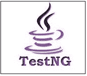

# 单元测试工具

> 原文：<https://www.javatpoint.com/unit-testing-tools>

当我们必须找到并验证代码的特定模块或单元时，我们需要单元测试工具。在这些工具的帮助下，我们可以构建安全的设计和文档，并减少错误数量。

通常，单元测试是一个手动过程，但是现在一些组织已经在这些工具的帮助下自动化了单元测试。通过使用单元测试工具，我们可以覆盖最大的覆盖范围、性能、兼容性和集成测试。

所有的单元测试工具都是作为 eclipse 的插件来实现的。单元测试工具被开发人员用来测试应用的源代码或实现应用的源代码。

以下是[单元测试](https://www.javatpoint.com/unit-testing)最常用的工具:

*   努涅特
*   6 月
*   **测试 G**
*   **莫基托**
*   phpunit

## NUnit

最常用的单元测试工具之一是 NUnit。它是一个开源工具，最初是从适用于所有人的 JUnit 移植而来的。Net 语言。NUnit 完全是用 [C#语言](https://www.javatpoint.com/c-sharp-tutorial)编写的，并经过了全面的重新设计，以获得许多的优势。Net 语言特性。比如自定义属性和其他反射相关功能。

### NUnit 的特点

*   它有力地支持数据驱动的测试。
*   这样，我们可以并行执行测试。
*   它允许断言作为资产类的静态方法。
*   它使用控制台运行程序来加载和执行测试。
*   NUnit 支持各种平台，如 Silverlight、Xamarin mobile、。NET 核心，和紧凑的框架。

## 单元测试

是另一个开源的单元测试框架，是用 [Java 编程语言](https://www.javatpoint.com/java-tutorial)编写的。它主要用于测试驱动环境的开发。Junit 提供了注释，帮助我们找到测试方法。这个工具帮助我们提高了开发人员的效率，提供了开发代码的一致性，减少了调试的时间。

### JUnit 的特点

*   它提供了测试预期结果的断言。
*   在这个工具中，我们可以快速开发一个提高代码质量的代码。
*   这个工具可以在测试套件中构建，测试套件中有测试用例。
*   为了运行测试，它给测试运行人员。
*   运行测试用例将花费更少的时间。

有关 Junit 的更多详细信息，请参考以下链接:

[https://www.javatpoint.com/junit-tutorial](https://www.javatpoint.com/junit-tutorial)

## 测试

它是一个开源工具，支持 Java 和。Net 编程语言。**测试下一代** (TestNG)是一个高级的单元测试工具，它是从 JUnit 和 NUnit 测试框架中激发出来的。然而，很少有新的功能(附加注释、并行执行、组执行、Html 报告和监听器)使 TestNG 成为更强大的工具。

对于自动化过程，TestNG 将用于处理框架组件，并在没有任何人为干扰的情况下实现批处理执行。

### TestNG 的特性

以下是 TestNG 的一些常用[特性:](https://www.javatpoint.com/features-of-testng)

*   TestNG 支持相同测试用例的各种实例，参数化、注释、数据驱动、功能、集成和单元测试。
*   在开发的情况下，将使用 TestNG 开发一个单元测试用例，每个单元测试用例将测试源代码的业务逻辑。
*   它将提供灵活的测试配置。
*   它将有应用服务器测试的依赖方法
*   在 TestNG 的帮助下，我们可以完全控制测试用例和测试用例的执行。
*   它得到了 IDEA、Eclipse 和 Maven 等多个插件和工具的支持。

有关 TestNG 工具的更多详细信息，请参考以下链接:

[https://www.javatpoint.com/testng-tutorial](https://www.javatpoint.com/testng-tutorial)

## 莫基托

这是一个用于单元测试的模拟框架，它是用 Java 编程语言编写的。Mockito 也是麻省理工学院**(麻省理工学院)许可证**推出的开源工具。

在 Mockito 的帮助下，我们可以开发可测试的应用。使用这个工具的主要目的是通过模仿外部依赖关系并在测试代码中使用它们来简化测试的开发。它可以与其他测试框架如 TestNG 和 Junit 一起使用。

### 莫奇托的特点

*   它将用于支持异常。
*   借助注释功能，我们可以生成模型。
*   我们不需要自己编写模拟对象。
*   它将支持返回值。
*   它提供了像 verify()、mock()、when()等多种方法。，这对测试 Java 应用很有帮助。

有关 Mockito 工具的更多详细信息，请参考以下链接:

[https://www.javatpoint.com/mockito](https://www.javatpoint.com/mockito)

## 菲普奈

另一个单元测试工具是 PHPUnit，它是用 PHP 编程语言编写的。它是 xUnit 架构的一个实例，基于 JUnit 框架。它可以用 [JSON](https://www.javatpoint.com/json-tutorial) 、JUnit XML、TestDox 和 Test any 协议生成多种不同格式的测试结果输出。我们可以在跨平台操作系统上运行测试用例。

### PHPUnit 的特点

*   PHPUnit 将提供日志记录、代码覆盖率分析。
*   它的开发托管在 GitHub 上。
*   PHPUnit 使用 assessority 来验证特定组件的性能。
*   在这个工具的帮助下，开发人员可以识别他们新开发的代码中的问题。

* * *